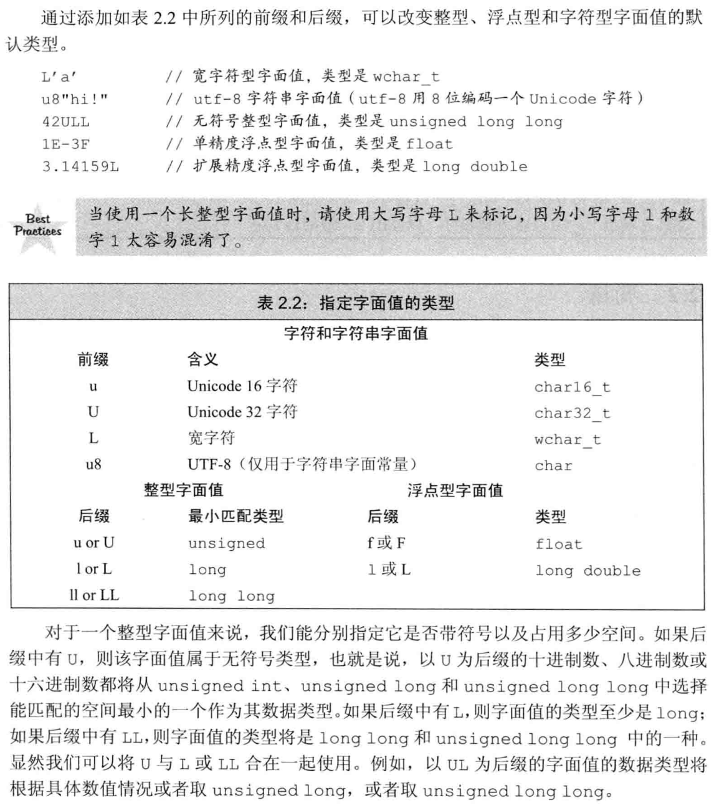
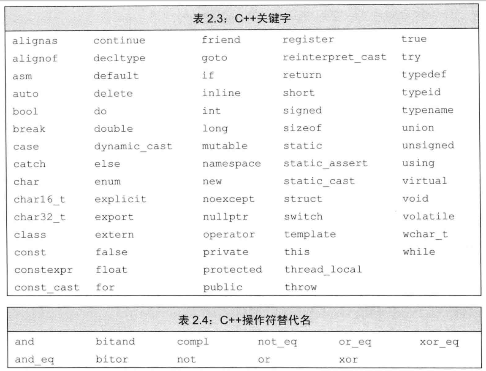

# 2 变量和基本类型 

- 一个char的空间应确保可以存放机器基本字符集中的任意字符对应的数字值，也就是说，一个char的大小和一个机器字节一样
- wchar_t, char16_t, char32_t用于扩展字符集
  - wchart_t: 确保可以存放机器最大扩展字符集中的任意一个字符
  - char16_t/char32_t: 为Unicode字符集服务
- 当赋给**无符号类型**一个超出它表示范围的值时，结果是初始值对无符号类型表示数值总数取模后的余数
- 当赋给**有符号类型**一个超出它表示范围的值时，结果是未定义的，程序可能继续工作，可能崩溃，也可能产生垃圾数据
- 默认情况下，十进制字面值的类型是`int, long, long long`中最小的那个，八进制和十六进制字面值的类型是容纳其数值的`int, unsigned int, long, unsigned long, long long, unsigned long long`中尺寸最小的那个。如果一个字面值连与之管理得最大数据类型都放不下，将产生错误。
- 尽管整型字面值可以存储在带符号数据类型中，但严格来说，十进制字面值不会是负数，比如一个`-42`的字面值，负号并不在字面值之内，它的作用仅仅是对字面值取负
- 默认情况下，浮点型字面值是`double`
- 转义字符：`\x`后可以跟一个或多个十六进制；`\`后可以跟1,2,3个八进制数字，超过之后只有前三个构成转义序列；一般一个字符是8bit，所以超过8bit的16进制转义字符可能会报错，如果需要可以跟下表的前缀的扩展字符集一起使用
  
  
- 数据类型决定着变量所占内存空间的大小和布局方式，该空间能存储的值的范围，以及变量能参与的运算
- 初始化和赋值是两个完全不同的操作；初始化的含义是创建变量时赋予其一个初始值，而赋值的含义是把对象的当前值擦除，而以一个新值来替代
- 任何包含了显示初始化的声明即成为定义，给由`extern`关键字标记的变量赋初值，会抵消`extern`的作用，就不是声明，而是定义了
  ```c++
  extern double pi = 3.14156; //定义
  ```
- **函数体内部**初始化一个`extern`关键字标记的变量，会引发错误
  ```c++
  int main () {
    extern int i = 0;
    return 0;
  }
  dongkesi@DESKTOP-CL29DN1:/mnt/c/workspace/github/C++-Primer/ch01$ g++ t1-22.cc
  t1-22.cc: In function ‘int main()’:
  t1-22.cc:2:14: error: ‘i’ has both ‘extern’ and initializer
   extern int i = 0;
  ```
- C++保留了一些名字；
  - 用户自定义的标识符不能连续出现两个下划线
  - 也不能以下划线紧连大写字母开头
  - 定义在函数体外的标识符不能以下划线开头
- C++关键字
  
  
- 作用域
  - C++的大多数作用域以花括号分隔
  - 名字的有效区域始于名字的声明语句，以声明语句所在的作用域末端结束
- 一般在初始化变量时，初始值会被拷贝到新建的对象中。然而定义引用时，程序把引用和它的初始值**绑定**在一起，而不是将初始值拷贝给引用。一旦初始化完成，引用将和它的初始值对象一直绑定在一起。因为无法令引用重新绑定到另外一个对象，因此引用必须初始化
- 引用本身不是一个对象，所以不能定义引用的引用，也不能定义指向引用的指针。但是指针是对象，所以存在对指针的引用
  ```c++
  int i = 42;   // 
  int *p;       // p是一个int型指针
  // 从右向左读r的定义，离变量名最近的符号&对变量的类型有最直接的影响，因此r是一个引用。其余部分用以确定r引用的类型是int *，所以r引用的是一个int指针  
  int *&r = p;  // r是一个对指针p的引用
  r = &i;       // r引用了一个指针，因此给r赋值&i就是令p指向i
  *r = 0;       // 解引用r得到i, 也就是p指向的对象，将i的值改为0
  ```
- 引用只能绑定在对象上，而不能与字面值或某个表达式的计算结果绑定在一起
- 所有引用的类型都要和与之绑定的对象严格匹配
- 推荐用`nullptr`(字面值)初始化指针，避免使用`NULL`(预处理变量)
- `const`对象一旦创建后其值就不能再改变，所以`const`对象必须初始化
- 默认情况下，const对象仅在文件内有效。编译器在编译过程中把用到const对象的地方都替换成了对应的值，也就是说编译器会找到用到bufSize的地方，然后用512替换，为了执行以上替换，编译器必须知道变量的初值
- 如果在多个文件间共享`const`对象，必须在变量的定义之前添加`extern`关键字
- 所谓指向常量的指针或引用，不过是指针或引用“自以为是”罢了，它们觉得自己指向了常量，所以自觉的不去改变所指对象的值
- 如果认定变量时一个常量表达式，就把它声明为`constexpr`类型
- `constexpr`修饰指针
  ```c++
  constexpr const int *p = &i; // p 是常量指针，指向整型常量i
  constexpr int *p1 = &j;      // p1 是常量指针，指向整数j
  ```
- 指针常量，常量指针混淆
  ```c++
  typedef char *pstring;
  const pstring cstr = 0;     // cstr是指向char的常量指针，也就是char *const ctr = 0; 而不是const char *cstr = 0, 这个是指向const char的指针
  const pstring *ps;
  ```
- auto让编译器通过初始值来推算变量的类型，显然，auto定义的变量必须有初始值
- 如果表达式的内容是解引用操作，则`decltype`将得到引用类型
  ```C++
  int i = 0;
  int *p = &i;
  decltyp(*p) c = i; // 结果类型是int &而不是int
  ```
- `decltype((var))`的结果永远是引用，而`decltype(var)`结果只有当`var`本身是一个引用时才是引用
  