# 3 字符串、向量和数组
## 3.1 命名空间的using声明
- 头文件不应包含using声明：因为头文件的内容会拷贝到所有引用它的文件中去，如果头文件有某个using声明，那么每个使用了该头文件的文件就都会有这个声明。可能产生始料未及的名字冲突。
## 3.2 标准库类型string
- string初始化方式

  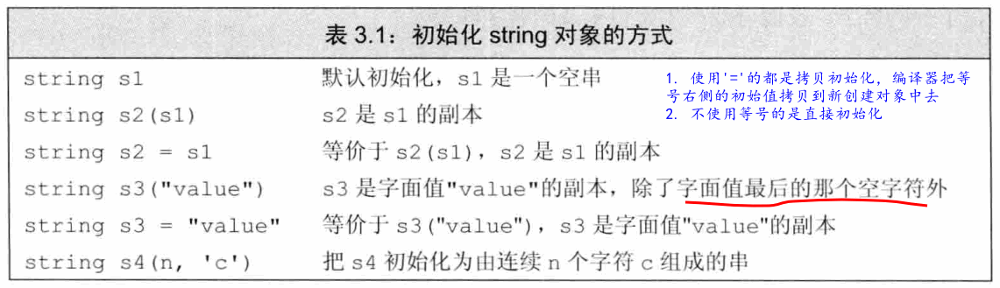
### 3.2.2 string对象上的操作

  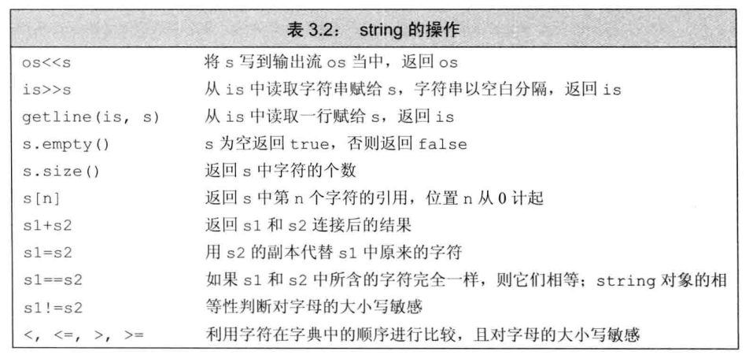

- 因为string::size()的类型是size_type，一个无符号类型。所以如果一条表达式中已经有了size()函数就不要再使用int了，这样可以避免混用int和unsigned可能带来的问题。
- `==`: 意味着长度相同以及所包含的字符也全相同。
- 标准库允许把字面值和字符串字面值转换成string对象
- 当string对象和字符字面值及字符串字面值混在一条语句使用时，必须确保每个`+`运算符两侧的运算对象至少有一个是string
  ```c++
  string s6 = s1 + ", " + "world"; //等价于(s1+", ") + "world"; 因此合规
  string s7 = "hello" + ", " + s2; //前面两个不合规，不能字面值直接相加
  ```
- 因为历史原因，也为了与C兼容，C++中的字符串字面值并不是标准库类型string的对象。切记：字符串字面值与string是不同的类型。

#### Exercise

- `ctrl+d`退出`while`输入: https://stackoverflow.com/questions/50999994/c-when-will-whilecins-stop

- e3.2a
  ```C++
  #include <string>
  #include <iostream>

  using std::string;

  int main() {
          string line;
          int cnt = 0;
          while (std::getline(std::cin, line)) {
                  cnt++;
                  std::cout << cnt << ": " << line << std::endl;
          }
          return 0;
  }
  ```

- e3.2b
  ```c++
  #include <string>
  #include <iostream>

  using std::string;

  int main() {
          string line;
          int cnt = 0;

          while (std::cin >> line) {
                  cnt++;
                  std::cout << cnt << ":" << line << std::endl;
          }
          return 0;
  }
  ```
- e3.3
  - 类似cin >> s: 由空白符（空格，制表符，换行）分开
  - getline(cin, s)：由换行符(`\n`)分开
- e3.4a
  ```c++
  #include <string>
  #include <iostream>
  using std::string;

  int main() {
          string s1, s2;
          std::cout << "Input S1: " << std::endl;
          std::cin >> s1;
          std::cout << "Input S2: " << std::endl;
          std::cin >> s2;

          if (s1 >= s2) {
                  std::cout << s1 << std::endl;
          } else {
                  std::cout << s2 << std::endl;
          }
          return 0;
  }
  ```
- e3.4b
  ```c++
  #include <iostream>
  using std::string;

  int main() {
          string s1, s2;
          std::cout << "Input S1: " << std::endl;
          std::cin >> s1;
          std::cout << "Input S2: " << std::endl;
          std::cin >> s2;

          if (s1.size() > s2.size()) {
                  std::cout << s1 << std::endl;
          } else if (s1.size() < s2.size()) {
                  std::cout << s2 << std::endl;
          } else {
                  std::cout << "same length" << std::endl;
          }
          return 0;
  }
  ```
- e3.5a
  ```c++
  #include <string>
  #include <iostream>

  using std::string;

  int main() {
          string input;
          string output;

          while (std::cin >> input) {
                  output += input;
                  std::cout << output << std::endl;
          }
          std::cout << "end:" << output << std::endl;
          return 0;
  }
  ```
- e3.5b
  ```c++
  #include <string>
  #include <iostream>

  using std::string;

  int main() {
          string input;
          string output;

          while (std::cin >> input) {
                  output += input + ' ';
                  std::cout << output << std::endl;
          }
          std::cout << "end:" << output << std::endl;
          return 0;
  }
  ```

### 3.2.3 处理string对象中的字符

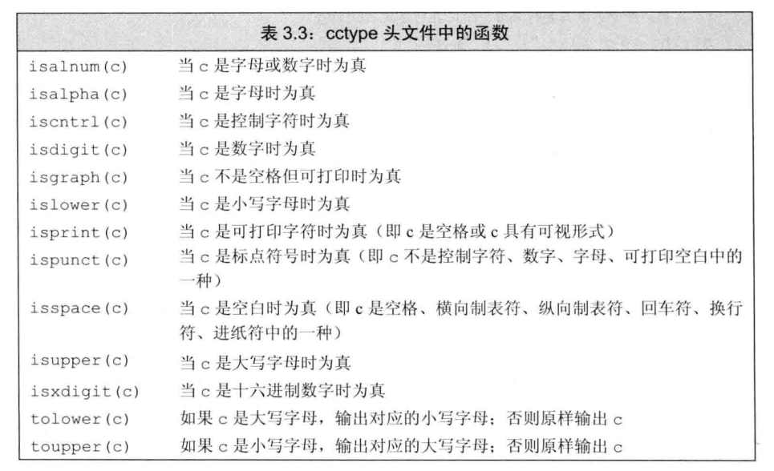

- 推荐使用如下形式操作字符
  ```c++
  // expression部分是一个对象，用于表示一个序列
  // declaration定义一个变量用于访问序列中的基础元素
  // 每次迭代，declaration部分的变量会被初始化为expression部分的下一个元素值
  for (declaration : expression)
    statement
  
  // Example
  string str("some string")

  for (auto c: str)
    cout << c << endl;
  ```
- 如果要改变string对象中的值，必须把循环变量定义成引用类型
  ```c++
  string s("Hello World!!!");
  for (auto &c : s)
    c = toupper(c);
  cout << s << endl;
  //输出： HELLO WORLD!!!
  ```
- 如果只处理部分字符，有两种方式：使用下标；使用迭代器。
- 使用下标访问超出范围，即使只是访问而不改写也是危险的。在使用下标时务必检测该下标可否访问

#### Exercise
- e3.6
  ```c++
  #include <string>
  #include <cctype>
  #include <iostream>
  using std::string;

  int main() {
          string s("Hello C++14!");
          std::cout << s << std::endl;
          for (auto &c : s)
                  if (std::isprint(c))
                          c = 'X';
          std::cout << s << std::endl;
          return 0;
  }
  ```
- e3.7
  ```c++
  #include <string>
  #include <cctype>
  #include <iostream>
  using std::string;

  int main() {
          string s("Hello C++14!");
          std::cout << s << std::endl;
          for (char &c : s)
                  if (std::isprint(c))
                          c = 'X';
          std::cout << s << std::endl;
          return 0;
  }
  // 没有什么变化
  ```
- e3.8a
  ```c++
  #include <string>
  #include <cctype>
  #include <iostream>
  using std::string;

  int main() {
          string s("Hello C++14!");
          std::cout << s << std::endl;
          for (decltype(s.size()) i = 0; i != s.size(); ++i)
                  if (std::isprint(s[i]))
                          s[i] = 'X';
          std::cout << s << std::endl;
          return 0;
  }
  ```
- e3.8b
  ```c++
  #include <string>
  #include <cctype>
  #include <iostream>
  using std::string;

  int main() {
          string s("Hello C++14!");
          std::cout << s << std::endl;
          decltype(s.size()) i = 0;
          while (i != s.size()) {
                  if (std::isprint(s[i]))
                          s[i] = 'X';
                  ++i;
          }
          std::cout << s << std::endl;
          return 0;
  }
  ```
- e3.9
  > 不合法，这里打印s中第一个元素，但s是空的，访问超过s.size()的元素都是未定义的
- e3.10
  ```c++
  #include <string>
  #include <cctype>
  #include <iostream>

  using std::string;

  int main() {
          string s("I'm Hello World! Yeti@gmail.com");
          std::cout << s << std::endl;

          string res;
          for (auto c : s)
                  if (!ispunct(c))
                          res += c;
          std::cout << res << std::endl;
          return 0;
  }
  ```
- e3.11
  > 不合法，const char &
  ```c++
  #include <string>
  #include <iostream>

  int main() {
          const std::string s = "Keep Out!";
          // 这部分合法，因为不修改
          for (auto &c : s) {
                  std::cout << c << std::endl;
          }
          // 这部分不合法，编译失败：t3-11.cc:11:7: error: assignment of read-only reference ‘c’
          for (auto &c : s) {
                  c = 'X';
          }
          return 0;
  }
  ```
## 3.3 标准库类型vector
- 模板本身不是类或函数，相反可以将模板看作为编译器生成类或函数编写的一份说明。编译器根据模板创建类或函数的过程称为实例化，当使用模板时，需要指出编译器应把类或函数实例化为何种类型
- vector是模板而非类型，由vector生成的类型必须包含vector中元素的类型，例如vector<int>
- vector能容纳大多数类型的最想作为其元素，但**因为引用不是对象，所以不存在包含引用的vector**
### 3.3.1 定义和初始化vector对象

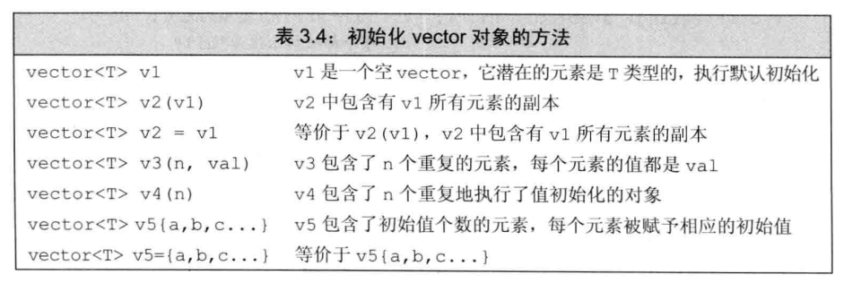

- 最常见的方式是先定义一个空vector，然后当运行时获取到元素的值后再逐一添加

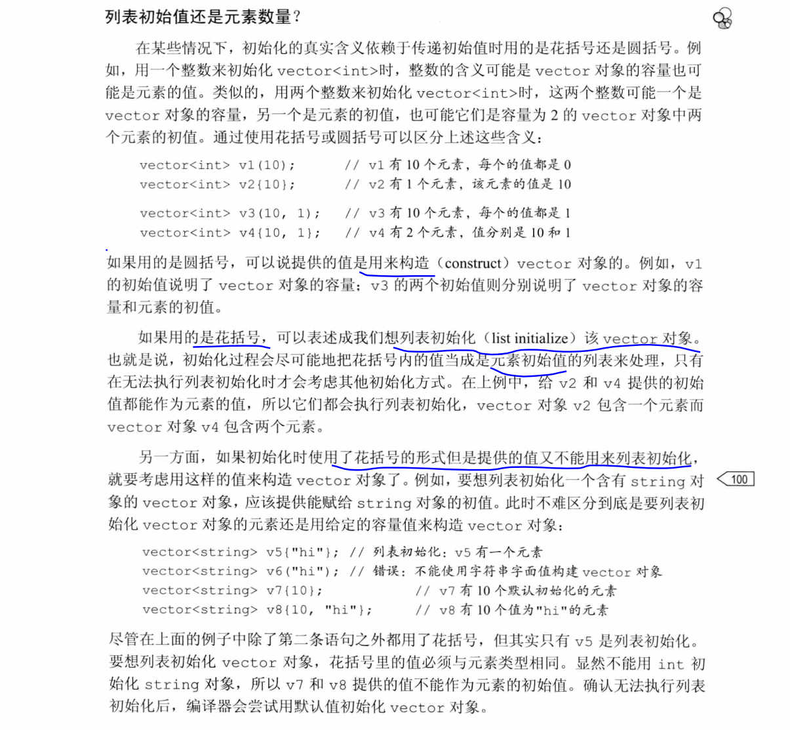

#### Exercise
- e3.12
  ```c++
  #include <vector>
  #include <string>

  using std::string;
  using std::vector;

  int main() {
          vector<vector<int>> ivec;
          vector<string> svec1 = ivec;
          vector<string> svec2(10, "null");
          return 0;
  }
  t3-12.cc: In function ‘int main()’:
  t3-12.cc:9:25: error: conversion from ‘std::vector<std::vector<int> >’ to non-scalar type ‘std::vector<std::__cxx11::basic_string<char> >’ requested
    vector<string> svec1 = ivec;
                          ^~~~
  ```

- e3.13
  ```c++
  #include <string>
  #include <vector>
  #include <iostream>
  using std::string;
  using std::vector;

  int main() {
          vector<int> v1;
          vector<int> v2(10);
          vector<int> v3(10, 42);
          vector<int> v4{10};
          vector<int> v5{10, 42};
          vector<string> v6{10};
          vector<string> v7{10, "hi"};

          std::cout << "v1.size(): " << v1.size() << std::endl;
          std::cout << "v2.size(): " << v2.size() << std::endl;
          std::cout << "v3.size(): " << v3.size() << std::endl;
          std::cout << "v4.size(): " << v4.size() << std::endl;
          std::cout << "v5.size(): " << v5.size() << std::endl;
          std::cout << "v6.size(): " << v6.size() << std::endl;
          std::cout << "v7.size(): " << v7.size() << std::endl;
          return 0;
  }
  //output
  v1.size(): 0
  v2.size(): 10
  v3.size(): 10
  v4.size(): 1
  v5.size(): 2
  v6.size(): 10
  v7.size(): 10
  ```

### 向vector对象中添加元素

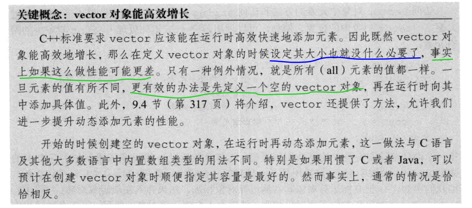

- 如果循环体内部包含有向vector对象添加元素的语句，则不能使用范围for循环。
- 范围for语句体内不应改变其所遍历序列的大小。

#### Exercise
- e3.14
  ```c++
  #include <vector>
  #include <iostream>

  using std::vector;

  int main() {
          vector<int> ivec;
          int i;
          while (std::cin >> i) {
                  ivec.push_back(i);
          }

          for (auto v : ivec)
                  std::cout << v << std::endl;

          return 0;
  }
  ```

- e3.15
  ```c++
  #include <vector>
  #include <iostream>
  #include <string>

  using std::vector;
  using std::string;

  int main() {
          vector<string> ivec;
          string s;
          while (std::cin >> s) {
                  ivec.push_back(s);
          }

          for (auto v : ivec)
                  std::cout << v << std::endl;

          return 0;
  }
  ```

### 3.3.3 其它vector操作

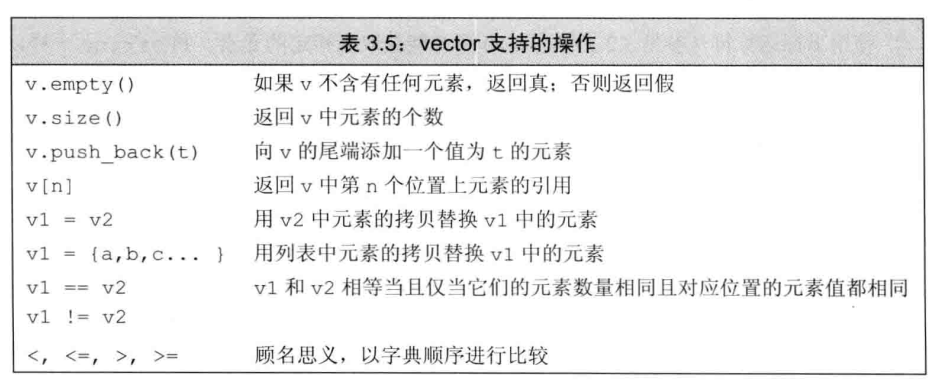

- vector对象的下标运算符可用于访问已存在的元素，而不能用于添加元素
- 确保下标合法的一种有效手段就是尽可能使用范围for语句

#### Exercise
- e3.16
  ```c++
  #include <vector>
  #include <iostream>
  #include <string>

  using std::vector;
  using std::string;

  int main() {
          vector<int> v1;
          vector<int> v2(10);
          vector<int> v3(10, 42);
          vector<int> v4{10};
          vector<int> v5{10, 42};
          vector<string> v6{10};
          vector<string> v7{10, "hi"};

          std::cout << "v1.size(): " << v1.size() << std::endl;
          std::cout << "v2.size(): " << v2.size() << std::endl;
          std::cout << "v3.size(): " << v3.size() << std::endl;
          std::cout << "v4.size(): " << v4.size() << std::endl;
          std::cout << "v5.size(): " << v5.size() << std::endl;
          std::cout << "v6.size(): " << v6.size() << std::endl;
          std::cout << "v7.size(): " << v7.size() << std::endl;
          return 0;
  }
  ```

- e3.17
  ```c++
  #include <iostream>
  #include <vector>
  #include <string>

  using std::vector;
  using std::string;

  int main() {
          string s;
          vector<string> svec;
          while (std::cin >> s) {
                  svec.push_back(s);
          }

          for (auto &v : svec) {
                  for (auto &c : v) {
                          if (isalpha(c) && islower(c)) {
                                  c = toupper(c);
                          }
                  }
                  std::cout << v << std::endl;
          }
          return 0;
  }
  ```

- e3.18
  ```c++
  //不合法，使用push_back
  vector<int> ivec;
  // 编译时并不会出错，但是执行时会报告：Segmentation fault (core dumped)
  ivec[0] = 42;
  ```

- e3.19
  ```c++
  #include <vector>
  #include <iostream>

  using std::vector;

  int main() {
      vector<int> v1{42, 42, 42, 42, 42, 42, 42, 42, 42, 42};
      // best one
      vector<int> v2(10, 42);
      vector<int> v3(10);
      for (auto &v : v3)
          v = 42;

      for (decltype(v1.size()) index = 0; index != v1.size(); ++index) {
          std::cout << "v1:" << index << ": " << v1[index] << std::endl;
          std::cout << "v2:" << index << ": " << v2[index] << std::endl;
          std::cout << "v3:" << index << ": " << v3[index] << std::endl;
      }
      return 0;
  }
  ```

- e3.20a
  ```c++
  #include <iostream>
  #include <vector>

  using std::vector;

  int main() {
      vector<int> ivec;
      int i;
      while (std::cin >> i) {
          ivec.push_back(i);
      }

      if (ivec.empty()) {
          std::cout << "empty" << std::endl;
      } else if (ivec.size() == 1) {
          std::cout << ivec[0] << std::endl;
      } else {
          for (decltype(ivec.size()) idx = 0; idx != ivec.size() - 1; ++idx) {
              std::cout << ivec[idx] + ivec[idx+1] << std::endl;
          }
      }
      return 0;
  }
  ```

- e3.20b
  ```c++
  #include <iostream>
  #include <vector>

  using std::vector;

  int main() {
      vector<int> ivec;
      int i;
      while (std::cin >> i) {
          ivec.push_back(i);
      }

      if (ivec.empty()) {
          std::cout << "empty" << std::endl;
      } else {
          for (decltype(ivec.size()) idx = 0; idx != (ivec.size() + 1) / 2; ++idx) {
              std::cout << ivec[idx] + ivec[ivec.size() - idx - 1] << std::endl;
          }
      }
      return 0;
  }
  ```

## 3.4 使用迭代器
- 所有的标准库容器都可以使用迭代器，但是其中只有少数几种才支持下标运算符。
- 迭代器提供对对象的**间接访问**（那就类似指针咯，取对象就得用*解引用），其对象是容器中的元素或者string对象中的字符。
- 有效的迭代器或者指向某个元素，或者指向容器中尾元素的下一个位置。其它所有情况都属于无效。
  
### 3.4.1 使用迭代器
- end成员返回指向容器“尾元素的下一个位置”的迭代器
- 如果容器为空，则begin和end返回的是同一个迭代器，都是尾后迭代器
- 一般来说，我们不清楚（不在意）迭代器准确的类型到底是什么。
- 迭代器运算符
  
  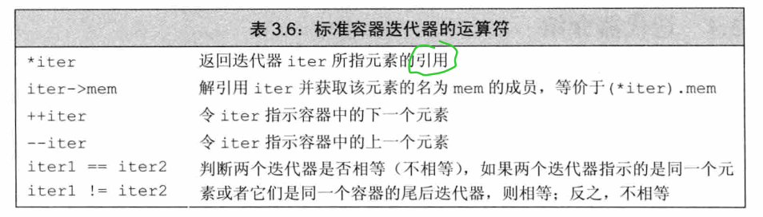

- 试图解引用一个非法迭代器或者尾后迭代器都是未定义的行为
- 迭代器使用递增（++）运算符来从一个元素移动到下一个元素
- 因为end返回的迭代器并不实际指向某个元素，所以不能对其进行递增或解引用操作
- 每个容器类定义了一个名为iterator的类型，该类型支持迭代器概念所规定的一套操作
- begin和end返回的具体类型由对象是否是常量决定
- cbegin和cend返回const_iterator类型
- it->men 等价于 (*it).mem
- 凡是使用了迭代器的循环体，都不要向迭代器所属的容器添加元素

#### Exercise
- e3.21
  ```c++
  #include <string>
  #include <vector>
  #include <iostream>
  using std::string;
  using std::vector;

  void print_out(vector<int> ivec) {
      for (auto it = ivec.cbegin(); it != ivec.cend(); ++it) {
          std::cout << *it << (it != ivec.cend() ? ' ' : ('\n'));
      }
      std::cout << std::endl;
  }

  void print_out(vector<string> svec) {
      for (auto it = svec.cbegin(); it != svec.cend(); ++it) {
          std::cout << *it << (it != svec.cend() ? ' ' : ('\n'));
      }
      std::cout << std::endl;
  }

  int main() {
          vector<int> v1;
          vector<int> v2(10);
          vector<int> v3(10, 42);
          vector<int> v4{10};
          vector<int> v5{10, 42};
          vector<string> v6{10};
          vector<string> v7{10, "hi"};

          std::cout << "v1.size(): " << v1.size() << std::endl;
          std::cout << "v2.size(): " << v2.size() << std::endl;
          std::cout << "v3.size(): " << v3.size() << std::endl;
          std::cout << "v4.size(): " << v4.size() << std::endl;
          std::cout << "v5.size(): " << v5.size() << std::endl;
          std::cout << "v6.size(): " << v6.size() << std::endl;
          std::cout << "v7.size(): " << v7.size() << std::endl;

          print_out(v1);
          print_out(v2);
          print_out(v3);
          print_out(v4);
          print_out(v5);
          print_out(v6);
          print_out(v7);


          return 0;
  }
  ```

- e3.22
  ```c++
  #include <iostream>
  #include <string>
  #include <vector>
  #include <cctype>

  using std::string;
  using std::vector;

  int main() {
      vector<string> text;
      string line;
      while (getline(std::cin, line)) {
          text.push_back(line);
      }

      for (auto &line : text) {
          for (auto &c : line) {
              if (std::isalpha(c) && std::islower(c))
                  c = toupper(c);
          }
          std::cout << line << std::endl;
      }
  }
  ```

- e3.23
  ```c++
  #include <iostream>
  #include <vector>
  #include <cctype>

  using std::vector;

  int main() {
      vector<int> ivec{1, 2, 3, 4, 5, 6, 7, 8, 9, 10};
      for (auto it = ivec.begin(); it != ivec.end(); ++it)
          *it = *it * 2;
      for (auto i : ivec)
          std::cout << i << std::endl;
      return 0;
  }
  ```

### 3.4.2 迭代器运算

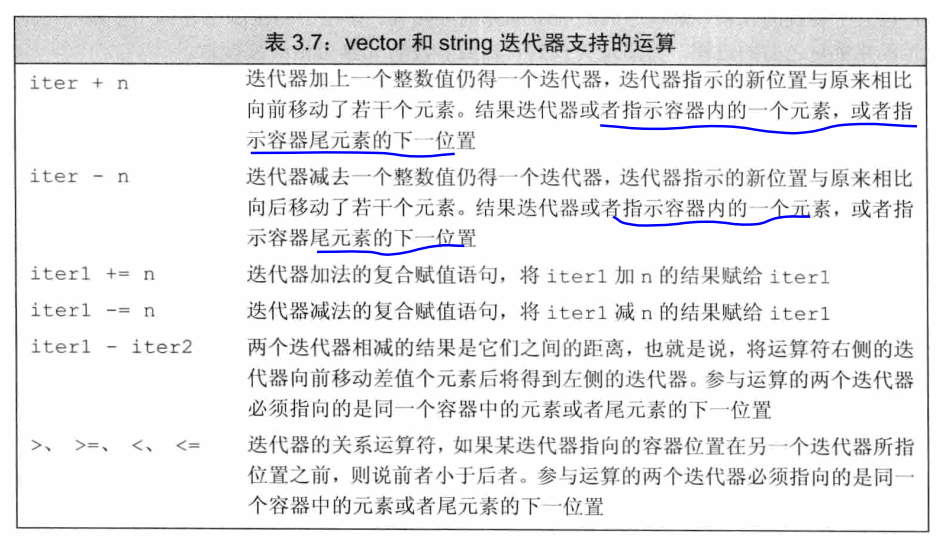

#### Exercise

- e3.24a
  ```c++
  #include <iostream>
  #include <vector>

  using std::vector;

  int main() {
      vector<int> ivec;
      int i;
      while (std::cin >> i) {
          ivec.push_back(i);
      }

      if (ivec.empty()) {
          std::cout << "empty" << std::endl;
      } else if (ivec.size() == 1) {
          std::cout << ivec[0] << std::endl;
      } else {
          for (auto it = ivec.cbegin(); it != ivec.cend() - 1; ++it) {
              std::cout << *it + *(it+1) << std::endl;
          }
      }
      return 0;
  }
  ```

- e3.24b
  ```c++
  #include <iostream>
  #include <vector>

  using std::vector;

  int main() {
      vector<int> ivec;
      int i;
      while (std::cin >> i) {
          ivec.push_back(i);
      }
      if (ivec.empty()) {
          std::cout << "empty" << std::endl;
      } else {
          for (auto beg = ivec.cbegin(), end = ivec.cend() - 1; beg <= end; ++beg, --end)
              std::cout << *beg + *end << std::endl;
      }
      return 0;
  }
  ```
- e3.25
  ```c++
  #include <iostream>
  #include <vector>

  using std::vector;

  int main() {
      vector<int> scores(11, 0);
      int grade;
      while (std::cin >> grade) {
          if (grade <= 100 && grade >=0) {
              ++(*(scores.begin() + grade/10));
          }
      }

      for (auto s : scores) {
          std::cout << s << std::endl;
      }
      return 0;
  }
  ```
- e3.26
  > 没有迭代器的+操作，只有-操作。类似指针，因为+没有任何意义啊。比如两个指针相加，那个地址有意义吗？没意义吧。还可能越界。

## 3.5 数组
- 如果不清楚元素具体个数，使用vector

### 3.5.1 定义和初始化内置数组
- 数组的元素必须为对象，所以不存在引用的数组
- 不允许使用一个数组初始化另一个数组。不能把一个数组直接赋值给另一个数组。
  
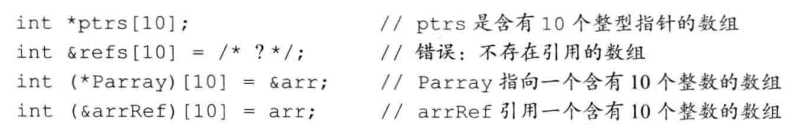

#### Exercise
- e3.27
  - 不合法，维度不是常量表达式
  - 合法
  - 不合法，返回值是int，不是常量表达式
  - 不合法，越界
- e3.28
  ```c++
  #include <string>
  #include <iostream>
  using std::string;

  string sa[10];
  int ia[10];

  int main() {
      string sa2[10];
      int ia2[10];

      for (int i = 0; i != 10; ++i) {
          std::cout << "sa[" << i << "]=" << sa[i] << std::endl;
          std::cout << "sa2[" << i << "]=" << sa2[i] << std::endl;
          std::cout << "ia[" << i << "]=" << ia[i] << std::endl;
          std::cout << "ia2[" << i << "]=" << ia2[i] << std::endl;
      }

      return 0;
  }
  // sa/sa2 输出空，ia输出0, ia2输出随机数
  ```
- e3.29
  - 不能使用auto
  - 固定大小
  - 性能好，但是缺少灵活性
  - 一些额外因素需要考虑，容易引起bug，比如字符数组使用字符串初始化，经常出错
  - 拷贝和赋值不方便

### 3.5.2 访问数组元素
- 当使用数组下标时，通常定义为`size_t`类型
#### Exercise
- e3.30
  > 0~9而不是1~10
- e3.31
  ```c++
  #include <iostream>

  int main() {
      int a[10] = {};
      for (size_t i = 0; i < 10; ++i)
          a[i] = i;
      for (auto i : a)
          std::cout << i << std::endl;
      return 0;
  }
  ```
- e3.32a
  ```c++
  #include <iostream>

  int main() {
      int a[10] = {};
      for (size_t i = 0; i < 10; ++i)
          a[i] = i;
      int b[10];
      for (size_t i = 0; i < 10; ++i)
          b[i] = a[i];
      for (auto i : b)
          std::cout << i << std::endl;
      return 0;
  }
  ```
- e3.32b
  ```c++
  #include <iostream>
  #include <vector>

  using std::vector;

  int main() {
      vector<int> ivec;
      for (int i = 0; i < 10; ++i)
          ivec.push_back(i);

      vector<int> ivec2;
      ivec2 = ivec;
      for (auto i : ivec2)
          std::cout << i << std::endl;

      return 0;
  }
  ```
- e3.33b
  ```c++
  #include <iostream>
  using namespace std;

  int main() {
      unsigned scores[11];
      unsigned grade;

      while (cin >> grade) {
          if (grade <= 100)
              ++scores[grade/10];
      }
      for (auto i : scores)
          cout << i << " ";
      cout << endl;
      return 0;
  }
  //输入：1 34 55 33 44 90 100 30 43
  //输出：3 0 3904900141 32723 3900770722 32721 0 0 3904900064 32721 3904899457
  ```
### 3.5.3 指针和数组
- 使用数组的时候，编译器一般把它转换为指针
- 在很多使用数组名字的地方，编译器都会自动地将其替换为一个指向数组首元素的指针。
- 当使用数组作为一个auto变量的初始值时，推断得到的类型是指针而非数组
  
  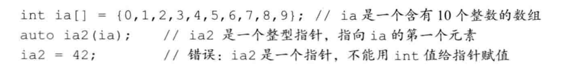
- `auto ia2(ia)`类似于`auto ia2(&ia[0])`
- 但是`decltype`返回的类型不同
  
  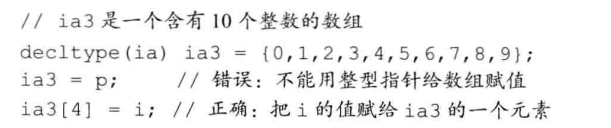
- 标注库类型限定使用的下标必须是无符号类型，而内置的下标运算无此要求
#### Exercise
- e3.34
  > 无论p1/p2哪个大，总是会产生合法的值
- e3.35
  ```c++
  #include <iostream>

  int main() {
      const int sz = 5;
      int a[sz];
      for (int *p = a; p != &a[sz]; ++p)
          *p = 0;
      for (auto i : a)
          std::cout << i << std::endl;
      return 0;
  }
  ```
- e3.36a
  ```c++
  #include <iostream>

  int main() {
      const int sz = 10;
      int a[sz] = {1,2,3,4,5};
      int b[sz] = {1,2,3,4};

      for (size_t i = 0; i != sz; ++i) {
          std::cout << "a[" << i << "]: " << a[i] << "  b[" << i << "]: " <<  b[i] << std::endl;
          if (a[i] != b[i]) {
              std::cout << "unequal" << std::endl;
              return 0;
          }
      }

      std::cout << "equal" << std::endl;
      return 0;
  }
  ```
- e3.36b
  ```c++
  #include <iostream>
  #include <vector>

  using std::vector;

  int main() {
      vector<int> iva{1,2,3,4,5};
      vector<int> ivb{1,2,3,4,5};
      if (iva == ivb) {
          std::cout << "equal" << std::endl;
      } else {
          std::cout << "unequal" << std::endl;
      }
      return 0;
  }
  ```
### 3.5.4 C风格字符串
- C风格字符串不是一种类型，而是为了表达和使用字符串而形成的一种约定俗成的写法。
  
  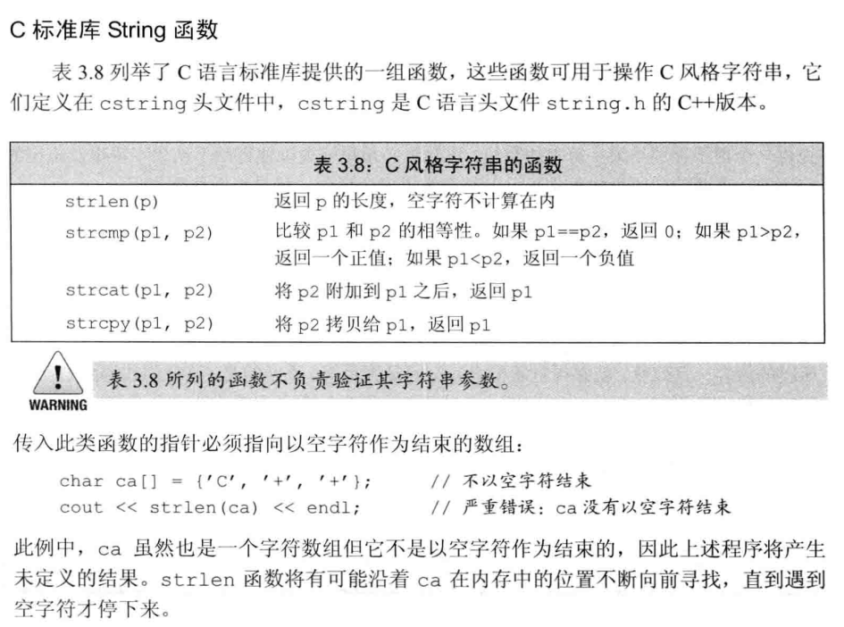

- 对于大多数应用来说，使用标准库string要比使用C风格字符串更安全、更高效

#### Exercise
- e3.37
  > 按理说，没有以'\0'结尾，会打印出乱码，但是实际测试中一次也没发生过。。。
- e3.38
  > https://www.zhihu.com/question/31254348
- e3.39
  ```c++
  #include <string>
  #include <iostream>
  #include <cstring>
  using namespace std;

  int main() {
      string s1("abc");
      string s2("abcd");

      if (s1 == s2) {
          cout << "string equal" << endl;
      } else {
          cout << "string unequal" << endl;
      }

      const char *c1 = "abcd";
      const char *c2 = "abcd";

      if (strcmp(c1, c2) == 0) {
          cout << "char array equal" << endl;
      } else {
          cout << "char array unequal" << endl;
      }
      return 0;
  }
  ```
- e3.40
  ```c++
  #include <cstring>
  #include <iostream>

  using namespace std;

  int main() {
      static const char a[] = "abc";
      static const char b[] = "efg";
      constexpr size_t len = strlen(a) + strlen(b) + 1;
      char c[len];
      strcpy(c, a);
      strcat(c, b);
      cout << c << endl;
      return 0;
  }
  ```

### 3.5.5 与旧代码的接口
- 如果执行完c_str()函数后程序想一直都能使用其返回的数组，最好将该数组重新拷贝一份
- 不允许使用一个数组为一个内置类型的数组赋值，也不允许使用vector对象初始化数组。相反，允许使用数组来初始化vector对象。
  ```c++
  int int_arr[] = {0,1,2,3,4,5};
  vector<int> ivec(begin(int_arr), end(int_arr));
  ```
- 现代C++程序应当尽量使用vector和迭代器，避免使用内置数组和指针；应该尽量使用string，避免使用C风格的基于数组的字符串。

#### Exercise
- e3.41
  ```c++
  #include <vector>
  #include <iostream>
  using std::vector;

  int main() {
      int int_arr[] = {1, 2, 3, 4, 5};
      vector<int> ivec(std::begin(int_arr), std::end(int_arr));
      for (auto i : ivec)
          std::cout << i << std::endl;
      return 0;
  }
  ```

- e3.42
  ```c++
  #include <vector>
  #include <iostream>

  using std::vector;

  int main() {
      vector<int> ivec{1, 2, 3, 4, 5};
      int iarr[5];
      for (size_t i = 0; i != ivec.size(); ++i)
          iarr[i] = ivec[i];
      for (auto i : iarr)
          std::cout << i << " ";
      std::cout << std::endl;
      return 0;
  }
  ```
## 3.6 多维数组
- 严格来讲，C++中没有多维数组，通常所说的多维数组都是数组的数组。
- 当一个数组的元素仍然是数组时，通常使用两个维度来定义它：一个维度表示数组本身大小，另一个维度表示其元素（也是数组）大小
  ```c++
  int ia[3][4]; //大小为3的数组，每个元素是含有4个整数的数组
  ```
- 如果表达式含有的下标运算符数量和数组的维度一样多，该表达式的结果将是给定类型的元素；反之，如果表达式含有的下标运算符数量比数组的维度小，则表达式的结果将是给定索引处的一个内层数组。
- 用for循环处理多维数组
  ```c++
  constexpr size_t rowCnt = 3, colCnt = 4;
  int ia[rowCnt][colCnt];
  for (size_t i = 0; i != rowCnt; ++i) {
    for (size_t j = 0; j != colCnt; ++j) {
      ia[i][j] = i * colCnt + j;
    }
  }

  size_t cnt = 0;
  // 这里两层循环因为修改数组内容而使用引用，可以理解
  for (auto &row : ia)
    for (auto &col : row) {
      col = cnt;
      ++cnt;
    }
  
  // 这里只是读取数据，为什么也声明为引用类型呢？这是为了避免数组被自动转换成指针
  for (const auto &row : ia)
    for (auto col : row)
      cout << col << endl;

  // 假设不用引用类型，则通不过编译，因为row不是引用类型，所以编译器初始化row时会自动将这些数组形式的元素转换成数组首元素的指针。这样row的类型就是int *，显然内层循环不合法了，编译器试图在一个int *内遍历。而我们期望的时int (*p)[col_size]类型。
  for (auto row : ia)
    for (auto col : row)

  ```
- 要使用范围for语句处理多维数组，除了最内层的循环外，其它所有循环的控制变量都应该是引用类型。
- 当程序使用多维数组的名字时，也会**自动将其转换成指向数组首元素的指针**
  > int a[10]的首元素是a[0]，类型是int，首元素的地址是&a[0]，类型是int *
  
  > int a[2][3]的首元素是a[0]，类型是int ()[4]，首元素的地址是&a[0]，类型是int (*)[4]；
- 定义指向多维数组的指针时，千万别忘了这个多维数组实际上是数组的数组

  ```c++
  #include <iostream>
  using namespace std;
  int main() {
      int ia[3][4] = {1,2,3,4,11,12,13,14,21,22,23,24};

      for (auto &row : ia)
          for (auto col : row)
              std::cout << col << " ";
      std::cout << std::endl;

      typedef int(*prow_t)[4];
      std::cout << "ia: " << ia << std::endl;
      std::cout << "ia+3: " << ia + 3 << std::endl;

      for (prow_t row = ia; row != &ia[3]; ++row) {
          std::cout << "row: " << row << std::endl;
          for (int i = 0; i != 4; ++i)
              std::cout << "(*row)[i]: " << (*row)[i] << "; ";
          std::cout << std::endl;
      }
      typedef int (row_t)[4];
      row_t row = {1, 2, 3, 4}; // cannot use other array instantiate an array
      for (int i = 0; i != 4; ++i)
          std::cout << "(row)[i]: " << (row)[i] << "; ";
      std::cout << std::endl;

      //在程序中使用多维数组名字时，自动将其转换成指向数组首元素的指针
      //遵循这一条，这里ia[3][4]的首元素为ia[0]，类型为int ()[4], 首元素的指针是&ia[0]，类型为int (*)[4]。
      for (auto p = ia; p != ia + 3; ++p) {
          //p是一个int(*)[4]的地址，*p类型为int ()[4]，即一个有4个元素的一维数组的名字。名字用在程序中，自动将其转换为数组首元素的指针。首元素为(*p)[0]，类型为int，首元素的指针为&(*p)[0]，类型为int *
          for (auto q = *p; q != *p + 4; ++q)
              std::cout << *q << ' ';
          std::cout << std::endl;
      }


      for (auto p = begin(ia); p != end(ia); ++p) {
          for (auto q = begin(*p); q != end(*p); ++q)
              std::cout << *q << ' ';
          std::cout << std::endl;
      }
      return 0;
  }
  // output:
  1 2 3 4 11 12 13 14 21 22 23 24
  ia: 0x7ffff0945100
  ia+3: 0x7ffff0945130
  row: 0x7ffff0945100
  (*row)[i]: 1; (*row)[i]: 2; (*row)[i]: 3; (*row)[i]: 4;
  row: 0x7ffff0945110
  (*row)[i]: 11; (*row)[i]: 12; (*row)[i]: 13; (*row)[i]: 14;
  row: 0x7ffff0945120
  (*row)[i]: 21; (*row)[i]: 22; (*row)[i]: 23; (*row)[i]: 24;
  (row)[i]: 1; (row)[i]: 2; (row)[i]: 3; (row)[i]: 4;
  1 2 3 4
  11 12 13 14
  21 22 23 24
  1 2 3 4
  11 12 13 14
  21 22 23 24
  ```
#### Exercise
- e3.43
  ```c++
  #include <iostream>
  using namespace std;

  int main() {
      int ia[3][4] = { {1,2,3,4}, {11,12,13,14}, {21,22,23,24}};

      for (int (&row)[4] : ia) {
          for (int col : row)
              cout << col << " ";
          cout << endl;
      }

      for (size_t i = 0; i != 3; ++i) {
          for (size_t j = 0; j != 4; ++j)
              cout << ia[i][j] << " ";
          cout << endl;
      }

      for (int (*row)[4] = ia; row != ia + 3; ++row) {
          for (int *col = *row; col != *row + 4; ++col)
              cout << *col << " ";
          cout << endl;
      }

      return 0;
  }
  ```
- e3.44
  ```c++
  #include <iostream>
  using namespace std;

  int main() {
      int ia[3][4] = { {1,2,3,4}, {11,12,13,14}, {21,22,23,24}};

      using int_array = int[4];

      //for (int (&row)[4] : ia) {
      for (int_array &row : ia) {
          for (int col : row)
              cout << col << " ";
          cout << endl;
      }

      for (size_t i = 0; i != 3; ++i) {
          for (size_t j = 0; j != 4; ++j)
              cout << ia[i][j] << " ";
          cout << endl;
      }

      //for (int (*row)[4] = ia; row != ia + 3; ++row) {
      for (int_array *row = ia; row != ia + 3; ++row) {
          for (int *col = *row; col != *row + 4; ++col)
              cout << *col << " ";
          cout << endl;
      }

      return 0;
  }
  ```
- e3.45
  ```c++
  #include <iostream>
  using namespace std;

  int main() {
      int ia[3][4] = { {1,2,3,4}, {11,12,13,14}, {21,22,23,24}};

      using int_array = int[4];

      //for (int (&row)[4] : ia) {
      //for (int_array &row : ia) {
      for (auto &row : ia) {
          //for (int col : row)
          for (auto col : row)
              cout << col << " ";
          cout << endl;
      }

      for (size_t i = 0; i != 3; ++i) {
          for (size_t j = 0; j != 4; ++j)
              cout << ia[i][j] << " ";
          cout << endl;
      }

      //for (int (*row)[4] = ia; row != ia + 3; ++row) {
      //for (int_array *row = ia; row != ia + 3; ++row) {
      for (auto row = ia; row != ia + 3; ++row) {
          //for (int *col = *row; col != *row + 4; ++col)
          for (auto col = *row; col != *row + 4; ++col)
              cout << *col << " ";
          cout << endl;
      }

      return 0;
  }
  ```

