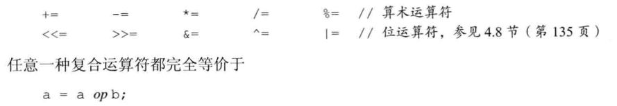
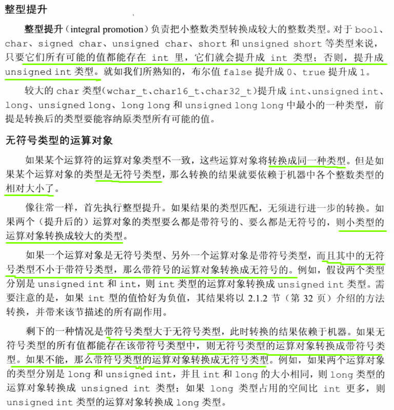

# 4 表达式

- 字面值和变量时最简单的**表达式**，其结果就是字面值和变量的值
- 表达式由一个或多个运算对象组成，对表达式求职将得到一个结果

## 4.1 基础
### 4.1.1 基本概念
- 当运算符作用于类类型的运算对象时，用户可以自定义其含义。
- 我们使用重载运算符时，其包括运算对象的类型，返回值的类型，都是由该运算符定义的；但是运算对象的个数，运算符的优先级和结合律都是无法改变的。
- 左值可以位于赋值语句左侧，右值不能
- 当一个对象被用作右值的时候，用的是对象的值（内容）；当对象被用作左值的时候，用的是对象的身份（在内存中的位置）
- 一个重要的原则是在需要右值的地方可以用左值来代替，但是不能把右值当做左值（也就是位置）使用。当一个左值当成右值使用时，实际使用的时它的内容（值）
- 有几种书序的运算符需要用到左值：
  - 赋值运算符需要一个（非常量）左值作为其左侧运算对象，得到的结果也仍然是一个**左值**
  - 取地址符**作用于一个左值运算对象**，返回一个指向该运算对象的指针，这个指针是一个**右值**。
  - 内置解引用运算符，下标运算符，迭代器解引用运算符、string和vector的下标运算符的求值结果都是**左值**。
  - 内置类型和迭代器的递增递减运算符作用于左值运算对象，其前置版本所得的结果也是**左值**
- 使用关键字decltype时，左值和右值也有所不同，如果表达式的求值结果是左值，decltype作用于该表达式（不是变量）得到一个引用类型
  ```c++
  int a;
  int *p = &a;
  decltype(*p)  // 类型为int &，因为*p表达式求值结果是左值
  decltype(&p)  // 类型为int **，因为取地址运算符生成右值
  ```
### 4.1.2 优先级与结合律
#### Exercise
- e4.1
  > 105
- e4.2
  > (a) *vec.begin(): *(vec.begin())
  
  > (b) *vec.begin() + 1: (*(vec.begin())) + 1

### 4.1.3 求值顺序
- 优先级规定了运算对象的组合方式，但是没有说明运算对象按照什么顺序求值。在大多数情况下，不会明确指定求值的顺序
  ```c++
  //无法知道到底f1/f2的调用顺序
  int i = f1() * f2();
  ```
- 对于没有指定执行顺序的运算符，如果表达式指向并修改了同一个对象，将会引发错误并产生未定义的行为。
  ```c++
  int i = 0;
  cout << i << " " << ++i << endl; //未定义的
  ```
- 有4种运算符明确规定了运算对象的求值顺序，(&&)， (||) ，( ?: ), (,)
- 运算对象的求值顺序与优先级和结合律无关。
- 建议：处理符合表达式
  - 拿不准的时候最好用括号来强制让表达式的组合关系符合程序逻辑的要求
  - 如果改变了某个对象的值，在表达式的其它地方不要再使用这个运算对象
    - 例外情况：比如*++iter，这种当改变运算对象子表达式本身就是另外一个子表达式的运算对象时。
#### Exercise
- e4.3
  > 不可以，引入的BUG远高于生成效率。如果顺序可控制，那效率和BUG都有所控制
## 4.2 算术运算符


- 布尔值不应该参与运算
  ```c++
  bool b = true;
  bool b2 = -b //b2是true
  //对于大多数运算符来说，bool类型的运算对象被提升为int类型。b在运算时被提升为整数值1，求负时结果是-1，不等于0，转换成布尔值后应该为1，
  ```

- 整数相除结果还是整数，如果商还有小数部分，直接弃除
  ```c++
  int ival1 = 21/6; //ival1是3，余数被抛弃
  int ival2 = 21/7; //ival2是3，没有余数，结果为整数
  ```
- %，取模运算符，负责计算两个整数相除所得的余数，参与取余的运算对象必须是整数类型
  ```c++
  int ival = 42;
  double dval = 3.14;
  ival % 12; //正确，结果是6
  ival % dval; //错误，因为运算对象为浮点类型
  ```
- 在除法运算中，如果两个运算符符号相同则商为正（如果不为0的话），否则为负。
- C++早起版本允许结果为负值的上向上或向下取整，**C++11规定商一律向0取整（即直接切除小数部分）**
- C++新标准规定模运算，除了-m导致溢出的特殊情况，其它时候(-m)/n和m/(-n)都等于-(m/n)，m%(-n)等于m%n, (-m)%n等于-(m%n)
  
  

### Exercise
- e4.4
  > 91

  ```c++
  #include <iostream>
  using namespace std;

  int main() {
      cout << 12 / 3 * 4 + 5 * 15 + 24 % 4 / 2 << endl;
      return 0;
  }
  //output:
  91
  ```
- e4.5
  > (a): -86 (b): -18 (c): 0 (d): -2

  ```c++
  #include <iostream>
  using namespace std;

  int main() {
      cout << -30 * 3 + 21 / 5 << endl;
      cout << -30 + 3 * 21 / 5 << endl;
      cout << 30 / 3 * 21 % 5 << endl;
      cout << -30 / 3 * 21 % 4 << endl;
      return 0;
  }
  ```
- e4.6
  ```c++
  #include <iostream>
  using namespace std;

  int main()
  {
      int a;
      cin >> a;
      cout << (a % 2 == 0 ? "EVEN" : "ODD") << endl;

      return 0;
  }
  ```
- e4.7
  ```c++
  #include <iostream>
  using namespace std;

  int main() {
      cout << sizeof(int) << endl;
      unsigned int a = ~0;
      cout << a << endl;
      cout << a + 1 << endl;

      int b = 0x7FFFFFFF;
      cout << b << endl;
      cout << b + 1 << endl;

      int c = 0x80000000;
      cout << c << endl;
      cout << c - 1 << endl;

      return 0;
  }
  //output:
  4
  4294967295
  0
  2147483647
  -2147483648
  -2147483648
  2147483647
  ```

## 4.3 逻辑和关系运算符
  


- 逻辑与运算符和逻辑或运算符都是先求运算对象的值再求右侧运算对象的值，当且仅当左侧运算对象无法确定表达式的结果时才会计算右侧运算对象的值，这种策略称为**短路求值**。
- 关系运算符比较运算对象的大小关系并返回布尔值，关系运算符都满足左结合律
- 进行比较运算时除非比较的对象是布尔类型，否则不要使用布尔字面值true/false作为运算对象

### Exercise
- e4.8
  > 逻辑与：左侧为真继续计算右侧，两者求与得到结果；左侧为假则结束运算返回假。
  > 逻辑或：左侧为真结束运算，返回真；左侧为假，继续计算右侧，两者求或得到结果  
  > 相等性运算：从左到右顺序都得运算，但是运算对象求值顺序未定义。
- e4.9
  > 判断cp是否为空，再执行解引用。cp不为空，为true，所以继续计算右侧，也不为0，为true，所以返回true
- e4.10
  ```c++
  #include <iostream>
  using namespace std;

  int main() {
      int a;
      while (cin >> a && a != 42)
          cout << a << endl;
      cout << "Quit: " << a << endl;
      return 0;
  }
  ```
- e4.11
  ```c++
  #include <iostream>
  using namespace std;

  int main() {
      int a = 5, b = 4, c = 3, d = 2;
      if (a > b && b > c && c > d) {
          cout << "Y" << endl;
      } else {
          cout << "N" << endl;
      }

      return 0;
  }
  ```
- e4.12
  > i != j < k => i != (j < k)

## 4.4 赋值运算符
- 赋值运算符的左侧运算对象必须是一个**可修改的左值**
  ```c++
  int i = 0, j = 0, k = 0; //初始化而非赋值
  const int ci = i; // 初始化而非赋值

  // 这些赋值是非法的
  1024 = k; //错误：字面值是右值
  i + j = k; //错误：算术表达式是右值
  ci = k; //错误：ci是常量左值
  ```
- 对于多重赋值语句中的每一个对象，它的类型或者与右边对象的类型相同、或者可由右边对象的类型转换得到
  
  

- 复合运算符与普通运算符的唯一区别是：左侧对象的求值次数，复合运算符只求值一次，而普通运算符则求值两次。这两次包括，一次是作为右边子表达式的一部分求值，另一次是作为赋值运算的左侧运算对象求值。
  
  

### Exercise
- e4.13
  > (a): d=i=3.5 => d=3.0, i=3  
  > (b): i=d=3.5 => i=3, d=3.5
- e4.14
  > if (42 = i) => 编译错误  
  > if (i = 42) => 永远为真，i赋值为42
- e4.15
  > int*不能赋值为int
- e4.16
  ```c++
  // g++ t4-15.cc -fpermissive
  #include <iostream>
  using namespace std;

  int main() {
      double dval; int ival; int *pi;
      /*
      t4-15.cc: In function ‘int main()’:
      t4-15.cc:6:22: warning: invalid conversion from ‘int*’ to ‘int’ [-fpermissive]
          dval = ival = pi = 0;
                        ~~~^~~
      */
      //dval = ival = pi = 0;
      /*
      t4-15.cc: In function ‘int main()’:
      t4-15.cc:7:15: warning: invalid conversion from ‘int’ to ‘int*’ [-fpermissive]
          pi = ival = dval = 0;
                ~~~~~^~~~~~~~~~
      */
      //pi = ival = dval = 0;
      /*
      t4-15.cc: In function ‘int main()’:
      t4-15.cc:8:24: warning: cast from ‘int*’ to ‘int’ loses precision [-fpermissive]
          dval = ival = (int)pi = 0;
                              ^~
      t4-15.cc:8:29: error: lvalue required as left operand of assignment
          dval = ival = (int)pi = 0;
      */
      //dval = ival = (int)pi = 0;
      /*
      t4-15.cc: In function ‘int main()’:
      t4-15.cc:9:31: warning: cast from ‘int*’ to ‘int’ loses precision 
      -fpermissive]
          dval = ival = (int)(pi = 0);
      */
      //dval = ival = (int)(pi = 0);

      dval = ival = 0;
      pi = 0;
      return 0;
  }
  ```

## 4.5 递增和递减运算符
- 很多迭代器本身不支持算术运算，所以此时递增和递减运算符除了书写简洁外还是必须的
- 这两种运算符必须作用于左值运算对象，前置版本将对象本身作为**左值返回**，后置版本则将对象原始值的副本作为**右值返回**。
  
  

- 为什么使用前置版本
  
  

- 如果想在一个复合表达式中既将变量加1或减1又能使用它原来的值，可以使用递增和递减运算符的后置版本：*pbeg++;
  > 后置递增运算符的优先级高于解引用运算符，因此 *pbeg++ 等价于 *(pbeg++)。pbeg++把pbeg的值加1，然后返回pbeg的初始值的副本作为其求值结果，此时解引用运算符的运算对象是pbeg未增加之前的值。
- 如果一条子表达式改变了某个运算对象的值，另一条子表达式又要使用该值的话，运算对象的求值顺序很关键
  ```c++
  while (beg != s.end() && !isspace(*beg))
      *beg = toupper(*beg++)  //错误：该赋值语句未定义
  ```

### Exercise
- e4.17
  > 前置运算符，把值加1，直接返回改变了的运算对象。后置运算符需要将原始值存储下来以便于返回这个未修改的内容，造成浪费。

  

  

- e4.18
  ```c++
  #include <iostream>
  #include <vector>

  using namespace std;

  int main() {
      vector<int> v{1,2,3,4,5,6,7,8,9,10};

      auto pbeg = v.begin();
      while (pbeg != v.end() && *pbeg >= 0)
          //cout << *pbeg++ << endl;
          cout << *++pbeg << endl;

      return 0;
  }

  //output
  2
  3
  4
  5
  6
  7
  8
  9
  10
  4113
  ```
- e4.19
  > (a) ptr != 0 && *ptr++: 先检查ptr是否为空，然后再取ptr的值，并且ptr指向下一个位置  
  > (b) ival++ && ival: 先取ival的值，然后与ival+1的值做运算  
  > (c) vec[ival++] <= vec[ival]: 因为<=运算符没有定义运算对象的先后顺序，所以结果未定义。比如vec[0] <= vec[1] 或者vec[1] <= vec[0] 或者 vec[1] = vec[1] 或者 vec[0] <= vec[0]都有可能

## 4.6 成员访问运算符
- 点运算符和箭头运算符都可用于访问成员，其中，点运算符获取类对象的一个成员；ptr->mem等价于(*ptr).mem。
- 解引用运算符的优先级低于点运算符，所以执行解引用运算的子表达式两端必须加上括号
- 箭头运算符作用于一个**指针类型的运算对象**，结果是一个**左值**。
- 点运算符分两种情况：如果成员**所属的对象是左值，那么结果是左值**；反之如果成员所**属对象是右值，那么结果是右值**

### Exercise
- e4.20
  > (a) *iter++: 合法, 取iter的值，然后iter指向下一个位置
  > (b) (*iter)++： 不合法，取iter的值，然后把当前值+1，但是string不能执行自增操作  
  > (c) *iter.empty(): 不合法：点引用优先级高，但是指针不能执行点操作
  > (d) iter->empty(): 合法：判断当前值是否为空  
  > (e) ++*iter: 不合法：与（b）类似，不能对string对象执行自增操作  
  > (f) iter++->empty(): 先执行iter->empty()，然后iter自增

  ```c++
  #include <iostream>
  #include <vector>
  using namespace std;

  int main() {
      vector<string> svec{"abc", "efg", "hij"};
      vector<string>::iterator iter = svec.begin();
      cout << "*iter:" << *iter << endl;
      /*
        *iter:abc
        abc
        *iter:efg
      */
      //cout << *iter++ << endl;
      /*
        t4-20.cc: In function ‘int main()’:
        t4-20.cc:10:20: error: no ‘operator++(int)’ declared for postfix ‘++’ [-fpermissive]
            cout << (*iter)++ << endl;
                    ~~~~~~~^~
      */
      //cout << (*iter)++ << endl;
      /*
        t4-20.cc: In function ‘int main()’:
        t4-20.cc:11:19: error: ‘std::vector<std::__cxx11::basic_string<char> >::iterator {aka class
        __gnu_cxx::__normal_iterator<std::__cxx11::basic_string<char>*, std::vector<std::__cxx11::basic_string<char> > >}’ has no member named ‘empty’
            cout << *iter.empty() << endl;
                          ^~~~~
      */
      //cout << *iter.empty() << endl;
      /*
        *iter:abc
        0
        *iter:abc
      */
      //cout << iter->empty() << endl;
      /*
        t4-20.cc: In function ‘int main()’:
        t4-20.cc:13:13: error: no match for ‘operator++’ (operand type is ‘std::__cxx11::basic_string<char>’)
            cout << ++*iter << endl;
                    ^~~~~~~
      */
      //cout << ++*iter << endl;
      /*
        *iter:abc
        0
        *iter:efg
      */
      cout << iter++->empty() << endl;
      cout << "*iter:" << *iter << endl;

      return 0;
  }
  ```

## 4.7 条件运算符
- `cond`是判断条件的表达式，而`expr1`和`expr2`是两个类型相同或可能转换为某个公共类型的表达式
  ```c++
  cond ? expr1 : expr2
  ```
- 当条件运算符的两个表达式都是左值或者转换成同一种左值类型时，运算的结果是左值；否则运算的结果是右值

### Exercise
- e4.21
  ```c++
  #include <iostream>
  #include <vector>
  using namespace std;

  int main() {
      vector<int> ivec{1, 2, 3, 4, 5, 6, 7, 8};
      cout << "before: " << endl;
      for (auto i : ivec)
          cout << i << endl;

      for (auto &i : ivec) {
          i = (i % 2 == 0 ? i : i * 2);
      }

      cout << "after: " << endl;
      for (auto i : ivec)
          cout << i << endl;

      return 0;
  }
  ```
- e4.22
  > if/else更容易理解，嵌套太深条件运算符很难理解

  ```c++
  #include <iostream>
  using namespace std;

  int main() {
      int grade;
      cin >> grade;
      string finalgrade = (grade > 90) ? "high pass" : (grade < 60) ? "fail" : (grade < 75) ? "low pass" : "pass";

      cout << finalgrade << endl;

      if (grade > 90) {
          finalgrade = "high pass";
      } else if (grade < 60) {
          finalgrade = "fail";
      } else if (grade < 75) {
          finalgrade = "low pass";
      } else {
          finalgrade = "pass";
      }

      cout << finalgrade << endl;
      return 0;
  }
  ```
- e4.23
  ```c++
  #include <iostream>
  #include <string>
  using namespace std;

  int main() {
      string s = "word";
      string p1 = s + (s[s.size() - 1] == 's' ? "" : "s");
      cout << p1 << endl;

      return 0;
  }
  ```
- e4.24
  ```c++
  #include <iostream>
  #include <string>
  using namespace std;

  int main() {
      int grade;
      cin >> grade;
      string finalgrade = (grade > 90) ? "high pass" : (grade < 60) ? "fail" : "pass";
      cout << finalgrade << endl;;
      //right
      finalgrade = (grade > 90) ? "high pass" : ((grade < 60) ? "fail" : "pass");
      cout << finalgrade << endl;
      //left
      /*
      t4-24.cc: In function ‘int main()’:
      t4-24.cc:14:32: error: operands to ?: have different types ‘const char*’ and ‘bool’
          finalgrade = ((grade > 90) ? "high pass" : (grade < 60)) ? "fail" : "pass";
                        ~~~~~~~~~~~~~^~~~~~~~~~~~~~~~~~~~~~~~~~~~
      如果bool可转换为string，那么当前部分>90时结果将是"high pass"，为正，所有最后结果为"fail"，但是这里不能自动转换，所以编译不通过。
      */
      finalgrade = ((grade > 90) ? "high pass" : (grade < 60)) ? "fail" : "pass";
      cout << finalgrade << endl;

      return 0;
  }

  ```
## 4.8 位运算符
- 所有位运算符同样能用于bitset类型

  

- 一般来说，如果运算对象是“小整型”，它的值会被自动提升成较大的整数类型。
- 运算对象是带符号的，也可以是无符号的。如果运算对象是带符号的且它的值为负，那么位运算符如何处理运算对象的“符号位”依赖于机器。而且此时的左移操作可能会改变符号位的值，因此是一种未定义的行为
- 关于符号位如何处理没有明确的规定，所以强烈建议仅将位运算符用于处理无符号类型
- 移位操作符结合律如下：
  
  

### Exercise
- e4.25
  ```c++
  #include <iostream>
  #include <bitset>
  using namespace std;

  int main() {
      int a = ~'q' << 6; //这里的~优先级比<<高
      cout << sizeof(a) << endl;
      cout << bitset<sizeof(a) * 8>('q') << endl;
      cout << bitset<sizeof(a) * 8>(~'q') << endl;
      cout << bitset<sizeof(a) * 8>(a) << endl;

      return 0;
  }
  //output:
  4
  00000000000000000000000001110001
  11111111111111111111111110001110
  11111111111111111110001110000000
  ```
- e4.26
  > int与机器字长有关，可能为16位，这样就会越界
- e4.27
  ```c++
  #include <iostream>
  #include <bitset>
  using namespace std;

  int main() {
      unsigned long ul1 = 3, ul2 = 7;
      cout << sizeof(ul1) << endl;
      constexpr size_t max_bit = sizeof(ul1) * 8;
      cout << bitset<max_bit>(ul1 & ul2) << endl;
      cout << bitset<max_bit>(ul1 | ul2) << endl;
      cout << (ul1 && ul2) << endl;
      cout << (ul1 || ul2) << endl;
      return 0;
  }

  //output
  8
  0000000000000000000000000000000000000000000000000000000000000011
  0000000000000000000000000000000000000000000000000000000000000111
  1
  1
  ```

## 4.9 sizeof运算符
- sizeof运算符返回一条表达式或一个类型名字所占的字节数
- sizeof满足右结合律，所得的值是一个**size_t类型的常量表达式**
- 运算对象的两种形式
  ```c++
  sizeof (type)
  sizeof expr
  ```
- 第二种形式中，sizeof返回的是表达式结果类型的大小。sizeof并不实际计算其运算对象的值
- sizeof *p; 返回p所指类型的空间大小。因为，sizeof满足右结合律并且与 * 运算符优先级一样，所以表达式按照从右向左的顺序组合。等价于sizeof( *p)，因为sizeof不会实际求运算对象的值，所以即使p是一个无效的（即未初始化）指针也不会有什么影响。
- 在sizeof的运算对象中解引用一个无效指针仍然是一种安全的行为，因为指针实际上并没有被真正使用。sizeof不需要真的解引用指针也能知道它所指对象的类型。
  
  

### Exercise
- e4.28
  - https://en.cppreference.com/w/cpp/language/types

  ```c++
  #include <iostream>
  using namespace std;

  int main() {
      // Void

      /*
        t4-28.cc: In function ‘int main()’:
        t4-28.cc:6:35: warning: invalid application of ‘sizeof’ to a void type [-Wpointer-arith]
            cout << "void " << sizeof(void) << endl;
                                          ^
      */
      cout << "void: " << sizeof(void) << endl;
      cout << "void *: " << sizeof(void *) << endl;
      cout << "std::nullptr_t: " << sizeof(std::nullptr_t) << endl;
      // Boolean
      cout << "bool: " << sizeof(bool) << endl;
      // Integer

      /// short, short int, signed short, signed short int
      cout << "short int: " << sizeof(short int) << endl;
      /// unsigned short, unsigned short int
      cout << "unsigned short int: " << sizeof(unsigned short int) << endl;
      /// int, signed, signed int
      cout << "int: " << sizeof(int) << endl;
      /// long, long int, signed long, signed long int
      cout << "long int: " << sizeof(long int) << endl;
      /// unsigned long, unsigned long int
      cout << "unsigned long int: " << sizeof(unsigned long int) << endl;
      /// long long, long long int, signed long long, signed long long int
      cout << "long long int: " << sizeof(long long int) << endl;
      /// unsigned long long, unsigned long long int
      cout << "unsigned long long int: " << sizeof(unsigned long long int) << endl;

      // Character

      cout << "char: " << sizeof(char) << endl;
      cout << "wchar_t: " << sizeof(wchar_t) << endl;
      //cout << "char8_t " << sizeof(char8_t) << endl;
      cout << "char16_t: " << sizeof(char16_t) << endl;
      cout << "char32_t: " << sizeof(char32_t) << endl;

      // Floating point
      cout << "float: " << sizeof(float) << endl;
      cout << "double: " << sizeof(double) << endl;
      cout << "long double: " << sizeof(long double) << endl;

      return 0;
  }
  //output
  void: 1
  void *: 8
  std::nullptr_t: 8
  bool: 1
  short int: 2
  unsigned short int: 2
  int: 4
  long int: 8
  unsigned long int: 8
  long long int: 8
  unsigned long long int: 8
  char: 1
  wchar_t: 4
  char16_t: 2
  char32_t: 4
  float: 4
  double: 8
  long double: 16
  ```
- e4.29
  ```c++
  #include <iostream>
  using namespace std;

  int main() {
      int x[10]; int *p = x;
      cout << sizeof(x) / sizeof(*x) << endl;
      cout << sizeof(p) / sizeof(*p) << endl;

      return 0;
  }
  // output
  10  //这里是期望的值
  2   //这个其实在不同的机器上值可能不同。这里是64位机器，指针是8字节，int是4字节
  ``` 
- e4.30
  ```c++
  #include <iostream>
  using namespace std;

  void f1() {}
  double f2() {}
  struct A{
      int mem[10];
  };
  A sa;
  A *p = &sa;
  int i = 0;

  int x = 20, y = 20;
  int a = 10, b = 20;

  int main() {
      p->mem[i] = 100;

      cout << "before" << endl;
      cout << (sizeof x + y) << endl; //sizeof优先级比+高
      cout << (sizeof p->mem[i]) << endl; //->,[]优先级比sizeof高
      cout << (sizeof a < b) << endl; // sizeof比<优先级高
      /*
        t4-30.cc:23:24: warning: invalid application of ‘sizeof’ to a void type [-Wpointer-arith]
        cout << (sizeof f1()) << endl;
                            ^
      */
      cout << (sizeof f1()) << endl; // 返回void, sizeof对void无定义
      cout << (sizeof f2()) << endl; // 返回double, 所以是8

      cout << "after" << endl;
      cout << (sizeof (x) + y) << endl;
      cout << (sizeof (p->mem[i])) << endl;
      cout << (sizeof (a) < b) << endl;
      cout << (sizeof (f1())) << endl;
      cout << (sizeof (f2())) << endl;
      return 0;
  }

  //output
  before
  24
  4
  1
  1
  8
  after
  24
  4
  1
  1
  8
  ```

## 4.10 逗号运算符
- 逗号运算符规定了运算对象求值的顺序，从左到右，首先对左侧的表达式求值，然后将求值结果丢弃掉。真正结果是右侧表达式的值。
- 逗号表达式经常用在for循环中

### Exercise
- e4.31
  > 结果并没有变。一般只在*iter++这种情况下使用后置版本
  ```c++
  #include <iostream>
  #include <vector>
  using namespace std;

  int main() {
      vector<int> ivec{1,2,3,4,5,6,7,8,9,10};
      vector<int>::size_type cnt = ivec.size();
      for (vector<int>::size_type ix = 0; ix != ivec.size(); ++ix, --cnt)
          ivec[ix] = cnt;
      for (auto i : ivec)
          cout << i << " ";
      cout << endl;

      vector<int> ivec1{1,2,3,4,5,6,7,8,9,10};
      vector<int>::size_type cnt1 = ivec1.size();
      for (vector<int>::size_type ix1 = 0; ix1 != ivec1.size(); ix1++, cnt1--)
          ivec1[ix1] = cnt1;
      for (auto i : ivec1)
          cout << i << " ";
      cout << endl;

      return 0;
  }
  //output
  10 9 8 7 6 5 4 3 2 1
  10 9 8 7 6 5 4 3 2 1
  ```
- e4.32
  > 使用ix/ptr一起判断是否越界，其实这是一种多余的操作，选一个即可
- e4.33
  > 根据优先级“,”比“?:”优先级低，所以`someValue ? ++x, ++y : --x, --y;`类似于`(someValue ? ++x, ++y : --x), --y;`，当someValue是true时，结果是`(true ? ++x[11], ++y[21] : --x[不执行]), --y[20]`，返回结果20，可以看到这里x变为11，y是20；当someValue为false时，结果是`(false ? ++x[不执行], ++y[不执行] : --x[9]), --y[19]`，然后返回结果19,最终可看到x变为9, y变为19

  ```c++
  #include <iostream>
  using namespace std;

  int main() {
      int someValue = 0;
      int x = 10, y=20;
      cin >> someValue;
      cout << "before x: " << x << " y: " << y << endl;
      someValue ? ++x, ++y : --x, --y;
      cout << "after x: " << x << " y: " << y << endl;

      return 0;
  }
  //output
  dongkesi@DESKTOP-CL29DN1:/mnt/c/workspace/github/C++-Primer/ch04$ ./a.out
  0
  before x: 10 y: 20
  after x: 9 y: 19
  dongkesi@DESKTOP-CL29DN1:/mnt/c/workspace/github/C++-Primer/ch04$ ./a.out
  1
  before x: 10 y: 20
  after x: 11 y: 20
  ```
## 4.11 类型转换


### 4.11.1 算术转换
- 算术转换的规则定义运算符的运算对象转换成最宽的类型




#### Exercise
- e4.34
  > (a) if (fval)  => fval转换成bool  
  > (b) dval = fval + ival => ival转换成float, 两者相加后转换成double赋值给dval  
  > (c) dval + ival * cval => cval提升为int, 然后两者的结果提升为double  

- e4.35
  > (a) cval = 'a' + 3; => 'a'提升为int, 结果为int, 然后转换为char  
  > (b) fval = ui - ival * 1.0 => ival转换为double，ui转换为double，最后转换为float  
  > (c) dval = ui * fval => ui转换为float, 然后转换为double  
  > (d) cval = ival + fval + dval => ival 转换为float, 与fval相加，结果转换为double, 最后转换为char

### 4.11.2 其它隐式类型转换


### 4.11.3 显示转换
- 显示转换又称强制类型转换
- 虽然有时不得不使用强制类型转换，但这种方法本质上是非常危险的
- 命名强制类型转换
  ```c++
  // type是转换的目标类型，而expression是要转换的值，如果type是引用类型，则结果是左值
  // cast-name: static_cast, dynamic_cast, const_cast 和 reinterpret_cast
  cast-name<type>(expression)
  ```
- static_cast: 
  - 任何具有**明确定义的类型转换**，只要**不包括低层const**，都可以使用static_cast
  - 当需要把一个较大的算术类型赋值给较小的类型时，static_cast非常有用。此时它告诉编译器，我们知道并且不在乎潜在的精度损失。
  - 对于编译器无法自动执行的类型转换也非常有用，比如找回void*指针中的值
    ```c++
    void *p = &d;
    double *dp = static_cast<double *>(p);
    ```
- const_cast:
  - 只能改变运算对象的低层const
    ```c++
    const char *pc;
    char *p = const_cast<char *>(pc);
    ```
  - 将常量对象转换成非常量对象的行为，称为“去掉const性质”。一旦去掉了某个对象的const性质，编译器就不再阻止我们队该对象进行写操作了。
  - 如果对象本身**不是一个常量**，使用强制类型转换获得写权限是合法的行为。如果对象**是一个常量**，再使用const_cast执行写操作就会产生未定义的后果。
  - 只有const_cast能改变表达式的常量属性，其它形式的命名强制类型转换改变表达式的常量属性都将引发编译器错误。同样也不能用const_cast改变表达式类型。

    

  - const_cast常用于有函数重载的上下文中
- reinterpret_cast
  - 通常为运算对象的位模式提供较低层次上的重新解释。
    ```c++
    int *ip;
    char *pc = reinterpret_cast<char *>(ip);
    ```
  - 使用它是非常危险的
  - reinterpret_cast本质上依赖于机器。要想安全地使用reinterpret_cast必须对设计的类型和编译器实现转换的过程非常了解
  
    

  


#### Exercise
- e4.36
  > i *= static_cast<int>(d);
- e4.37
  > (a) pv = (void *)ps => pv = static_cast<void *>(const_cast<string *>(ps))  
  > (b) i = int(*pc) => i = static_cast<int>(*pc)  
  > (c) pv = &d => pv = static_cast<void *>(&d)  
  > (d) pc = (char *)pv => pc = static_cast<char *>(pv)

  ```c++
  #include <iostream>
  using namespace std;

  int main() {
      int i; double d; const string *ps; char *pc; void *pv; int *pi;
      pv = (void*)ps;
      i = int(*pc);
      pc = (char *)pi;
      pv = &d;
      pc = (char*)pv;

      pv = static_cast<void *>(const_cast<string *>(ps));
      i = static_cast<int>(*pc);
      pc = reinterpret_cast<char *>(pi);
      pv = static_cast<void *>(&d);
      pc = static_cast<char *>(pv);

      return 0;
  }
  ```

- e4.38
  ```c++
  #include <iostream>
  using namespace std;

  int main() {
      int i = 12, j = 22;
      double slope = static_cast<double>(j/i);
      cout << slope << endl;
      slope = static_cast<double>(j) / i;
      cout << slope << endl;

      return 0;
  }
  //output
  1
  1.83333
  ```
## 4.12 运算符优先级表


