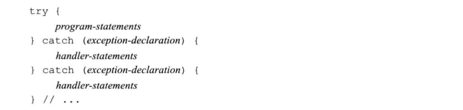

# 5 语句
## 5.1 简单语句
- 表达式语句的作用是执行表达式并丢弃掉求值结果
  ```c++
  ival + 5;     // 一条没什么实际用处的表达式语句
  cout << ival; // 一条有用的表达式语句
  ```
- 空语句: 如果在程序的某个地方，语法上需要一条语句但是逻辑上不需要，此时应该使用空语句。
  ```c++
  ; // 空语句
  while (...)
    ; // 空语句
  ```
- 使用空语句应该加上注释，从而令读这段代码的人知道该语句是有意省略的
- **复合语句**是指用花括号括起来的语句和声明的序列，复合语句也被称为块。一个块就是一个作用域，在块中引入的名字只能在块内部以及嵌套在块中的子块里访问。通常，名字在有限的区域内可见，该区域从名字定义处开始，到名字所在的块的结尾为止。

### Exercise
- e5.1
  > 空语句：一个语句中只含有单独的分号。  
  > 使用：语法上需要一条语句但是逻辑上不需要，此时应该使用空语句。
- e5.2
  > 块：用花括号括起来的语句和声明的序列，复合语句也叫块
  > 使用：语法上需要一条语句，但是逻辑上需要多条语句，应该使用复合语句（块）
- e5.3
  > 可读性降低
  ```c++
  #include <iostream>
  using namespace std;

  int main() {
      int sum = 0, val = 1;
  /*
      while (val <= 10) {
          sum += val;
          ++val;
      }
  */
      while (val <= 10)
          sum += val, ++val;
      cout << "Sum of 1 to 10 inclusive is " << sum << endl;

      return 0;
  }
  ```
## 5.2 语句作用域

### Exercise
- e5.4
  ```c++
  //迭代器需要初始化
  string::iterator iter = s.begin();
  while (iter != s.end()) { /*...*/ }

  //定义到外面
  bool status;
  while (status = find(word)) { /*...*/ }
  if (!status) { /*...*/ }
  ```

## 5.3 条件语句
### 5.3.1 if语句
#### Exercise
- e5.5
  ```c++
  #include <iostream>
  #include <vector>
  #include <string>
  using namespace std;

  int main() {
      const vector<string> scores = {"F", "D", "C", "B", "A", "A++"};
      string lettergrade;
      int grade = 0;

      cin >> grade;
      if (grade < 60) {
          lettergrade = scores[0];
      } else {
          lettergrade = scores[(grade - 50) / 10];
      }
      cout << lettergrade << endl;
      return 0;
  }
  ```
- e5.6
  ```c++
  #include <iostream>
  #include <vector>
  #include <string>
  using namespace std;

  int main() {
      const vector<string> scores = {"F", "D", "C", "B", "A", "A++"};
      string lettergrade;
      int grade = 0;

      cin >> grade;
      lettergrade = grade < 60 ? scores[0] : scores[(grade - 50) / 10];
      cout << lettergrade << endl;
      return 0;
  }
  ```
- e5.7
  ```c++
  // a
  if (ival1 != ival2)
    ival1 = ival2; //添加分号
  else ival1 = ival2 = 0; //这句没问题

  // b
  if (ival < minval) {
    minval = ival;
    occurs = 1;
  }

  // c
  if (ival = get_value())
    cout << "ival = " << ival << endl;
  else if (!ival)
    cout << "ival = 0 \n";

  // d
  if (ival == 0)
    ival = get_value();
  ```
- e5.8
  > 当一个if语句嵌套在另一个if语句内部时，很可能if分支多于else分支。C++为解决二义性，规定else与离他最近的尚未匹配的if匹配

### 5.3.2 switch语句
- case标签必须是整型常量表达式
  
  

- 一般不要省略case分支最后的break语句。如果没写break语句，最好加一段注释说清楚程序的逻辑
- 即使不准备在default标签下做任何工作，定义一个default标签也是有用的，其目的在于告诉程序的读者，我们已经考虑到了默认的情况，只是目前什么也没做。


#### Exercise
- e5.9
  ```c++
  #include <iostream>
  using namespace std;

  int main() {
      unsigned aCnt = 0, eCnt = 0, iCnt = 0, oCnt = 0, uCnt = 0;
      char ch;

      while (cin >> ch) {
          if (ch == 'a') ++aCnt;
          else if (ch == 'e') ++eCnt;
          else if (ch == 'i') ++iCnt;
          else if (ch == 'o') ++oCnt;
          else if (ch == 'u') ++uCnt;
          else ;
      }

      cout << "a: \t" << aCnt << '\n'
          << "e: \t" << eCnt << '\n'
          << "i: \t" << iCnt << '\n'
          << "o: \t" << oCnt << '\n'
          << "u: \t" << uCnt << endl;

      return 0;
  }
  ```
- e5.10
  ```c++
  #include <iostream>
  using namespace std;

  int main() {
      unsigned aCnt = 0, eCnt = 0, iCnt = 0, oCnt = 0, uCnt = 0;
      char ch;

      while (cin >> ch) {
          switch (ch) {
              case 'a': case 'A': ++aCnt; break;
              case 'e': case 'E': ++eCnt; break;
              case 'i': case 'I': ++iCnt; break;
              case 'o': case 'O': ++oCnt; break;
              case 'u': case 'U': ++uCnt; break;
              default: break;
          }
      }

      cout << "a: \t" << aCnt << '\n'
          << "e: \t" << eCnt << '\n'
          << "i: \t" << iCnt << '\n'
          << "o: \t" << oCnt << '\n'
          << "u: \t" << uCnt << endl;

      return 0;
  }
  ```
- e5.11
  ```c++
  #include <iostream>
  using namespace std;

  int main() {
      unsigned aCnt = 0, eCnt = 0, iCnt = 0, oCnt = 0, uCnt = 0;
      unsigned spaceCnt = 0, tableCnt = 0, newLineCnt = 0;

      char ch;

      while (cin >> std::noskipws >> ch) {
          switch (ch) {
              case 'a': case 'A': ++aCnt; break;
              case 'e': case 'E': ++eCnt; break;
              case 'i': case 'I': ++iCnt; break;
              case 'o': case 'O': ++oCnt; break;
              case 'u': case 'U': ++uCnt; break;
              case ' ': ++spaceCnt; break;
              case '\t': ++tableCnt; break;
              case '\n': ++newLineCnt; break;
              default: break;
          }
      }

      cout << "a: \t" << aCnt << '\n'
          << "e: \t" << eCnt << '\n'
          << "i: \t" << iCnt << '\n'
          << "o: \t" << oCnt << '\n'
          << "space: \t" << spaceCnt << '\n'
          << "tab: \t" << tableCnt << '\n'
          << "newline: \t" << newLineCnt << endl;

      return 0;
  }
  ```
- e5.12
  ```c++
  #include <iostream>
  using namespace std;

  int main() {
      unsigned aCnt = 0, eCnt = 0, iCnt = 0, oCnt = 0, uCnt = 0;
      unsigned spaceCnt = 0, tableCnt = 0, newLineCnt = 0;
      unsigned ffCnt = 0, flCnt = 0, fiCnt = 0;

      char ch;
      char prech = ' ';

      while (cin >> std::noskipws >> ch) {
          switch (ch) {
              case 'a': case 'A': ++aCnt; break;
              case 'e': case 'E': ++eCnt; break;
              case 'i': if (prech == 'f') ++fiCnt;
              case 'I': ++iCnt; break;
              case 'o': case 'O': ++oCnt; break;
              case 'u': case 'U': ++uCnt; break;
              case ' ': ++spaceCnt; break;
              case '\t': ++tableCnt; break;
              case '\n': ++newLineCnt; break;
              case 'f': if (prech == 'f') ++ffCnt; break;
              case 'l': if (prech == 'f') ++flCnt; break;
              default: break;
          }
          prech = ch;
      }

      cout << "a: \t" << aCnt << '\n'
          << "e: \t" << eCnt << '\n'
          << "i: \t" << iCnt << '\n'
          << "o: \t" << oCnt << '\n'
          << "space: \t" << spaceCnt << '\n'
          << "tab: \t" << tableCnt << '\n'
          << "newline: \t" << newLineCnt << '\n'
          << "ff: \t" << ffCnt << '\n'
          << "fi: \t" << fiCnt << '\n'
          << "fl: \t" << flCnt << endl;

      return 0;
  }
  ```
- e5.13
  ```c++
  //a: 应该在case于default后面加break;
  //b: 跳过了ix的初始化
  //c: case 1: case 3: case 5:... 不过C语言中可以这么用
  //d: 变量不能作为case标签，必须是整型常量表达式
  ```

## 5.4 迭代语句
### 5.4.1 while语句
- 当不确定到底要迭代多少次时，使用while循环比较合适，比如读取输入的内容就是如此

#### Exercise
- e5.14
  ```c++
  #include <iostream>
  #include <string>
  using namespace std;

  int main() {
      string input = "";
      string prev = "";
      int cnt_max = 0;
      int cnt = 0;
      while (cin >> input) {
          if (input == prev) {
              ++cnt;
              cout << "input: " << input << " cnt: " << cnt << endl;
          } else {
              cnt = 1;
              prev = input;
          }
          cnt_max = cnt_max > cnt ? cnt_max : cnt;
      }

      cout << cnt_max << endl;

      return 0;
  }
  // output:
  how now now now brown cow cow cow cow
  input: now cnt: 2
  input: now cnt: 3
  input: cow cnt: 2
  input: cow cnt: 3
  input: cow cnt: 4
  how now now now brown cow cow cow cow
  4
  ```
### 5.4.2 传统的for语句
- for语句语法形式
  ```c++
  for (init-statement; condition; expression)
    statement
  ```
- for语句头中的init-statement可以定义多个对象。但是只能由一条声明语句，因此，所有变量的基础类型必须相同。

#### Exercise
- e5.15
  > (a) if (ix != sz)在for语句外，ix已经销毁
  > (b) for中init-statement部分省略的话需要保留分号，表示一个空的init-statement  
  > (c) 在expression中修改了sz
- e5.16
  > 综合来看for更易读，可以很容易控制迭代的范围，而且控制量在其作用域范围内。
  ```c++
  vector<int> v;
  int i;
  while (cin >> i)
    v.push_back(i);

  vector<int> v;
  for (int i; cin >> i; /*empty expression*/)
    v.push_back(i);

  int sum = 0;
  for (int i = 0; i < 100; ++i)
    sum += i;

  int sum = 0;
  int i = 0;
  while (i < 100) {
    sum += i++;
  }
  ```
- e5.17
  ```c++
  #include <iostream>
  #include <vector>
  using namespace std;

  bool prefix(vector<int> &ivec1, vector<int> &ivec2) {
      int sz = ivec1.size() > ivec2.size() ? ivec2.size() : ivec1.size();
      for (decltype(ivec1.size()) i = 0; i != sz; ++i)
          if (ivec1[i] != ivec2[i]) {
              return false;
          }
      return true;
  }

  int main() {
      vector<int> ivec1{0,1,1,2};
      vector<int> ivec2{3,0,1,1,2,4,5,8};
      if (prefix(ivec1, ivec2))
          cout << "Y" << endl;
      else
          cout << "N" << endl;
      return 0;
  }
  ```
### 5.4.3 范围for语句
- 语法形式
  ```c++
  for (declaration : expression)
    statement
  ```
- expression必须是一个序列，比如用花括号括起来的初始值列表，数组或者vector或string等类型的对象，这些对象的共同特点是拥有能返回迭代器的begin和end成员
- declaration定义一个变量，序列中的**每个元素都得能转换成该变量得类型**。确保类型相容最简单得办法是使用**auto**类型说明符，这个关键字可以令编译器帮助我们指定合适得类型。如果需要对序列中得元素执行写操作，循环变量**必须声明成引用类型**
- 每次迭代都会重新定义循环控制变量，并将其初始化成序列中得下一个值，之后才会执行statement
  ```c++
  vector<int> v = {0,1,2,3,4,5,6,7,8,9};
  for (auto &r : v)
    r *= 2;
  //以上等价于
  //从这里可以看出，为什么不能通过for语句增加vector对象得元素了，在范围for语句中，预存了end()的值。一旦在序列中添加/删除元素，end函数的值就可能变得无效了
  for (auto beg = v.begin(), end = v.end(); beg != end; ++beg) {
    auto &r = *beg;
    r *= 2;
  }
  ```
### 5.4.4 do while语句
- do while语句应该在括号包围起来的条件后面用一个分号表示语句的结束
- 因为对于do while来说先执行语句或者块，后判断条件，所以不允许在条件部分定义变量

#### Exercise
- e5.18
  ```c++
  // (a)
  do {
    int v1, v2; 
    cout << "Please enter two numbers to sum:";
    if (cin >> v1 >> v2)
      cout << "Sum is: " << v1 + v2 << endl;
  } while (cin);

  // (b)
  int ival;
  do {
    // ...
  } while (ival = get_response());

  // (c)
  int ival = get_response();
  do {
    ival = get_response();
  } while (ival);
  ```
- e5.19
  ```c++
  #include <iostream>
  #include <string>
  using namespace std;

  int main() {
      do {
          string s1, s2;
          cout << "Please enter two string: ";
          if (cin >> s1 >> s2) {
              cout << s1.size() << " " << s2.size() << endl;
              cout << (s1.size() >= s2.size() ? s2 : s1) << endl;
          }
      } while (cin);

      return 0;
  }
  ```

## 5.5 跳转语句
- C++提供4种跳转语句：break、continue、goto、return.

### 5.5.1 break语句
- break语句负责终止离他最近的while、do while、for或switch语句，并从这些语句之后的第一条语句开始继续执行。
- break语句只能出现在迭代语句或者switch语句内部（包括嵌套在此类循环里的语句或块的内部）。break语句的作用范围仅限于最近的循环或者switch

#### Exercise
- e5.20
  ```c++
  #include <iostream>
  #include <string>
  using namespace std;

  int main() {
      string input = "";
      string prev = "";
      bool rep = false;
      while (cin >> input) {
          if (input == prev) {
              rep = true;
              break;
          }
          prev = input;
      }

      cout << (rep ? prev : "no repeat") << endl;

      return 0;
  }
  ```
### 5.5.2 continue语句
- continue语句终止最近的循环中当前迭代并立即开始下一次迭代。只能出现在for、while和do while循环的内部。
- 和break语句类似的是，出现在嵌套循环中的continue语句也仅作用于离它最近的循环。和break语句不同的是，**只有当switch语句嵌套在迭代语句内部时，才能在switch里使用continue**。

#### Exercise
- e5.21
  ```c++
  #include <iostream>
  #include <string>
  using namespace std;

  int main() {
      string input = "";
      string prev = "";
      bool rep = false;
      while (cin >> input) {
          if (input == prev) {
              if (isupper(input[0])) {
                  rep = true;
                  break;
              } else
                  continue;
          }
          prev = input;
      }

      cout << (rep ? prev : "no repeat") << endl;

      return 0;
  }
  ```
### goto语句
- goto语句的作用时从goto语句无条件跳转到同一函数内的另一条语句
- 不要再程序中使用goto语句，因为它使得程序既难理解又难修改
- 标签标示符独立于变量或其他标示符的名字，因此，标签标示符可以和程序中其他实体的标示符使用同一个名字而不会相互干扰。
- goto语句和控制权转向的那条带标签的语句必须再同一个函数之内
- 和switch语句类似，goto语句也不能将程序的控制权从变量的作用域之外转移到作用域之内
  
  
- 向后跳过一个已经执行的定义时合法的。跳回到变量定义之前意味着系统将销毁该变量，然后重新创建它
  
  

#### Exercise
- e5.22
  ```c++
  int sz;
  do {
      sz = get_size()
  } while (sz <= 0)

  return 0;
  ```

## 5.6 try语句块和异常处理
- 检测：检测出问题的部分应该发出某种信号以表明程序遇到了故障，无法继续下去了，而且信号的发出方无须知道将在何处得到解决。一旦发出异常信号，检测出问题的部分也就完成了任务。
- 处理：如果程序中含有可能引发异常的代码，那么通常也会有专门的代码处理问题。
- 异常处理机制为程序中的异常检测和异常处理这两部分的写作提供支持。在C++语言中，异常处理包括：

  

### 5.6.1 throw表达式
- 程序的异常检测部分使用throw表达式引发一个异常。
- throw表达式包含关键字throw和紧随其后的一个表达式，其中表达式的类型就是抛出的异常类型。
- throw表达式后面通常紧跟一个分号，从而构成一条表达式语句

### 5.6.2 try语句块
- 语法形式

  

  - 跟在try块之后的时一个或多个catch子句。
  - catch子句包含三部分：关键字catch，括号内一个（可能未命名的）对象的声明（异常声明），以及一个块。
  - 当选中某个catch子句处理异常之后，执行与之对应的块。
  - catch一旦完成，程序跳转到try语句最后一个catch子句之后的那条语句继续执行。

- try语句块中的`program-statements`组成程序的**正常逻辑**
- try语句块内声明的变量在块外部无法访问，特别是**在catch子句内也无法访问**


### 5.6.3 标准异常
- C++标准库定义了一组类，用于报告标准库函数遇到的问题，也可以用在用户编写的程序中，分别定义在4个头文件中：

  

#### Exercise
- e5.23
  ```c++
  #include <iostream>
  #include <string>
  using namespace std;

  int main() {
      int a, b;
      cin >> a >> b;
      cout << a / b << endl;

      return 0;
  }
  ```
  ```bash
  # output:
  dongkesi@DESKTOP-CL29DN1:/mnt/c/workspace/github/C++-Primer/ch05$ ./a.out
  5 0
  Floating point exception (core dumped)
  ```

- e5.24
  ```c++
  #include <iostream>
  #include <string>
  using namespace std;

  int main() {
      int a, b;
      cin >> a >> b;

      if (b == 0)
          throw runtime_error("division by 0");
      cout << a / b << endl;

      return 0;
  }
  ```
  ```bash
  # output
  dongkesi@DESKTOP-CL29DN1:/mnt/c/workspace/github/C++-Primer/ch05$ ./a.out
  5 0
  terminate called after throwing an instance of 'std::runtime_error'
    what():  division by 0
  Aborted (core dumped)
  ```

- e5.25
  ```c++
  #include <iostream>
  #include <string>
  using namespace std;

  int main() {
      int a, b;

      while( cin >> a >> b) {
          try {
              if (b == 0)
                  throw runtime_error("division by 0");
              cout << a / b << endl;
          } catch (runtime_error err) {
              cout << err.what() << endl;
              cout << "Try Again? Enter y or n" << endl;
              char c;
              cin >> c;
              if (!cin || c == 'n')
                  break;
          }
      }
      return 0;
  }
  ```

  ```bash
  # output
  dongkesi@DESKTOP-CL29DN1:/mnt/c/workspace/github/C++-Primer/ch05$ ./a.out
  5 2
  2
  5 0
  division by 0
  Try Again? Enter y or n
  y
  5 1
  5
  4 0
  division by 0
  Try Again? Enter y or n
  n
  ```