# 6 函数
## 6.1 函数基础
- 函数调用完成两项工作：
  - 用实参初始化函数对应的形参
  - 将控制权转移给被调用函数
- return语句完成两项工作：
  - 返回return语句中的值（如果有的话）
  - 将控制权从被调函数转移回主调函数
- 对fact函数调用的等价形式

  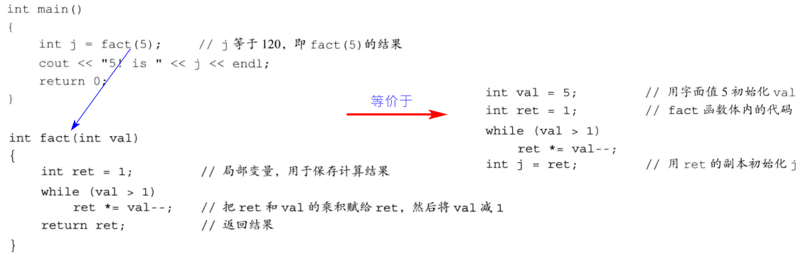
- 尽管实参与形参存在对应关系，但是并没有规定实参的求值顺序，编译器能以任意可行的顺序对实参求值
- 要定义一个不带形参的函数，最常用的办法是书写以个空的形参列表。不过为了与C语言兼容，也可以使用关键字void表示函数没有形参
  
  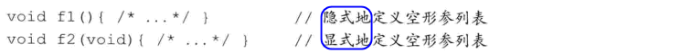
- 任意两个形参都不能同名
- 形参名是可选的，但是由于我们无法使用未命名的形参，所以形参一般都应该有个名字
- **函数返回类型不能是数组或函数类型，但可以是只想数组或函数的指针**

### Exercise
- e6.1
  > 实参（arguments）是形参（parameters）的初始值。类型必须匹配。函数有几个形参就必须提供相同数量的实参。
- e6.2
  ```
  (a): 返回类型需是string
  (b): 没有返回类型
  (c): 没有return
  (d): 没有{}
  ```
- e6.3
  ```c++
  #include <iostream>
  using namespace std;

  int fact(int val) {
      if (val <= 1) {
          return val;
      }
      return val * fact(val - 1);
  }

  int main() {
      int val = 0;
      cin >> val;
      cout << fact(val) << endl;
      return 0;
  }
  ```
- e6.4
- e6.5
  ```c++
  #include <iostream>
  using namespace std;

  int my_abs(int val) {
      return val >= 0 ? val : -val;
  }

  int main() {
      int val;
      cin >> val;
      cout << my_abs(val) << endl;

      return 0;
  }
  ```
### 6.1.1 局部对象
- 在C++语言中，名字有作用域，对象有生命周期
  - 名字的作用域是程序文本的一部分，**名字在其中可见**
  - 对象的生命周期是程序执行过程中该对象**存在的一段时间**
- 局部变量会隐藏在外层作用域中同名的其他所有声明
- 局部静态变量在程序的执行路径**第一次经过对象定义**语句时初始化，并且知道程序终止才被销毁。
  
#### Exercise
- e6.6
  - 作用域：三者作用域都是从定义开始到当前块结束。
  - 生命周期：形参与局部变量是从定义开始到块末尾销毁。而局部静态变量在执行路径第一次经过定义语句时初始化，直到程序终止才销毁。
  
  ```c++
  #include <iostream>
  #include <string>
  using namespace std;
  int fun(int val) {
      static int ia = val;
      int ib;
      ib = val;
      cout << ib << " "<< ia++ << endl;
  }
  int main() {
      int val;
      cin >> val;
      for (int i = 0; i < 10; ++i)
          fun(val);

      return 0;
  }
  ```
  ```bash
  # output
  dongkesi@DESKTOP-CL29DN1:/mnt/c/workspace/github/C++-Primer/ch06$ ./a.out
  20
  20 20
  20 21
  20 22
  20 23
  20 24
  20 25
  20 26
  20 27
  20 28
  20 29
  ```

- e6.7
  ```c++
  #include <iostream>
  using namespace std;
  int fun() {
      static int s1 = 0;
      return s1++;
  }
  int main() {
      for (int i = 0; i < 5; ++i)
          cout << fun() << endl;

      return 0;
  }
  ```

  ```bash
  # output
  dongkesi@DESKTOP-CL29DN1:/mnt/c/workspace/github/C++-Primer/ch06$ ./a.out
  0
  1
  2
  3
  4
  ```
### 6.1.2 函数声明
- 函数使能定义一次，但可以声明多次。如果一个函数永远也不会被我们用到，那么它可以只有声明没有定义。
- 因为函数的声明不包含函数体，所以也就无须形参的名字。事实上，在函数声明中经常省略形参的名字
- **定义函数的源文件应该把含有函数声明的头文件包含进来**，编译器负责验证函数的定义和声明是否匹配

#### Exercise
- e6.8
  ```c++
  #ifndef CHAPTER6_H
  #define CHAPTER6_H

  int fact(int val);
  int my_abs(int val);

  #endif
  ```

### 6.1.3 分离式编译
#### Exercise
- e6.9
  ```c++
  // fact.cc
  #include "Chapter6.h"

  int fact(int val) {
      if (val <= 1) {
          return val;
      }
      return val * fact(val - 1);
  }

  // factMain.cc
  #include <iostream>
  #include "Chapter6.h"
  using namespace std;

  int main() {
      int val = 0;
      cin >> val;
      cout << fact(val) << endl;
      return 0;
  }

  // Compile
  $ g++ -c fact.cc
  $ g++ -c factMain.c
  $ g++ factMain.o fact.o -o main
  ```
## 6.2 参数传递
- 参数初始化的机理与变量初始化一样
- 如果形参时引用类型，它将绑定到对应的实参上，否则，将实参的值拷贝后赋给形参
- 当实参的值被拷贝给形参时，**形参和实参是两个相互独立的对象**。我们说这样的实参被值传递或者函数被传值调用

### 6.2.1 传值参数
- 当初始化一个非引用类型的变量时，初始值被拷贝给变量。此时，对变量的改动不会影响初始值。
- 指针的行为和其他非引用类型一样。当执行指针拷贝操作时，拷贝的时指针的值。拷贝之后，两个指针是不同的指针。因为指针使我们可以间接地访问它所指的对象，所以通过指针可以**修改它所指对象的值**。
- **在C++语言中，建议使用引用类型的形参替代指针**

#### Exercise
- e6.10
  ```c++
  #include <iostream>
  using namespace std;

  void swap(int *a, int *b) {
      int tmp;
      tmp = *a;
      *a = *b;
      *b = tmp;
  }

  int main() {
      int a = 5, b = 10;
      cout << "Before: " << a << " " << b << endl;
      swap(&a, &b);
      cout << "After: " << a << " " << b << endl;

      return 0;
  }
  ```
### 6.2.2 传引用参数
- 拷贝大的类类型对象或者容器对象比较低效，甚至有的类类型根本就不支持拷贝操作。**当某种类型不支持拷贝操作时，函数只能通过引用形参访问该类型的对象**。
- 如果函数无须改变引用形参的值，最好将其声明为常量引用

#### Exercise
- e6.11
  ```c++
  #include <iostream>
  using namespace std;

  void reset(int &val) {
      val = 0;
  }

  int main() {
      int a = 10;
      cout << "Before: " << a << endl;
      reset(a);
      cout << "After: " << a << endl;

      return 0;
  }
  ```
- e6.12
  > 引用的方式更好，更直观，更方便
  ```c++
  #include <iostream>
  using namespace std;

  void swap(int &a, int &b) {
      int tmp;
      tmp = a;
      a = b;
      b = tmp;
  }

  int main() {
      int a = 5, b = 10;
      cout << "Before: " << a << " " << b << endl;
      swap(a, b);
      cout << "After: " << a << " " << b << endl;

      return 0;
  }
  ```
- e6.13
  > void f(T): 传值函数，在函数内对T的修改不会影响实参   
  > void f(&T)：传引用函数，在函数内对T的修改会影响实参
- e6.14
  ```c++
  // 应该是引用
  void swap(int &a, int &b) {
      int tmp;
      tmp = a;
      a = b;
      b = tmp;
  }

  // 不应该是引用
  int fact(int val) {
      if (val <= 1) {
          return val;
      }
      return val * fact(val - 1);
  }
  ```
- e6.15
  - 为什么s是常量引用而occurs是普通引用
    > 因为s不需要修改，声明为常量，另外为引用类型减少了拷贝的损耗。occurs是返回值，理应是引用，需要被修改，当然不能是常量
  - 为什么s和occurs是引用类型而c不是？
    > 引用主要是减少了拷贝复制的损耗。所以对于类类型声明为引用更好。对于内置类型，拷贝复制相对引用来说没多少损耗。不过这里的主要原因是c不能引用一个常量'o'
    ```bash
    # 例如如果修改为char &c会报如下错误
    t6-15.cc: In function ‘int main()’:
    t6-15.cc:24:39: error: cannot bind non-const lvalue reference of type ‘char&’ to an rvalue of type ‘char’
        auto index = find_char(s, 'o', ctr);
                                       ^
    # 不过根据提示，可以修改为const char &c就可以了。
    ```
  - 如果令s是普通引用会发生什么？
    > 结果是一样的。这里主要是因为s不需要修改所以声明为常量，这是一个好的习惯。虽然工作正常但是大大受限。下面一节会详细介绍。
  - 如果令occurs是常量引用会发生什么情况？
    > 不能修改作为返回值
    ```bash
    # 修改后会有如下错误
    t6-15.cc: In function ‘std::__cxx11::basic_string<char>::size_type find_char(std::__cxx11::string&, const char&, const size_type&)’:
    t6-15.cc:7:14: error: assignment of read-only reference ‘occurs’
        occurs = 0;
                  ^
    t6-15.cc:12:15: error: increment of read-only reference ‘occurs’
                ++occurs;
                  ^~~~~~
    ```


### 6.2.3 const形参和实参
- 当用实参初始化形参时会忽略掉顶层const。即，形参的顶层const会被忽略掉。当形参有顶层const时，传给它常量对象或者非常量对象都是可以的。
  
  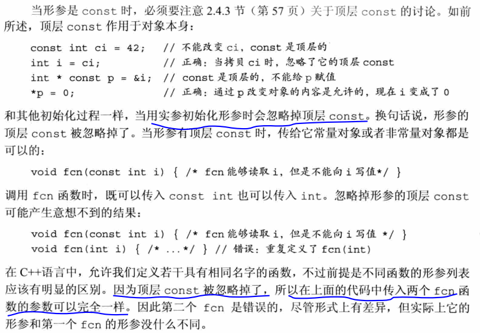
- 指针或引用形参与const
  
  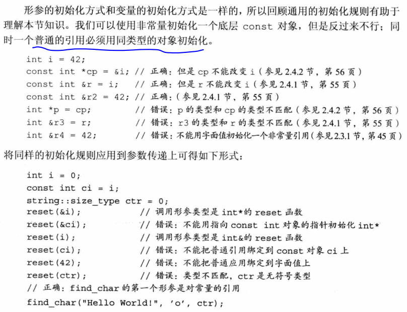
- 常量引用要点
  
  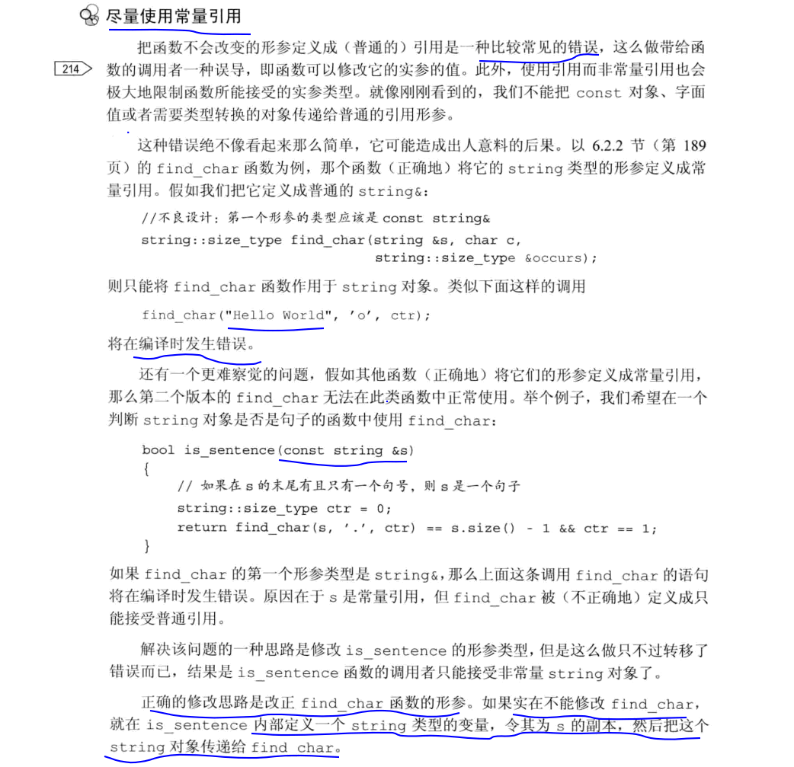

#### Exercise
- e6.16
  > 不能直接介绍一个常量字符串，另外对调用它的函数也不能传入使用const string&
- e6.17
  > 参数不同，一个需要修改，另一个不需要
  ```c++
  #include <iostream>
  #include <string>
  using namespace std;

  bool my_isupper(const string &str) {
      for (auto c : str)
          if (isupper(c))
              return true;
      return false;
  }

  int main() {
      cout << my_isupper("ceafeAce") << endl;
      cout << my_isupper("ceafeace") << endl;

      return 0;
  }

  ```
  ```c++
  #include <iostream>
  #include <string>
  using namespace std;

  void conv2lower(string &str) {
      for (auto &c : str) {
          if (isupper(c)) {
              cout << c << endl;
              c = tolower(c);
              cout << c << endl;
          }
      }
  }

  int main() {
      string str;
      cin >> str;
      conv2lower(str);
      cout << str << endl;

      return 0;
  }
  ```
- e6.18
  ```c++
  boot compare(const matrix &ma, const matrix &mb);
  vector<int>::iterator change_val(int a, vector<int>::iterator &it);
  ```
- e6.19
  > (a)不合法，参数只有1个，(b,c,d)合法
- e6.20
  > 如果不修改，那么就用const。如果设为普通引用，一方面调用者会认为函数会修改实参，所以会做一些备份处理；令一方面，会极大地限制实参类型。

### 6.2.4 数组形参
  
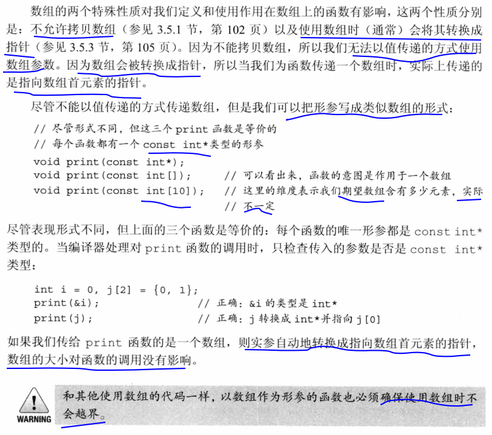

- 需要提供一些额外信息给函数以知道数组的确切尺寸
  - 使用标记：如C风格的字符串后面有一个空字符
  - 使用标准库规范：传递指向数组首元素和尾后元素的指针
  - 显示传递一个表示数组大小的形参：C和过去的C++程序常用的方法
- 数组引用形参

  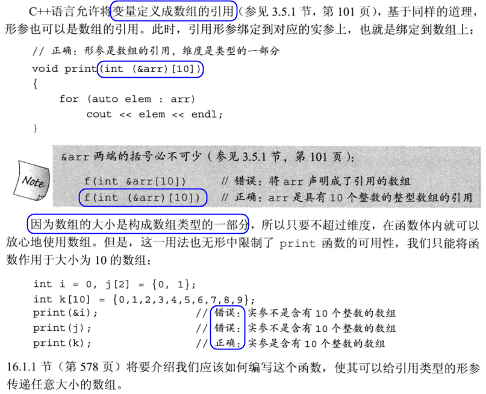
- 传递多维数组：数组第二维（以及后面所有维度）的大小都是数组类型一部分，不能省略
  
  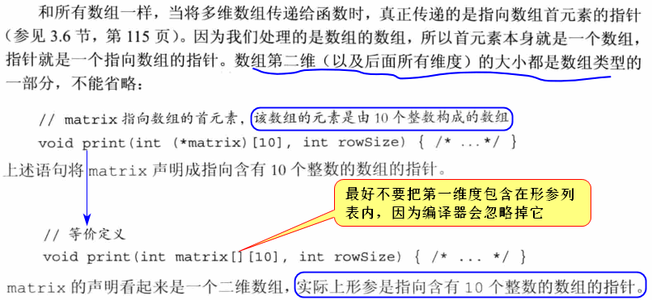

#### Exercise
- e6.21
  ```c++
  #include <iostream>
  using namespace std;

  int compare(int a, const int *b) {
      return a > *b ? a : *b;
  }

  int main() {
      int a = 10;
      int b = 20;
      cout << compare(a, &b) << endl;
      b = 5;
      cout << compare(a, &b) << endl;

      return 0;
  }
  ```
- e6.22
  ```c++
  // Method 1: 通过引用交换
  #include <iostream>
  using namespace std;

  void swap(int *&pa, int *&pb) {
      int *tmp = pa;
      pa = pb;
      pb = tmp;
  }

  int main() {
      int a = 1, b = 2;
      int *pa = &a;
      int *pb = &b;
      cout << "Before" << endl;
      cout <<"*pa: " << *pa << "\tpa: " << pa << "\t&pa: " << &pa << endl;
      cout <<"*pb: " << *pb << "\tpb: " << pb << "\t&pb: " << &pb << endl;
      cout << "a: " << a << "\t&a: " << &a << endl;
      cout << "b: " << b << "\t&b: " << &b << endl;
      swap(pa, pb);
      cout << "After" << endl;
      cout <<"*pa: " << *pa << "\tpa: " << pa << "\t&pa: " << &pa << endl;
      cout <<"*pb: " << *pb << "\tpb: " << pb << "\t&pb: " << &pb << endl;
      cout << "a: " << a << "\t&a: " << &a << endl;
      cout << "b: " << b << "\t&b: " << &b << endl;
      return 0;
  }
  ```

  ```c++
  // Method 2: 通过指针交换
  #include <iostream>
  using namespace std;

  void swap(int **pa, int **pb) {
      int *tmp = *pa;
      *pa = *pb;
      *pb = tmp;
  }

  int main() {
      int a = 1, b = 2;
      int *pa = &a;
      int *pb = &b;
      cout << "Before" << endl;
      cout <<"*pa: " << *pa << "\tpa: " << pa << "\t&pa: " << &pa << endl;
      cout <<"*pb: " << *pb << "\tpb: " << pb << "\t&pb: " << &pb << endl;
      cout << "a: " << a << "\t&a: " << &a << endl;
      cout << "b: " << b << "\t&b: " << &b << endl;
      swap(&pa, &pb);
      cout << "After" << endl;
      cout <<"*pa: " << *pa << "\tpa: " << pa << "\t&pa: " << &pa << endl;
      cout <<"*pb: " << *pb << "\tpb: " << pb << "\t&pb: " << &pb << endl;
      cout << "a: " << a << "\t&a: " << &a << endl;
      cout << "b: " << b << "\t&b: " << &b << endl;
      return 0;
  }
  ```

  ```c++
  // Method 3 faild
  #include <iostream>
  using namespace std;

  void swap(int **pa, int **pb) {
      int *tmp = *pa;
      *pa = *pb;
      *pb = tmp;
  }

  int main() {
      int a = 1, b = 2;
      int *pa = &a;
      int *pb = &b;
      cout << "Before" << endl;
      cout <<"*pa: " << *pa << "\tpa: " << pa << "\t&pa: " << &pa << endl;
      cout <<"*pb: " << *pb << "\tpb: " << pb << "\t&pb: " << &pb << endl;
      cout << "a: " << a << "\t&a: " << &a << endl;
      cout << "b: " << b << "\t&b: " << &b << endl;
      /* 这里我想这样调用，但是编译器报错
      t6-22c.cc: In function ‘int main()’:
      t6-22c.cc:19:18: error: no matching function for call to ‘swap(void*, void*)’
          swap(&&a, &&b);
                        ^
      t6-22c.cc:4:6: note: candidate: void swap(int**, int**) <near match>
      void swap(int **pa, int **pb) {
            ^~~~
      t6-22c.cc:4:6: note:   conversion of argument 2 would be ill-formed:
      t6-22c.cc:19:15: error: invalid conversion from ‘void*’ to ‘int**’ [-fpermissive]
          swap(&&a, &&b);
                    ^~~
      */
      swap(&&a, &&b);
      cout << "After" << endl;
      cout <<"*pa: " << *pa << "\tpa: " << pa << "\t&pa: " << &pa << endl;
      cout <<"*pb: " << *pb << "\tpb: " << pb << "\t&pb: " << &pb << endl;
      cout << "a: " << a << "\t&a: " << &a << endl;
      cout << "b: " << b << "\t&b: " << &b << endl;
      return 0;
  }
  ```

  ```c++
  #include <iostream>
  using namespace std;

  int main() {

      int a = 0;
      /*
      t6-22d.cc: In function ‘int main()’:
      t6-22d.cc:7:17: error: invalid conversion from ‘void*’ to ‘int**’ [-fpermissive]
          int **ppa = &&a;
                      ^~~
      t6-22d.cc:7:19: error: label ‘a’ used but not defined
          int **ppa = &&a;
                        ^
      */
      //int **ppa = &&a;

      /*
      t6-22d.cc: In function ‘int main()’:
      t6-22d.cc:8:21: error: lvalue required as unary ‘&’ operand
          int **ppa = &(&a);
                          ^
      */
      // int **ppa = &(&a);

      /*
      t6-22d.cc: In function ‘int main()’:
      t6-22d.cc:9:30: error: lvalue required as unary ‘&’ operand
          int **ppa = &((int *)(&a));
                                    ^
      */
      //int **ppa = &((int *)(&a));

      // successed
      int *pa = &a;
      int **ppa = &pa;

      return 0;
  }
  ```
- e6.23
  - https://codeyarns.com/2018/08/22/how-to-get-function-name-in-c/
  ```c++
  #include <iostream>
  using namespace std;

  void print(const int *ip) {
      cout << __PRETTY_FUNCTION__ << endl;
      if (ip)
          cout << *ip << endl;
  }

  void print(const int *beg, const int *end) {
      cout << __PRETTY_FUNCTION__ << endl;
      while (beg != end)
          cout << *beg++ << " ";
      cout << endl;
  }

  void print(const int ia[], size_t size) {
      cout << __PRETTY_FUNCTION__ << endl;
      for (size_t i = 0; i != size; ++i) {
          cout << ia[i] << " ";
      }
      cout << endl;
  }

  void print(int (&arr)[2]) {
      cout << __PRETTY_FUNCTION__ << endl;
      for (auto e : arr)
          cout << e << " ";
      cout << endl;
  }

  int main() {
      int i = 1, j[2] = {2, 3};

      print(&i);
      print(j);

      print(&i, &i+1);
      print(begin(j), end(j));

      print(&i, 1);
      print(j, end(j) - begin(j));

      print(j);

      return 0;
  }
  // output
  void print(const int*)
  1
  void print(int (&)[2])
  2 3

  void print(const int*, const int*)
  1
  void print(const int*, const int*)
  2 3

  void print(const int*, size_t)
  1
  void print(const int*, size_t)
  2 3
  void print(int (&)[2])
  2 3
  ```
- e6.24
  > 编译器会忽略`const int ia[10]`中的10，实际上的类型是`const int *`，所以这里写什么都无所谓，由于int类型的数组在此例中并不知道具体大小。所以有些人的意图可能是值接受数组大小是10的参数。那么参数类型应该声明为`const int (&ia)[10]`。这样就只能接受大小是10的整形数组。

  ```c++
  #include <iostream>
  using namespace std;

  void print(const int (&ia)[10]) {
      for (size_t i = 0; i != 10; ++i)
          cout << ia[i] << endl;
  }
  int main() {
      /*
        t6-24.cc: In function ‘int main()’:
        t6-24.cc:10:12: error: invalid initialization of reference of type ‘const int (&)[10]’ from expression of type ‘int [11]’
            print(a);
                    ^
        t6-24.cc:4:6: note: in passing argument 1 of ‘void print(const int (&)[10])’
        void print(const int (&ia)[10]) {
              ^~~~~
      */
      //int a[11] = {0,1,2,3,4,5,6,7,8,9};
      int a[10] = {0,1,2,3,4,5,6,7,8,9};
      print(a);
      return 0;
  }
  ```

### 6.2.5 main: 处理命令行选项
- 函数定义格式
  ```c++
  int main(int argc, char *argv[]) { ... }
  // 因为第二个形参是数组，所以main函数也可以定义成
  int main(int argc, char **argv) { ... }
  ```
- 当使用argv中的实参时，一定要记得可选的实参从argv[1]开始；argv[0]保存程序的名字，而非用户的输入。

#### Exercise
- e6.25
  ```c++
  #include <iostream>
  #include <string>
  using namespace std;

  int main(int argc, char *argv[]) {
      if (argc != 3) {
          cout << "usage: ./a.out str1 str2" << endl;
          return -1;
      }

      cout << string(argv[1]) + string(argv[2]) << endl;

      return 0;
  }
  ```

- e6.26
  ```c++
  #include <iostream>
  #include <string>
  using namespace std;

  int main(int argc, char *argv[]) {
      for (int i = 0; i != argc; ++i) {
          cout << "argv[" << i << "] = " << "\"" << argv[i] << "\";" << endl;
      }

      return 0;
  }
  ```
  ```bash
  # output
  dongkesi@DESKTOP-CL29DN1:/mnt/c/workspace/github/C++-Primer/ch06$ ./a.out -d -o ofile data0 0
  argv[0] = "./a.out";
  argv[1] = "-d";
  argv[2] = "-o";
  argv[3] = "ofile";
  argv[4] = "data0";
  argv[5] = "0";
  ```

### 6.2.6 含有可变形参的函数
- 为了编写能处理不同数量实参的函数，C++11新标准提供了两种主要的方法：
  - 如果**所有实参类型相同**，可以传递一个名为`initializer_list`的标准库类型
  - 如果**实参类型不同**，可以编写一种特殊的函数，也就是所谓的可**变参数模板**
  - 另外：还有一种特殊的形参类型（...），可以用它**传递可变数量的实参**。不过需要注意的是，这种功能**一般只用于C函数交互的接口程序**。
- `initializer_list`是一种标准类型，用于表示某种特定类型的值的数组。提供如下操作
  
  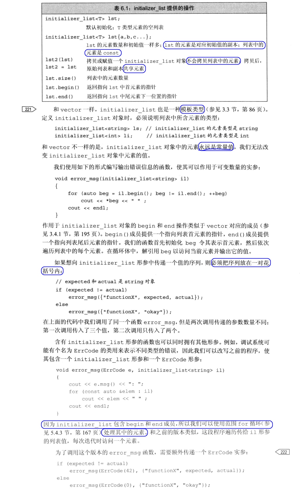

- 省略符形参

  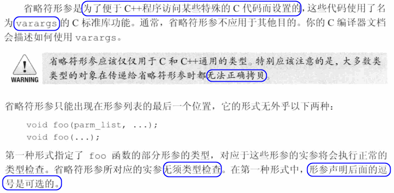

#### Exercise
- e6.27
  ```c++
  #include <iostream>
  using namespace std;
  int sum(initializer_list<int> il) {
      int sum = 0;
      for (auto beg = il.begin(); beg != il.end(); ++beg)
          sum += *beg;
      return sum;
  }

  int main() {
      cout << sum({1,2,3,4,5}) << endl;

      return 0;
  }
  ```
- e6.28
  > const string &
- e6.29
  > https://github.com/Mooophy/Cpp-Primer/blob/362deb8caddc6f243f7c8ecc6d98f04a28bbbd20/ch06/README.md  
  > https://zh.cppreference.com/w/cpp/named_req/PODType  
  > Depends on the type of elements of initializer_list. When the type is PODType, reference is unnecessary. Because POD is cheap to copy(such as int). Otherwise, Using **reference(const)** is the better choice.

## 6.3 返回类型和return语句
- 形式
  ```c++
  return;
  return expression;
  ```
- 返回void的函数不要求非得有return语句，因为在这类函数得最后一句后面会隐式地执行return
- 一个返回类型是void得函数也能使用return语句得第二种形式，不过此时return语句的expression**必须是另一个返回void的函**数。强行令void函数返回其他类型的表达式将产生编译错误。
- 在含有return语句的循环后面应该也有一条return语句，如果没有的话该程序就是错误的。很多编译器都无法发现此类错误
- 返回一个值的方式和初始化一个变量或形参的方式完全一样：**返回的值用于初始化调用点的一个临时量**，该临时量就是函数调用的结果。
- **不要返回局部对象的引用或指针**：函数完成后，它所占用的存储空间也随之被释放掉。因此函数终止意味着局部变量的引用将指向不再有效的内存区域。
- 要确保返回值的安全，我们不妨提问：引用所引的是在函数之前已经存在的哪个对象？
- 如果函数返回指针、引用或类的对象，我们就能使用函数调用的结果访问结果**对象的成员**。
- 函数的返回类型决定函数调用是否是左值。调用一个**返回引用**的函数得到**左值**，其他返回类型得到右值。
- C++11新标准规定，函数可以返回花括号包围的值的列表。
  - 如果**列表为空**，临时量执行值初始化
  - 否则，返回的值由函数的返回类型决定
  - 如果函数返回的是**内置类型**，则花括号包围的列表最多包含一个值，而且该值所占空间不应该大于目标类型的空间
  - 如果函数返回的是**类类型**，由类本身定义初始值如何使用
- return有一个列外，允许main的函数没有return语句直接结束。如果没有return，编译器将隐式地插入一条返回0的return语句
- 如果一个函数调用了自身，不管这种调用时直接的还是间接的，都称该函数为**递归函数**。

#### Exercise
- e6.30
  ```c++
  #include <iostream>
  #include <string>
  using namespace std;

  bool str_subrange(const string &str1, const string &str2) {
      if (str1.size() == str2.size())
          return str1 == str2;
      auto size = (str1.size() < str2.size()) ? str1.size() : str2.size();
      for (decltype(size) i = 0; i != size; ++i) {
          if (str1[i] != str2[i])
              /*
              t6-30.cc: In function ‘bool str_subrange(const string&, const string&)’:
              t6-30.cc:11:13: error: return-statement with no value, in function returning ‘bool’ [-fpermissive]
                          return;
                          ^~~~~~
              */
              //return;
              return false;
      }
      // 编译器默认配置并没有检查出这里的错误，运行结果到这里返回了3
      /*
      dongkesi@DESKTOP-CL29DN1:/mnt/c/workspace/github/C++-Primer/ch06$ g++ --version
      g++ (Ubuntu 7.4.0-1ubuntu1~18.04.1) 7.4.0
      Copyright (C) 2017 Free Software Foundation, Inc.
      This is free software; see the source for copying conditions.  There is NO
      warranty; not even for MERCHANTABILITY or FITNESS FOR A PARTICULAR PURPOSE.
      */
  }

  int main() {
      cout << str_subrange("abc", "efg") << endl;  //0
      cout << str_subrange("abc", "abc") << endl;  //1
      cout << str_subrange("abc", "abcd") << endl; //3
      cout << str_subrange("abc", "abed") << endl; //0

      return 0;
  }
  ```
- e6.31
  > 返回局部变量的引用无效；如果需要给返回值赋值时，返回常量引用无效
- e6.32
  > 合法，给ia赋值为{0-9};
  ```c++
  #include <iostream>
  using namespace std;

  int &get(int *arry, int index) { return arry[index]; }

  int main() {
      int ia[10];
      for (int i = 0; i != 10; ++i)
          get(ia, i) = i;

      for (auto i : ia)
          cout << i << " ";
      cout << endl;
      return 0;
  }  
  ```

  ```bash
  # output
  dongkesi@DESKTOP-CL29DN1:/mnt/c/workspace/github/C++-Primer/ch06$ ./a.out
  0 1 2 3 4 5 6 7 8 9
  ```
- e6.33
  ```c++
  #include <iostream>
  #include <vector>
  using namespace std;

  void print(const vector<int> &iv) {
      if (iv.empty()) {
          return;
      }
      cout << *begin(iv) << " ";
      print(vector<int>(begin(iv)+1, end(iv)));
  }

  int main() {
      print({1,2,3,4,5,6});
      cout << endl;
      print({1});
      cout << endl;
      print({});
      cout << endl;
      return 0;
  }
  ```

  ```c++
  // 这种方式更好
  #include <iostream>
  #include <vector>
  using namespace std;

  void print(vector<int>::const_iterator first, vector<int>::const_iterator last) {
      if (first != last) {
          cout << *first << " ";
          print(++first, last);
      }
  }

  int main() {
      vector<int> iv{1,2,3,4,5,6};
      print(iv.cbegin(), iv.cend());
      cout << endl;
      return 0;
  }
  ```
- e6.34
  > 如果是负数则永远不会停止；如果是正数结果正确，只是最后多算了一次*1
- e6.35 
  > 因为形参是传值，val--的时候传入的是val，然后下一次进入函数还是val。会无限递归

### 6.3.3 返回数组指针

- 函数不能返回数组，但可以返回数组的指针或引用。返回数组指针的四种方式：
  ```c++
  // 方式 1：类型别名
  typedef int arrT[10];
  using arrT = int[10]; // 这两种方式都可以
  arrT* func(inti);
  // 方式 2：不使用类型别名
  Type (*function(parameter_list))[dimension] //格式
  int (*func(int i))[10] 
  // 方式 3: 使用尾置返回类型
  auto func(int i) -> int(*)[10];
  // 方式 4: 使用decltype
  int odd[] = {1,3,5,7,9}; //必须得有原始变量类型
  int even[] = {0,2,4,6,8};
  decltype(odd) *arrPtr(int i);
  ```

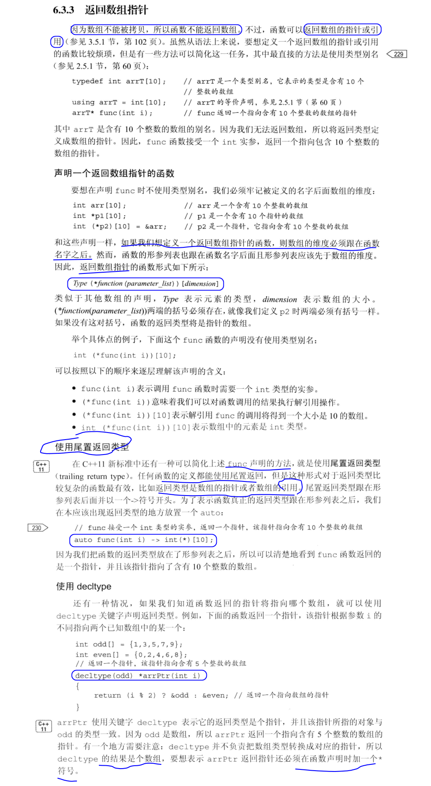

#### Exercise
- e6.36
  ```c++
  #include <iostream>
  #include <string>
  using namespace std;

  string (&fun())[10] {
      static string str[10]{"a", "b", "c", "d", "e", "f", "g", "h", "i", "j"};
      return str;
  }

  int main() {
      for (auto &s : fun()) {
          cout << s << " ";
          s += "C";
      }
      cout << endl;
      for (auto &s : fun())
          cout << s << " ";
      cout << endl;
      return 0;
  }
  ```

  ```bash
  # output
  dongkesi@DESKTOP-CL29DN1:/mnt/c/workspace/github/C++-Primer/ch06$ ./a.out
  a b c d e f g h i j
  aC bC cC dC eC fC gC hC iC jC
  ```
- e6.37
  > 使用类型别名更好一点，容易写。
  ```c++
  #include <iostream>
  #include <string>
  using namespace std;

  string (&fun1())[10] {
      static string str[10]{"a", "b", "c", "d", "e", "f", "g", "h", "i", "j"};
      return str;
  }

  using strT = string[10];
  strT &fun2() {
      static string str[10]{"a", "b", "c", "d", "e", "f", "g", "h", "i", "j"};
      return str;
  }

  auto fun3() -> string(&)[10] {
      static string str[10]{"a", "b", "c", "d", "e", "f", "g", "h", "i", "j"};
      return str;
  }

  static string str[10]{"a", "b", "c", "d", "e", "f", "g", "h", "i", "j"};
  decltype(str) &fun4() {
      return str;
  }

  int main() {
      for (auto &s : fun1()) {
          cout << s << " ";
          s += "1";
      }
      cout << endl;
      for (auto &s : fun1())
          cout << s << " ";
      cout << endl;

      for (auto &s : fun2()) {
          cout << s << " ";
          s += "2";
      }
      cout << endl;
      for (auto &s : fun2())
          cout << s << " ";
      cout << endl;


      for (auto &s : fun3()) {
          cout << s << " ";
          s += "3";
      }
      cout << endl;
      for (auto &s : fun3())
          cout << s << " ";
      cout << endl;


      for (auto &s : fun4()) {
          cout << s << " ";
          s += "4";
      }
      cout << endl;
      for (auto &s : fun4())
          cout << s << " ";
      cout << endl;
      return 0;
  }
  ```

  ```bash
  # output
  dongkesi@DESKTOP-CL29DN1:/mnt/c/workspace/github/C++-Primer/ch06$ ./a.out
  a b c d e f g h i j
  a1 b1 c1 d1 e1 f1 g1 h1 i1 j1
  a b c d e f g h i j
  a2 b2 c2 d2 e2 f2 g2 h2 i2 j2
  a b c d e f g h i j
  a3 b3 c3 d3 e3 f3 g3 h3 i3 j3
  a b c d e f g h i j
  a4 b4 c4 d4 e4 f4 g4 h4 i4 j4
  ```
- e6.38
  ```c++
  #include <iostream>
  using namespace std;

  int odd[] = {1,3,5,7,9};
  int even[] = {0,2,4,6,8};

  decltype(odd) &arrPtr(int i) {
      return (i % 2) ? odd : even;
  }

  int main() {
      for (auto e : arrPtr(0))
          cout << e << " ";
      cout << endl;

      for (auto e : arrPtr(1))
          cout << e << " ";
      cout << endl;

      return 0;
  }
  ```

## 6.4 函数重载
- 如果同一作用域内的几个**函数名字相同但是形参列表不同**，称之为**重载（overloaded）函数**
- main函数不能重载
- 不允许两个函数除了返回类型外其它所有的要素都相同

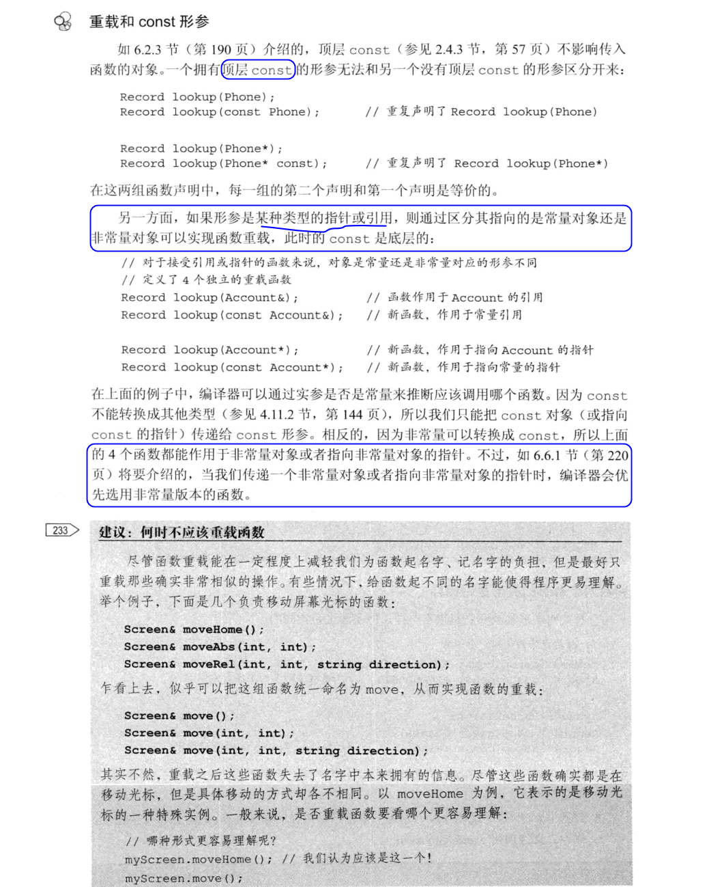

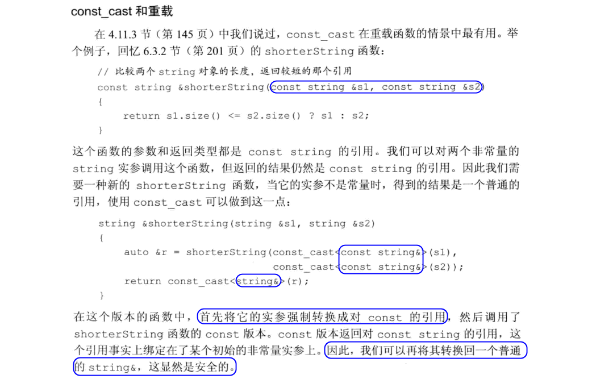

- 当调用重载函数时有三种可能的结果
  - 编译器找到一个与实参**最佳匹配**的函数，并生成调用该函数的代码
  - 找不到任何一个函数与调用的实参匹配，此时编译器发出**无匹配**的错误信息
  - 有多于一个函数可以匹配，但是每一个都不是明显的最佳选择。此时也将发生错误，称为**二义性调用**
#### Exercise
- e6.39
  > 从下面两段代码可以看出(a)如果只是声明的话没有问题，因为编译器会忽略const，两者就完全等价，多次声明不会有问题。但是如果再加上定义的话就上重复定义了  
  > 对于(b)来说，函数不能通过返回值来重载，所以会有二义性错误  
  > 对于(c)，是正确合法的
  ```c++
  #include <iostream>
  using namespace std;
  // 这俩声明其实是等价的，重复声明。
  int calc(int, int);
  int calc(const int, const int);

  /*
  t6-39.cc:8:8: error: ambiguating new declaration of ‘double get()’
  double get();
          ^~~
  t6-39.cc:7:5: note: old declaration ‘int get()’
  int get();
      ^~~
  */
  //int get();
  double get();

  // 合法
  int *reset(int *);
  double *reset(double *);

  int main() {
      return 0;
  }
  ```

  ```c++
  // 但是声明+定义的话
  #include <iostream>
  using namespace std;
  // 注意这个是redefinition
  /* 
    t6-39.cc: In function ‘int calc(int, int)’:
    t6-39.cc:5:5: error: redefinition of ‘int calc(int, int)’
    int calc(const int, const int) {return 0;}
        ^~~~
    t6-39.cc:4:5: note: ‘int calc(int, int)’ previously defined here
    int calc(int, int) {return 0;}
        ^~~~
  */
  int calc(int, int) {return 0;}
  int calc(const int, const int) {return 0;}

  // 这个是ambiguating： 二义性
  /*
    t6-39.cc: In function ‘double get()’:
    t6-39.cc:16:8: error: ambiguating new declaration of ‘double get()’
    double get() {return 0;}
            ^~~
    t6-39.cc:15:5: note: old declaration ‘int get()’
    int get() {return 0;}
        ^~~
  */
  int get() {return 0;}
  double get() {return 0;}

  int *reset(int *) {return 0;}
  double *reset(double *) {return 0;}

  int main() {
      return 0;
  }
  ```
### 6.4.1 重载与作用域

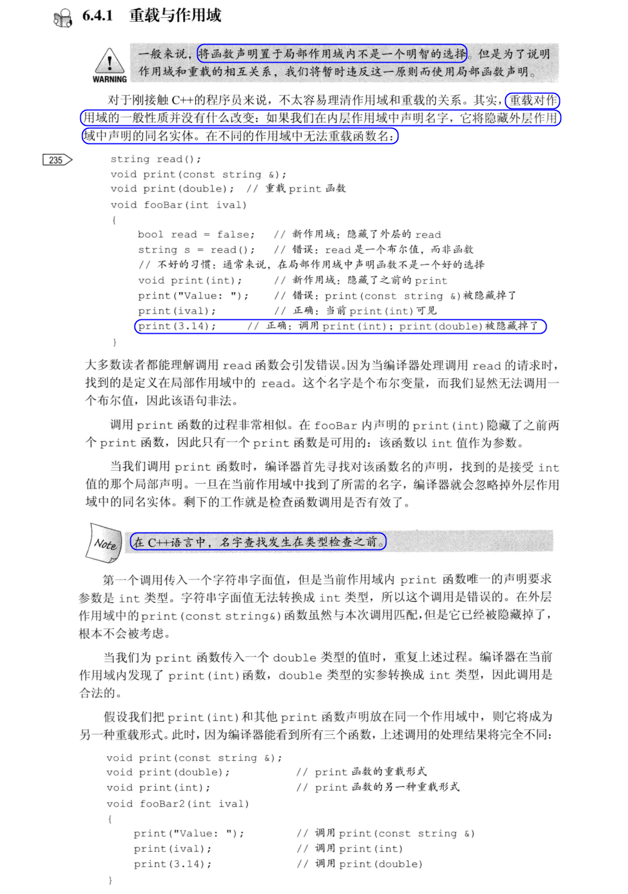

## 6.5 特殊用于语言特性

### 6.5.1 默认实参
- 一旦某个形参被赋予了默认值，它后面的所有形参都必须有默认值
- 当设计含有默认实参的函数时，其中一项任务是合理设置形参的顺序，尽量让不怎么使用默认值的形参出现在前面，而让那些经常使用默认值的形参出现在后面。
- 应该在函数声明中指定默认实参，并将该声明放在合适的头文件中

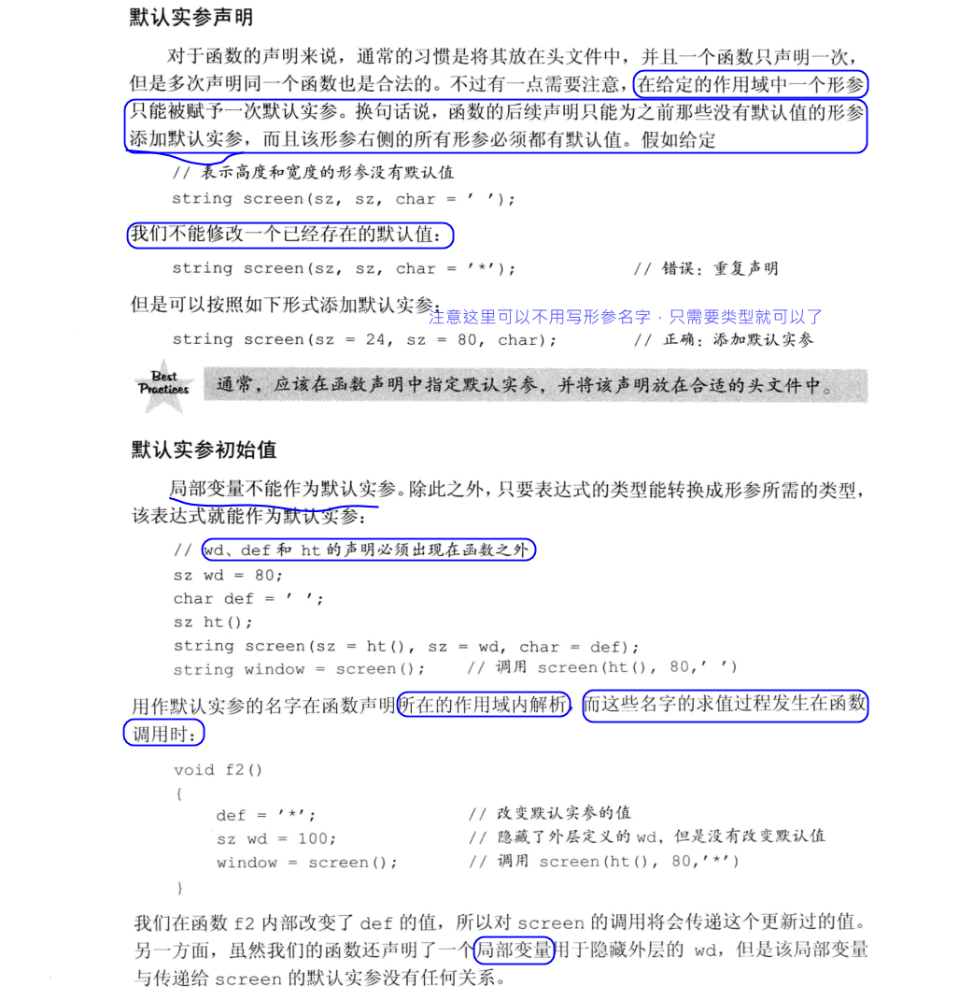

#### Exercise
- e6.40
  > (a) 正确   
  > (b) 不正确
- e6.41
  > (a) 不合法  
  > (b) 正确  
  > (c) 合法，'*'可转换为整型，但是不符初衷 
- e6.42
  ```c++
  #include <iostream>
  #include <string>
  using namespace std;

  string make_plural(size_t, const string &, const string & = "s");

  string make_plural(size_t ctr, const string &word, const string &ending) {
      return (ctr > 1) ? word + ending : word;
  }

  int main() {
      cout << make_plural(2, "word", "es") << endl;
      cout << make_plural(2, "word") << endl;

      return 0;
  }
  ```
  

### 6.5.2 内联函数和constexpr函数
- 内联函数可避免函数调用的开销
- 内联说明只是向编译器发出的一个请求，编译器可以选择忽略这个请求
- 一般来说，内联机制用于优化规模较小、流程直接、频繁调用的函数。
- **`constexpr`函数**是指用于常量表达式的函数。定义`constexpr`函数的要遵循几项约定：
  - 函数的返回值及所有形参都得是字面值类型
  - 函数体中必须有且只有一条return语句
- 执行初始化任务时，编译器把对`constexpr`函数的调用**替换成其结果值**。为了能在编译过程中**随时展开**，`constexpr`函数**被隐式地指定为内联函数
**
- `constexpr`函数不一定返回常量表达式
  
  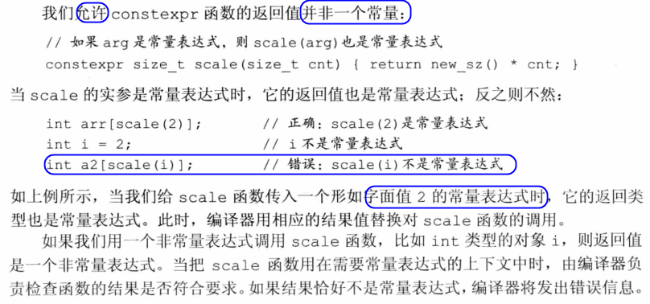

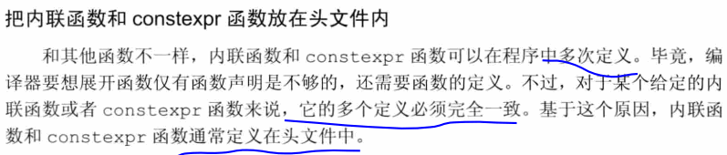

#### Exercise
- e6.43
  > 都放在头文件中。一个时内联，另外一个是声明
- e6.44
  ```c++
  #include <iostream>
  #include <string>
  using namespace std;

  inline bool isShorter(const string &s1, const string &s2) {
      return s1.size() < s2.size();
  }

  int main() {
      cout << isShorter("abc", "efgh") << endl;
      cout << isShorter("abcd", "efg") << endl;

      return 0;
  }
  ```
- e6.45
- e6.46
  > 不能，因为string::size()是non-constexpr function
  ```c++
  #include <iostream>
  #include <string>
  using namespace std;

  /*
  t6-46.cc: In function ‘constexpr bool isShorter(const string&, const string&)’:
  t6-46.cc:6:19: error: call to non-constexpr function ‘std::__cxx11::basic_string<_CharT, _Traits, _Alloc>::size_type std::__cxx11::basic_string<_CharT, _Traits, _Alloc>::size() const [with _CharT = char; _Traits = std::char_traits<char>; _Alloc = std::allocator<char>; std::__cxx11::basic_string<_CharT, _Traits, _Alloc>::size_type
  = long unsigned int]’
      return s1.size() < s2.size();
              ~~~~~~~^~
  */

  constexpr bool isShorter(const string &s1, const string &s2) {
      return s1.size() < s2.size();
  }

  int main() {
      cout << isShorter("abc", "efgh") << endl;
      cout << isShorter("abcd", "efg") << endl;

      return 0;
  }
  ```

### 6.5.3 调试帮助
- assert宏常用于检查“不能发生的”条件
- assert(expr);
  - 对expr求值，如果表达式为假，assert输出信息并终止程序的执行
  - 如果为真，什么也不做
- assert的行为依赖于一个`NDEBUG`的预处理变量的状态。如果定义了`NDEBUG`，则assert什么也不做。默认状态下没有定义`NDEBUG`，此时assert将执行运行时检查。
- assert应该仅用于验证那些确实不可能发生的事情。
- 编译器调试程序有用的变量
  
  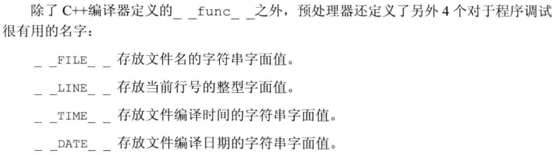

#### Exercise
- e6.47
  ```c++
  #include <iostream>
  #include <vector>
  using namespace std;

  void print(vector<int>::const_iterator first, vector<int>::const_iterator last) {
  #ifndef NDEBUG
      cout << "vector<int>::size(): " << last - first << endl;
  #endif
      if (first != last) {
          cout << *first << " ";
          print(++first, last);
      }
  }

  int main() {
      vector<int> iv{1,2,3,4,5,6};
      print(iv.cbegin(), iv.cend());
      cout << endl;
      return 0;
  }
  ```  
- e6.48
  ```c++
  #include <iostream>
  #include <cassert>
  #include <string>
  using namespace std;

  int main() {
      string s;
      string sought = "quit";
      while (cin >> s && s != sought) {
          cout << s << endl;
      }
      // 如果有输入总是返回true。如果题意是让接受到sought才正确返回。那么assert(s == sought)可能更合适
      assert(cin);

      return 0;
  }
  ```
## 6.6 函数匹配
- 当几个重载函数的形参数量相等以及某个形参的类型可以由其它类型转换得来时，函数匹配就不那么容易了
- 函数匹配步骤：
  - 第一步：选定本次调用对应的重载函数集，集合中的函数成为**候选函数**。具有两个特征
    - 被调用的函数同名
    - 声明在调用点可见
  - 第二步：考察本次调用提供的**实参**，然后从候选函数中选出能被这组实参调用的函数，这些新选的函数称为**可行函数**。也具有两个特征
    - 形参数量与本次调用提供的实参**数量相等**
      > 如果函数含有默认实参，则我们在调用该函数时传入的实参数量**可能少于**它实际使用的实参数量
    - 每个实参的类型与对应的形参**类型相同**，或者能**转换**成形参的类型

    如果没有找到可行函数，编译器将报告无匹配函数的错误
  - 第三步：从可行函数中选择与本地调用最匹配的函数。如果有且只有一个函数满足下列条件，则匹配成功：
    - 该函数每个**实参的匹配**都**不劣于**其它可行函数需要的匹配
    - **至少有一个实参的匹配优于**其它可行函数提供的匹配
- 调用重载函数时**应尽量避免强制类型转换**。如果在实际应用中确实需要强制类型转换，则说明我们设计的形参集合不合理

#### Exercise
- e6.49
  > 看上面
- e6.50；e6.51
  ```c++
    #include <iostream>
    using namespace std;

    void f() {
        cout << __PRETTY_FUNCTION__ << endl;
    }

    void f(int a) {
        cout << __PRETTY_FUNCTION__ << endl;
    }

    void f(int a, int b) {
        cout << __PRETTY_FUNCTION__ << endl;
    }

    void f(double a, double b = 3.14) {
        cout << __PRETTY_FUNCTION__ << endl;
    }

    int main() {
        /*
          t6-50.cc: In function ‘int main()’:
          t6-50.cc:21:15: error: call of overloaded ‘f(double, int)’ is ambiguous
              f(2.56, 42);
                        ^
          t6-50.cc:12:6: note: candidate: void f(int, int)
          void f(int a, int b) {
                ^
          t6-50.cc:16:6: note: candidate: void f(double, double)
          void f(double a, double b = 3.14) {
                ^
        */
        f(2.56, 42);
        f(42); // void f(int)
        f(42, 0); // void f(int, int)
        f(2.56, 3.14); // void f(double, double)

        return 0;
    }
  ```
### 6.6.1 实参类型转换

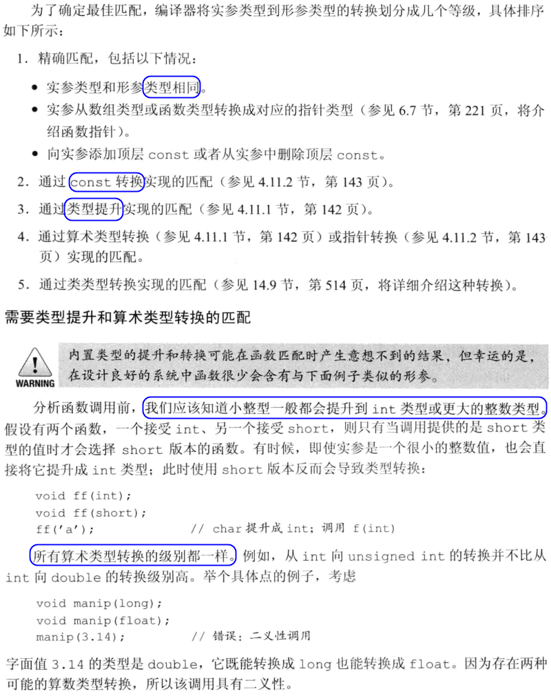

#### Exercise
- e6.52
  > 3. 类型提升，从char提升到int  
  > 4. 算术类型转换
- e6.53
  > (a) 
  > (b)
  > (c) 不合法.
  
  ```c++
  #include <iostream>
  using namespace std;

  int calc (int &a, int &b) {
      cout << __PRETTY_FUNCTION__ << endl;
      return 0;
  }
  int calc (const int &a, const int &b) {
      cout << __PRETTY_FUNCTION__ << endl;
      return 0;
  }
  int calc (char *a, char *b) {
      cout << __PRETTY_FUNCTION__ << endl;
      return 0;
  }
  int calc (const char *a, const char *b) {
      cout << __PRETTY_FUNCTION__ << endl;
      return 0;
  }

  /*
    t6-53.cc: In function ‘int calc(char*, char*)’:
    t6-53.cc:20:5: error: redefinition of ‘int calc(char*, char*)’
    int calc (char* const a, char* const b) {
        ^~~~
    t6-53.cc:12:5: note: ‘int calc(char*, char*)’ previously defined here
    int calc (char *a, char *b) {
        ^~~~
  */
  /*
  int calc (char* const a, char* const b) {
      cout << __PRETTY_FUNCTION__ << endl;
      return 0;
  }
  */
  int main() {
      int ia, ib;
      char ca, cb;
      char *const pca = 0;
      char *const pcb = 0;

      calc(ia, ib);
      calc(1, 2);
      calc(&ca, &cb);
      calc("ab", "cd");
      calc(pca, pcb);

      return 0;
  }
  ```
  ```bash
  # output
  int calc(int&, int&)
  int calc(const int&, const int&)
  int calc(char*, char*)
  int calc(const char*, const char*)
  int calc(char*, char*)
  ```
## 6.7 函数指针

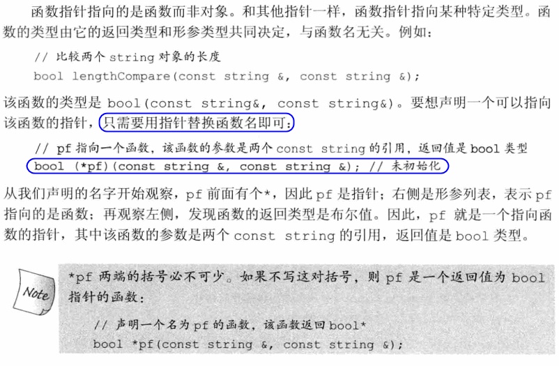

- 当把函数名作为一个值使用时，函数自动转换成指针
  ```c++
  // 两者等价
  pf = lengthCompare;
  pf = &lengthCompare; 
  ```
- 不同函数类型的指针间不存在转换规则
- 重载函数的指针必须与重载函数中的某一个精确匹配
- 不能定义函数类型的形参，但是形参可以是指向函数的指针

  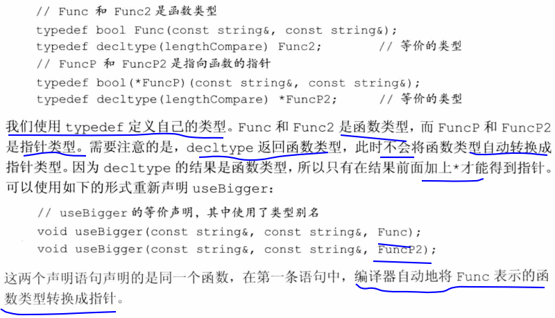

- 不能返回一个函数，但是能返回指向函数类型的指针

  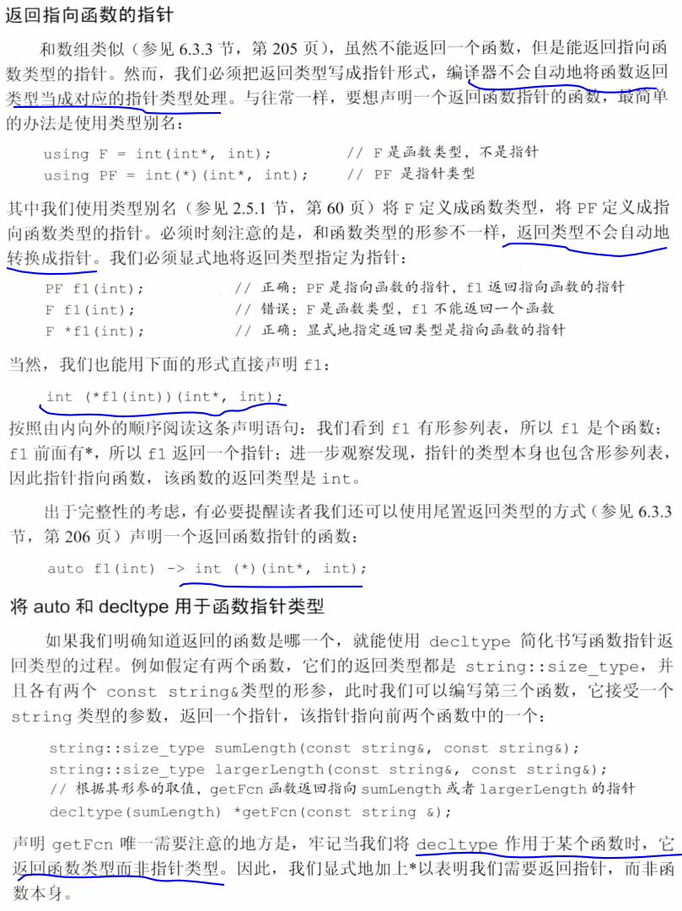

#### Exercise
- e6.54
  ```c++
  #include <iostream>
  #include <vector>
  using namespace std;
  int fun(int a, int b);
  vector<int (*)(int, int)> fv;

  int main() {
      return 0;
  }
  ```
- e6.55
  ```c++
  #include <iostream>
  #include <vector>
  using namespace std;
  int fun(int a, int b);
  vector<int (*)(int, int)> fv;

  int main() {


      return 0;
  }
  dongkesi@DESKTOP-CL29DN1:/mnt/c/workspace/github/C++-Primer/ch06$ cat t6-55.cc
  #include <iostream>
  #include <vector>
  using namespace std;
  int fun(int a, int b);
  //using PF = int(*)(int, int);
  vector<int (*)(int, int)> fv;
  //vector<PF> fv;

  int my_add(int a, int b) {
      return a + b;
  }

  int my_sub(int a, int b) {
      return a - b;
  }

  int my_mul(int a, int b) {
      return a * b;
  }

  int my_div(int a, int b) {
      return a / b;
  }

  int main() {
      fv.push_back(my_add);
      fv.push_back(my_sub);
      fv.push_back(my_mul);
      fv.push_back(my_div);

      return 0;
  }
  ```
- e6.56
  ```C++
  #include <iostream>
  #include <vector>
  using namespace std;
  int fun(int a, int b);
  //using PF = int(*)(int, int);
  vector<int (*)(int, int)> fv;
  //vector<PF> fv;

  int my_add(int a, int b) {
      return a + b;
  }

  int my_sub(int a, int b) {
      return a - b;
  }

  int my_mul(int a, int b) {
      return a * b;
  }

  int my_div(int a, int b) {
      return a / b;
  }

  int main() {
      fv.push_back(my_add);
      fv.push_back(my_sub);
      fv.push_back(my_mul);
      fv.push_back(my_div);

      for (auto f : fv)
          cout << f(20, 10) << endl;
      return 0;
  }
  ```