# 7 类
- 类的基本思想是**数学抽象**和**封装**
  - **数据抽象**是一种依赖于**接口**和**实现**的**分离**的编程技术
    - 类的**接口**包括用户所能执行的操作
    - 类的**实现**则包括类的数据成员、负责接口实现的函数体以及定义类所需的各种私有函数
  - 封装实现了类的接口和实现的分离。封装后的类隐藏了它的实现细节，也就是说，类的用户只能使用接口而无法访问实现部分
- 类要实现数据抽象和封装，需要首先定义一个抽象数据类型。
  - 类的设计者负责考虑类的实现过程
  - 类的使用者只需抽象地思考类型做了什么，而无须了解类型的工作细节
## 7.1 定义抽象数据类型
### 7.1.1 设计Sales_data类
#### Exercise
- e7.1
  ```c++
  #include <iostream>
  #include <string>

  using namespace std;

  struct Sales_data {
      std::string bookNo;
      unsigned units_sold = 0;
      double revenue = 0.0;
  };

  int main()
  {
      Sales_data total; // variable to hold data for the next transaction

      // read the first transaction and ensure that there are data to process
      if (std::cin >> total.bookNo >> total.units_sold >> total.revenue) {
          Sales_data trans; // variable to hold the running sum
          // read and process the remaining transactions
          while (std::cin >> trans.bookNo >> trans.units_sold >> trans.revenue) {
              // if we're still processing the same book
              if (total.bookNo == trans.bookNo) {
                  total.units_sold += trans.units_sold; // update the running total
                  total.revenue += trans.revenue;
              } else {
                  // print results for the previous book
                  std::cout << total.bookNo << " " << total.units_sold << " "
                            << total.revenue << " " << std::endl;
                  total = trans;  // total now refers to the next book
              }
          }
          std::cout << total.bookNo << " " << total.units_sold << " "
                    << total.revenue << " " << std::endl;
      } else {
          // no input! warn the user
          std::cerr << "No data?!" << std::endl;
          return -1;  // indicate failure
      }

      return 0;
  }
  ```
### 7.1.2 定义改进的Sales_data类
- 成员函数的声明必须在类的内部，它的定义则既可以在类的内部也可以在类的外部。
- 定义在类内部的函数时隐式的`inline`函数
- total.isbn() -> Sales_data::isbn(&total)
- 因为this的目的总是指向“这个”对象，所以this是一个常量指针，我们不允许改变this中保存的地址

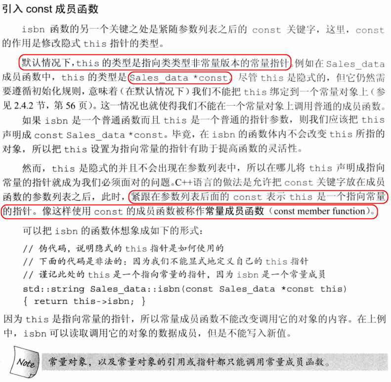

- 编译器分两步处理类：首先编译成员的声明，然后才轮到成员函数体（如果有的话）。因此，成员函数可以随意使用类中的其它成员而无须在意这些成员出现的次序。
- 当我们在类的外部定义成员函数时，成员函数的定义必须与它的声明匹配。类外部定义的成员的名字必须包含它所属的类名。

#### Exercise
- e7.2
  ```c++
    #ifndef SALES_DATA_H
    #define SALES_DATA_H

    #include <string>

    struct Sales_data {
            std::string bookNo;
            unsigned units_sold = 0;
            double revenue = 0.0;
            Sales_data& combine(const Sales_data &rhs);
            std::string isbn() const { return bookNo; }
    };

    Sales_data& Sales_data::combine(const Sales_data &rhs) {
        units_sold += rhs.units_sold;
        revenue += rhs.revenue;
        return *this;
    }

    #endif
  ```
- e7.3
  ```c++
    #include <iostream>
    #include <string>
    #include "t7-2.h"

    using namespace std;

    int main()
    {
        Sales_data total; // variable to hold data for the next transaction

        // read the first transaction and ensure that there are data to process
        if (std::cin >> total.bookNo >> total.units_sold >> total.revenue) {
            Sales_data trans; // variable to hold the running sum
            // read and process the remaining transactions
            while (std::cin >> trans.bookNo >> trans.units_sold >> trans.revenue) {
                // if we're still processing the same book
                if (total.isbn() == trans.isbn()) {
                    total.combine(trans);
                } else {
                    // print results for the previous book
                    std::cout << total.bookNo << " " << total.units_sold << " "
                            << total.revenue << " " << std::endl;
                    total = trans;  // total now refers to the next book
                }
            }
            std::cout << total.bookNo << " " << total.units_sold << " "
                    << total.revenue << " " << std::endl;
        } else {
            // no input! warn the user
            std::cerr << "No data?!" << std::endl;
            return -1;  // indicate failure
        }

        return 0;
    }
  ```
- e7.4
  ```c++
    #ifndef _PERSON_H_
    #define _PERSON_H_
    #include <string>

    class Person {
    private:
        std::string name;
        std::string address;
    };
    #endif
  ```
- e7.5
  > 目前来看设置为const会更好，因为函数内部并没有改变它们，从而常量对象也可以调用它们
  ```c++
    #ifndef _PERSON_H_
    #define _PERSON_H_
    #include <string>

    class Person {
    public:
        std::string get_name() const { return name; }
        std::string get_address() const { return address; }
    private:
        std::string name;
        std::string address;
    };
    #endif
  ```
### 7.1.3 定义类相关的非成员函数
- 如果函数在概念上属于类但是不定义在类中则它一般应与类声明（而非定义）在同一个头文件中。
- 一般来说，如果非成员函数时类接口的组成部分，则**这些函数的声明应该与类在同一个头文件中**
- IO类属于不能被拷贝的类型，因此我们只能通过引用来传递它们。
- 一般来说，执行输出任务的函数应该尽量减少对格式的控制，这样可以确保由用户代码来决定是否换行

#### Exercise
- e7.6
  ```c++
    #ifndef SALES_DATA_H
    #define SALES_DATA_H

    #include <string>
    #include <iostream>
    using std::istream;
    using std::ostream;

    struct Sales_data {
            std::string bookNo;
            unsigned units_sold = 0;
            double revenue = 0.0;
            Sales_data& combine(const Sales_data &rhs);
            std::string isbn() const { return bookNo; }
    };

    Sales_data& Sales_data::combine(const Sales_data &rhs) {
        units_sold += rhs.units_sold;
        revenue += rhs.revenue;
        return *this;
    }

    istream& read(istream &is, Sales_data &item) {
        double price = 0;
        is >> item.bookNo >> item.units_sold >> price;
        item.revenue = price * item.units_sold;
        return is;
    }

    ostream& print(ostream &os, const Sales_data &item) {
        os << item.isbn() << " " << item.units_sold << " "
            << item.revenue;// << " " << item.avg_price();
        return os;
    }

    Sales_data add(const Sales_data &lhs, const Sales_data &rhs) {
        Sales_data sum = lhs;
        sum.combine(rhs);
        return sum;
    }

    #endif
  ```
- e7.7
  ```c++
    #include <iostream>
    #include <string>
    #include "t7-6.h"

    using namespace std;

    int main()
    {
        Sales_data total; // variable to hold data for the next transaction

        // read the first transaction and ensure that there are data to process
        if (read(std::cin, total)) {
            Sales_data trans; // variable to hold the running sum
            // read and process the remaining transactions
            while (read(std::cin, trans)) {
                // if we're still processing the same book
                if (total.isbn() == trans.isbn()) {
                    total.combine(trans);
                } else {
                    // print results for the previous book
                    print(std::cout, total) << std::endl;
                    total = trans;  // total now refers to the next book
                }
            }
            print(std::cout, total) << std::endl;
        } else {
            // no input! warn the user
            std::cerr << "No data?!" << std::endl;
            return -1;  // indicate failure
        }

        return 0;
    }
  ```
- e7.8
  > 因为read中需要修改该参数，而print不修改
- e7.9
  ```c++
    #ifndef _PERSON_H_
    #define _PERSON_H_
    #include <string>
    #include <iostream>
    using std::istream;
    using std::ostream;

    class Person {
    public:
        std::string get_name() const { return name; }
        std::string get_address() const { return address; }
    //private:
        std::string name;
        std::string address;
    };

    istream& read(istream &is, Person &item) {
        is >> item.name >> item.address;
        return is;
    }

    ostream& print(ostream &os, const Person &item) {
        os << item.name << " " << item.address;
        return os;
    }

    #endif

  ```
- e7.10
  > 输入data1, 然后输入data2。判断是否输入为空
### 7.1.4 构造函数
- 构造函数的任务是初始化类对象的数据成员，无论何时只要类的对象被创建，就会执行构造函数
- 不同于其它成员函数，**构造函数不能被声明成const的**。当我们创建类的一个const对象时，直到构造函数完成初始化过程，**对象才能真正取得其“常量”属性**。因此，构造函数在const对象的构造过程中可以向其写值。
- 默认构造函数无须任何实参
- 编译器创建的构造函数又被成为合成的默认构造函数。对于大多数类来说，这个合成的默认构造函数将按照如下规则初始化类的数据成员：
  - 如果存在类内的初始值，用它来初始化成员。
  - 否则，默认初始化该成员
    ```c++
    struct Sales_data {
        std::string bookNo;
        unsigned units_sold = 0;
        double revenue = 0.0;
    };
    ```
    - 因为units_sold和revenue提供了初始值，所以合成的默认构造函数将使用这些值来初始化对应的成员；同时，它把bookNo默认初始化成一个空字符串。
- 合成的默认构造函数只适合非常简单的类，对于一个普通的类来说，必须定义它自己的默认构造函数，原因有三：
  - 编译器只有在发现类不包含任何构造函数的情况下才会替我们生成一个默认的构造函数。一旦我们定义了一些其它的构造函数，那么除非我们再定义一个默认的构造函数，否则类将没有默认构造函数。
  - 对于某些类，合成的默认构造函数可能执行错误的操作。如果类包含有内置类型或者符合类型的成员，则**只有当这些成员全部都被赋予了类内的初始值时**，这个类才适合于使用合成的默认构造函数
  - 有时候编译器不能为某些类合成默认的构造函数，比如类中包含一个其它类类型的成员且这个成员的类型没有默认构造函数。
- `= default`: 当我们需要这个函数的作用完全等同于之前使用的合成默认构造函数时。它要求编译器生成构造函数。既可以和声明一起出现在类的内部，也可以作为定义出现在类的外部。
- 构造函数不应该轻易覆盖掉类内的初始值，除非新赋得值与原值不同。如果你不能使用类内初始值，则所有构造函数都应该显示地初始化每个内置类型的成员。

#### Exercise
- e7.11
  ```c++
    // .h
    #ifndef SALES_DATA_H
    #define SALES_DATA_H

    #include <string>
    #include <iostream>
    using std::istream;
    using std::ostream;

    struct Sales_data {
        Sales_data() = default;
        Sales_data(const std::string &s) : bookNo(s) { }
        Sales_data(const std::string &s, unsigned n, double p) :
            bookNo(s), units_sold(n), revenue(p*n) { }
        Sales_data(std::istream &);

        Sales_data& combine(const Sales_data &rhs);
        std::string isbn() const { return bookNo; }
        std::string bookNo;
        unsigned units_sold = 0;
        double revenue = 0.0;
    };

    Sales_data& Sales_data::combine(const Sales_data &rhs) {
        units_sold += rhs.units_sold;
        revenue += rhs.revenue;
        return *this;
    }

    istream& read(istream &is, Sales_data &item) {
        double price = 0;
        is >> item.bookNo >> item.units_sold >> price;
        item.revenue = price * item.units_sold;
        return is;
    }

    ostream& print(ostream &os, const Sales_data &item) {
        os << item.isbn() << " " << item.units_sold << " "
            << item.revenue;// << " " << item.avg_price();
        return os;
    }

    Sales_data add(const Sales_data &lhs, const Sales_data &rhs) {
        Sales_data sum = lhs;
        sum.combine(rhs);
        return sum;
    }

    Sales_data::Sales_data(std::istream &is) {
        read(is, *this);
    }

    #endif
  ```

  ```c++
    // .cc
    #include <iostream>
    #include "t7-11.h"
    using namespace std;

    int main() {
        Sales_data d1;
        Sales_data d2("0-201-78343-X");
        Sales_data d3("0-201-78344-X", 3, 20.00);
        Sales_data d4(std::cin);

        print(std::cout, d1) << std::endl;
        print(std::cout, d2) << std::endl;
        print(std::cout, d3) << std::endl;
        print(std::cout, d4) << std::endl;
        return 0;
    }
  ```
- e7.12
  ```c++
    #ifndef SALES_DATA_H
    #define SALES_DATA_H

    #include <string>
    #include <iostream>
    using std::istream;
    using std::ostream;
    struct Sales_data;
    istream& read(istream &is, Sales_data &item);
    struct Sales_data {
        Sales_data() = default;
        Sales_data(const std::string &s) : bookNo(s) { }
        Sales_data(const std::string &s, unsigned n, double p) :
            bookNo(s), units_sold(n), revenue(p*n) { }
        Sales_data(std::istream &is) { read(is, *this); }

        Sales_data& combine(const Sales_data &rhs);
        std::string isbn() const { return bookNo; }
        std::string bookNo;
        unsigned units_sold = 0;
        double revenue = 0.0;
    };

    Sales_data& Sales_data::combine(const Sales_data &rhs) {
        units_sold += rhs.units_sold;
        revenue += rhs.revenue;
        return *this;
    }

    istream& read(istream &is, Sales_data &item) {
        double price = 0;
        is >> item.bookNo >> item.units_sold >> price;
        item.revenue = price * item.units_sold;
        return is;
    }

    ostream& print(ostream &os, const Sales_data &item) {
        os << item.isbn() << " " << item.units_sold << " "
            << item.revenue;// << " " << item.avg_price();
        return os;
    }

    Sales_data add(const Sales_data &lhs, const Sales_data &rhs) {
        Sales_data sum = lhs;
        sum.combine(rhs);
        return sum;
    }
    /*
    Sales_data::Sales_data(std::istream &is) {
        read(is, *this);
    }
    */
    #endif
  ```
- e7.13
  ```c++
    #include <iostream>
    #include <string>
    #include "t7-12.h"

    using namespace std;

    int main()
    {
        Sales_data total(std::cin); // variable to hold data for the next transaction

        // read the first transaction and ensure that there are data to process
        if (!total.isbn().empty()) {
            std::istream &is = std::cin;
            // read and process the remaining transactions
            while (is) {
                Sales_data trans(is); // variable to hold the running sum
                // if we're still processing the same book
                if (!is) break;

                if (total.isbn() == trans.isbn()) {
                    total.combine(trans);
                } else {
                    // print results for the previous book
                    print(std::cout, total) << std::endl;
                    total = trans;  // total now refers to the next book
                }
            }
            print(std::cout, total) << std::endl;
        } else {
            // no input! warn the user
            std::cerr << "No data?!" << std::endl;
            return -1;  // indicate failure
        }

        return 0;
    }
  ```
- e7.14
  > Sales_data():bookNo(""), units_sold(0), revenue(0.0) { }
- e7.15
  ```c++
    #ifndef _PERSON_H_
    #define _PERSON_H_
    #include <string>
    #include <iostream>
    using std::istream;
    using std::ostream;

    struct Person {
        Person() = default;
        Person(const std::string &name, const std::string &address) : name(name), address(address){ }
        std::string get_name() const { return name; }
        std::string get_address() const { return address; }

        std::string name;
        std::string address;
    };

    istream& read(istream &is, Person &item) {
        is >> item.name >> item.address;
        return is;
    }

    ostream& print(ostream &os, const Person &item) {
        os << item.name << " " << item.address;
        return os;
    }

    #endif
  ```
### 7.1.5 拷贝、复制和析构
- 拷贝：当初始化变量以及以值得方式传递或返回一个对象
- 复制：使用赋值运算符
- 析构：当对象不再存在时
  
## 7.2 访问控制和封装
- 在C++语言中，使用**访问说明符**加强类的封装性
  - 定义在**public**说明符之后的成员在整个程序内可被访问，public成员定义类的接口
  - 定义在**private**说明符之后的成员可以被类的成员函数访问，但是不能被使用该类的代码访问，private部分封装了（即隐藏了）类的实现细节。
- 使用`class`和`struct`定义类唯一的区别就是默认的访问权限

#### Exercise
- e7.16
  > 访问说明符的位置和次数没有限制。希望在整个程序内都可被访问的放在public之后。希望对外隐藏的部分放在private之后
- e7.17
  > 除了默认的访问权限没有其它区别。struct默认为public，class默认时private
- e7.18
  > 封装实现了类的接口和实现的分离。隐藏了实现的细节。优点：数据被封装后，客户无法直接访问，更不能修改，只有接口函数才可访问和修改封装的信息。进一步而言，使用接口的用户完全不知道描述该接口的函数如何使用封装信息，而且对象（或类）的用户对此也毫无兴趣。因为只有保证OOP（或用于实现对象的语言）的假定，即封装的信息只能通过已发布的接口访问，才能确保对象的完整。数据封装的另一个优点是实现独立（implementation independence）。由于类的用户无法查看封装的数据（或信息），他们甚至不会注意到封装数据的存在（从某种程度上看，这取决于语言，将在后续章节中介绍）。因此，改动封装内的数据不会（也不该）影响用户所见的接口。https://yq.aliyun.com/articles/93658

  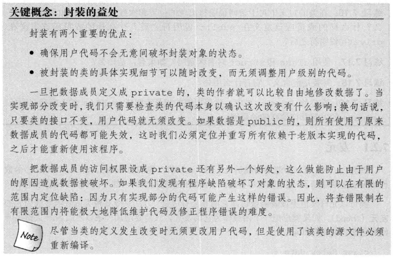
- e7.19
  ```c++
    //如下所示，成员变量声明为private。构造，获取变量内容的函数声明为public
    class Person {
    public:
        Person() {}
        Person(const std::string &name, const std::string &address) : name(name), address(address){ }
        std::string& get_name() const { return name; }
        std::string& get_address() const { return address; }
    private:
        std::string name;
        std::string address;
    };
  ```
### 7.2.1 友元
- 如果类想把一个函数作为它的友元，只需要增加一条以friend关键字开始的函数声明语句即可
- **友元声明只能出现在类定义的内部，但是在类内出现的具体位置不限。友元不是类的成员也不受它所在区域访问控制级别的约束**。
- 一般来说，最好在类定义开始或结束前的位置集中声明友元

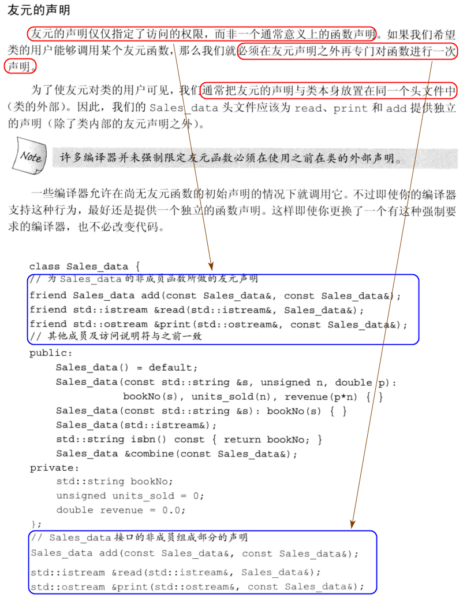

#### Exercise
- e7.20
  > 访问类的非共有成员时，可以使用友元，但是间接的暴露了类的内部成员，造成封装性和可维护性减弱
- e7.21
  ```c++
    #ifndef SALES_DATA_H
    #define SALES_DATA_H

    #include <string>
    #include <iostream>
    using std::istream;
    using std::ostream;
    struct Sales_data;

    class Sales_data {
    friend Sales_data add(const Sales_data &lhs, const Sales_data &rhs);
    friend istream& read(istream &is, Sales_data &item);
    friend ostream& print(ostream &os, const Sales_data &item);

    public:
        Sales_data() = default;
        Sales_data(const std::string &s) : bookNo(s) { }
        Sales_data(const std::string &s, unsigned n, double p) :
            bookNo(s), units_sold(n), revenue(p*n) { }
        Sales_data(std::istream &is) { read(is, *this); }

        Sales_data& combine(const Sales_data &rhs);
        std::string isbn() const { return bookNo; }

    private:
        std::string bookNo;
        unsigned units_sold = 0;
        double revenue = 0.0;
    };

    Sales_data& Sales_data::combine(const Sales_data &rhs) {
        units_sold += rhs.units_sold;
        revenue += rhs.revenue;
        return *this;
    }

    istream& read(istream &is, Sales_data &item) {
        double price = 0;
        is >> item.bookNo >> item.units_sold >> price;
        item.revenue = price * item.units_sold;
        return is;
    }

    ostream& print(ostream &os, const Sales_data &item) {
        os << item.isbn() << " " << item.units_sold << " "
            << item.revenue;// << " " << item.avg_price();
        return os;
    }

    Sales_data add(const Sales_data &lhs, const Sales_data &rhs) {
        Sales_data sum = lhs;
        sum.combine(rhs);
        return sum;
    }

    #endif
  ```
- e7.22
  ```c++
    #ifndef _PERSON_H_
    #define _PERSON_H_
    #include <string>
    #include <iostream>
    using std::istream;
    using std::ostream;

    class Person {
    friend istream& read(istream &is, Person &item);
    friend ostream& print(ostream &os, const Person &item);
    public:
        Person() = default;
        Person(const std::string &name, const std::string &address) : name(name), address(address){ }
        Person(istream &is) { read(is, *this); }
        std::string get_name() const { return name; }
        std::string get_address() const { return address; }
    private:
        std::string name;
        std::string address;
    };

    istream& read(istream &is, Person &item) {
        is >> item.name >> item.address;
        return is;
    }

    ostream& print(ostream &os, const Person &item) {
        os << item.name << " " << item.address;
        return os;
    }

    #endif
  ```
## 7.3 类的其它特性
### 7.3.1 类成员再探
- 类可以自定义某种类型在类中的别名。和其它成员一样**存在访问限制**，可以是public或者private中的一种。用来定义类型的成员必须先定义后使用。类型成员通常出现在类开始的地方。

    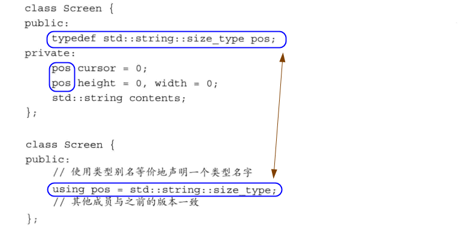

- 无须再声明和定义的地方同时说明inline，只需要一个地方即可，这样做是合法的。不过最好只在**类外部定义的地方说明inline**，这样可以使类更容易理解。
- inline成员函数应该与相应的类定义再同一个头文件中
- 类内初始值必须使用`=`的初始化形式，或者花括号括起来的直接初始化形式。

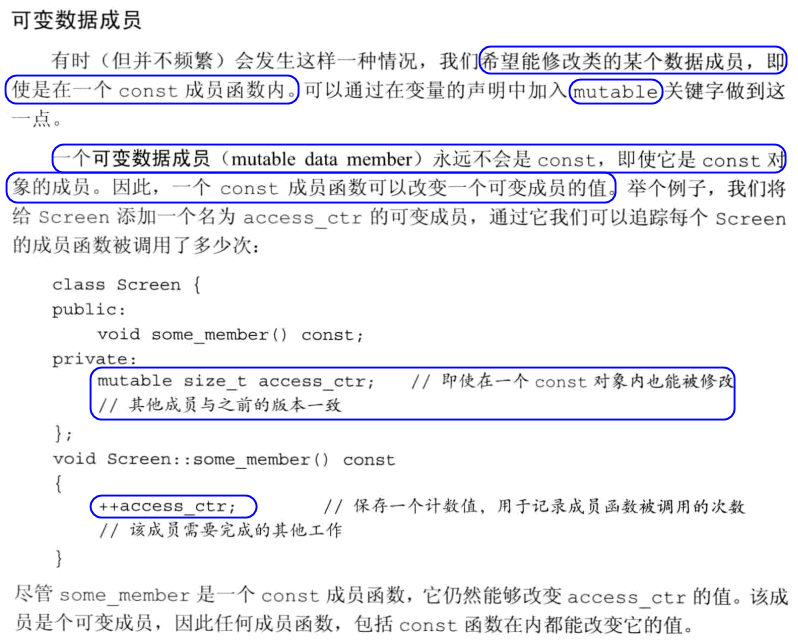

#### Exercise
- e7.23
  ```c++
    #ifndef _SCREEN_H
    #define _SCREEN_H
    #include <string>

    class Screen {
    public:
        typedef std::string::size_type pos;

        Screen() = default;
        Screen(pos ht, pos wd, char c) : height(ht), width(wd), contents(ht * wd, c) { }

        char get() const { return contents[cursor]; }
        char get(pos r, pos c) const;
        Screen &move(pos r, pos c);

    private:
        pos cursor = 0;
        pos height = 0, width = 0;
        std::string contents;
    };

    inline Screen &Screen::move(pos r, pos c) {
        pos row = r * width;
        cursor = row + c;
        return *this;
    }

    inline char Screen::get(pos r, pos c) const {
        pos row = r * width;
        return contents[row + c];
    }


    #endif
  ```
- e7.24
  ```c++
    #ifndef _SCREEN_H
    #define _SCREEN_H
    #include <string>

    class Screen {
    public:
        typedef std::string::size_type pos;

        Screen() = default;
        Screen(pos ht, pos wd) : height(ht), width(wd), contents(ht * wd, ' ') { }
        Screen(pos ht, pos wd, char c) : height(ht), width(wd), contents(ht * wd, c) { }

        char get() const { return contents[cursor]; }
        char get(pos r, pos c) const;
        Screen &move(pos r, pos c);

    private:
        pos cursor = 0;
        pos height = 0, width = 0;
        std::string contents;
    };

    inline Screen &Screen::move(pos r, pos c) {
        pos row = r * width;
        cursor = row + c;
        return *this;
    }

    inline char Screen::get(pos r, pos c) const {
        pos row = r * width;
        return contents[row + c];
    }


    #endif
  ```
- e7.25

    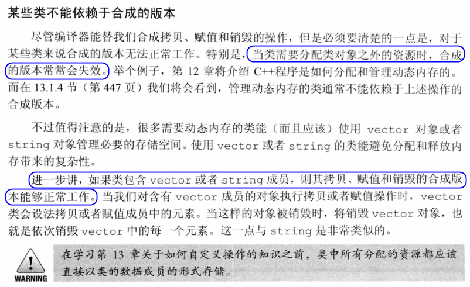

- e7.26
  ```c++
    #ifndef SALES_DATA_H
    #define SALES_DATA_H

    #include <string>
    #include <iostream>
    using std::istream;
    using std::ostream;
    struct Sales_data;

    class Sales_data {
    friend Sales_data add(const Sales_data &lhs, const Sales_data &rhs);
    friend istream& read(istream &is, Sales_data &item);
    friend ostream& print(ostream &os, const Sales_data &item);

    public:
        Sales_data() = default;
        Sales_data(const std::string &s) : bookNo(s) { }
        Sales_data(const std::string &s, unsigned n, double p) :
            bookNo(s), units_sold(n), revenue(p*n) { }
        Sales_data(std::istream &is) { read(is, *this); }

        Sales_data& combine(const Sales_data &rhs);
        std::string isbn() const { return bookNo; }

    private:
        double avg_price() const;
        std::string bookNo;
        unsigned units_sold = 0;
        double revenue = 0.0;
    };

    Sales_data& Sales_data::combine(const Sales_data &rhs) {
        units_sold += rhs.units_sold;
        revenue += rhs.revenue;
        return *this;
    }

    istream& read(istream &is, Sales_data &item) {
        double price = 0;
        is >> item.bookNo >> item.units_sold >> price;
        item.revenue = price * item.units_sold;
        return is;
    }

    ostream& print(ostream &os, const Sales_data &item) {
        os << item.isbn() << " " << item.units_sold << " "
            << item.revenue;// << " " << item.avg_price();
        return os;
    }

    Sales_data add(const Sales_data &lhs, const Sales_data &rhs) {
        Sales_data sum = lhs;
        sum.combine(rhs);
        return sum;
    }

    inline double Sales_item::avg_price() const
    {
        if (units_sold)
            return revenue/units_sold;
        else
            return 0;
    }

    #endif
  ```
### 7.3.2 返回*this的成员函数
- 一个const成员函数如果以引用的形式返回*this，那么它的返回类型将是常量引用
#### Exercise
- e7.27
  ```c++
    #ifndef _SCREEN_H
    #define _SCREEN_H
    #include <string>

    class Screen {
    public:
        typedef std::string::size_type pos;

        Screen() = default;
        Screen(pos ht, pos wd) : height(ht), width(wd), contents(ht * wd, ' ') { }
        Screen(pos ht, pos wd, char c) : height(ht), width(wd), contents(ht * wd, c) { }

        char get() const { return contents[cursor]; }
        char get(pos r, pos c) const;
        Screen &set(char);
        Screen &set(pos, pos, char);
        Screen &display(std::ostream &os) { do_display(os); return *this; }
        const Screen &display(std::ostream &os) const { do_display(os); return *this; }

        Screen &move(pos r, pos c);

    private:
        void do_display(std::ostream &os) const { os << contents; }


        pos cursor = 0;
        pos height = 0, width = 0;
        std::string contents;
    };

    inline Screen &Screen::move(pos r, pos c) {
        pos row = r * width;
        cursor = row + c;
        return *this;
    }

    inline char Screen::get(pos r, pos c) const {
        pos row = r * width;
        return contents[row + c];
    }

    inline Screen &Screen::set(char c) {
        contents[cursor] = c;
        return *this;
    }

    inline Screen &Screen::set(pos r, pos col, char ch) {
        contents[r * width + col] = ch;
        return *this;
    }

    #endif
  ```

  ```c++
    #include "t7-27.h"
    #include <iostream>
    using namespace std;

    int main() {
        Screen myScreen(5, 5, 'X');
        myScreen.move(4, 0).set('#').display(cout);
        cout << "\n";
        myScreen.display(cout);
        cout << "\n";
    }
  ```
- e7.28
  ```c++
    #ifndef _SCREEN_H
    #define _SCREEN_H
    #include <string>

    class Screen {
    public:
        typedef std::string::size_type pos;

        Screen() = default;
        Screen(pos ht, pos wd) : height(ht), width(wd), contents(ht * wd, ' ') { }
        Screen(pos ht, pos wd, char c) : height(ht), width(wd), contents(ht * wd, c) { }

        char get() const { return contents[cursor]; }
        char get(pos r, pos c) const;
        Screen set(char);
        Screen set(pos, pos, char);
        Screen display(std::ostream &os) { do_display(os); return *this; }
        const Screen display(std::ostream &os) const { do_display(os); return *this; }

        Screen move(pos r, pos c);

    private:
        void do_display(std::ostream &os) const { os << contents; }


        pos cursor = 0;
        pos height = 0, width = 0;
        std::string contents;
    };

    inline Screen Screen::move(pos r, pos c) {
        pos row = r * width;
        cursor = row + c;
        return *this;
    }

    inline char Screen::get(pos r, pos c) const {
        pos row = r * width;
        return contents[row + c];
    }

    inline Screen Screen::set(char c) {
        contents[cursor] = c;
        return *this;
    }

    inline Screen Screen::set(pos r, pos col, char ch) {
        contents[r * width + col] = ch;
        return *this;
    }

    #endif
  ```
  ```bash
    # output
    dongkesi@DESKTOP-CL29DN1:/mnt/d/workspace/github/C++-Primer/ch07$ g++ t7-28.cc
    dongkesi@DESKTOP-CL29DN1:/mnt/d/workspace/github/C++-Primer/ch07$ ./a.out
    XXXXXXXXXXXXXXXXXXXX#XXXX
    XXXXXXXXXXXXXXXXXXXXXXXXX
    dongkesi@DESKTOP-CL29DN1:/mnt/d/workspace/github/C++-Primer/ch07$ g++ t7-27.cc
    dongkesi@DESKTOP-CL29DN1:/mnt/d/workspace/github/C++-Primer/ch07$ ./a.out
    XXXXXXXXXXXXXXXXXXXX#XXXX
    XXXXXXXXXXXXXXXXXXXX#XXXX
  ```
- e7.29
  > 如上
- e7.30
  > 优点：处理同名变量时。有时候更加明确。缺点：冗长

### 7.3.3 类类型
- 可以声明类而暂时不定义它
  ```c++
  class Screen;
  //这种声明有时被称作前向声明，它向程序中引入名字Screen并且指明Screen是一种类类型。对于类型Screen来说，在它声明之后定义之前是一个不完全类型。即，此时我们已知Screen是一个类类型，但是不清除它到底包含哪些成员
  ```
- 不完全类型只能在非常有限的情景下使用：可以定义**指向这种类型的指针或引用，也可以声明（但是不能定义）以不完全类型作为参数或者返回类型的函数**。

#### Exercise
- e7.31
  ```c++
    class Y;

    // 这个必须在Y之前，因为Y中是对象，而这个是指针
    class X {
        Y *pY;
    };

    class Y {
        X x;
    };

    int main() {}
  ```
### 7.3.4 友元再探
- 类还可以把其它类定义成友元，也可以把其它类的成员函数定义成友元。此外，友元函数能定义在类的内部，这样的函数时隐式内联的
- 友元关系不存在传递性。每个类负责控制自己的友元类或友元函数
  
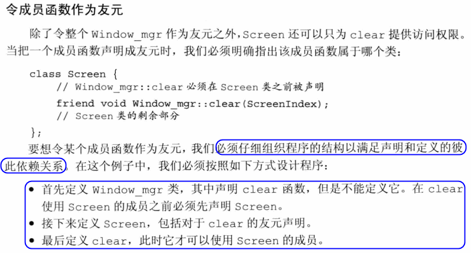

- 重载函数时不同的函数，都需要声明

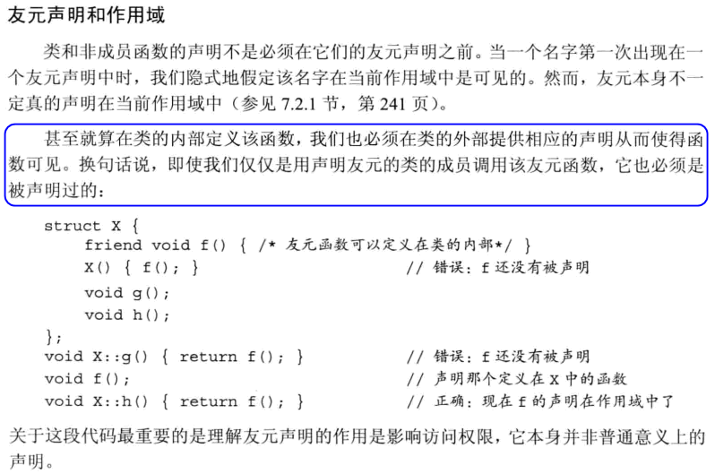

#### Exercise
- e7.32
  ```c++
    #ifndef _SCREEN_H
    #define _SCREEN_H
    #include <string>
    #include <vector>
    //前向声明
    class Screen;
    // 1. 首先定义Window_mgr类，在其中声明clear函数，但是不能定义它
    class Window_mgr {
    public:
        using ScreenIndex = std::vector<Screen>::size_type;
        void clear(ScreenIndex);
    private:
        std::vector<Screen> screens;//{Screen(24, 80, ' ')};
    };
    // 2. 接下来定义Screen，包括对clear的友元声明
    class Screen {
        friend void Window_mgr::clear(ScreenIndex);
    public:
        typedef std::string::size_type pos;

        Screen() = default;
        Screen(pos ht, pos wd) : height(ht), width(wd), contents(ht * wd, ' ') { }
        Screen(pos ht, pos wd, char c) : height(ht), width(wd), contents(ht * wd, c) { }

        char get() const { return contents[cursor]; }
        char get(pos r, pos c) const;
        Screen &set(char);
        Screen &set(pos, pos, char);
        Screen &display(std::ostream &os) { do_display(os); return *this; }
        const Screen &display(std::ostream &os) const { do_display(os); return *this; }

        Screen &move(pos r, pos c);

    private:
        void do_display(std::ostream &os) const { os << contents; }


        pos cursor = 0;
        pos height = 0, width = 0;
        std::string contents;
    };


    inline Screen &Screen::move(pos r, pos c) {
        pos row = r * width;
        cursor = row + c;
        return *this;
    }

    inline char Screen::get(pos r, pos c) const {
        pos row = r * width;
        return contents[row + c];
    }

    inline Screen &Screen::set(char c) {
        contents[cursor] = c;
        return *this;
    }

    inline Screen &Screen::set(pos r, pos col, char ch) {
        contents[r * width + col] = ch;
        return *this;
    }

    // 3. 最后定义clear，然后才可以使用Screen的成员
    void Window_mgr::clear(ScreenIndex i) {
        Screen &s = screens[i];
        s.contents = std::string(s.height * s.width, ' ');
    }


    #endif
  ```
## 7.4 类的作用域
- 返回类型需要知名属于哪个类。

    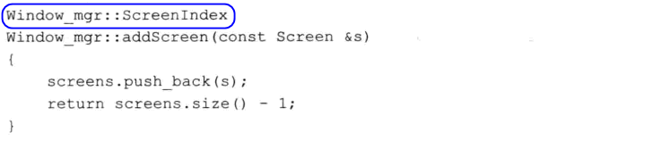

#### Exercise
- e7.33
  ```c++
  Screen::pos Screen::size() const {
      return height * width;
  }
  ```
### 7.4.1 名字查找与类的作用域
- 名字查找过程：
  - 在**名字所在的块中**寻找其声明语句，只考虑在名字的使用之前出现的声明
  - 如果没有找到，继续查找外层作用域
  - 如果最终没有找到匹配的声明，则程序报错
- 定义在类内部的成员函数，名字解析与上述有所区别。分两步处理。
  - 首先，编译成员的声明
  - 直到类全部可见后才编译函数体
- 编译器处理完类中的全部声明后才会处理成员函数的定义
- 这两步处理只适用于成员函数中使用的名字。声明中使用的名字，包括返回类型或者参数列表中使用的名字，都必须在使用前确保可见。

    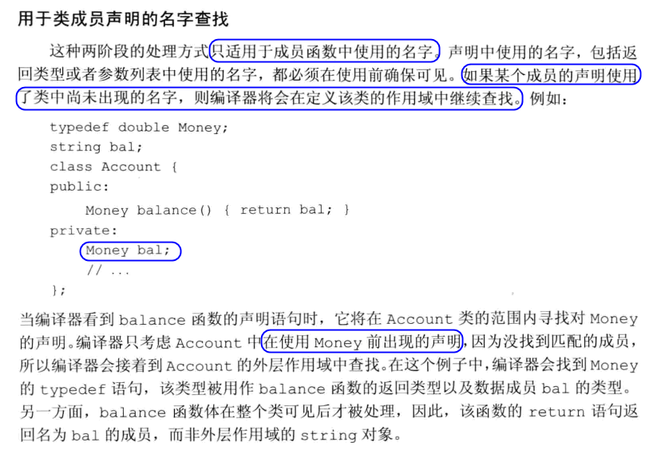

- 在类中，如果成员使用了外层作用域的某个名字，而该名字**代表一种类型**，则类不能再之后重新定义该名字
- **类型名的定义通常出现在类的开始处**，这样就能确保所有使用该类型的成员都出现在类名的定义之后
- 成员函数中使用的名字按照如下方式解析：
  - 首先，在成员函数内查找该名字的声明。
  - 如果在成员函数内没找到，则在类内继续查找，这时类的所有成员都可以被考虑
  - 如果类内也没有找到该名字的声明，在成员函数定义之前的作用域内继续查找

#### Exercise
- e7.34
  > **类型名的定义通常出现在类的开始处**，这样就能确保所有使用该类型的成员都出现在类名的定义之后

  > 编译不通过
- e7.35
  ```c++
    #include <string>
    using namespace std;

    typedef string Type;
    Type initVal(); // string

    class Exercise {
    public:
        typedef double Type;
        Type setVal(Type); // double
        Type initVal(); //double
    private:
        int val;
    };

    /*
    t7-35.h:16:6: error: prototype for ‘Type Exercise::setVal(Exercise::Type)’ does not match any in class ‘Exercise’
    Type Exercise::setVal(Type parm) {
        ^~~~~~~~
    t7-35.h:10:10: error: candidate is: Exercise::Type Exercise::setVal(Exercise::Type)
        Type setVal(Type);
            ^~~~~~
    */
    //Type Exercise::setVal(Type parm) { //名字在这里有歧义，分别为string, double
    Exercise::Type Exercise::setVal(Type parm) {  //修改为指定作用域
        val = parm + initVal(); // Exercise::initVal()
        return val;
    }
  ```
## 7.5 构造函数再探
### 7.5.1 构造函数初始值列表

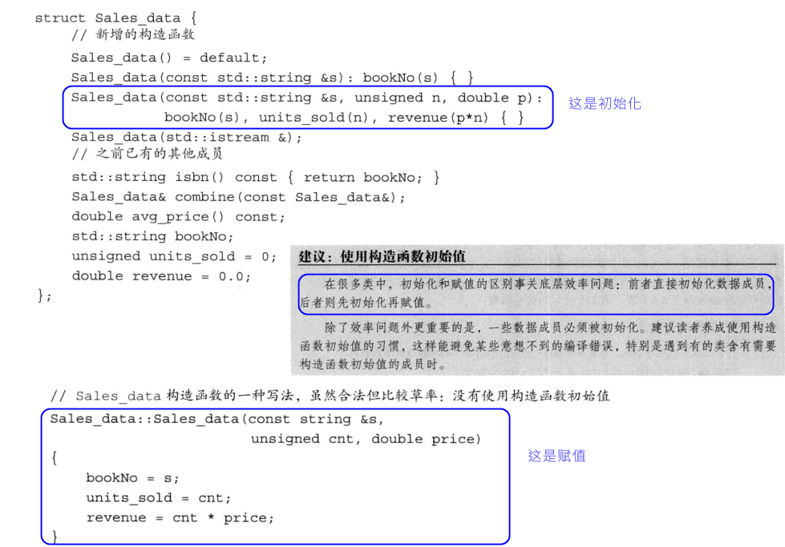

- 如果成员时const、引用，或者属于某种未提供默认构造函数的类类型，我们必须通过构造初始值列表未这些成员提供初值

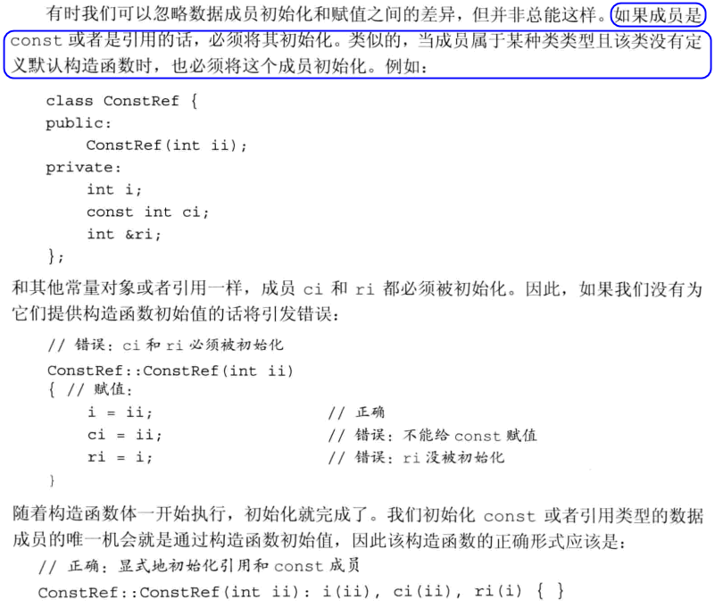

- 成员的初始化顺序和它们在类定义中的出现顺序一致：第一个成员先被初始化，然后第二个，以此类推。构造函数初始值列表中的初始值前后位置关系不会影响实际的初始化顺序
- 最好令构造函数初始值的顺序与成员声明的顺序保持一致。而且如果可能的话，尽量避免使用某些成员初始化其它成员
- 如果一个构造函数为所有参数都提供了默认实参，则它实际上也定义了默认构造函数

#### Exercise
- e7.36
  ```C++
    struct X {
        X (int i, int j) : base(i), rem(base % j) { }
        //int rem, base;
        int base, rem;
    };
  ```
- e7.37
  ```c++
    #ifndef SALES_DATA_H
    #define SALES_DATA_H

    #include <string>
    #include <iostream>
    using std::istream;
    using std::ostream;

    class Sales_data {
    friend Sales_data add(const Sales_data &lhs, const Sales_data &rhs);
    friend istream& read(istream &is, Sales_data &item);
    friend ostream& print(ostream &os, const Sales_data &item);

    public:
        Sales_data(std::string s = ""):bookNo(s) { }
        Sales_data(std::string s, unsigned n, double p) :
            bookNo(s), units_sold(n), revenue(p*n) { }
        Sales_data(std::istream &is) { read(is, *this); }

        Sales_data& combine(const Sales_data &rhs);
        std::string isbn() const { return bookNo; }

    private:
        double avg_price() const;
        std::string bookNo;
        unsigned units_sold = 0;
        double revenue = 0.0;
    };

    Sales_data& Sales_data::combine(const Sales_data &rhs) {
        units_sold += rhs.units_sold;
        revenue += rhs.revenue;
        return *this;
    }

    istream& read(istream &is, Sales_data &item) {
        double price = 0;
        is >> item.bookNo >> item.units_sold >> price;
        item.revenue = price * item.units_sold;
        return is;
    }

    ostream& print(ostream &os, const Sales_data &item) {
        os << item.isbn() << " " << item.units_sold << " "
            << item.revenue;// << " " << item.avg_price();
        return os;
    }

    Sales_data add(const Sales_data &lhs, const Sales_data &rhs) {
        Sales_data sum = lhs;
        sum.combine(rhs);
        return sum;
    }

    inline double Sales_data::avg_price() const
    {
        if (units_sold)
            return revenue/units_sold;
        else
            return 0;
    }

    #endif
  ```

  ```c++
    #include "t7-37.h"

    Sales_data first_item(std::cin);
    int main() {
        Sales_data next;
        Sales_data last("9-999-99999-9");

        print(std::cout, first_item) << std::endl;
        print(std::cout, next) << std::endl;
        print(std::cout, last) << std::endl;
    }
  ```

  ```output
    dongkesi@DESKTOP-CL29DN1:/mnt/d/workspace/github/C++-Primer/ch07$ ./a.out
    0-201-78345-X 2 25.00 // 输入
    ---//输出
    0-201-78345-X 2 50
    0 0
    9-999-99999-9 0 0
  ```
- e7.38
  ```c++
  Sales_data(std::istream &is = std::cin) { read(is, *this); }
  ```
- e7.39
  > 不合法，二义性
  ```
    t7-39.cc: In function ‘int main()’:
    t7-39.cc:5:16: error: call of overloaded ‘Sales_data()’ is ambiguous
        Sales_data next;
                    ^~~~
    t7-38.h:18:5: note: candidate: Sales_data::Sales_data(std::istream&)
        Sales_data(std::istream &is = std::cin) { read(is, *this); }
        ^~~~~~~~~~
    t7-38.h:15:5: note: candidate: Sales_data::Sales_data(std::__cxx11::string)
        Sales_data(std::string s = ""):bookNo(s) { }
        ^~~~~~~~~~
  ```
- e7.40
  ```c++
    #include <string>
    #include <iostream>

    class Employee {
    public:
        Employee(std::string id, std::string name, int age, double salary)
            : _id(id), _name(name), _age(age), _salary(salary) { }
        Employee(std::istream &is) {
            is >> _id >> _name >> _age >> _salary;
        }
    private:
        std::string _id;
        std::string _name;
        int _age;
        double _salary;
    };
  ```
### 7.5.2 委托构造函数
- 一个**委托构造函数**使用它所属类的其它构造函数执行它自己的初始化过程，或者说它把自己的一些（或者全部）职责委托给了其它构造函数
- 当一个构造函数委托给另一个构造函数时，受委托的构造函数的初始值列表和函数体被一次执行。假若受委托的构造函数包含代码的话，将先执行这些代码，然后控制权才会交还给委托者的函数体。

    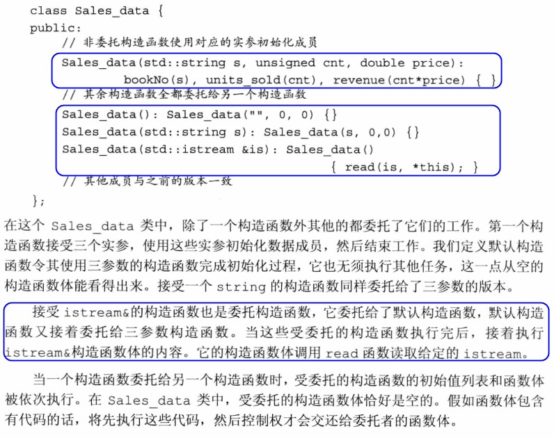

#### Exercise
- e7.41
  ```c++
    #ifndef SALES_DATA_H
    #define SALES_DATA_H

    #include <string>
    #include <iostream>
    using std::istream;
    using std::ostream;

    class Sales_data {
    friend Sales_data add(const Sales_data &lhs, const Sales_data &rhs);
    friend istream& read(istream &is, Sales_data &item);
    friend ostream& print(ostream &os, const Sales_data &item);

    public:
        Sales_data(std::string s, unsigned cnt, double price) :
            bookNo(s), units_sold(cnt), revenue(cnt * price) {
            std::cout << __PRETTY_FUNCTION__ << std::endl;
        }

        Sales_data() : Sales_data("", 0, 0) {
            std::cout << __PRETTY_FUNCTION__ << std::endl;
        }

        Sales_data(std::string s) : Sales_data(s, 0, 0) {
            std::cout << __PRETTY_FUNCTION__ << std::endl;
        }

        Sales_data(std::istream &is) : Sales_data() {
            std::cout << __PRETTY_FUNCTION__ << std::endl;
            read(is, *this);
        }

        Sales_data& combine(const Sales_data &rhs);
        std::string isbn() const { return bookNo; }

    private:
        double avg_price() const;
        std::string bookNo;
        unsigned units_sold = 0;
        double revenue = 0.0;
    };

    Sales_data& Sales_data::combine(const Sales_data &rhs) {
        units_sold += rhs.units_sold;
        revenue += rhs.revenue;
        return *this;
    }

    istream& read(istream &is, Sales_data &item) {
        double price = 0;
        is >> item.bookNo >> item.units_sold >> price;
        item.revenue = price * item.units_sold;
        return is;
    }

    ostream& print(ostream &os, const Sales_data &item) {
        os << item.isbn() << " " << item.units_sold << " "
            << item.revenue;// << " " << item.avg_price();
        return os;
    }

    Sales_data add(const Sales_data &lhs, const Sales_data &rhs) {
        Sales_data sum = lhs;
        sum.combine(rhs);
        return sum;
    }

    inline double Sales_data::avg_price() const
    {
        if (units_sold)
            return revenue/units_sold;
        else
            return 0;
    }

    #endif
  ```

  ```c++
    #include "t7-41.h"

    int main () {
        std::cout << "d1" << std::endl;
        Sales_data d1("d1", 2, 30);
        print(std::cout, d1) << std::endl;

        std::cout << "d2" << std::endl;
        Sales_data d2;
        print(std::cout, d2) << std::endl;

        std::cout << "d3" << std::endl;
        Sales_data d3("d3");
        print(std::cout, d3) << std::endl;

        std::cout << "d4" << std::endl;
        Sales_data d4(std::cin);
        print(std::cout, d4) << std::endl;
    }
  ```
  ```bash
    // output
    dongkesi@DESKTOP-CL29DN1:/mnt/d/workspace/github/C++-Primer/ch07$ ./a.out
    d1
    Sales_data::Sales_data(std::__cxx11::string, unsigned int, double)
    d1 2 60
    d2
    Sales_data::Sales_data(std::__cxx11::string, unsigned int, double)
    Sales_data::Sales_data()
    0 0
    d3
    Sales_data::Sales_data(std::__cxx11::string, unsigned int, double)
    Sales_data::Sales_data(std::__cxx11::string)
    d3 0 0
    d4
    Sales_data::Sales_data(std::__cxx11::string, unsigned int, double)
    Sales_data::Sales_data()
    Sales_data::Sales_data(std::istream&)
    0-201-78345-X 2 25.00
    0-201-78345-X 2 50
  ```
- e7.42

### 7.5.3 默认构造函数的作用

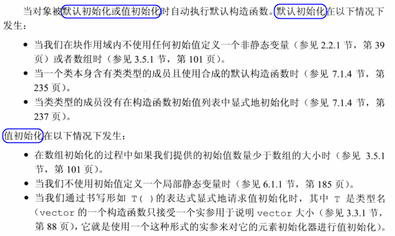

- 在实际中，如果定义了其它构造函数，那么最好也提供一个默认的构造函数


#### Exercise
- e7.43
  ```c++
    class NoDefault {
    public:
        NoDefault(int a) { }
    };

    class C {
    public:
        C() : mem(0) { }
    private:
        NoDefault mem;
    };
  ```
- e7.44
  > 不合法，因为NoDefault没有默认构造函数，而这里会调用默认构造函数
- e7.45
  > 合法，因为C有默认构造函数
- e7.46
  > (a): 不正确，编译器会提供一些合成的默认构造函数  
  > (b): 不正确，如果所有参数提供了默认值，也时默认构造函数  
  > (c): 不正确，某些情况下只能用默认构造函数，如果提供了其它构造函数，就应该提供默认构造函数  
  > (d): 不正确，如果没提供任何构造函数，那么编译器会提供一个默认构造函数，但是如果有其它构造函数，则不会提供，需要自己写  
### 7.5.4 隐式的类类型转换
- 如果**构造函数只接受一个实参**，则它实际上定义了转换为此类类型的隐式转换机制，有时我们把这种构造函数称作**转换构造函数**。
- **能通过一个实参调用的构造函数定义了一条从构造函数的参数类型向类类型隐式转换的规则**。
- 编译器只会自动执行**一步类型转换**

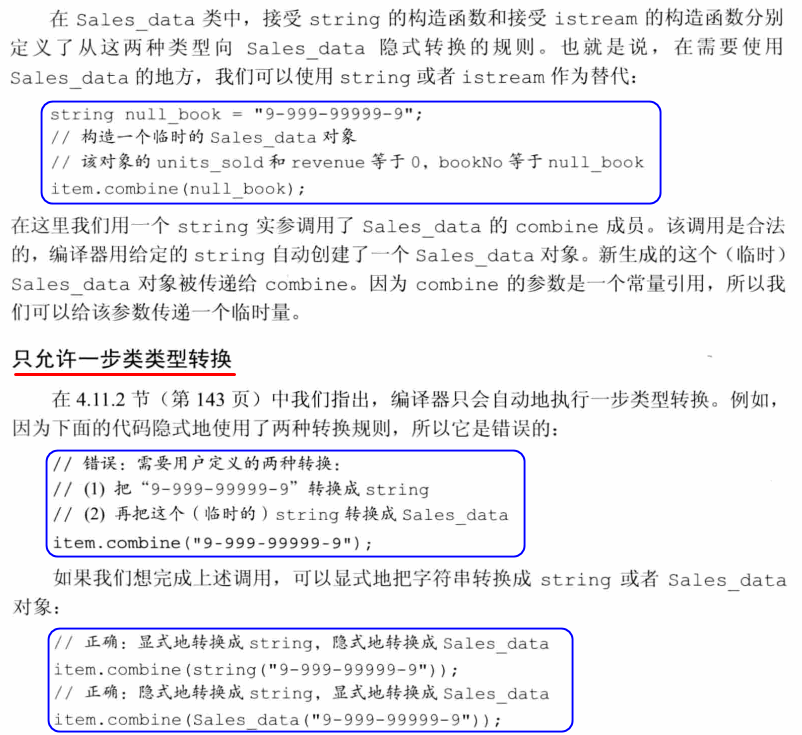

- 在要求隐式转换的程序上下文中，我们可以通过将构造函数声明为`explicit`加以阻止
- 关键字`explicit`**只对一个实参的构造函数有效**。需要多个实参的构造函数不能用于执行隐式转换，所以无须将这些构造函数指定为`explicit`的。**只能在类内声明构造函数时使用**`explicit`关键字，在类外部定义时不应重复。
- 当我们用`explicit`关键字声明构造函数时，它将**只能以直接初始化的形式使用**。而且，编译器将不会在自动转换过程中使用该构造函数。

#### Exercise
- e7.47
  > 具体情况具体分析。优点：抑制隐式转换；只能用于直接初始化。缺点: 只能在接受一个单参数的构造函数上使用。
- e7.48
  > 两者都工作正常。两者都是直接用于**直接初始化**
- e7.49
  ```c++
    #include "t7-49a.h"

    int main() {
        std::string s("9-999-99999-9");
        std::cout << "1" << std::endl;
        Sales_data i;
        std::cout << "2" << std::endl;
        i.combine(s);
    }
  ```
  > (a) Sales_data &combine(Sales_data); //OK  
  ```
    dongkesi@DESKTOP-CL29DN1:/mnt/d/workspace/github/C++-Primer/ch07$ ./a
    1
    Sales_data::Sales_data(std::__cxx11::string, unsigned int, double)
    Sales_data::Sales_data()
    2
    Sales_data::Sales_data(std::__cxx11::string, unsigned int, double)
    Sales_data::Sales_data(std::__cxx11::string)
  ```
  > (b) Sales_data &combine(Sales_data&); //Failed  
  ```
    In file included from t7-49.cc:1:0:
    t7-49b.h: In function ‘Sales_data add(const Sales_data&, const Sales_data&)’:
    t7-49b.h:64:17: error: binding reference of type ‘Sales_data&’ to ‘const Sales_data’
    discards qualifiers
        sum.combine(rhs);
                    ^~~
    t7-49b.h:43:13: note:   initializing argument 1 of ‘Sales_data& Sales_data::combine(Sales_data&)’
    Sales_data& Sales_data::combine(Sales_data &rhs) {
                ^~~~~~~~~~
    t7-49.cc: In function ‘int main()’:
    t7-49.cc:8:16: error: cannot bind non-const lvalue reference of type ‘Sales_data&’ to an rvalue of type ‘Sales_data’
        i.combine(s);
                    ^
    In file included from t7-49.cc:1:0:
    t7-49b.h:24:5: note:   after user-defined conversion: Sales_data::Sales_data(std::__cxx11::string)
        Sales_data(std::string s) : Sales_data(s, 0, 0) {
        ^~~~~~~~~~
    t7-49b.h:43:13: note:   initializing argument 1 of ‘Sales_data& Sales_data::combine(Sales_data&)’
    Sales_data& Sales_data::combine(Sales_data &rhs) {
                ^~~~~~~~~~
  ```
  > (c) Sales_data &combine(const Sales_data&) const; //Failed  
  ```
    In file included from t7-49.cc:1:0:
    t7-49c.h: In member function ‘Sales_data& Sales_data::combine(const Sales_data&) const’:
    t7-49c.h:44:23: error: assignment of member ‘Sales_data::units_sold’ in read-only object
        units_sold += rhs.units_sold;
                        ^~~~~~~~~~
    t7-49c.h:45:20: error: assignment of member ‘Sales_data::revenue’ in read-only object     revenue += rhs.revenue;
                        ^~~~~~~
    t7-49c.h:46:12: error: binding reference of type ‘Sales_data&’ to ‘const Sales_data’
    discards qualifiers
        return *this;
                ^~~~~
  ```
- e7.50
  ```c++
    #ifndef _PERSON_H_
    #define _PERSON_H_
    #include <string>
    #include <iostream>
    using std::istream;
    using std::ostream;

    class Person {
    friend istream& read(istream &is, Person &item);
    friend ostream& print(ostream &os, const Person &item);
    public:
        Person() = default;
        Person(const std::string &name, const std::string &address) : name(name), address(address){ }
        // 是否需要隐式转换依赖于用户的看法。
        explicit Person(istream &is) { read(is, *this); }
        std::string get_name() const { return name; }
        std::string get_address() const { return address; }
    private:
        std::string name;
        std::string address;
    };

    istream& read(istream &is, Person &item) {
        is >> item.name >> item.address;
        return is;
    }

    ostream& print(ostream &os, const Person &item) {
        os << item.name << " " << item.address;
        return os;
    }

    #endif
  ```
- e7.51

    [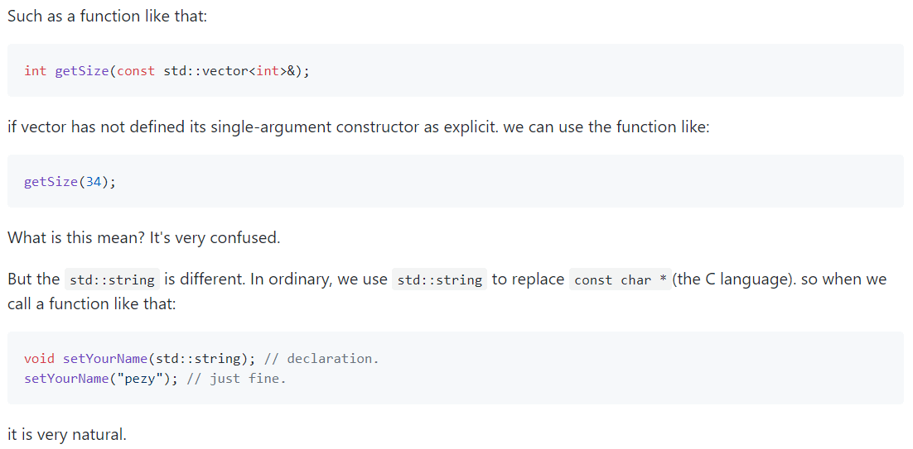](https://github.com/Mooophy/Cpp-Primer/blob/362deb8caddc6f243f7c8ecc6d98f04a28bbbd20/ch07/README.md)

### 7.5.5 聚合类
- 聚合类（aggregate class）使得用户可以直接访问其成员，并且具有特殊的初始化语法形式。
- 当一个类满足如下条件时，说它是聚合的
  - 所有成员都是public的
  - 没有定义任何构造函数
  - 没有类内初始值
  - 没有基类，也没有virtual函数
  ```
  struct Data {
      int ival;
      string s;
  };
  ```
#### Exercise
- e7.52
  ```c++
  //64页提供的代码，这里并不是一个聚合类，因为有类内初始值。不过在GNU编译器下并没有报错，不过按书中定义，应该把下面的初始值去掉。
  struct Sales_data {
      std::string bookNo;
      unsigned units_sold = 0;
      double revenue = 0.0;
  };
  //修改后
  struct Sales_data {
      std::string bookNo;
      unsigned units_sold;
      double revenue;
  }; 
  ```
### 7.5.6 字面值常量类

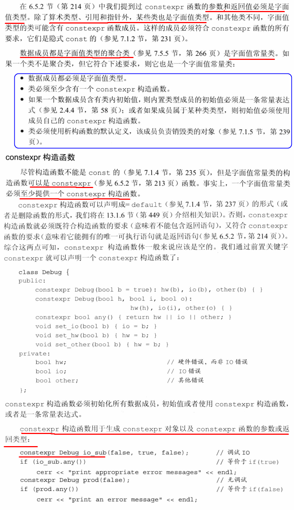

#### Exercise
- e7.53
  ```c++
    class Debug {
    public:
        constexpr Debug(bool b = true) : hw(b), io(b), other(b) { }
        constexpr Debug(bool h, bool i, bool o) : hw(h), io(i), other(o) { }

        constexpr bool any() { return hw || io || other; }
        void set_io(bool b) { io = b; }
        void set_hw(bool b) { hw = b; }
        void set_other(bool b) { other = b; }
    private:
        bool hw;
        bool io;
        bool other;
    };
  ```
- e7.54
  > 不应该，应为改写了内容
- e7.55
  > 不是，string没有constexpr构造函数
## 7.6 类的静态成员
- 静态成员可以是public的或private的。
- 静态数据成员的类型可以是常量、引用、指针、类类型等
- 类的静态成员存在于任何对象之外，对象中不包含任何于静态数据成员有关的数据。
- 静态成员函数不与任何对象绑定在一起，它们不包含this指针。
- 作为结果，静态成员函数不能声明成const，而且我们也不能再static函数体内使用this指针
- 在类的外部定义静态成员时，不能重复static关键字，该关键字只出现在类内部的声明语句。
- 因为**静态成员不属于类的任何一个对象，所以它们并不是在创建类的对象时被定义的**。而且一般来说，我们**不能在类的内部初始化静态成员**。相反，必须在类的外部定义和初始化每个静态成员。
- 静态数据成员一旦被定义，存在于程序的整个生命周期中
- 要想确保对象只定义一次，最好的办法是把静态数据成员的定义与其它非内联函数的定义**放在同一个文件**中。
- 即使一个常量静态数据成员在类内部被初始化了，通常情况下也应该在类的外部定义以下该成员。
- 静态成员可以是不完全类型。可以作为默认实参
- 如果类已经声明而尚未定义，则它是一个**不完全类型**
  
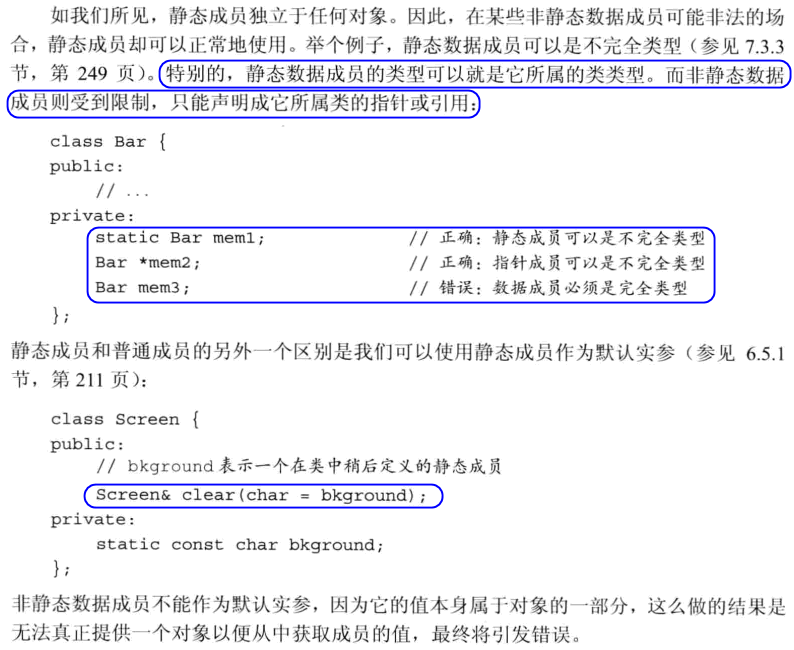

#### Exercise
- e7.56
  > 定义：通过static声明的成员；  
  > 优点：直接与类本身关联。不属于对象，避免重复。  
  > 与普通成员区别：可以是不完全类型；可以作为默认实参
- e7.57
  ```c++
    #include <string>
    #include <vector>

    class Account {
    public:
        void calculate() { amount += amount * interestRate; }
        static double rate() { return interestRate; }
        static void rate(double newRate);

    private:
        std::string owner;
        double amount;
        static double interestRate;
        static constexpr int period = 30;
        double daily_tbl[period];
        static double initRate() { return 0; }
    };


    double Account::interestRate = Account::initRate();
    constexpr int Account::period;

    void Account::rate(double newRate) {
        interestRate = newRate;
    }

    double initRate() {
        return 0;
    }
  ```

  ```c++
    #include "t7-57.h"
    #include <iostream>

    int main() {
        Account ac;
        ac.rate(6.5);
        std::cout << Account::rate() << std::endl;
        std::cout << ac.rate() << std::endl;
    }
  ```
- e7.58
  ```
    In file included from example.cc:1:0:
    // 不能对非const的static data，使用类内初始化
    example.h:5:19: error: ‘constexpr’ needed for in-class initialization of static data
    member ‘double Example::rate’ of non-integral type [-fpermissive]
        static double rate = 6.5;
                    ^~~~
    // 不能指定类内初始化
    example.h:7:31: error: ‘vecSize’ is not a type
        static vector<double> vec(vecSize);
                                ^~~~~~~
    example.h:11:25: error: ‘std::vector<double> Example::vec’ is not a static data member of ‘class Example’
    // 因为上一步的原因，声明出错，所以定义也错
    vector<double> Example::vec;
                            ^~~
  ```

  ```c++
    #include <vector>
    using std::vector;
    class Example {
    public:
        static double rate;
        static const int vecSize = 20;
        static std::vector<double> vec;
    };
  ```

  ```c++
    #include "example.h"
    double Example::rate = 6.5;
    vector<double> Example::vec(vecSize);

    int main() {
    }
  ```