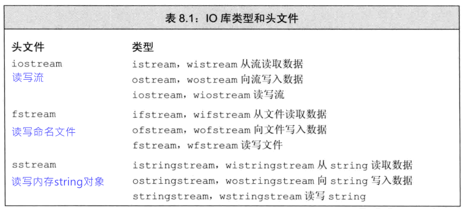
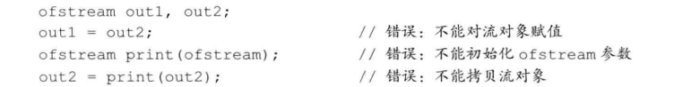
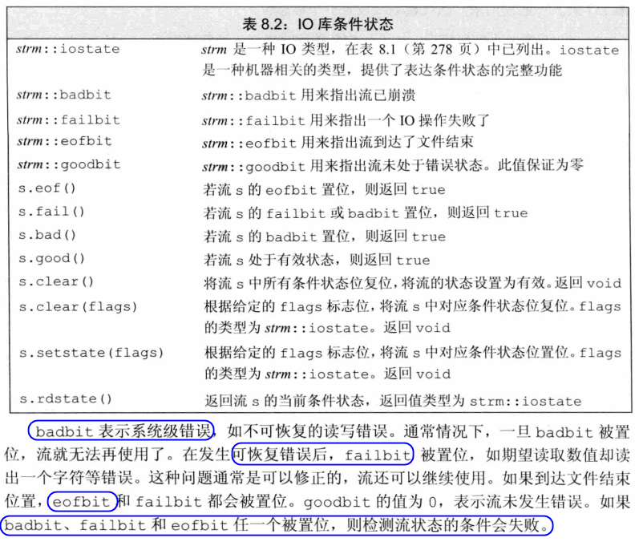
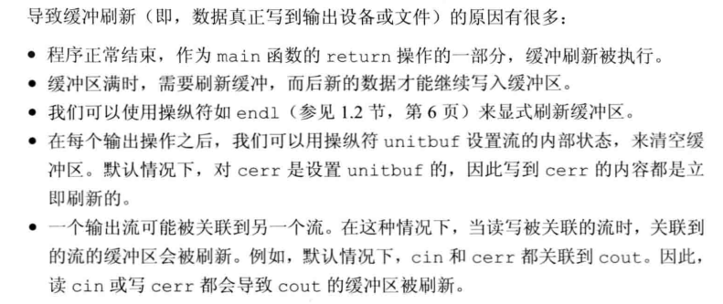
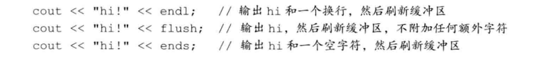
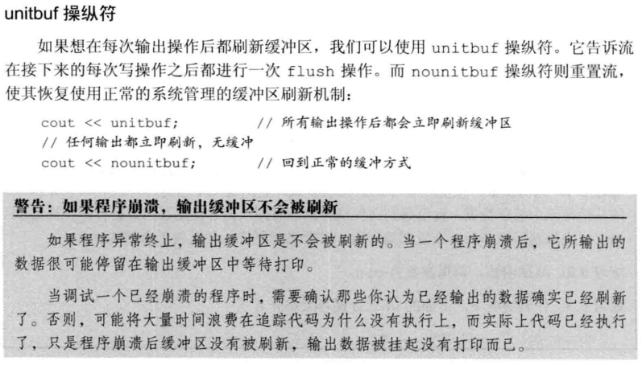
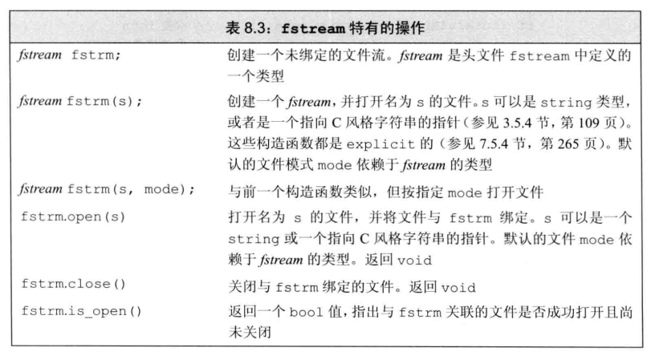
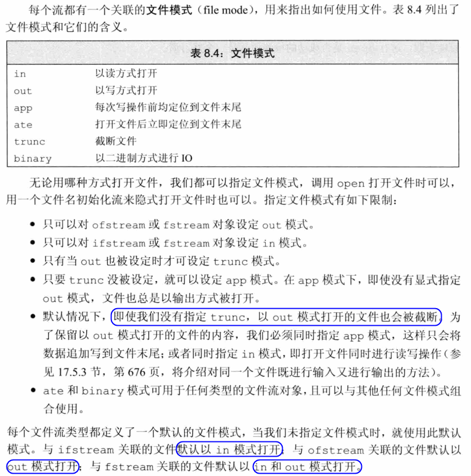
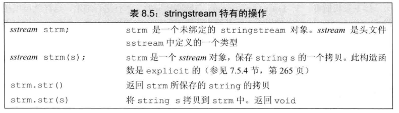

# 8 IO 库
## 8.1 IO类



- 为了支持使用宽字符的语言，标准库定义了一组类型和对象来操作`wchar_t`类型的数据。
  - 宽字符版本的类型和函数名字以一个`w`开始。例如`wcin`，`wcout`，`werr`分别对应`cin`，`cout`，`cerr`的宽字符对象。
  - 宽字符版本的类型和对象与其对应的普通`char`版本的类型定义在同一个头文件中
### 8.1.1 IO对象无拷贝或赋值
- 不能拷贝或对IO对象赋值
- 由于不能拷贝IO对象，因此我们也**不能将形参或返回类型设置为流类型**。进行IO操作的函数通常以**引用方式传递或返回流**。
- 读写一个IO对象会改变其状态，因此传递和返回的引用不能是`const`的



### 8.1.2 条件状态
- IO操作可能发生错误。下面列出了一些函数和标志，可以帮助我们访问和操纵流的条件状态



#### Exercise
- e8.1
  ```c++
  #include <iostream>

  using namespace std;

  istream &fun(istream &is) {
      string input;
      while (is >> input) {
          if (is.eof()) {
              cout << "eof()" << endl;
              break;
          }
          cout << input << endl;
      }
      is.clear();
      return is;
  }

  int main() {
      fun(cin);
  }
  ```
- e8.2
  ```c++
  #include <iostream>

  using namespace std;

  istream &fun(istream &is) {
      string input;
      while (is >> input) {
          if (is.eof()) {
              cout << "eof()" << endl;
              break;
          }
          cout << input << endl;
      }
      is.clear();
      return is;
  }

  int main() {
      istream &is = fun(cin);
      cout << is.rdstate() << endl;
  }
  ```
- e8.3
  > 只要有badbit、failbit、eofbit任一发生，检测流状态的条件会失败。就会停止。
  > badbit: 系统级错误  
  > failbit: 比如读取类型错误  
  > eofbit: 到达文件结束

### 8.1.3 管理输出缓冲



- 刷新缓冲区的操纵符

  

 

- 交互式系统通常应该关联输入流和输出流。意味着所有输出，包括用户提示信息，都会在读操作之前被打印出来。

## 8.2 文件输入输出

 

### 8.2.1 使用文件流对象
- 当一个fstream对象被销毁时，close会自动被调用
- 在接受一个iostream类型引用（或指针）参数的函数，可以用一个对应的fstream（或者sstream）类型来调用。

#### Exercise
- e8.4
  ```c++
  #include <iostream>
  #include <fstream>
  #include <string>
  #include <vector>

  using namespace std;

  int main(int argc, char *argv[]) {
      ifstream input(argv[1]);
      vector<string> svec;
      string line;

      if (!input) {
          cout << "open file error: " << string(argv[1]) <<  endl;
          return -1;
      }
      while(getline(input, line)) {
          svec.push_back(line);
      }
      int i = 0;
      for (auto &s : svec) {
          ++i;
          cout << i << ":\t" << s << endl;
      }

      input.close();
      return 0;
  }
  ```
- e8.5
  ```c++
  #include <iostream>
  #include <fstream>
  #include <string>
  #include <vector>

  using namespace std;

  int main(int argc, char *argv[]) {
      ifstream input(argv[1]);
      vector<string> svec;
      string line;

      if (!input) {
          cout << "open file error: " << string(argv[1]) <<  endl;
          return -1;
      }
      while(input >> line) {
          svec.push_back(line);
      }
      int i = 0;
      for (auto &s : svec) {
          ++i;
          cout << i << ":\t" << s << endl;
      }

      input.close();
      return 0;
  }
  ```
- e8.6
  ```c++
  #include <iostream>
  #include <string>
  #include <fstream>

  using namespace std;

  struct Sales_data {
      std::string bookNo;
      unsigned units_sold = 0;
      double revenue = 0.0;
  };

  int main(int argc, char *argv[])
  {
      Sales_data total; // variable to hold data for the next transaction
      ifstream in(argv[1]);
      if (!in) {
          cout << "Cannot open file: " << string(argv[1]) << endl;
          return -1;
      }

      // read the first transaction and ensure that there are data to process
      if (in >> total.bookNo >> total.units_sold >> total.revenue) {
          Sales_data trans; // variable to hold the running sum
          // read and process the remaining transactions
          while (in >> trans.bookNo >> trans.units_sold >> trans.revenue) {
              // if we're still processing the same book
              if (total.bookNo == trans.bookNo) {
                  total.units_sold += trans.units_sold; // update the running total
                  total.revenue += trans.revenue;
              } else {
                  // print results for the previous book
                  std::cout << total.bookNo << " " << total.units_sold << " "
                            << total.revenue << " " << std::endl;
                  total = trans;  // total now refers to the next book
              }
          }
          std::cout << total.bookNo << " " << total.units_sold << " "
                    << total.revenue << " " << std::endl;
      } else {
          // no input! warn the user
          std::cerr << "No data?!" << std::endl;
          return -1;  // indicate failure
      }

      return 0;
  }
  ```
### 8.2.2 文件模式

 

- 保留被`ofstream`打开的文件中已有数据的唯一方式是显示指定`app`或`in`模式
- 在每次打开文件时，都要设置文件模式，可能是显示设置，也可能是隐式地设置。当程序未指定模式时，就使用默认值

#### Exercise
- e8.7
  ```c++
  #include <iostream>
  #include <string>
  #include <fstream>

  using namespace std;

  struct Sales_data {
      std::string bookNo;
      unsigned units_sold = 0;
      double revenue = 0.0;
  };

  int main(int argc, char *argv[])
  {
      Sales_data total; // variable to hold data for the next transaction
      ifstream in(argv[1]);
      ofstream out(argv[2]);
      if (!in) {
          cout << "Cannot open file: " << string(argv[1]) << endl;
          return -1;
      }

      if (!out) {
          cout << "Cannot open file: " << string(argv[2]) << endl;
          return -1;
      }

      // read the first transaction and ensure that there are data to process
      if (in >> total.bookNo >> total.units_sold >> total.revenue) {
          Sales_data trans; // variable to hold the running sum
          // read and process the remaining transactions
          while (in >> trans.bookNo >> trans.units_sold >> trans.revenue) {
              // if we're still processing the same book
              if (total.bookNo == trans.bookNo) {
                  total.units_sold += trans.units_sold; // update the running total
                  total.revenue += trans.revenue;
              } else {
                  // print results for the previous book
                  out << total.bookNo << " " << total.units_sold << " "
                            << total.revenue << " " << std::endl;
                  total = trans;  // total now refers to the next book
              }
          }
          out << total.bookNo << " " << total.units_sold << " "
                    << total.revenue << " " << std::endl;
      } else {
          // no input! warn the user
          std::cerr << "No data?!" << std::endl;
          return -1;  // indicate failure
      }

      return 0;
  }
  ```
- e8.8
  ```c++
  #include <iostream>
  #include <string>
  #include <fstream>

  using namespace std;

  struct Sales_data {
      std::string bookNo;
      unsigned units_sold = 0;
      double revenue = 0.0;
  };

  int main(int argc, char *argv[])
  {
      Sales_data total; // variable to hold data for the next transaction
      ifstream in(argv[1]);
      ofstream out(argv[2], ofstream::app);
      if (!in) {
          cout << "Cannot open file: " << string(argv[1]) << endl;
          return -1;
      }

      if (!out) {
          cout << "Cannot open file: " << string(argv[2]) << endl;
          return -1;
      }

      // read the first transaction and ensure that there are data to process
      if (in >> total.bookNo >> total.units_sold >> total.revenue) {
          Sales_data trans; // variable to hold the running sum
          // read and process the remaining transactions
          while (in >> trans.bookNo >> trans.units_sold >> trans.revenue) {
              // if we're still processing the same book
              if (total.bookNo == trans.bookNo) {
                  total.units_sold += trans.units_sold; // update the running total
                  total.revenue += trans.revenue;
              } else {
                  // print results for the previous book
                  out << total.bookNo << " " << total.units_sold << " "
                            << total.revenue << " " << std::endl;
                  total = trans;  // total now refers to the next book
              }
          }
          out << total.bookNo << " " << total.units_sold << " "
                    << total.revenue << " " << std::endl;
      } else {
          // no input! warn the user
          std::cerr << "No data?!" << std::endl;
          return -1;  // indicate failure
      }

      return 0;
  }
  ```

## 8.3 string流
- sstream头文件定义了三个类型来支持内存IO，这些类型可以向string写入数据，从string读取数据，就像string是一个IO流一样
- `istringstream`从`string`读取数据，`ostringstrem`向`string`写入数据，而头文件`stringstream`既可从`string`读数据也可向`string`写数据。

 

### 8.3.1 使用istringstream
#### Exercise
- e8.9
  ```c++
  #include <iostream>
  #include <sstream>

  using namespace std;

  istream &fun(istream &is) {
      string input;
      while (is >> input) {
          cout << input << endl;
          if (is.eof()) {
              cout << "eof()" << endl;
              break;
          }
      }
      is.clear();
      return is;
  }

  int main() {
      string input = "abc efg hij kkk";
      istringstream record(input);
      istream &is = fun(record);
      cout << is.rdstate() << endl;
  }
  ```
- e8.10
  ```c++
  #include <iostream>
  #include <sstream>
  #include <fstream>
  #include <vector>
  #include <string>
  using namespace std;

  int main(int argc, char *argv[]) {
      ifstream in(argv[1]);

      if (!in) {
          cout << "Cannot open file: " << string(argv[1]) << endl;
          return -1;
      }

      vector <string> svec;
      string line;
      while (getline(in, line)) {
          svec.push_back(line);
      }

      for (auto s : svec) {
          istringstream record(s);
          string word;
          while (record >> word)
              cout << word << endl;
      }
      return 0;
  }
  ```
- e8.11
  ```
  #include <iostream>
  #include <fstream>
  #include <sstream>
  #include <string>
  #include <vector>

  using namespace std;

  int main() {
      struct PersonInfo {
          string name;
          vector<string> phones;
      };

      string line, word;
      vector<PersonInfo> people;

      istringstream record;
      while (getline(cin, line)) {
          PersonInfo info;
          // 需要加上这一句
          record.clear();
          record.str(line);
          record >> info.name;
          while (record >> word)
              info.phones.push_back(word);
          people.push_back(info);
      }

      for (auto &p : people) {
          cout << p.name << " ";
          for (auto &phone : p.phones) {
              cout << phone << " ";
          }
          cout << endl;
      }
      return 0;
  }
  ```
- e8.12
  > 因为每个人的电话号码数量不同

### 8.3.2 使用ostringstream
#### Exercise
- e8.13
  ```c++
  #include <iostream>
  #include <fstream>
  #include <sstream>
  #include <string>
  #include <vector>

  using namespace std;

  int main(int argc, char *argv[]) {
      struct PersonInfo {
          string name;
          vector<string> phones;
      };

      ifstream in(argv[1]);
      if (!in) {
          cout << "Cannot open file: " << string(argv[1]) << endl;
          return -1;
      }

      string line, word;
      vector<PersonInfo> people;

      istringstream record;
      while (getline(in, line)) {
          PersonInfo info;
          record.clear();
          record.str(line);
          record >> info.name;
          while (record >> word)
              info.phones.push_back(word);
          people.push_back(info);
      }

      for (auto &p : people) {
          cout << p.name << " ";
          for (auto &phone : p.phones) {
              cout << phone << " ";
          }
          cout << endl;
      }
      return 0;
  }
  ```
- e8.14
  > 因为只是输出，没有修改内容，所以是const；引用更有效，一般情况下能用引用就用引用

