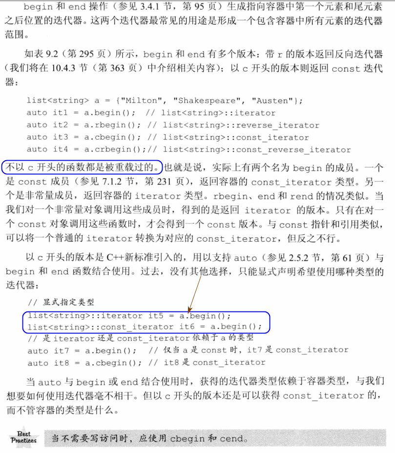
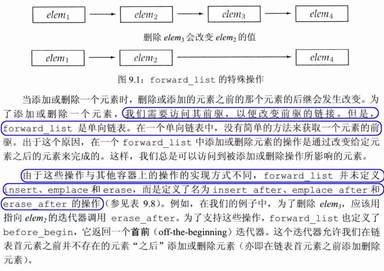

# 9 顺序容器
- 元素在顺序容器中的顺序与其加入容器时的位置相对应。
- 关联容器中的位置由元素相关联的关键字决定
## 9.1 顺序容器概述
- 所有顺序容器都提供了快速顺序访问元素的能力。但是，这些容器在以下方面都提供了不同的性能折中：
  - 向容器添加或从容器删除元素的代价
  - 非顺序访问容器中元素的代价


- 对于顺序容器，通常，使用vector是最好的选择，除非你有很好的理由选择其他容器
- 容器选择基本原则
  
  

#### Exercise
- e9.1
  > (a): list: 会在中间插入数据
  > (b): deque: 适合头尾插入和删除
  > (c): vector: 可以在后面追加，然后重新排序。同时小元素不适合使用list从而造成额外开销

## 9.2 容器库概览
- 容器类型上的操作层次：
  - 某些操作时所有容器类型都提供的
  - 一些操作仅针对顺序容器、关联容器或无序容器
  - 还有一些操作只适用于一小部分操作
- 容器都定义为模板类
- 顺序容器几乎可以保存任意类型的元素，但是某些容器操作对元素类型有其自己的特殊要求。我们可以为不支持特定操作需求的类型定义容器，但是这种情况下只能使用那些没有特殊要求的容器操作了。
  


#### Exercise
- e9.2
  ```c++
  list<deque<int>> l;
  ```
### 9.2.1 迭代器
- 如果一个迭代器提供了某个操作，那么所有提供相同操作的迭代器对这个操作的实现方式都是相同的。
  


- 迭代器范围的概念是标准库的基础
  - 一个迭代器范围是由一对迭代器表示，两个迭代器分别指向同一个容器中的元素或者是尾元素之后的位置。通常称为begin和end或者first和last。
  - last并不是指向最后一个元素，而是尾元素之后的位置。
  - 数学描述为$[begin, end)$，左闭右开区间
  - begin和end必须指向相同的容器。end可以与begin指向相同的位置，但不能指向begin之前的位置


#### Exercise
- e9.3
  
  
- e9.4
  ```c++
  #include <iostream>
  #include <vector>
  using namespace std;

  bool search(vector<int> &ivec, int key) {
      for (auto it = ivec.begin(); it != ivec.end(); ++it) {
          if (*it == key)
              return true;
      }
  }

  int main() {
      vector<int> ivec{0,1,2,3,4,5,6,7,8,9};
      int key = 17;
      cout << search(ivec, key) << endl;
      return 0;
  }
  ```
- e9.5
  ```c++
  #include <iostream>
  #include <vector>
  using namespace std;

  vector<int>::iterator search(vector<int> &ivec, int key) {
      for (auto it = ivec.begin(); it != ivec.end(); ++it) {
          if (*it == key) {
              return it;
          }
      }
      return ivec.end();
  }

  int main() {
      vector<int> ivec{10,1,2,3,4,5,6,7,8,9};
      int key = 7;
      vector<int>::iterator ito = search(ivec, key);
      if (ito == ivec.end())
          cout << "to end()" << endl;
      else
          cout << *ito << endl;
      return 0;
  }
  ```
- e9.6
  ```c++
  #include <list>
  using namespace std;
  int main() {
      list<int> lst1;
      list<int>::iterator iter1 = lst1.begin(), iter2 = lst1.end();
      /*
        t9-6.cc:7:18: error: no match for ‘operator<’ (operand types are ‘std::__cxx11::list<int>::iterator {aka std::_List_iterator<int>}’ and ‘std::__cxx11::list<int>::iterator {aka std::_List_iterator<int>}’)
        while (iter1 < iter2) {
                ~~~~~~^~~~~~~
      */
      //! while (iter1 < iter2) {
      while (iter1 != iter2) {
          ;
      }
  }
  ```
### 9.2.2 容器类型成员
#### Exercise
- e9.7
  > vector<int>::size_type
- e9.8
  > 读取：const list<string>::value_type & 或者 list<string>::const_reference  
  > 写入：list<string>::value_type & 或者 list<string>::reference

  ```c++
  #include <list>
  #include <iostream>
  #include <string>
  using namespace std;

  int main() {
      list<string> lst1{"abc", "efg"};
      list<string>::const_reference ref1 = *lst1.begin();
      const list<string>::value_type &ref2 = *(++lst1.begin());

      cout << ref1 << " " << ref2 << endl;

      list<string>::reference ref3 = *lst1.begin();
      list<string>::value_type &ref4 = *(++lst1.begin());

      cout << ref3 << " " << ref4 << endl;

      ref3 = "abcd";
      ref4 = "efgh";
      cout << ref3 << " " << ref4 << endl;
      cout << *lst1.begin() << " " << *(++lst1.begin()) << endl;

  }
  // out
  dongkesi@DESKTOP-CL29DN1:/mnt/d/workspace/github/C++-Primer/ch09$ ./a.out
  abc efg
  abc efg
  abcd efgh
  abcd efgh
  ```

### 9.2.3 begin和end成员



#### Exercise
- e9.9
  > begin被重载过，当对非常量对象调用begin时，返回的时iterator版本，对const调用begin是const_iterator版本。而cbegin返回类型为const_iterator

- e9.10
  > it1: vector<int>::iterator  
  > it2: vector<int>::const_iterator  
  > it3: vector<int>::const_iterator  
  > it4: vector<int>::const_iterator  

  ```c++
  #include <vector>
  using namespace std;

  int main() {
      vector<int> v1;
      const vector<int> v2;
      /*
      t9-10.cc:7:5: error: inconsistent deduction for ‘auto’: ‘__gnu_cxx::__normal_iterator<int*, std::vector<int> >’ and then ‘__gnu_cxx::__normal_iterator<const int*, std::vector<int> >’
          auto it1 = v1.begin(), it2 = v2.begin();
          ^~~~
      */
      //! auto it1 = v1.begin(), it2 = v2.begin();
      
      auto it1 = v1.begin();
      auto it2 = v2.begin();
      auto it3 = v1.cbegin(), it4 = v2.cbegin();
  }
  ```
### 9.2.4 容器定义和初始化


#### Exercise
- e9.11
  ```c++
  #include <vector>
  #include <string>
  #include <iostream>

  using namespace std;

  void print(const string &name, const vector<int> &ivec) {
      cout << name << ": ";
      for (auto v : ivec) {
          cout << v << " ";
      }
      cout << endl;
  }
  int main() {
      vector<int> v1;
      vector<int> v2(v1);
      vector<int> v3 = v2;
      vector<int> v4{1,2,3,4,5,6};
      vector<int> v5 = {11,12,13,14,15,16};
      vector<int> v6(v5.begin(), v5.end());
      vector<int> v7(6);
      vector<int> v8(6, 2);

      print("v1", v1);
      print("v2", v2);
      print("v3", v3);
      print("v4", v4);
      print("v5", v5);
      print("v6", v6);
      print("v7", v7);
      print("v8", v8);
      return 0;
  }

  //output
  dongkesi@DESKTOP-CL29DN1:/mnt/d/workspace/github/C++-Primer/ch09$ ./a.out
  v1:
  v2:
  v3:
  v4: 1 2 3 4 5 6
  v5: 11 12 13 14 15 16
  v6: 11 12 13 14 15 16
  v7: 0 0 0 0 0 0
  v8: 2 2 2 2 2 2
  ```
- e9.12
  > 接收容器：容器类型和元素类型必须相同  
  > 接收两个迭代器：不要求容器类型也相同，只要拷贝的元素可转换位要初始化的容器元素类型即可
- e9.13
  ```c++
  #include <vector>
  #include <list>
  #include <iostream>
  using namespace std;

  int main() {
      list<int> lst{1,2,3,4,5,6};
      /*
      t9-13.cc:9:29: error: no matching function for call to ‘std::vector<double>::vector(std::__cxx11::list<int>&)’
      vector<double> dvec1(lst);
                              ^
      */
      //! vector<double> dvec1(lst);
      vector<double> dvec2(lst.cbegin(), lst.cend());
      /*
      t9-13.cc:15:28: error: conversion from ‘std::__cxx11::list<int>’ to non-scalar type
      std::vector<double>’ requested
        vector<double> dvec3 = lst;
                              ^~~
      */

      //! vector<double> dvec3 = lst;

      vector<int> ivec{1,2,3,4,5,6};
      /*
      t9-13.cc:25:31: error: no matching function for call to ‘std::vector<double>::vector(std::vector<int>&)’
      vector<double> dvec11(ivec);
                                ^
      */
      //! vector<double> dvec11(ivec);
      vector<double> devc12(ivec.cbegin(), ivec.cend());

      /*
      t9-13.cc:32:29: error: conversion from ‘std::vector<int>’ to non-scalar type ‘std::vector<double>’ requested
      vector<double> devc13 = ivec;
                              ^~~~
      */
      //! vector<double> devc13 = ivec;
  }
  ```
### 9.2.5 赋值和swap


- 赋值运算符要求左边和右边的运算对象**具有相同的类型**。它将右边运算对象中所有元素拷贝到左边运算对象中。
- 顺序容器（arrary除外）定义了一个名为`assign`的成员，允许我们从一个不同但相容的类型赋值，或者从容器的一个子序列赋值。
- 注意由于旧元素被替换，传递给`assign`的迭代器不能指向调用`assign`的容器
- 除`array`外，`swap`不对任何元素进行拷贝、删除或者插入操作，因此可以保证在常熟时间内完成。
- `swap`只是交换了两个容器的内部数据结构，元素本身并未交换
  


#### Exercise
- e9.14
  ```c++
  #include <list>
  #include <string>
  #include <vector>
  #include <iostream>
  using namespace std;

  int main() {
      list<const char *> lst{"111", "222", "333"};
      vector<string> svec;

      svec.assign(lst.cbegin(), lst.cend());
      for (const auto &s : svec) {
          cout << s << " ";
      }
      cout << endl;
      return 0;
  }
  ```
### 9.2.6 容器大小操作


### 9.2.7 关系运算符


#### Exercise
- e9.15
  ```c++
  #include <vector>
  #include <iostream>
  using namespace std;

  int main() {
      vector<int> v1 = {1,3,5,7,9,12};
      vector<int> v2 = {1,3,9};
      vector<int> v3 = {1,3,5,7};
      vector<int> v4 = {1,3,5,7,9,12};

      cout << (v1 < v2) << endl;
      cout << (v1 < v3) << endl;
      cout << (v1 == v4) << endl;
      cout << (v1 == v2) << endl;
  }
  //output
  dongkesi@DESKTOP-CL29DN1:/mnt/d/workspace/github/C++-Primer/ch09$ ./a.out
  1
  0
  1
  0
  ```
- e9.16
  ```c++
  #include <vector>
  #include <list>
  #include <iostream>
  using namespace std;

  int main() {
      list<int> l1 = {1,3,5,7,9,12};
      vector<int> v2 = {1,3,9};
      vector<int> v3 = {1,3,5,7};
      vector<int> v4 = {1,3,5,7,9,12};

      cout << (vector<int>(l1.begin(), l1.end()) < v2) << endl;
      cout << (vector<int>(l1.begin(), l1.end()) < v3) << endl;
      cout << (vector<int>(l1.begin(), l1.end()) == v4) << endl;
      cout << (vector<int>(l1.begin(), l1.end()) == v2) << endl;
  }
  // output
  dongkesi@DESKTOP-CL29DN1:/mnt/d/workspace/github/C++-Primer/ch09$ ./a.out
  1
  0
  1
  0
  ```
- e9.17
  > 首先不能是无序关联容器，其次左右两边必须是相同类型的容器，且必须保存相同类型的元素，最后只有当其元素也定义了相应的比较运算符时，才可以使用关系运算符

## 9.3 顺序容器操作
- 顺序容器和关联容器的不同之处在于两者组织元素的方式。这些不同之处直接关系到元素如何存储、访问、添加以及删除。
### 9.3.1 向顺序容器添加元素


- 除了`array`和`forward_list`之外，每个顺序容器都支持`push_back`
  


- `list`、`forward_list`和`deque`容器支持`push_front`
- insert函数接受一个迭代器作为第一个参数。由于迭代器可能指向容器尾部之后不存在的元素的位置，而且在容器开始位置插入元素是很有用的功能，所以insert函数将元素插入迭代器所指定的位置之前。
- 将元素插入到`vector`，`deque`，`string`中的任何位置都是合法的，但是可能很耗时


#### Exercise
- e9.18
  ```c++
  #include <string>
  #include <deque>
  #include <iostream>

  using namespace std;

  int main() {
      string word;
      deque<string> sd;

      while (cin >> word)
          sd.push_back(word);

      for (const auto &s : sd) {
          cout << s << " ";
      }
      cout << endl;
      return 0;
  }
  ```
- e9.19
  > 除了提换为list，什么都不需要修改
  ```c++
  #include <string>
  #include <list>
  #include <iostream>

  using namespace std;

  int main() {
      string word;
      list<string> sd;

      while (cin >> word)
          sd.push_back(word);

      for (const auto &s : sd) {
          cout << s << " ";
      }
      cout << endl;
      return 0;
  }
  ```
- e9.20
  ```c++
  #include <iostream>
  #include <string>
  #include <list>
  #include <deque>
  using namespace std;

  int main() {
      list<int> lst{1,2,3,4,5,6,6,7,8,8,9,10,11,12,13,14,99};
      deque<int> odd, even;
      cout << "list size " << lst.size() << endl;
      for (const auto &e : lst) {
          if (e & 1) {
              odd.push_back(e);
          } else {
              even.push_back(e);
          }
      }

      cout << "odd size " << odd.size() << ": ";
      for (const auto &e : odd)
          cout << e << " ";
      cout << endl;

      cout << "even size " << even.size() << ": ";
      for (const auto &e : even)
          cout << e << " ";
      cout << endl;

      return 0;
  }
  ```
- e9.21
  > 会在vector的头部不断追加数据，每追加一次都会迫使后面的所有元素都移动一次，效率非常低。其它和list工作时类似的。iter初始化为v.begin().第一次调用insert会将刚读入的string插入到iter所指向元素之前的位置。insert返回的迭代器恰好指向这个新元素，然后将这个返回值赋值给iter并重复循环，读取下一个词。。。。
- e9.22
  > 向一个vector、string或deque插入元素会使所有指向容器的迭代器、引用和指针失效。另外该程序并没有更改iter值，所以iter可能在某个随机的时间点，等于mid而退出循环

  ```c++
  #include <iostream>
  #include <vector>

  using namespace std;

  void insert(std::vector<int>& iv, int some_val)
  {
      vector<int>::iterator iter = iv.begin(), mid = iv.begin() + iv.size() / 2;
      while (iter != mid) {
          if (*iter == some_val) {
              // iter在插入后失效，重新赋值指向新插入元素
              iter = iv.insert(iter, 2 * some_val);
              // 所以需要再+1，指向之前的元素
              ++iter;
          }
          // 然后再+1，指向之前元素的下一个位置
          ++iter;
          // 同时mid失效，所以需要重新修改它的位置
          mid = iv.begin() + iv.size() / 2;
      }
  }

  int main()
  {
      std::vector<int> v{ 1, 2, 2, 3, 2, 4, 5, 6, 7, 8 };
      for (auto i : v)
          cout << i << " ";
      cout << endl;

      insert(v, 2);

      for (auto i : v)
          cout << i << " ";
      cout << endl;
  }
  ```
### 9.3.2 访问元素
- 如果容器中没有元素，访问操作的结果是未定义的
- 每个顺序容器有一个`front`成员函数，除了`forward_list`之外的所有顺序容器都有一个`back`成员函数

  


#### Exercise
- e9.23
  > 同一个值
- e9.24
  ```c++
  #include <vector>
  #include <iostream>

  using namespace std;

  int main() {
      vector<int> ivec{1,2,3,4};
      //! vector<int> ivec;
      cout << ivec.at(0) << endl;
      cout << ivec[0] << endl;
      cout << ivec.front() << endl;
      cout << *ivec.begin() << endl;

      ivec.at(1) = 10;
      cout << ivec.at(1) << endl;

      ivec[1] = 100;
      cout << ivec[1] << endl;

      ivec.front() = 1000;
      cout << ivec.front() << endl;

      *ivec.begin() = 10000;
      cout << *ivec.begin() << endl;
  }
  // output
  dongkesi@DESKTOP-CL29DN1:/mnt/d/workspace/github/C++-Primer/ch09$ ./a.out
  1
  1
  1
  1
  10
  100
  1000
  10000
  ```
### 9.3.3 删除元素


#### Exercise
- e9.25
  > 如果相等，则不会删除任何内容，返回值等于elem2；如果elem2为尾后迭代器，返回尾后迭代器。如果都为尾后迭代器，则返回尾后迭代器

  ```c++
  #include <vector>
  #include <iostream>
  using namespace std;
  int main() {
      vector<int> ivec{1,2,3,4,5};
      auto elem1 = ivec.begin() + 1;
      auto elem2 = ivec.end() - 1;
      ivec.erase(elem1, elem2);
      for (auto &i : ivec)
          cout << i << " ";
      cout << endl;

      ivec = {1,2,3,4,5};
      elem1 = ivec.begin() + 1;
      elem2 = ivec.end();
      ivec.erase(elem1, elem2);
      for (auto &i : ivec)
          cout << i << " ";
      cout << endl;

      ivec = {1,2,3,4,5};
      elem1 = ivec.begin() + 1;
      elem2 = ivec.begin() + 1;
      ivec.erase(elem1, elem2);
      for (auto &i : ivec)
          cout << i << " ";
      cout << endl;

      ivec = {1,2,3,4,5};
      elem1 = ivec.end();
      elem2 = ivec.end();
      ivec.erase(elem1, elem2);
      for (auto &i : ivec)
          cout << i << " ";
      cout << endl;
  }
  // output
  dongkesi@DESKTOP-CL29DN1:/mnt/d/workspace/github/C++-Primer/ch09$ ./a.out
  1 5
  1
  1 2 3 4 5
  1 2 3 4 5
  ```
- e9.26
  ```c++
  #include <iostream>
  #include <vector>
  #include <list>
  using namespace std;

  int main() {
      int ia[] = {0, 1, 1, 2, 3, 5, 8, 13, 21, 55, 89};
      vector<int> ivec(cbegin(ia), cend(ia));
      list<int> ilst(cbegin(ia), cend(ia));

      auto it = ivec.begin();
      while (it != ivec.end()) {
          if (*it % 2)
              ++it;
          else
              it = ivec.erase(it);
      }
      for (auto &i : ivec) {
          cout << i << " ";
      }
      cout << endl;

      auto it2 = ilst.begin();
      while (it2 != ilst.end()) {
          if (*it2 % 2)
              it2 = ilst.erase(it2);
          else
              ++it2;
      }
      for (auto &i : ilst) {
          cout << i << " ";
      }
      cout << endl;

      return 0;
  }
  ```
### 9.3.4 特殊的forward_list操作
  



#### Exercise
- e9.27
  ```c++
  #include <forward_list>
  #include <iostream>
  using namespace std;

  int main() {
      forward_list<int> flst = {0,1,2,3,4,5,6,7,8,9};
      forward_list<int>::iterator prev = flst.before_begin();
      forward_list<int>::iterator curr = flst.begin();
      while (curr != flst.end()) {
          if (*curr % 2)
              curr = flst.erase_after(prev);
          else {
              prev = curr;
              ++curr;
          }
      }
      for (auto &e : flst)
          cout << e << " ";
      cout << endl;
  }
  ```
- e9.28
  ```c++
  #include <forward_list>
  #include <string>
  #include <iostream>
  using namespace std;

  forward_list<string> &insert(forward_list<string> &flst, const string &key, const string &val) {
      forward_list<string>::iterator prev = flst.before_begin();
      forward_list<string>::iterator curr = flst.begin();
      while (curr != flst.end()) {
          if (*curr == key) {
              flst.insert_after(curr, val);
              return flst;
          } else {
              prev = curr;
              ++curr;
          }
      }
      flst.insert_after(prev, val);
      return flst;
  }

  int main() {
      forward_list<string> flst = {"aaa", "bbb", "ccc", "ddd"};
      insert(flst, "aaa", "xxx");
      for (auto &e : flst) {
          cout << e << " ";
      }
      cout << endl;

      flst = {"aaa", "bbb", "ccc", "ddd"};
      insert(flst, "eee", "xxx");
      for (auto &e : flst) {
          cout << e << " ";
      }
      cout << endl;

      flst = {};
      insert(flst, "eee", "xxx");
      for (auto &e : flst) {
          cout << e << " ";
      }
      cout << endl;
  }
  ```
### 9.3.5 改变容器大小


#### Exercise
- e9.29
  > 调整为100个元素，并且新元素进行初始化，使用值初始化或者默认构造函数。再调整为10会丢弃90个元素
- e9.30
  > 该类型进行值初始化。如果是类类型，必须提供初始值或者元素类型提供一个默认构造函数

### 9.3.6 容器操作可能使迭代器失效


#### Exercise
- e9.31
  ```c++
  #include <vector>
  #include <forward_list>
  #include <list>
  #include <iostream>
  using namespace std;

  void print(const vector<int> &vi) {
      for (const auto &e : vi)
          cout << e << " ";
      cout << endl;
  }

  void print(const list<int> &li) {
      for (const auto &e : li)
          cout << e << " ";
      cout << endl;
  }

  void print(const forward_list<int> &lsti) {
      for (const auto &e : lsti)
          cout << e << " ";
      cout << endl;
  }

  int main() {
      list<int> li = {0,1,2,3,4,5,6,7,8,9};
      print(li);
      auto iter = li.begin();
      while (iter != li.end()) {
          if (*iter % 2) {
              iter = li.insert(iter, *iter);
              iter++; iter++;
          } else {
              iter = li.erase(iter);
          }
      }
      print(li);
  }
  ```

  ```c++
  #include <vector>
  #include <forward_list>
  #include <list>
  #include <iostream>
  using namespace std;

  void print(const vector<int> &vi) {
      for (const auto &e : vi)
          cout << e << " ";
      cout << endl;
  }

  void print(const list<int> &li) {
      for (const auto &e : li)
          cout << e << " ";
      cout << endl;
  }

  void print(const forward_list<int> &lsti) {
      for (const auto &e : lsti)
          cout << e << " ";
      cout << endl;
  }

  int main() {
      forward_list<int> li = {0,1,2,3,4,5,6,7,8,9};
      print(li);
      auto prev = li.before_begin();
      auto iter = li.begin();
      while (iter != li.end()) {
          if (*iter % 2) {
              iter = li.insert_after(prev, *iter);
              prev = ++iter;
              ++iter;
          } else {
              iter = li.erase_after(prev);
          }
      }
      print(li);
  }
  ```
- e9.32
  > 虽然，看上去得到了正确的答案，但是这个是不合法，因为传入的参数什么时候计算，是未定义的。在我的编译器上，可以通过以下修改得到正确答案。
  ```c++
  iter = vi.insert(iter, *iter++);
  iter += 1;
  ```
- e9.33
  > begin会失效
  ```c++
  #include <vector>
  #include <iostream>

  using namespace std;

  int main() {
      vector<int> v{1,2,3,4,2,5,6};
      for (auto &e : v)
          cout << e << " ";
      cout << endl;

      auto begin = v.begin();
      while (begin != v.end()) {
          cout << "while: " << *begin << endl;
          if (*begin == 2) {
              ++begin;
              begin = v.insert(begin, 42);
              //! v.insert(begin, 42);
              ++begin;
          }
          ++begin;
      }

      for (auto &e : v)
          cout << e << " ";
      cout << endl;
      return 0;
  }
  ```
- e9.34
  > 会无限循环，永远在第一个奇数位置一直插入该值。
  ```c++
  #include <vector>
  #include <iostream>

  using namespace std;

  int main() {
      vector<int> vi{0,1,2,3,4,5};
      auto iter = vi.begin();
      while (iter != vi.end()) {
          cout << *iter << " ";
          if (*iter % 2)
              iter = vi.insert(iter, *iter);
          ++iter;
      }
      cout << endl;
      return 0;
  }
  ```
## 9.4 vector 对象是如何增长的


- 容器的size是指它已经保存的元素的数目；而capacity则是在不分配新的内存空间的前提下它最多可以保存多少元素
- 每个vector实现都可以选择自己的内存分配策略。但是必须遵守的一条原则是：只有当迫不得已时才可以分配新的内存空间。
  
#### Exercise
- e9.35
  > size指已经保存的元素数目，capacity是在不分配新的内存空间的前提下最多可以保存多少元素
- e9.36
  > 不可能
- e9.37
  > list需要时分配，不会影响系统性能。array是固定大小，定义时就分配好了
- e9.38
  ```c++
  #include <vector>
  #include <iostream>
  using namespace std;

  void print(const vector<int> &ivec) {
      cout << " ivec: size: " << ivec.size() << " capacity: " << ivec.capacity() << endl;
  }

  int main() {
      vector<int> ivec;
      print(ivec);

      for (vector<int>::size_type ix = 0; ix != 24; ++ix)
          ivec.push_back(ix);
      print(ivec);

      ivec.reserve(50);
      print(ivec);

      while (ivec.size() != ivec.capacity())
          ivec.push_back(0);
      print(ivec);

      ivec.push_back(42);
      print(ivec);

      ivec.shrink_to_fit();
      print(ivec);

      ivec.push_back(33);
      print(ivec);
      return 0;
  }

  //output
  dongkesi@DESKTOP-CL29DN1:/mnt/d/workspace/github/C++-Primer/ch09$ ./a.out
  ivec: size: 0 capacity: 0
  ivec: size: 24 capacity: 32
  ivec: size: 24 capacity: 50
  ivec: size: 50 capacity: 50
  ivec: size: 51 capacity: 100
  ivec: size: 51 capacity: 51
  ivec: size: 52 capacity: 102
  ```
- e9.39
  > 预留了1024空间，然后调整容器中的元素数目为已输入数目的1.5倍。resize只改变容器中元素的数目，即会改变size大小，但是capacity不一定会改变，除非修改后的size大于capacity。
  ```c++
  #include <vector>
  #include <string>
  #include <iostream>
  using namespace std;

  void print(const vector<string> &svec) {
        cout << " svec: size: " << svec.size() << " capacity: " << svec.capacity() << endl;
  }

  int main() {
      vector<string> svec;
      print(svec);
      svec.reserve(10);
      print(svec);
      string word;
      while (cin >> word)
          svec.push_back(word);
      print(svec);
      svec.resize(svec.size() + svec.size() / 2);
      print(svec);
      return 0;
  }
  // output
  dongkesi@DESKTOP-CL29DN1:/mnt/d/workspace/github/C++-Primer/ch09$ ./a.out
  svec: size: 0 capacity: 0
  svec: size: 0 capacity: 10
  11 22 33 44 55 66 77 88 99 00
  svec: size: 10 capacity: 10
  svec: size: 15 capacity: 20
  ```
- e9.40
  > 读入256，resize之后size是384 capacity是 1024  
  > 读入512，resize之后size是768 capacity是 1024 
  > 读入1000，resize之后size是1500 capacity是 2000
  > 读入1048，resize之后size是 1572 capacity是 2048    

## 9.5 额外的string操作
### 9.5.1 构造string的其它方法


#### Exercise
- e9.41
  ```c++
  #include <vector>
  #include <string>
  #include <iostream>
  using namespace std;
  int main() {
      vector<char> cvec;
      for(char a = 'a'; a != 'z' + 1; ++a)
          cvec.push_back(a);

      string s(cvec.cbegin(), cvec.cend());
      cout << s << endl;
      return 0;
  }
  ```
- e9.42
  > s.reserve(100)

### 9.5.2 改变string的其它方法


#### Exercise
- e9.43
  ```c++
  #include <string>
  #include <iostream>
  using namespace std;
  string &replace(string &s, const string &oldVal, const string &newVal) {
      for (auto iter = s.begin(); iter <= s.end() - oldVal.size(); ) {
          if (oldVal == string{iter, iter + oldVal.size()}) {
              s.erase(iter, iter + oldVal.size());
              iter = s.insert(iter, newVal.cbegin(), newVal.cend());
              iter += newVal.size();
          } else {
              ++iter;
          }
      }
      return s;
  }


  int main() {
      string s{"tho:abc:tho:efh"};
      cout << s << endl;
      replace(s, "tho", "though");
      cout << s << endl;
  }
  ```
- e9.44
  ```c++
  #include <string>
  #include <iostream>

  using namespace std;

  string &replace(string &s, const string &oldVal, const string &newVal) {
      for (string::size_type ix = 0; ix <= s.size() - oldVal.size(); ) {
          if (oldVal == string{s, ix, oldVal.size()}) {
              s.replace(ix, oldVal.size(), newVal);
              ix += newVal.size();
          } else {
              ++ix;
          }
      }

      return s;
  }


  int main() {
      string s{"tho:abc:tho:efh"};
      cout << s << endl;
      replace(s, "tho", "though");
      cout << s << endl;
  }
  ```
- e9.45
  ```c++
  #include <string>
  #include <iostream>
  using namespace std;
  string &fun(string &name, const string &prefix, const string &suffix) {
      name.insert(name.begin(), prefix.begin(), prefix.end());
      name.append(suffix);
      return name;
  }

  int main() {
      string name{"peter"};
      cout << fun(name, "Mr.", "Jr.") << endl;
  }
  ```
- e9.46
  ```c++
  #include <string>
  #include <iostream>
  using namespace std;
  string &fun(string &name, const string &prefix, const string &suffix) {
      name.insert(0, prefix, 0, prefix.size());
      name.insert(name.size(), suffix, 0, suffix.size());
      return name;
  }

  int main() {
      string name{"peter"};
      cout << fun(name, "Mr.", "Jr.") << endl;
  }
  ```
### 9.5.3 string搜索操作


#### Exercise
- e9.47
  ```c++
  #include <iostream>
  #include <string>
  using namespace std;

  int main() {
      string s("ab2c3d7R4E6");
      string numbers("0123456789");
      string chars("abcdefghijklmnopqrstuvwxyzABCDEFGHIJKLMNOPQRSTUVWXYZ");

      string::size_type pos = 0;
      while ((pos = s.find_first_of(numbers, pos)) != string::npos) {
          cout << "found number at index: " << pos << " element is " << s[pos] << endl;
          ++pos;
      }

      pos = 0;
      while ((pos = s.find_first_of(chars, pos)) != string::npos) {
          cout << "found char at index: " << pos << " element is " << s[pos] << endl;
          ++pos;
      }
      return 0;
  }
  ```

  ```c++
  #include <iostream>
  #include <string>
  using namespace std;

  int main() {
      string s("ab2c3d7R4E6");
      string numbers("0123456789");
      string chars("abcdefghijklmnopqrstuvwxyzABCDEFGHIJKLMNOPQRSTUVWXYZ");

      string::size_type pos = 0;
      while ((pos = s.find_first_not_of(chars, pos)) != string::npos) {
          cout << "found number at index: " << pos << " element is " << s[pos] << endl;
          ++pos;
      }

      pos = 0;
      while ((pos = s.find_first_not_of(numbers, pos)) != string::npos) {
          cout << "found char at index: " << pos << " element is " << s[pos] << endl;
          ++pos;
      }
      return 0;
  }
  ```
- e9.48
  > string::npos
- e9.49
  ```c++
  #include <iostream>
  #include <string>
  #include <fstream>
  using namespace std;

  int main(int argc, char *argv[]) {
      ifstream in(argv[1]);

      string filter("bdfghijklpqty");
      string word;
      string::size_type max = 0;
      string max_string;
      while (in >> word) {
          //cout << word << endl;
          if (word.find_first_of(filter) == string::npos) {
              // test word: mmmmoooo
              cout << "tmp string: " << word << " max: " << word.size() << endl;
              max = word.size() > max ? (max_string = word, word.size()) : max;
          } else {
              cout << "filter word: " << word << endl;
          }
      }
      cout << "max string: " << max_string << " max: " << max << endl;
      return 0;
  }
  ```
### 9.5.4 compare 函数


### 9.5.5 数值转换


#### Exercise
- e9.50
  ```c++
  #include <iostream>
  #include <vector>
  #include <string>
  using namespace std;

  int main() {
      vector<string> svec{"100", "200", "333", "150"};
      int sum = 0;
      for (const auto &e : svec) {
          sum += stoi(e);
      }
      cout << sum << endl;
      return 0;
  }
  ```

  ```c++
  #include <iostream>
  #include <vector>
  #include <string>
  using namespace std;

  int main() {
      vector<string> svec{"100.1", "200.2", "333.3", "150.3"};
      double sum = 0;
      for (const auto &e : svec) {
          sum += stod(e);
      }
      cout << sum << endl;
      return 0;
  }
  ```
- e9.51
  ```c++

  ```

## 9.6 容器适配器
  


#### Exercise
- e9.52
  ```c++
  #include <stack>
  #include <iostream>

  using namespace std;

  void express(const string &s) {
      stack<char> stk;
      int cnt = 0;
      for (const auto &e : s) {
          if (e == '(') {
              ++cnt;
              cout << "push: " << e << endl;
              stk.push(e);
          } else if (e == ')') {
              --cnt;
              char c;
              cout << "meet: " << e << " cnt" << cnt <<  endl;
              if (cnt >= 0) {
                  do {
                      c = stk.top();
                      cout << "pop: " << c << endl;
                      stk.pop();
                  } while (c != '(');
              }

          } else {
              cout << "push: " << e << endl;
              stk.push(e);
          }
      }

      while(!stk.empty()) {
          cout << "pop: " << stk.top() << endl;
          stk.pop();
      }
  }

  int main() {
      express("3+4+2-(5*4)+(3-(2+2))");
  }
  ```