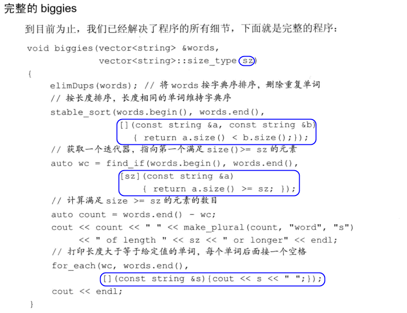

# 10 泛型算法
- 这些算法的大多数独立于任何特定的容器，是通用的。

## 10.1 概述
- 大多数算法都定义在头文件`algorithm`中。标准库还在头文件`numeric`中定义了一组数值泛型算法。
- 这些算法并不直接操作容器，而是遍历由两个迭代器指定的元素范围来进行操作。
- find将范围中的每个元素与给定值进行比较。返回指向第一个等于给定值的元素的**迭代器**。如果**无匹配元素**，则find**返回第二个参数来表示搜索失败**。


#### Exercise
- e10.1
  ```c++
  #include <iostream>
  #include <vector>
  #include <algorithm>

  using namespace std;

  int main() {
      vector<int> ivec{0,1,2,3,4,5,6,7,8,9,2,3,4,5,2,2,3,3};
      auto cnt = count(ivec.cbegin(), ivec.cend(), 3);
      cout << cnt << endl;

      return 0;
  }
  ```
- e10.2
  ```c++
  #include <iostream>
  #include <string>
  #include <algorithm>
  #include <list>

  using namespace std;

  int main() {
      string word;
      list<string> sl;
      while (cin >> word) {
          sl.push_back(word);
      }

      auto cnt = count(sl.cbegin(), sl.cend(), "aa");
      cout << cnt << endl;

      return 0;
  }
  ```

## 10.2 初始泛型算法


- 除少数例外，标准库算法都对一个范围内的元素进行操作。
- 理解算法的最基本的方法就是了解它们是否读取元素、改变元素或是重排元素顺序

### 10.2.1 只读算法
- `accumulate`的第三个参数的类型决定了函数中使用哪个加法运算符以及返回值的类型。这里蕴含着一个编程假定：将元素类型加到和的类型上的操作必须是可行的。即，序列中元素的类型必须与第三个参数匹配，或者能转换为第三个参数的类型。
- 那些只接受一个单一迭代器来表示第二个序列的算法，都**假定第二个序列至少与第一个序列一样长**。

#### Exercise
- e10.3
  ```c++
  #include <iostream>
  #include <vector>
  #include <algorithm>
  #include <numeric>

  using namespace std;

  int main() {
      vector<int> ivec{0,1,2,3,4,5,6,7,8,9};

      auto sum = accumulate(ivec.cbegin(), ivec.cend(), 0);
      cout << sum << endl;

      return 0;
  }
  ```
- e10.4
  > 返回值会是整型而不是double
  ```c++
  #include <iostream>
  #include <vector>
  #include <algorithm>
  #include <numeric>

  using namespace std;

  int main() {
      vector<double> ivec{0,1.5,2,3,4,5,6,7,8,9};

      auto sum1 = accumulate(ivec.cbegin(), ivec.cend(), 0.0);  //output: 45.5
      auto sum2 = accumulate(ivec.cbegin(), ivec.cend(), 0); //output: 45
      cout << sum1 << " " << sum2 << endl;

      return 0;
  }
  ```
- e10.5
  > TODO:: https://github.com/Mooophy/Cpp-Primer/issues/227
  ```c++
  #include <iostream>
  #include <vector>
  #include <string>
  #include <algorithm>

  using namespace std;

  int main() {
      char ca[] = "abcdefgh";
      //char cb[] = "abcdefgh"; // 1
      char cb[] = "abcdefghi"; // 0
      auto outc = equal(cbegin(ca), cend(ca), cbegin(cb));
      cout << outc << endl;
      string sa{"abcdefgh"};
      //string sb{"abcdefgh"}; // 1
      string sb{"abcdefghi"}; // 1
      auto outs = equal(cbegin(sa), cend(sa), cbegin(sb));
      cout << outs << endl;

      vector<const char *> cveca{"aaa", "bbb", "ccc"};
      //vector<const char *> cvecb{"aaa", "bbb", "ccc"}; // 1
      vector<const char *> cvecb{"aaa", "bbb", "ccc", "ddd"}; // 1
      auto outvc = equal(cveca.cbegin(), cveca.cend(), cvecb.cbegin());
      cout << outvc << endl;

      vector<string> sveca{"aaa", "bbb", "ccc"};
      //vector<string> svecb{"aaa", "bbb", "ccc"}; // 1
      vector<string> svecb{"aaa", "bbb", "ccc", "ddd"}; // 1
      auto outvs = equal(sveca.cbegin(), sveca.cend(), svecb.cbegin());
      cout << outvs << endl;

      return 0;
  }
  ```
### 10.2.2 写容器元素的算法


- 向目的位置迭代器写入数据的算法假定目的位置足够大，能容纳要写入的元素
- 一个保证算法有足够元素空间来容纳输出数据的方法是使用插入迭代器

#### Exercise
- e10.6
  ```c++
  #include <iostream>
  #include <vector>
  #include <algorithm>
  #include <iterator>

  using namespace std;

  int main() {
      vector<int> ivec{0,1,2,3,4,5,6};
      for (auto e : ivec)
          cout << e << " ";
      cout << endl;

      fill_n(ivec.begin(), ivec.size(), 0);

      for (auto e : ivec)
          cout << e << " ";
      cout << endl;

      fill_n(back_inserter(ivec), 5, 3);

      for (auto e : ivec)
          cout << e << " ";
      cout << endl;

      return 0;
  }
  ```
- e10.7
  - (a)
  ```c++
  #include <iostream>
  #include <vector>
  #include <list>
  #include <algorithm>
  #include <iterator>

  using namespace std;

  int main() {
      vector<int> vec; list<int> lst; int i;
      while (cin >> i)
          lst.push_back(i);
      copy(lst.cbegin(), lst.cend(), back_inserter(vec));

      for (auto e : vec)
          cout << e << " ";
      cout << endl;

      return 0;
  }
  ```
  - (b)
  ```c++
  #include <iostream>
  #include <vector>
  #include <algorithm>
  #include <iterator>

  using namespace std;

  int main() {
      vector<int> vec;
      vec.reserve(10); // reserver并不改变容器中元素的数量，仅影响vector预先分配多大的内存空间
      cout << vec.size() << " " << vec.capacity() << endl;  // 0 10
      //! fill_n(vec.begin(), 10, 0);
      fill_n(back_inserter(vec), 10, 0);
      for (auto e : vec)
          cout << e << " ";
      cout << endl;

      return 0;
  }
  ```
- e10.8

  

### 10.2.3 重排容器元素的算法
#### Exercise
- e10.9
  ```c++
  #include <iostream>
  #include <vector>
  #include <string>
  #include <algorithm>

  using namespace std;

  void elimDups(vector<string> &words) {
      sort(words.begin(), words.end());
      auto end_unique = unique(words.begin(), words.end());
      words.erase(end_unique, words.end());
  }

  int main() {
      string word;
      vector<string> words;
      while (cin >> word) {
          words.push_back(word);
      }

      for (auto e : words) {
          cout << e << " ";
      }
      cout << endl;

      elimDups(words);

      for (auto e : words) {
          cout << e << " ";
      }
      cout << endl;

      return 0;
  }
  ```
- e10.10
  > 第一是为了保证隔离性，通过迭代器删除增加元素。而算法保证独立性。另外标准库算法对迭代器而不是容器进行操作。因此，算法不能直接添加或删除元素

## 10.3 定制操作
- sort算法默认使用元素类型的`<`运算符
- 很多算法都会比较输入序列中的元素。默认情况下，这类算法使用元素类型的`<`或`==`运算符完成比较

### 10.3.1 向算法传递函数


#### Exercise
- e10.11
  ```
  #include <iostream>
  #include <vector>
  #include <string>
  #include <algorithm>

  using namespace std;

  bool isShorter(const string &s1, const string &s2) {
      return s1.size() < s2.size();
  }

  void elimDups(vector<string> &words) {
      sort(words.begin(), words.end());
      auto end_unique = unique(words.begin(), words.end());
      words.erase(end_unique, words.end());
  }

  int main() {
      string word;
      vector<string> words;
      while (cin >> word) {
          words.push_back(word);
      }

      for (auto e : words) {
          cout << e << " ";
      }
      cout << endl;

      elimDups(words);

      for (auto e : words) {
          cout << e << " ";
      }
      cout << endl;

      stable_sort(words.begin(), words.end(), isShorter);

      for (auto e : words) {
          cout << e << " ";
      }
      cout << endl;

      return 0;
  }
  //output
  dongkesi@DESKTOP-CL29DN1:/mnt/d/workspace/github/C++-Primer/ch10$ ./a.out
  fox red the over slow jumps quick turtle red the
  fox red the over slow jumps quick turtle red the
  fox jumps over quick red slow the turtle
  fox red the over slow jumps quick turtle
  ```
- e10.12
  ```c++
  #include "t10-12.h"
  #include <vector>
  #include <iostream>
  #include <algorithm>

  using namespace std;

  bool isSmall(const Sales_data &s1, const Sales_data &s2) {
      return s1.isbn() < s2.isbn();
  }

  void compareIsbn(vector<Sales_data> &books) {
      sort(books.begin(), books.end(), isSmall);
  }

  int main() {
      vector<Sales_data> books = {{"0-201-78345-1", 3, 20.00}, {"0-201-78345-9", 3, 20.00}, {"0-201-78345-2", 3, 20.00}, {"0-201-78345-0", 3, 20.00}};
      for (auto &item : books)
          print(cout, item) << " ";
      cout << endl;

      compareIsbn(books);
      for (auto &item : books)
          print(cout, item) << " ";
      cout << endl;
  }
  ```

  ```c++
  #ifndef SALES_DATA_H
  #define SALES_DATA_H

  #include <string>
  #include <iostream>
  using std::istream;
  using std::ostream;

  class Sales_data {
  friend Sales_data add(const Sales_data &lhs, const Sales_data &rhs);
  friend istream& read(istream &is, Sales_data &item);
  friend ostream& print(ostream &os, const Sales_data &item);

  public:
      Sales_data(std::string s, unsigned cnt, double price) :
          bookNo(s), units_sold(cnt), revenue(cnt * price) {
          std::cout << __PRETTY_FUNCTION__ << std::endl;
      }

      Sales_data() : Sales_data("", 0, 0) {
          std::cout << __PRETTY_FUNCTION__ << std::endl;
      }

      Sales_data(std::string s) : Sales_data(s, 0, 0) {
          std::cout << __PRETTY_FUNCTION__ << std::endl;
      }

      Sales_data(std::istream &is) : Sales_data() {
          std::cout << __PRETTY_FUNCTION__ << std::endl;
          read(is, *this);
      }

      Sales_data& combine(const Sales_data &rhs);
      std::string isbn() const { return bookNo; }

  private:
      double avg_price() const;
      std::string bookNo;
      unsigned units_sold = 0;
      double revenue = 0.0;
  };

  Sales_data& Sales_data::combine(const Sales_data &rhs) {
      units_sold += rhs.units_sold;
      revenue += rhs.revenue;
      return *this;
  }

  istream& read(istream &is, Sales_data &item) {
      double price = 0;
      is >> item.bookNo >> item.units_sold >> price;
      item.revenue = price * item.units_sold;
      return is;
  }

  ostream& print(ostream &os, const Sales_data &item) {
      os << item.isbn() << " " << item.units_sold << " "
          << item.revenue;// << " " << item.avg_price();
      return os;
  }

  Sales_data add(const Sales_data &lhs, const Sales_data &rhs) {
      Sales_data sum = lhs;
      sum.combine(rhs);
      return sum;
  }

  inline double Sales_data::avg_price() const
  {
      if (units_sold)
          return revenue/units_sold;
      else
          return 0;
  }

  #endif
  ```
- e10.13
  ```c++
  #include <iostream>
  #include <vector>
  #include <string>
  #include <algorithm>

  using namespace std;

  bool isShorter5(const string &s) {
      return s.size() < 5;
  }


  int main() {
      vector<string> svec{"aa", "ccc", "bbb", "bbbb", "eeeeee", "ffff", "gggggg", "hhhhh"};

      auto send = partition(svec.begin(), svec.end(), isShorter5);
      for (auto it = svec.begin(); it != svec.end(); ++it)
          cout << *it << " ";
      cout << endl;

      for (auto it = send; it != svec.end(); ++it)
          cout << *it << " ";
      cout << endl;


      return 0;
  }
  ```
### 10.3.2 lambda 表达式
- 可调用对象：
  - 函数
  - 函数指针
  - 重载了调用运算符的类
  - lambda表达式


  


#### Exercise
- e10.14
  ```c++
  #include <iostream>
  using namespace std;

  int main() {
      auto f = [](int a, int b) -> int {return a + b; };
      cout << f(3, 5) << endl;
      return 0;
  }
  ```
- e10.15
  ```c++
  #include <iostream>
  using namespace std;

  int main() {
      int i = 20;
      // auto f = [i](int a) -> int {return a + i; };
      auto f = [i](int a) {return a + i; };
      cout << f(3) << endl;
      return 0;
  }
  ```
- e10.16
  ```c++
  #include <iostream>
  #include <vector>
  #include <string>
  #include <algorithm>

  using namespace std;

  bool isShorter(const string &s1, const string &s2) {
      return s1.size() < s2.size();
  }

  void elimDups(vector<string> &words) {
      sort(words.begin(), words.end());
      auto end_unique = unique(words.begin(), words.end());
      words.erase(end_unique, words.end());
  }

  string make_plural(int count, const string &s1, const string &s2) {
      return count > 1 ? s1 + s2 : s1;
  }

  void biggies(vector<string> &words, vector<string>::size_type sz) {
      elimDups(words);
      stable_sort(words.begin(), words.end(), [](const string &s1, const string
  &s2) -> bool {return s1.size() < s2.size(); });

      auto wc = find_if(words.begin(), words.end(), [sz](const string &s) -> bool {return s.size() >= sz; });

      auto count = words.end() - wc;
      cout << count << " " << make_plural(count, "word", "s") << " of length" << sz << " or longer" << endl;

      for_each(wc, words.end(), [](const string &s) -> void { cout << s << " ";});
      cout << endl;
  }

  int main() {
      string word;
      vector<string> words;
      while (cin >> word) {
          words.push_back(word);
      }

      for (auto e : words) {
          cout << e << " ";
      }
      cout << endl;

      biggies(words, 5);

      return 0;
  }
  ```
- e10.17
  ```c++
  #include "t10-12.h"
  #include <vector>
  #include <iostream>
  #include <algorithm>

  using namespace std;

  bool isSmall(const Sales_data &s1, const Sales_data &s2) {
      return s1.isbn() < s2.isbn();
  }

  void compareIsbn(vector<Sales_data> &books) {
      sort(books.begin(), books.end(), [](const Sales_data &s1, const Sales_data &s2) -> bool {return s1.isbn() < s2.isbn(); });
  }

  int main() {
      vector<Sales_data> books = {{"0-201-78345-1", 3, 20.00}, {"0-201-78345-9", 3, 20.00}, {"0-201-78345-2", 3, 20.00}, {"0-201-78345-0", 3, 20.00}};
      for (auto &item : books)
          print(cout, item) << " ";
      cout << endl;

      compareIsbn(books);
      for (auto &item : books)
          print(cout, item) << " ";
      cout << endl;
  }
  ```
- e10.18
  ```c++
  #include <iostream>
  #include <vector>
  #include <string>
  #include <algorithm>

  using namespace std;

  bool isShorter(const string &s1, const string &s2) {
      return s1.size() < s2.size();
  }

  void elimDups(vector<string> &words) {
      sort(words.begin(), words.end());
      auto end_unique = unique(words.begin(), words.end());
      words.erase(end_unique, words.end());
  }

  string make_plural(int count, const string &s1, const string &s2) {
      return count > 1 ? s1 + s2 : s1;
  }

  void biggies(vector<string> &words, vector<string>::size_type sz) {
      elimDups(words);
      stable_sort(words.begin(), words.end(), [](const string &s1, const string
  &s2) -> bool {return s1.size() < s2.size(); });

      auto wc = partition(words.begin(), words.end(), [sz](const string &s){return s.size() < sz; });
  /*
      auto wc = find_if(words.begin(), words.end(), [sz](const string &s) -> bool {return s.size() >= sz; });
  */
      auto count = words.end() - wc;
      cout << count << " " << make_plural(count, "word", "s") << " of length" << sz << " or longer" << endl;

      for_each(wc, words.end(), [](const string &s) -> void { cout << s << " ";});
      cout << endl;
  }

  int main() {
      string word;
      vector<string> words;
      while (cin >> word) {
          words.push_back(word);
      }

      for (auto e : words) {
          cout << e << " ";
      }
      cout << endl;

      biggies(words, 5);

      return 0;
  }
  ```
- e10.19
  ```c++
  #include <iostream>
  #include <vector>
  #include <string>
  #include <algorithm>

  using namespace std;

  bool isShorter(const string &s1, const string &s2) {
      return s1.size() < s2.size();
  }

  void elimDups(vector<string> &words) {
      sort(words.begin(), words.end());
      auto end_unique = unique(words.begin(), words.end());
      words.erase(end_unique, words.end());
  }

  string make_plural(int count, const string &s1, const string &s2) {
      return count > 1 ? s1 + s2 : s1;
  }

  void biggies(vector<string> &words, vector<string>::size_type sz) {
      elimDups(words);
      stable_sort(words.begin(), words.end(), [](const string &s1, const string
  &s2) -> bool {return s1.size() < s2.size(); });

      auto wc = stable_partition(words.begin(), words.end(), [sz](const string &s){return s.size() < sz; });
  /*
      auto wc = find_if(words.begin(), words.end(), [sz](const string &s) -> bool {return s.size() >= sz; });
  */
      auto count = words.end() - wc;
      cout << count << " " << make_plural(count, "word", "s") << " of length" << sz << " or longer" << endl;

      for_each(wc, words.end(), [](const string &s) -> void { cout << s << " ";});
      cout << endl;
  }

  int main() {
      string word;
      vector<string> words;
      while (cin >> word) {
          words.push_back(word);
      }

      for (auto e : words) {
          cout << e << " ";
      }
      cout << endl;

      biggies(words, 5);

      return 0;
  }
  ```
### 10.3.3 lambda捕获和返回
- 当定义一个lambda时，编译器生成一个与lambda对应的**新的（未命名的）类类型**。
- 目前，可以这样理解，当向一个函数传递一个lambda时，**同时定义了一个新类型和该类型的一个对象**。
  - 传递的参数（函数）就是次编译器生成的类类型的**未命名对象**。
  - 当使用auto定义一个用lambda初始化变量时，定义了一个lambda生成的类型的**对象**。
- 默认情况下，从lambda生成的类都包含一个对应该lambda所捕获的变量的**数据成员**。**类似任何普通类的数据成员**，lambda的数据成员也在lambda对象创建时被初始化。
- 类似参数传递，变量的捕获方式可以是值或引用
  - 采用值捕获的前提是变量可以拷贝。与参数不同，被捕获的变量的值在lambda创建时拷贝，而不是调用时拷贝

  
  
  - 一个以引用方式捕获的变量与其他任何类型的引用的行为类似。当我们在lambda函数体内使用此变量时，实际上使用的是引用所绑定的对象

  

- 当以引用方式捕获一个变量时，必须保证在lambda执行时变量时存在的

  


- 如果**函数体只是一个return语句**，则返回类型从返回的表达式的类型推断而来。否则，返回类型为void。如果不是单条return语句，而需要返回类型的，需注明返回类型，编译器推断不出来。

#### Exercise
- e10.20
  ```c++
  #include <iostream>
  #include <vector>
  #include <string>
  #include <algorithm>

  using namespace std;

  bool isShorter(const string &s1, const string &s2) {
      return s1.size() < s2.size();
  }

  void elimDups(vector<string> &words) {
      sort(words.begin(), words.end());
      auto end_unique = unique(words.begin(), words.end());
      words.erase(end_unique, words.end());
  }

  string make_plural(int count, const string &s1, const string &s2) {
      return count > 1 ? s1 + s2 : s1;
  }

  void biggies(vector<string> &words, vector<string>::size_type sz) {
      elimDups(words);
      stable_sort(words.begin(), words.end(), [](const string &s1, const string
  &s2) -> bool {return s1.size() < s2.size(); });

      auto wc = count_if(words.begin(), words.end(), [sz](const string &s) -> bool {return s.size() >= sz; });

      cout << wc << endl;
  }

  int main() {
      string word;
      vector<string> words;
      while (cin >> word) {
          words.push_back(word);
      }

      for (auto e : words) {
          cout << e << " ";
      }
      cout << endl;

      biggies(words, 6);

      return 0;
  }
  ```
- e10.21
  ```c++
  #include <iostream>
  using namespace std;

  int main() {
      int i = 10;
      auto f = [&i] ()  -> bool {
          if (i > 0) --i;
          return i == 0;
      };

      while (!f()) {
          cout << i << " ";
      }
      cout << i << endl;
  }
  ```
### 10.3.4 参数绑定
- 对于那种只在一两个地方使用的简单操作，lambda表达式是最有用的。如果我们需要在很多地方使用相同的操作，通常应该定一个函数，而不是多次编写相同的lambda表达式。
- 如果一个操作需要很多语句才能完成，通常使用函数更好
- 如果lambda的捕获列表为空，通常可以用函数来代替它。
- 使用bind函数代替有参数列表的lambda
  ```
  auto newCallable = bind(callable, arg_list);
  ```
  - arg_list的参数包含形如`_n`的名字，其中`n`是一个整数。这些参数是“占位符”，表示`newCallable`的参数，它们占据了传递给`newCallable`的参数的“位置”。数值`n`表示生成的可调用对象中参数的位置：`_1`为`newCallable`的第一个参数，`_2`为第二个参数，依次类推
  ```c++
  auto g = bind(f, a, b, _2, c, _l); // 参数位置可以互换
  g(_l, _2); -> f(a, b, _2, c, _l)
  
  // 按单词长度由短至长排序
  sort(words.begin(), words.end(), isShorter);
  // 按单词长度由长至短排序
  sort (words.begin(), words.end(), bind(isShorter, _2, _l));
  ```
- 绑定引用参数需要使用`ref`或`cref`函数

#### Exercise
- e10.22
  ```c++
  #include <iostream>
  #include <vector>
  #include <string>
  #include <algorithm>
  #include <functional>

  using namespace std;
  using namespace std::placeholders;

  void elimDups(vector<string> &words) {
      sort(words.begin(), words.end());
      auto end_unique = unique(words.begin(), words.end());
      words.erase(end_unique, words.end());
  }

  bool isLonger6(const string &s, vector<string>::size_type sz) {
      return s.size() >= sz;
  }

  void biggies(vector<string> &words, vector<string>::size_type sz) {
      elimDups(words);
      stable_sort(words.begin(), words.end(), [](const string &s1, const string
  &s2) -> bool {return s1.size() < s2.size(); });

      auto wc = count_if(words.begin(), words.end(), bind(isLonger6, _1, sz));

      cout << wc << endl;
  }

  int main() {
      string word;
      vector<string> words;
      while (cin >> word) {
          words.push_back(word);
      }

      for (auto e : words) {
          cout << e << " ";
      }
      cout << endl;

      biggies(words, 6);

      return 0;
  }
  ```
- e10.23
  > 如果一个函数有n个参数，那么bind可接受n+1个参数
- e10.24
  ```c++
  #include <iostream>
  #include <vector>
  #include <algorithm>
  #include <string>
  #include <functional>

  using namespace std;
  using namespace std::placeholders;

  bool check_size(const string &s, int i) {
      return i > s.size();
  }

  int main() {
      vector<int> ivec{1,2,6,3,4,5,6,7};
      string s{"abcd"};
      auto wc = find_if(ivec.cbegin(), ivec.cend(), bind(check_size, cref(s), _1));
      cout << *wc << endl;

      return 0;
  }
  ```
- e10.25
  ```c++
  #include <iostream>
  #include <vector>
  #include <string>
  #include <algorithm>
  #include <functional>

  using namespace std;
  using namespace std::placeholders;

  void elimDups(vector<string> &words) {
      sort(words.begin(), words.end());
      auto end_unique = unique(words.begin(), words.end());
      words.erase(end_unique, words.end());
  }

  bool check_size(const string &s, vector<string>::size_type sz) {
      return s.size() < sz;
  }

  string make_plural(int count, const string &s1, const string &s2) {
      return count > 1 ? s1 + s2 : s1;
  }

  void biggies(vector<string> &words, vector<string>::size_type sz) {
      elimDups(words);
      stable_sort(words.begin(), words.end(), [](const string &s1, const string
  &s2) -> bool {return s1.size() < s2.size(); });

      auto wc = partition(words.begin(), words.end(), bind(check_size, _1, sz));    auto count = words.end() - wc;
      cout << count << " " << make_plural(count, "word", "s") << " of length" << sz << " or longer" << endl;

      for_each(wc, words.end(), [](const string &s) -> void { cout << s << " ";});
      cout << endl;
  }

  int main() {
      string word;
      vector<string> words;
      while (cin >> word) {
          words.push_back(word);
      }

      for (auto e : words) {
          cout << e << " ";
      }
      cout << endl;

      biggies(words, 5);

      return 0;
  }
  ```
## 10.4 再探迭代器


### 10.4.1 插入迭代器


- 这里的inserter理解起来挺费解：可以这样理解，第一次容器是空的，然后在begin()之前插入，那么类似 item1 | begin() 这样的顺序，然后返回Item1位置的迭代器，然后再+1，那么就还是begin()的位置，然后插入item2时，结构是 item1 | item2 | begin() ...

#### Exercise
- e10.26
  > back_inserter使用push_back; front_inserter使用push_front；insert接受第二个参数，该参数指向给定容器的迭代器，元素将被插入到给定迭代器所表示的元素之前
- e10.27
  ```c++
  #include <iostream>
  #include <vector>
  #include <list>
  #include <algorithm>

  using namespace std;

  int main() {
      vector<int> ivec{0,1,2,3,2,4,1,5};
      list<int> il;
      // 注意，需要先排序，因为unique的比较是基于两个相邻位置。
      sort(ivec.begin(), ivec.end());
      unique_copy(ivec.begin(), ivec.end(), inserter(il, il.begin()));

      for (auto &e : il)
          cout << e << " ";
      cout << endl;

      return 0;
  }
  ```
- e10.28
  ```c++
  #include <iostream>
  #include <vector>
  #include <list>
  #include <algorithm>

  using namespace std;

  int main() {
      vector<int> ivec{1,2,3,4,5,6,7,8,9};
      list<int> il1, il2, il3;

      copy(ivec.cbegin(), ivec.cend(), inserter(il1, il1.begin()));
      copy(ivec.cbegin(), ivec.cend(), back_inserter(il2));
      copy(ivec.cbegin(), ivec.cend(), front_inserter(il3));
      for (auto &e : il1)
          cout << e << " ";
      cout << endl;

      for (auto &e : il2)
          cout << e << " ";
      cout << endl;

      for (auto &e : il3)
          cout << e << " ";
      cout << endl;

      return 0;
  }
  ```

### 10.4.2 iostream迭代器


#### Exercise
- e10.29
  ```c++
  #include <iostream>
  #include <string>
  #include <vector>
  #include <fstream>
  #include <iterator>

  using namespace std;

  int main(int argc, char *argv[]) {
      ifstream is(argv[1]);
      istream_iterator<string> in_iter(is), eof;
      vector<string> svec;

      while (in_iter != eof) {
          svec.push_back(*in_iter++);
      }

      ostream_iterator<string> out_iter(cout, " ");
      for (auto e : svec)
          *out_iter++ = e;
      cout << endl;

      return 0;
  }
  ```
- e10.30
  ```c++
  #include <iostream>
  #include <vector>
  #include <iterator>
  #include <algorithm>

  using namespace std;

  int main(int argc, char *argv[]) {
      istream_iterator<int> in_iter(cin), eof;
      ostream_iterator<int> out_iter(cout, " ");
      vector<int> ivec(in_iter, eof);
      sort(ivec.begin(), ivec.end());
      copy(ivec.begin(), ivec.end(), out_iter);
      cout << endl;

      return 0;
  }
  ```
- e10.31
  ```c++
  #include <iostream>
  #include <vector>
  #include <iterator>
  #include <algorithm>

  using namespace std;

  int main(int argc, char *argv[]) {
      istream_iterator<int> in_iter(cin), eof;
      ostream_iterator<int> out_iter(cout, " ");
      vector<int> ivec(in_iter, eof);
      sort(ivec.begin(), ivec.end());
      unique_copy(ivec.begin(), ivec.end(), out_iter);
      cout << endl;

      return 0;
  }
  ```
- e10.32
  ```c++
  #include <iostream>
  #include "Sales_item.h"
  #include <vector>
  #include <iterator>
  #include <algorithm>
  #include <functional>
  #include <numeric>
  using namespace std;
  using namespace std::placeholders;

  void compareIsbn1(vector<Sales_item> &books) {
      sort(books.begin(), books.end(), [](const Sales_item &s1, const Sales_item &s2) -> bool {return s1.isbn() < s2.isbn(); });
  }

  int main() {
      istream_iterator<Sales_item> in_iter(cin), eof;
      ostream_iterator<Sales_item> out_iter(cout, "\n");

      vector<Sales_item> vec(in_iter, eof);
      compareIsbn1(vec);
      for (auto it = vec.cbegin(), wc = it; it != vec.cend(); it = wc) {
          /*inline bool compareIsbn(const Sales_item &lhs, const Sales_item &rhs)
              { return lhs.isbn() != rhs.isbn(); }*/
          wc = find_if(it, vec.cend(), bind(compareIsbn, _1, cref(*it)));
          // wc = find_if(it, vec.cend(), [it](const Sales_item &item) {return it->isbn() != item.isbn(); });
          out_iter = accumulate(it, wc, Sales_item(it->isbn()));
      }

      return 0;
  }
  ```
- e10.33
  ```c++
  #include <fstream>
  #include <iostream>
  #include <iterator>

  using namespace std;

  int main(int argc, char *argv[]) {
      ifstream in(argv[1]);
      ofstream out_odd(argv[2]);
      ofstream out_even(argv[3]);

      istream_iterator<int> in_iter(in), eof;
      ostream_iterator<int> odd_iter(out_odd, " ");
      ostream_iterator<int> even_iter(out_even, "\n");

      while (in_iter != eof) {
          auto e = *in_iter++;
          if (e % 2)
              *odd_iter++ = e;
          else
              *even_iter++ = e;
      }
      return 0;
  }
  ```
### 10.4.3 反向迭代器
- 除了`forward_list`之外，其它容器都支持反向迭代器


- 只能从既支持`++`也支持`--`的迭代器来定义反向迭代器。因此，不能从一个`forward_list`或一个流迭代器创建反向迭代器


#### Exercise
- e10.34
  ```c++
  #include <iostream>
  #include <vector>
  #include <iterator>

  using namespace std;

  int main() {
      vector<int> ivec{0,1,2,3,4,5};
      for (auto it = ivec.crbegin(); it != ivec.crend(); ++it)
          cout << *it << " ";
      cout << endl;

      return 0;
  }
  ```
- e10.35
  ```c++
  #include <iostream>
  #include <vector>
  #include <iterator>

  using namespace std;

  int main() {
      vector<int> ivec{0,1,2,3,4,5};
      for (auto it = ivec.cend() - 1; it != ivec.cbegin() - 1; --it)
          cout << *it << " ";
      cout << endl;

      return 0;
  }
  ```
- e10.36
  ```c++
  #include <iostream>
  #include <list>
  #include <algorithm>

  using namespace std;

  int main() {
      list<int> il{0,1,2,3,4,5,0,6,8,0,1,9};
      int idx = il.size() - 1;
      for (auto it = il.crbegin(); it != il.crend(); ++it) {
          if (*it == 0)
              break;
          --idx;
      }
      cout << idx << endl;
      return 0;
  }
  ```
- e10.37
  ```c++
  #include <iostream>
  #include <vector>
  #include <list>
  using namespace std;

  int main() {
      vector<int> ivec{0,1,2,3,4,5,6,7,8,9};
      list<int> il;
      for (auto it = &ivec[7]; it != &ivec[2]; --it)
          il.push_back(*it);

      for (auto &e : il)
          cout << e << " ";
      cout << endl;

      return 0;
  }
  ```
  ```c++
  #include <iostream>
  #include <vector>
  #include <list>
  using namespace std;

  int main() {
      vector<int> ivec{0,1,2,3,4,5,6,7,8,9};
      list<int> il(8-3);
      copy(ivec.cbegin() + 3, ivec.cbegin() + 8, il.rbegin());
      for (auto &e : il)
          cout << e << " ";
      cout << endl;

      return 0;
  }
  ```

## 10.5 泛型算法结构


### 10.5.1 5类迭代器

- C++标准指明了泛型和数值算法的每个迭代器参数的最小类别
- 对于向一个算法传递错误类别的迭代器的问题，很多编译器不会给出任何警告或提示


#### Exercise
- e10.38
  > 输入（==, !=, ++, *, ->）、输出（++, *）、前向（==, != ++, *, ->）、双向（==, !=, ++, *, ->, --）、随机访问迭代器（==, !=, ++, *, ->, --, <, <=, >, >=, +, +=, -, -=, 迭代器-，iter[n], *(iter+n)）。
- e10.39
  > list迭代器属于双向迭代器，vector属于随机访问迭代器
- e10.40
  > copy前两个参数输入迭代器，第三个输出迭代器。reverse需要双向迭代器。unique需要前向迭代器

### 10.5.2 算法形参模式


### 10.5.3 算法命名规范


#### Exercise
- e10.41
  > 把输入序列中的所有old_val替换为new_val保存在输入序列  
  > 把输入序列中pred为真的元素替换为new_val保存在输入序列   
  > 拷贝输入序列到目的位置，并把所有old_val替换为new_val    
  > 拷贝输入序列到目的位置，并把pred为真的元素替换为new_val  

## 10.6 特定容器算法
- 对于list和forward_list，应该优先使用成员函数版本的算法而不是通用算法
- 一个链表可以通过改变元素间的链接而不是真的交换它们的值来快速“交换”元素


- 链表的特有版本与通用版本间的一个至关重要的区别是**链表版本会改变低层的容器**。

#### Exercise
- e10.42
  ```c++
  #include <iostream>
  #include <list>
  #include <string>
  #include <algorithm>

  using namespace std;

  void elimDups(list<string> &words) {
      words.sort();
      words.unique();
  }

  int main() {
      string word;
      list<string> words;
      while (cin >> word) {
          words.push_back(word);
      }

      for (auto e : words) {
          cout << e << " ";
      }
      cout << endl;

      elimDups(words);

      for (auto e : words) {
          cout << e << " ";
      }
      cout << endl;

      return 0;
  }
  ```