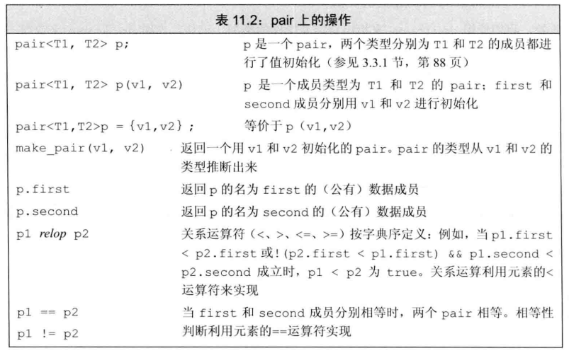
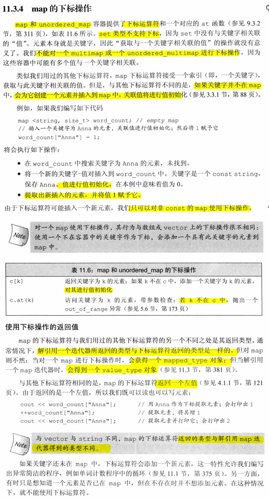

# 11 关联容器
- 关联容器中的元素是**按关键字**来保存和访问的。与之相对，顺序容器中的元素是**按它们在容器中的位置**来顺序保存和访问的。


## 11.1 使用关联容器
#### Exercise
- e11.1
  > map是按关键字来保存和访问元素，是关联容器；而vector是按顺序访问，是顺序容器。
- e11.2
  > list: 经常做插入删除的操作  
  > vector: 类似数组的操作  
  > deque: https://softwareengineering.stackexchange.com/questions/147667/where-would-i-typically-use-a-deque-in-production-software  
  > map: 键值对，类似字典，数据库  
  > set: 书上提供的例子黑名单之类，保存唯一关键字
- e11.3
  ```c++
  #include <iostream>
  #include <map>
  #include <string>

  using namespace std;

  int main() {
      map<string, size_t> word_count;
      string word;
      while (cin >> word) {
          ++word_count[word];
      }
      for (const auto &w : word_count)
          cout << w.first << " occurs " << w.second << ((w.second > 1) ? " times" : " time") << endl;

      return 0;
  }
  ```
- e11.4
  ```c++
  #include <iostream>
  #include <map>
  #include <set>
  #include <string>
  #include <algorithm>
  #include <cctype>

  using namespace std;

  string &strip(string &word) {
      cout << "strip before: " << word << endl;
      for (auto &w : word)
          w = tolower(w);
      word.erase(remove_if(word.begin(), word.end(), [](unsigned char x) { return ispunct(x); }), word.end());
      cout << "strip after: " << word << endl;
      return word;
  }

  int main() {
      map<string, size_t> word_count;
      string word;
      while (cin >> word) {
          ++word_count[strip(word)];
      }
      for (const auto &w : word_count)
          cout << w.first << " occurs " << w.second << ((w.second > 1) ? " times" : " time") << endl;

      return 0;
  }
  ```
## 11.2 关联容器概述
- 关联容器
  - 不支持顺序容器的位置相关的操作，比如`push_front`或`push_back`。原因是关联容器中元素是根据关键字存储的，这些操作对关联容器没有意义。
  - 迭代器都是双向的
### 11.2.1 定义关联容器
#### Exercise
- e11.5
  > map: `<key, value>`  
  > set: `<key>`  
  > [Both std::set and std::map are associative containers. The difference is that std::sets contain only the key, while in std::map there is an associated value. Choosing one over the other depends mainly on what the task at hand is. If you want to build a dictionary of all the words that appear in a text, you could use a std::set<std::string>, but if you also want to count how many times each word appeared (i.e. associate a value to the key) then you would need an std::map<std::string,int>. If you don't need to associate that count, it does not make sense to have the int that is unnecessary.](https://stackoverflow.com/questions/16286714/advantages-of-stdset-vs-vectors-or-maps)  
- e11.6
  > [std::list is O(1) for inserts and deletions. But you may well need O(n) to find the insertion or deletion point. std::set is O(log(n)) for inserts and deletions, it is usually implemented as a red-black tree.Consider the effort to find the insert/delete point to make your choice.](https://stackoverflow.com/questions/2302681/c-stl-list-vs-set)
- e11.7
  ```c++
  #include <iostream>
  #include <string>
  #include <vector>
  #include <map>

  using namespace std;

  int main() {
      map<string, vector<string>> family;
      string surname;
      string first_name;
      cout << "Please input surname" << endl;
      while (cin >> surname) {
          cout << "Please input a first name" << endl;
          cin >> first_name;
          family[surname].push_back(first_name);
          cout << "Please input surname" << endl;
      }

      for (auto & f : family) {
          cout << "Surname: " << f.first << endl;
          for (auto & n : f.second)
              cout << "First name: " << n << endl;
      }

      return 0;
  }
  ```
- e11.8
  > 相对于O(n)的缺点是，需要花费O(n)的时间搜索重复单词。set插入时会排序。
  ```c++
  #include <iostream>
  #include <vector>
  #include <string>
  #include <algorithm>
  using namespace std;

  int main() {
      vector<string> svec;
      string word;
      while (cin >> word) {
          auto rst = find(svec.cbegin(), svec.cend(), word);
          if (rst == svec.cend())
              svec.push_back(word);
      }
      for (const auto &w : svec)
          cout << w << " ";
      cout << endl;

      return 0;
  }
  ```

  

### 11.2.2 关键字类型的要求
- 对于有序容器——`map`、`multimap`、`set`以及`multiset`，关键字类型必须定义元素比较的方法。默认情况下，标准库使用关键字类型的`<`运算符来比较两个关键字。
  


#### Exercise
- e11.9
  ```c++
  #include <iostream>
  #include <map>
  #include <list>
  #include <fstream>
  #include <sstream>
  using namespace std;

  int main(int argc, char *argv[]) {
      ifstream in(argv[1]);
      map<string, list<int>> wmap;
      string line;
      int line_idx = 0;
      while (getline(in, line)) {
          istringstream record(line);
          string key;
          while (record >> key)
              wmap[key].push_back(line_idx);
          ++line_idx;
      }

      for (const auto & w : wmap) {
          cout << "key: " << w.first << endl;
          for (const auto & ln : w.second)
              cout << ln << " ";
          cout << endl;
      }

      return 0;
  }
  ```
- e11.10
  > 可以定义
  ```c++
  #include <map>
  #include <vector>
  #include <list>

  using namespace std;

  int main() {
      map<vector<int>::iterator, int> m1;
      map<list<int>::iterator, int> m2;
  }
  ```
- e11.11
  ```c++
  #include <iostream>
  #include "Sales_data.h"
  #include <set>

  using namespace std;

  int main() {
      //multiset<Sales_data, decltype(compareIsbn)*> bookstore(compareIsbn);
      multiset<Sales_data, bool (*)(const Sales_data &, const Sales_data &)> bookstore(compareIsbn);

      return 0;
  }
  ```
### 11.2.3 pair类型
- pair定义在utility中
- 与其他标准库类型不同，pair的数据成员是public的
- map的元素是pair



#### Exercise
- e11.12
  ```c++
  #include <iostream>
  #include <string>
  #include <vector>
  #include <utility>

  using namespace std;

  int main() {
      vector<pair<string, int>> pv;
      string s;
      int i;
      while(cin >> s >> i) {
          pv.push_back(make_pair(s, i));
      }
      for (const auto &e : pv)
          cout << e.first << " " << e.second << endl;

      return 0;
  }
  ```
- e11.13
  > 第一种make_pair最好理解，第一简单，第二知道这个一个pair
  ```c++
  #include <iostream>
  #include <string>
  #include <vector>
  #include <utility>

  using namespace std;

  int main() {
      vector<pair<string, int>> pv;
      string s;
      int i;
      while(cin >> s >> i) {
          pv.push_back(make_pair(s, i));
          pv.push_back(pair<string, int>(s, i));
          pv.push_back({s, i});
      }
      for (const auto &e : pv)
          cout << e.first << " " << e.second << endl;

      return 0;
  }
  ```
- e11.14
  ```c++
  #include <iostream>
  #include <string>
  #include <vector>
  #include <map>
  #include <utility>

  using namespace std;

  int main() {
      map<string, vector<pair<string, string>>> family;
      string surname;
      cout << "Please input surname" << endl;
      while (cin >> surname) {
          string first_name;
          string birth_day;
          cout << "Please input a first name" << endl;
          cin >> first_name >> birth_day;
          family[surname].push_back({first_name, birth_day});

          cout << "Please input surname" << endl;
      }

      for (auto & f : family) {
          cout << "Surname: " << f.first << endl;
          for (auto & n : f.second)
              cout << "First name: " << n.first << " Birth day: " << n.second << endl;
      }

      return 0;
  }
  ```
## 11.3 关联容器操作


### 11.3.1 关联容器迭代器
- 一个`map`的`value_type`是一个`pair`，我们可以改变`pair`的值，但不能改变关键字成员的值
- 不能改变map元素的关键字
- set的迭代器是const的


#### Exercise
- e11.15
  ```c++
  map<int, vector<int>>::mapped_type v1; // vector<int>
  map<int, vector<int>>::key_type v2; // int
  map<int, vector<int>>::value_type v3; // pair<const int, vector<int>>
  ```
- e11.16
  ```c++
  #include <iostream>
  #include <map>
  using namespace std;

  int main() {
      map<int, int> m;
      //map<int, int>::iterator it = m.begin();
      m[2] = 4;
      cout << m[2] << endl;
      //*it = {3, 4};
      //it->first = 4;
      map<int, int>::iterator it = m.begin();
      it->second = 5;
      cout << it->first << " " << it->second << endl;
      cout << m[2] << endl;
      return 0;
  }
  ```
- e11.17
  ```c++
  #include <iostream>
  #include <string>
  #include <set>
  #include <vector>
  #include <algorithm>
  #include <iterator>

  using namespace std;

  int main() {
      multiset<string> c{"ms1", "ms2"};
      vector<string> v{"v1", "v2"};

      copy(v.begin(), v.end(), inserter(c, c.end()));
      /*
        /usr/include/c++/7/bits/stl_iterator.h:492:13: error: ‘class std::multiset<std::__cxx11::basic_string<char> >’ has no member named ‘push_back’
        container->push_back(__value);
        ~~~~~~~~~~~^~~~~~~~~
      */
      //! copy(v.begin(), v.end(), back_inserter(c));
      copy(c.begin(), c.end(), inserter(v, v.end()));
      copy(c.begin(), c.end(), back_inserter(v));

      return 0;
  }
  ```
- e11.18
  ```c++
  #include <map>
  #include <string>

  using namespace std;

  int main() {
      map<string, size_t> word_count{ {"abc", 1} };
      //auto map_it = word_count.begin();
      map<string, size_t>::iterator map_it = word_count.begin();
  }
  ```
- e11.19
  ```c++
  #include <iostream>
  #include "Sales_data.h"
  #include <set>

  using namespace std;

  int main() {
      //multiset<Sales_data, decltype(compareIsbn)*> bookstore(compareIsbn);
      multiset<Sales_data, bool (*)(const Sales_data &, const Sales_data &)> bookstore(compareIsbn);
      //auto it = bookstore.begin();
      multiset<Sales_data, bool (*)(const Sales_data &, const Sales_data &)>::iterator it = bookstore.begin();

      return 0;
  }
  ```
### 11.3.2 添加元素


#### Exercise 
- e11.20
  > 下标方式更容易编写与阅读，
  ```c++
  #include <iostream>
  #include <map>
  #include <set>
  #include <string>
  #include <algorithm>
  #include <cctype>

  using namespace std;

  string &strip(string &word) {
      cout << "strip before: " << word << endl;
      for (auto &w : word)
          w = tolower(w);
      word.erase(remove_if(word.begin(), word.end(), [](unsigned char x) { return ispunct(x); }), word.end());
      cout << "strip after: " << word << endl;
      return word;
  }

  int main() {
      map<string, size_t> word_count;
      string word;
      while (cin >> word) {
          auto ret = word_count.insert({strip(word), 1});
          if (!ret.second)
              ++ret.first->second;
      }
      for (const auto &w : word_count)
          cout << w.first << " occurs " << w.second << ((w.second > 1) ? " times" : " time") << endl;

      return 0;
  }
  ```
- e11.21
  > 与之前的下标操作，和上面的insert操作结果完全相同
  ```c++
  #include <iostream>
  #include <map>
  #include <set>
  #include <string>
  #include <algorithm>
  #include <cctype>

  using namespace std;

  int main() {
      map<string, size_t> word_count;
      string word;
      while (cin >> word) {
          ++word_count.insert({word, 0}).first->second;
      }
      for (const auto &w : word_count)
          cout << w.first << " occurs " << w.second << ((w.second > 1) ? " times" : " time") << endl;

      return 0;
  }
  ```
- e11.22
  ```c++
  #include <iostream>
  #include <map>
  #include <string>
  #include <vector>
  #include <utility>

  using namespace std;

  int main() {
      map<string, vector<int>> m;
      pair<map<string, vector<int>>::iterator, bool> rst = m.insert(pair<string, vector<int>>({"abc", {1,2,3,4}}));

      map<string, vector<int>>::iterator it = m.begin();
      cout << "key: " << it->first << endl;
      for (const auto &e : it->second)
          cout << "value: " << e << endl;

      return 0;
  }
  ```
- e11.23
  ```c++
  #include <iostream>
  #include <string>
  #include <vector>
  #include <map>

  using namespace std;

  int main() {
      //map<string, vector<string>> family;
      multimap<string, string> family;
      string surname;
      string first_name;
      cout << "Please input surname" << endl;
      while (cin >> surname) {
          cout << "Please input a first name" << endl;
          cin >> first_name;
          //family[surname].push_back(first_name);
          // 由于一个multi容器中的关键字不必唯一，在这些类型上调用insert总会插入一个元素
          family.insert({surname, first_name});
          cout << "Please input surname" << endl;
      }

      for (auto & f : family) {
          cout << "Surname: " << f.first << endl;
          cout << "First name: " << f.second << endl;
      }

      return 0;
  }
  ```
### 11.3.3 删除元素


### 11.3.4 map的下标操作



#### Exercise
- e11.24
  > 声明并定义一个map对象，并添加一个键值对{0, 1}
- e11.25
  > 因为越界，会引发异常
- e11.26
  > 可以用key_type类型对map进行下标操作。下标操作返回mapped_type类型。
  ```c++
  #include <iostream>
  #include <map>
  #include <string>
  using namespace std;

  int main() {
      map<string, int> m;
      map<string, int>::key_type key = "abc";
      m[key] = 12;
      map<string, int>::mapped_type value = m[key];
      cout << value << endl;
      map<string, int>::iterator it = m.begin();
      cout << it->first << " " << it->second << endl;

      return 0;
  }
  ```
### 11.3.5 访问元素


#### Exercise
- e11.27
  > 如果我们所关心的只是一个特定元素是否已在容器中，可能find是最佳选择；对于不允许重复关键字的容器，使用find或count没什么区别；对于允许重复关键字的容器，count还会做更多的工作：如果元素在容器中，它还会统计有多少个元素有相同的关键字；如果不需要计数，最好使用find。
- e11.28
  ```c++
  #include <iostream>
  #include <map>
  #include <string>
  #include <vector>

  using namespace std;

  int main() {
      map<string, vector<int>> m{{"abc", {1,2,3}}, {"efg", {4,5,6}}};

      map<string, vector<int>>::iterator rst = m.find("efg");
      if (rst != m.end())
          for (auto &e : rst->second)
              cout << e << " ";
      cout << endl;

      return 0;
  }
  ```
- e11.29
  > lower_bound和upper_bound会返回相等的迭代器，都指向给定关键字的插入点。这个插入点可能是尾后迭代器，条件是该关键字不存在且大于容器中任何关键字，此时两者都是返回尾后迭代器。对于equal_range，若未找到匹配元素，则两个迭代器都指向关键字可以插入的位置。
- e11.30
  > pos是一个pair，first/second分别指向关键字匹配的范围，其中pos.first与关键字匹配首元素迭代器，该迭代器是value_type，也是pair，其中second指向mapped_type。
- e11.31
  ```c++
  #include <iostream>
  #include <map>
  #include <string>

  using namespace std;

  int main(int argc, char *argv[]) {
      multimap<string, string> authors;
      authors.insert({"abc", "1 book"});
      authors.insert({"abc", "2 book"});
      authors.insert({"abc", "3 book"});
      authors.insert({"efg", "1 book"});
      authors.insert({"efg", "2 book"});
      authors.insert({"hij", "1 book"});

      string key(argv[1]);
      multimap<string, string>::iterator it = authors.find(key);
      auto entries = authors.count(key);

      while (entries) {
          it = authors.erase(it);
          --entries;
      }

      for (auto &e : authors)
          cout << e.first << " " << e.second << endl;

      return 0;
  }
  ```
- e11.32
  ```c++
  #include <iostream>
  #include <map>
  #include <set>
  #include <string>

  using namespace std;

  int main(int argc, char *argv[]) {
      multimap<string, string> authors;
      authors.insert({"abc", "1 book"});
      authors.insert({"efg", "2 book"});
      authors.insert({"efg", "1 book"});
      authors.insert({"abc", "2 book"});
      authors.insert({"abc", "3 book"});
      authors.insert({"hij", "1 book"});

      for (auto &e : authors)
          cout << e.first << ": " << e.second << endl;

      map<string, set<string>> dict_authors;
      for (auto &e : authors) {
          dict_authors[e.first].insert(e.second);
      }

      for (auto &e : dict_authors) {
          cout << e.first << ": ";
          for (auto &s : e.second)
              cout << s << ", ";
          cout << endl;
      }

      return 0;
  }
  ```
### 11.3.6 一个单词转换的map

#### Exercise
- e11.33
  ```c++
  #include <iostream>
  #include <fstream>
  #include <sstream>
  #include <map>
  #include <string>

  using namespace std;

  map<string, string> buildMap(ifstream &map_file) {
      map<string, string> trans_map;
      string key;
      string value;
      while (map_file >> key && getline(map_file, value)) {
          if (value.size() > 1)
              trans_map[key] = value.substr(1);
          else
              throw runtime_error("no rule for " + key);
      }
      return trans_map;
  }

  const string &transform(const string &s, const map<string, string> &m) {
      auto map_it = m.find(s);
      if (map_it != m.cend())
          return map_it->second;
      else
          return s;
  }

  void word_transform(ifstream &map_file, ifstream &input) {
      auto trans_map = buildMap(map_file);
      string text;
      while (getline(input, text)) {
          istringstream stream(text);
          string word;
          bool firstword = true;
          while (stream >> word) {
              if (firstword)
                  firstword = false;
              else
                  cout << " ";
              cout << transform(word, trans_map);
          }
          cout << endl;
      }
  }

  int main(int argc, char *argv[]) {
      ifstream map_file(argv[1]);
      ifstream input(argv[2]);

      word_transform(map_file, input);
      return 0;
  }
  ```
- e11.34
  ```c++
  #include <iostream>
  #include <fstream>
  #include <sstream>
  #include <map>
  #include <string>

  using namespace std;

  map<string, string> buildMap(ifstream &map_file) {
      map<string, string> trans_map;
      string key;
      string value;
      while (map_file >> key && getline(map_file, value)) {
          if (value.size() > 1)
              trans_map[key] = value.substr(1);
          else
              throw runtime_error("no rule for " + key);
      }
      return trans_map;
  }

  const string &transform(const string &s, const map<string, string> &m) {
  /*    auto map_it = m.find(s);
      if (map_it != m.cend())
          return map_it->second;
      else
          return s;
  */

  /*
  t11-34.cc: In function ‘const string& transform(const string&, const std::map<std::__cxx11::basic_string<char>, std::__cxx11::basic_string<char> >&)’:
  t11-34.cc:29:15: error: passing ‘const std::map<std::__cxx11::basic_string<char>, std::__cxx11::basic_string<char> >’ as ‘this’ argument discards qualifiers [-fpermissive]
      return m[s];
                ^
  试图对一个const map做插入操作，这是不允许的
  */
      return m[s];
  }

  void word_transform(ifstream &map_file, ifstream &input) {
      auto trans_map = buildMap(map_file);
      string text;
      while (getline(input, text)) {
          istringstream stream(text);
          string word;
          bool firstword = true;
          while (stream >> word) {
              if (firstword)
                  firstword = false;
              else
                  cout << " ";
              cout << transform(word, trans_map);
          }
          cout << endl;
      }
  }

  int main(int argc, char *argv[]) {
      ifstream map_file(argv[1]);
      ifstream input(argv[2]);

      word_transform(map_file, input);
      return 0;
  }
  ```
- e11.35
  > 在map_file中最后追加一条`k ok?`, 对于11.33来说，结果为ok?，而对于insert来说结果为okay?，这也应了之前对于insert的操作：如果关键字已在容器中，则insert什么事情都不做。而对于下标操作符，会将最后一个值存入，从而覆盖之前的。
  ```
  dongkesi@DESKTOP-CL29DN1:/mnt/d/workspace/github/C++-Primer/ch11$ g++ t11-35.cc
  dongkesi@DESKTOP-CL29DN1:/mnt/d/workspace/github/C++-Primer/ch11$ ./a.out map_file
  input
  where are you
  why dont you send me a picture
  okay? thanks! 18r
  dongkesi@DESKTOP-CL29DN1:/mnt/d/workspace/github/C++-Primer/ch11$ g++ t11-33.cc
  dongkesi@DESKTOP-CL29DN1:/mnt/d/workspace/github/C++-Primer/ch11$ ./a.out map_file
  input
  where are you
  why dont you send me a picture
  ok? thanks! 18r
  ```
- e11.36
  > 会返回异常
  ```
  terminate called after throwing an instance of 'std::runtime_error'
    what():  no rule for l
  Aborted (core dumped)
  ```
## 11.4 无序容器
- 新标准定义了4个无序关联容器。这些容器不是使用**比较运算符**来组织元素，而是使用一个**哈希函数**和关键字类型的`==`运算符
- 如果关键字类型固有就是无序的，或者性能测试发现问题可以用哈希技术解决，那就可以使用无序容器
- 无序容器在存储上组织为一组桶，每个桶保存零个或多个元素。
- 无序容器的性能依赖于哈希函数的质量和桶的数量和大小
  


- 默认情况下，无序容器使用关键字类型的`==`运算符来比较元素，它们还使用一个`hash<key_type>`类型的对象来生成每个元素的哈希值。
- 标准库为内置类型提供了hash模板，还为一些标准库类型，string，智能指针定义了hash。因此，我们可以直接定义关键字是**内置类型（包括指针类型）、string还是智能指针类型**的无序容器。
- 我们**不能直接定义关键字类型为自定义类类型的无序容器**。不能直接使用哈希模板，必须提供我们自己的hash模板版本。
- 有序容器的迭代器通过关键字有序访问容器中的元素。**无论在有序容器中还是在无序容器中，具有相同关键字的元素都是相邻存储的**。

#### Exercise
- e11.37
  > 在关键字类型的元素没有明显的序关系的情况下，无序容器非常有用。有时候，维护元素的序代价非常高昂，此时无序容器也很有用。无序容器最大的缺点就是没有顺序。

  

- e11.38
  ```c++
  #include <iostream>
  #include <unordered_map>
  #include <set>
  #include <string>
  #include <algorithm>
  #include <cctype>

  using namespace std;

  string &strip(string &word) {
      cout << "strip before: " << word << endl;
      for (auto &w : word)
          w = tolower(w);
      word.erase(remove_if(word.begin(), word.end(), [](unsigned char x) { return ispunct(x); }), word.end());
      cout << "strip after: " << word << endl;
      return word;
  }

  int main() {
      unordered_map<string, size_t> word_count;
      string word;
      while (cin >> word) {
          ++word_count[strip(word)];
      }
      for (const auto &w : word_count)
          cout << w.first << " occurs " << w.second << ((w.second > 1) ? " times" : " time") << endl;

      return 0;
  }
  ```

  ```c++
  #include <iostream>
  #include <fstream>
  #include <sstream>
  #include <unordered_map>
  #include <string>

  using namespace std;

  unordered_map<string, string> buildMap(ifstream &map_file) {
      unordered_map<string, string> trans_map;
      string key;
      string value;
      while (map_file >> key && getline(map_file, value)) {
          if (value.size() > 1)
              trans_map[key] = value.substr(1);
          else
              throw runtime_error("no rule for " + key);
      }
      return trans_map;
  }

  const string &transform(const string &s, const unordered_map<string, string> &m) {
      auto map_it = m.find(s);
      if (map_it != m.cend())
          return map_it->second;
      else
          return s;
  }

  void word_transform(ifstream &map_file, ifstream &input) {
      auto trans_map = buildMap(map_file);
      string text;
      while (getline(input, text)) {
          istringstream stream(text);
          string word;
          bool firstword = true;
          while (stream >> word) {
              if (firstword)
                  firstword = false;
              else
                  cout << " ";
              cout << transform(word, trans_map);
          }
          cout << endl;
      }
  }

  int main(int argc, char *argv[]) {
      ifstream map_file(argv[1]);
      ifstream input(argv[2]);

      word_transform(map_file, input);
      return 0;
  }
  ```

