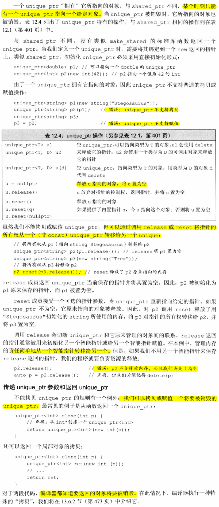
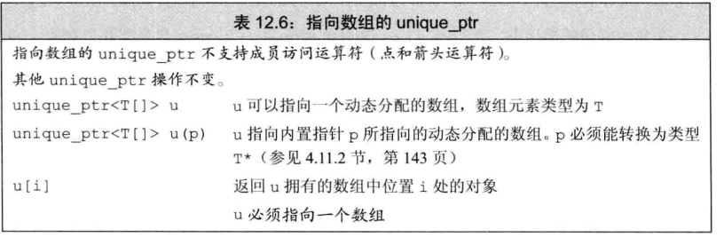

# 12 动态内存
- 分配在**静态或栈内存**中的对象由**编译器自动创建和销毁**
  - **静态内存**：用来保存局部`static`对象、类`static`数据成员以及定义在任何函数之外的变量。
  - **栈内存**：用来保存定义在函数内的非`static`对象。
- 动态对象的生存期由程序来控制，即，当动态对象不再使用时，我们的代码必须显示地销毁它们。

## 12.1 动态内存和智能指针
- memory头文件
- 为了更容易（更安全）使用动态内存，新的标准库提供了两种智能指针类型来管理动态对象。区别在于管理低层指针的方式：
  - shared_ptr：允许多个指针指向同一个对象。
    - weak_ptr：是一种弱引用，指向shared_ptr所管理的对象
  - unique_ptr：“独占”所指向的对象
### 12.1.1 shared_ptr类
- 智能指针也是**模板**
- 智能指针的使用方式与普通指针类似。
- 默认初始化的智能指针中保存着一个空指针


- **最安全的分配和使用动态内存的方法**是调用一个名为`make_shared`的标准库函数。此函数在动态内存中分配一个对象并初始化它，返回指向此对象的`shared_ptr`。


- 当指向一个对象的最后一个`shared_ptr`被销毁时，`shared_ptr`类会自动销毁此对象
- 如果你将`shared_ptr`存放于一个容器中，而后不再需要全部元素，而只使用其中一部分，要记得用`erase`删除不再需要的那些元素
- 程序使用动态内存出于三种原因
  - 程序不知道自己需要使用**多少对象**
    - 容器类
  - 程序不知道所需对象的**准确类型**
  - 程序需要在多个对象间**共享数据**
#### Exercise
- e12.1
  > b1是4个，但是b2在程序结尾即"}"之后已经被销毁了
- e12.2
  ```c++
  #include <iostream>
  #include <vector>
  #include <string>
  #include <memory>

  using namespace std;

  class StrBlob {
  public:
      typedef vector<string>::size_type size_type;
      StrBlob() : data(make_shared<vector<string>>()) { }
      StrBlob(initializer_list<string> il) : data(make_shared<vector<string>>(il)) { }
      size_type size() const { return data->size(); }
      bool empty() const { return data->empty(); }
      void push_back(const string &t) { data->push_back(t); }
      void pop_back();

      string &front();
      string &back();
      const string &front () const;
      const string &back () const;
  private:
      shared_ptr<vector<string>> data;
      void check(size_type i, const string &msg) const;
  };

  void StrBlob::check(size_type i, const string &msg) const {
      if (i >= data->size()) {
          throw out_of_range(msg);
      }
  }

  string& StrBlob::front() {
      check(0, "front on empty StrBlob");
      return data->front();
  }

  string& StrBlob::back() {
      check(0, "back on empty StrBlob");
      return data->back();
  }

  const string& StrBlob::front() const {
      check(0, "front on empty StrBlob");
      return data->front();
  }

  const string& StrBlob::back() const {
      check(0, "back on empty StrBlob");
      return data->back();
  }

  void StrBlob::pop_back() {
      check(0, "pop_back on empty StrBlob");
      data->pop_back();
  }

  int main() {
      StrBlob b1;
      StrBlob b2 = {"a", "an", "the"};
      const StrBlob b3 = {"word", "hello", "end"};
      b1 = b2;
      b2.push_back("about");

      cout << b1.size() << " " << b2.size() << endl;
      cout << b3.front() << " " << b3.back() << endl;
      cout << b2.front() << " " << b2.back() << endl;
      cout << b1.front() << " " << b1.back() << endl;
      b2.push_back("test_b2");
      cout << b1.front() << " " << b1.back() << endl;
      //! b3.push_back("test_b3");

      return 0;
  }
  ```
- e12.3
  > 这里看上去类似定义了一个const vector<string> *p, 其实不然是 const StrBlob obj, 只是obj不能修改，但是obj内部的vector<string>并不是const
  ```c++
  #include <iostream>
  #include <vector>
  #include <string>
  #include <memory>

  using namespace std;

  class StrBlob {
  public:
      typedef vector<string>::size_type size_type;
      StrBlob() : data(make_shared<vector<string>>()) { }
      StrBlob(initializer_list<string> il) : data(make_shared<vector<string>>(il)) { }
      size_type size() const { return data->size(); }
      bool empty() const { return data->empty(); }
      void push_back(const string &t) {
          cout << __PRETTY_FUNCTION__ << endl;
          data->push_back(t);
      }
      void push_back(const string &t) const {
          cout << __PRETTY_FUNCTION__ << endl;
          data->push_back(t);
      }
      void pop_back();
      void pop_back() const;

      string &front();
      string &back();
      const string &front () const;
      const string &back () const;
  private:
      shared_ptr<vector<string>> data;
      void check(size_type i, const string &msg) const;
  };

  void StrBlob::check(size_type i, const string &msg) const {
      if (i >= data->size()) {
          throw out_of_range(msg);
      }
  }

  string& StrBlob::front() {
      check(0, "front on empty StrBlob");
      return data->front();
  }

  string& StrBlob::back() {
      check(0, "back on empty StrBlob");
      return data->back();
  }

  const string& StrBlob::front() const {
      check(0, "front on empty StrBlob");
      return data->front();
  }

  const string& StrBlob::back() const {
      check(0, "back on empty StrBlob");
      return data->back();
  }

  void StrBlob::pop_back() {
      check(0, "pop_back on empty StrBlob");
      data->pop_back();
  }

  void StrBlob::pop_back() const {
      check(0, "pop_back on empty StrBlob");
      data->pop_back();
  }

  int main() {
      StrBlob b1 = {"a", "an", "the"};
      const StrBlob b3 = b1;
      b3.push_back("test_b3");
      cout << b3.size() << " " << b1.size() << endl;
      cout << b3.back() << " " << b1.back() << endl;
      b3.pop_back();
      cout << b3.back() << " " << b1.back() << endl;
      b1.push_back("test_b1");
      cout << b3.back() << " " << b1.back() << endl;

      vector<string> v = {"v1", "v2", "v3"};
      vector<string> *p1 = &v;
      cout << p1->back() << endl;
      p1->push_back("v4");
      cout << p1->back() << endl;

      const vector<string> *p2 = &v;
      cout << p2->back() << endl;
      //! p2->push_back("v4"); // 这里编译会失败，不能修改const 对象
      cout << p2->back() << endl;

      return 0;
  }
  ```

  ```
  dongkesi@DESKTOP-CL29DN1:/mnt/d/workspace/github/C++-Primer/ch12$ ./a.outvoid StrBlob::push_back(const string&) const
  4 4
  test_b3 test_b3
  the the
  void StrBlob::push_back(const string&)
  test_b1 test_b1
  v3
  v4
  v4
  v4
  ```
- e12.4
  > 因为size_type类型是无符号类型，必然>=0
- e12.5
  > 因为目前的initializer_list可以自动转换，如果加上了explicit，需要明确的构造临时对象。

  知识点回忆：
  - 在要求隐式转换的程序上下文中，我们可以通过将构造函数声明为`explicit`加以阻止
  - 关键字`explicit`**只对一个实参的构造函数有效**。需要多个实参的构造函数不能用于执行隐式转换，所以无须将这些构造函数指定为`explicit`的。**只能在类内声明构造函数时使用**`explicit`关键字，在类外部定义时不应重复。
  - 当我们用`explicit`关键字声明构造函数时，它将**只能以直接初始化的形式使用**。而且，编译器将不会在自动转换过程中使用该构造函数。

### 12.1.2 直接管理内存
- 对于定义了自己的构造函数的类类型来说，要求值初始化是没有意义的；不管采用什么形式，**对象都会通过默认构造函数来初始化**。
- 值初始化的内置类型对象有着良好定义的值
  


#### Exercise
- e12.6
  ```c++
  #include <iostream>
  #include <vector>

  using namespace std;

  vector<int> *my_alloc(void) {
      return new vector<int>;
  }

  void fill(vector<int> *pv) {
      int elem;
      while (cin >> elem)
          pv->push_back(elem);
  }

  void print(vector<int> *pv) {
      for (auto &e : *pv)
          cout << e << " ";
      cout << endl;
  }

  int main() {
      vector<int> *p = my_alloc();
      fill(p);
      print(p);
      delete p;

      return 0;
  }
  ```
- e12.7
  ```c++
  #include <iostream>
  #include <vector>
  #include <memory>

  using namespace std;

  shared_ptr<vector<int>> my_alloc(void) {
      return make_shared<vector<int>>();
  }

  void fill(shared_ptr<vector<int>> p) {
      int elem;
      while (cin >> elem)
          p->push_back(elem);
  }

  void print(shared_ptr<vector<int>> p) {
      for (auto &e : *p)
          cout << e << " ";
      cout << endl;
  }

  int main() {
      shared_ptr<vector<int>> p = my_alloc();
      fill(p);
      print(p);

      return 0;
  }
  ```
- e12.8
  > 函数会返回1， 从int *类型转换为bool类型，同时会造成内存泄漏
- e12.9
  ```c++
  #include <iostream>
  #include <memory>
  using namespace std;

  int main() {
      int *q = new int(42), *r = new int(100);
      cout << *q << " " << *r << endl;
      cout << q << " " << r << endl;
      r = q; // 会造成r内存泄漏
      cout << *q << " " << *r << endl;
      cout << q << " " << r << endl;

      auto q2 = make_shared<int>(42), r2 = make_shared<int>(100);
      cout << *q2 << " " << *r2 << endl;
      cout << q2 << " " << r2 << endl;
      r2 = q2; //r2的之前内存的引用减为0，q2引用内存的计数增加到2
      cout << *q2 << " " << *r2 << endl;
      cout << q2 << " " << r2 << endl;

      return 0;
  }
  ```

  ```
  // output
  42 100
  0x7fffeb48de70 0x7fffeb48de90
  42 42
  0x7fffeb48de70 0x7fffeb48de70
  42 100
  0x7fffeb48eed0 0x7fffeb48eef0
  42 42
  0x7fffeb48eed0 0x7fffeb48eed0
  ```
### 12.1.3 shared_ptr和new结合使用


- 当将一个`shared_ptr`绑定到一个普通指针时，我们就将内存的管理责任交给了这个`shared_ptr`。一旦这样做了，我们就**不应该再使用内置指针来访问`shared_ptr`所指向的内存了**。
- 使用一个内置指针来访问一个智能指针所负责的对象是很危险的，因为我们无法知道对象何时会被销毁。


#### Exercise
- e12.10
  > 正确，会是p的拷贝，增加p引用计数
  ```c++
    #include <iostream>
    #include <memory>
    using namespace std;

    void process(shared_ptr<int> ptr) {
        cout << ptr.use_count() << " |1| " << *ptr << endl;
    }

    int main() {
        shared_ptr<int> p(new int(42));
        process(shared_ptr<int>(p));
        cout << p.use_count() << " |2| " << *p << endl;
        *p = 32;
        shared_ptr<int> q(p);
        cout << p.use_count() << " |3| " << *p << endl;
        cout << q.use_count() << " |4| " << *q << endl;
        process(p);
        cout << p.use_count() << " |5| " << *p << endl;
        cout << q.use_count() << " |6| " << *q << endl;

        return 0;
    }
  ```
  ```
    //output
    2 |1| 42
    1 |2| 42
    2 |3| 32
    2 |4| 32
    3 |1| 32
    2 |5| 32
    2 |6| 32
  ```
- e12.11
  > 应该返回错误才对呀？为什么p的引用还是1呢？不过值已经没有了，变成了0
    ```c++
    #include <iostream>
    #include <memory>
    using namespace std;

    void process(shared_ptr<int> ptr) {
        cout << ptr.use_count() << " |1| " << *ptr << endl;
    }

    int main() {
        shared_ptr<int> p(new int(42));
        process(shared_ptr<int>(p.get()));
        cout << p.use_count() << " |2| " << *p << endl;

        return 0;
    }
    ```
    ```
    //output
    1 |1| 42
    1 |2| 0
    ```
- e12.12
  ```c++
    #include <iostream>
    #include <memory>
    using namespace std;

    void process(shared_ptr<int> ptr) {
        cout << ptr.use_count() << " |1| " << *ptr << endl;
    }

    int main() {
        auto p = new int(4);
        auto sp = make_shared<int>(5);
        process(sp);
        cout << *sp << endl;
        /*
            t12-12.cc:14:22: error: could not convert ‘(operator new(4), (<statement>, ((int*)
            <anonymous>)))’ from ‘int*’ to ‘std::shared_ptr<int>’
                process(new int());
                                ^
        */
        //! process(new int());

        /*
            t12-12.cc:15:14: error: could not convert ‘p’ from ‘int*’ to ‘std::shared_ptr<int
            ’
                process(p);
                        ^
        */
        //! process(p);
        process(shared_ptr<int>(p));
        cout << *p << endl;
        return 0;
    }
  ```
  ```
    //output
    2 |1| 5
    5
    1 |1| 4
    0
  ```
- e12.13
  ```c++
    #include <memory>
    #include <iostream>
    using namespace std;

    int main() {
        auto sp = make_shared<int>(4);
        auto p = sp.get();
        cout << sp.use_count() << " | " << *sp << endl;
        delete p;
        cout << sp.use_count() << " | " << *sp << endl;
        return 0;
    }
  ```
  ```
  // output
    1 | 4
    double free or corruption (out)
    Aborted (core dumped)
  ```

### 12.1.4 智能指针和异常


#### Exercise
- e12.14
  ```c++
    #include <iostream>
    #include <memory>
    #include <string>
    using namespace std;

    struct destination {
        destination(string ip) : _ip(ip) { cout << __PRETTY_FUNCTION__ << endl;}
        string _ip;
    };

    struct connection {
        connection(string ip) : _ip(ip) { cout << __PRETTY_FUNCTION__ << endl;}
        string _ip;
    };

    connection *connect(destination *d) {
        cout << __PRETTY_FUNCTION__ << endl;
        connection *pc = new connection(d->_ip);
        cout << pc << endl;
        return pc;
    }

    void disconnect(connection *connect) {
        cout << __PRETTY_FUNCTION__ << endl;
        cout << connect << endl;
        delete connect;
    }

    void end_connection(connection *p) {
        cout << __PRETTY_FUNCTION__ << endl;
        disconnect(p);
    }

    void f(destination &d) {
        connection *c = connect(&d);
        shared_ptr<connection> p(c, end_connection);
    }

    int main() {
        destination d("127.0.0.1");
        f(d);
        return 0;
    }

    //output
    destination::destination(std::__cxx11::string)
    connection* connect(destination*)
    connection::connection(std::__cxx11::string)
    0x7fffcdddbe80
    void end_connection(connection*)
    void disconnect(connection*)
    0x7fffcdddbe80
  ```
- e12.15
  ```c++
    #include <iostream>
    #include <memory>
    #include <string>
    using namespace std;

    struct destination {
        destination(string ip) : _ip(ip) { cout << __PRETTY_FUNCTION__ << endl;}
        string _ip;
    };

    struct connection {
        connection(string ip) : _ip(ip) { cout << __PRETTY_FUNCTION__ << endl;}
        string _ip;
    };

    connection *connect(destination *d) {
        cout << __PRETTY_FUNCTION__ << endl;
        connection *pc = new connection(d->_ip);
        cout << pc << endl;
        return pc;
    }

    void disconnect(connection *connect) {
        cout << __PRETTY_FUNCTION__ << endl;
        cout << connect << endl;
        delete connect;
    }
    /*
    void end_connection(connection *p) {
        cout << __PRETTY_FUNCTION__ << endl;
        disconnect(p);
    }
    */
    void f(destination &d) {
        connection *c = connect(&d);
        shared_ptr<connection> p(c, [](connection *p) -> void {
                                    cout << __PRETTY_FUNCTION__ << endl;
                                    disconnect(p); });
    }

    int main() {
        destination d("127.0.0.1");
        f(d);
        return 0;
    }
    //output
    destination::destination(std::__cxx11::string)
    connection* connect(destination*)
    connection::connection(std::__cxx11::string)
    0x7ffff7449e80
    f(destination&)::<lambda(connection*)>
    void disconnect(connection*)
    0x7ffff7449e80
  ```
### 12.1.5 unique_ptr



#### Exercise
- e12.16
  ```c++
    #include <iostream>
    #include <memory>
    using namespace std;

    int main() {
        unique_ptr<int> p1(new int(3));
    /*
    t12-16.cc: In function ‘int main()’:
    t12-16.cc:7:26: error: use of deleted function ‘std::unique_ptr<_Tp, _Dp>::unique_ptr(const std::unique_ptr<_Tp, _Dp>&) [with _Tp = int; _Dp = std::default_delete<int>]’
        unique_ptr<int> p2(p1);
                            ^
    In file included from /usr/include/c++/7/memory:80:0,
                    from t12-16.cc:2:
    /usr/include/c++/7/bits/unique_ptr.h:388:7: note: declared here
        unique_ptr(const unique_ptr&) = delete;
        ^~~~~~~~~~
    t12-16.cc:9:10: error: use of deleted function ‘std::unique_ptr<_Tp, _Dp>& std::unique_ptr<_Tp, _Dp>::operator=(const std::unique_ptr<_Tp, _Dp>&) [with _Tp = int; _Dp = std::default_delete<int>]’
        p3 = p1;
            ^~
    In file included from /usr/include/c++/7/memory:80:0,
                    from t12-16.cc:2:
    /usr/include/c++/7/bits/unique_ptr.h:389:19: note: declared here
        unique_ptr& operator=(const unique_ptr&) = delete;
                    ^~~~~~~~
    */
 
        unique_ptr<int> p2(p1);
        unique_ptr<int> p3;
        p3 = p1;

        return 0;
    }
  ```
- e12.17
  ```c++
    #include <iostream>
    #include <memory>
    using namespace std;

    int main() {
        int ix = 1024, *pi = &ix, *pi2 = new int(2048);
        typedef unique_ptr<int> IntP;
        {
        /*
        compiling error:
        t12-17.cc:9:15: error: no matching function for call to ‘std::unique_ptr<int>::unique_ptr(int&)’
        IntP p0(ix);
                ^
        */
        //! IntP p0(ix);

        /*
        runing error:
        Segmentation fault (core dumped)
        */
        //! IntP p1(pi);
        /*
        compile passed; but dangling pointer
        */
        IntP p2(pi2);
        /*
        running error:
        munmap_chunk(): invalid pointer
        Aborted (core dumped)
        */
        //! IntP p3(&ix);
        // Correct
        IntP p4(new int(2048));
        /*
        double release
        */
        IntP p5(p2.get());
        }
        cout << *pi2 << endl; // freed by p2;
        return 0;
    }
  ```
- e12.18
  > u.realse的工作原理是：u放弃对指针的控制权，返回指针，并将u置为空。但是shared_ptr有多个共享，所以不能放弃控制权。
  https://stackoverflow.com/questions/1833356/detach-a-pointer-from-a-shared-ptr/5995770#5995770

### 12.1.6 weak_ptr

#### Exercie
- e12.19
  ```c++
    #include <iostream>
    #include <vector>
    #include <string>
    #include <memory>

    using namespace std;

    class StrBlobPtr;

    class StrBlob {
    public:
        typedef vector<string>::size_type size_type;
        StrBlob() : data(make_shared<vector<string>>()) { }
        StrBlob(initializer_list<string> il) : data(make_shared<vector<string>>(il)) { }
        size_type size() const { return data->size(); }
        bool empty() const { return data->empty(); }
        void push_back(const string &t) {
            cout << __PRETTY_FUNCTION__ << endl;
            data->push_back(t);
        }
        void push_back(const string &t) const {
            cout << __PRETTY_FUNCTION__ << endl;
            data->push_back(t);
        }
        void pop_back();
        void pop_back() const;

        string &front();
        string &back();
        const string &front () const;
        const string &back () const;
    private:
        shared_ptr<vector<string>> data;
        void check(size_type i, const string &msg) const;
        friend class StrBlobPtr;
        StrBlobPtr begin();
        StrBlobPtr end();
    };

    void StrBlob::check(size_type i, const string &msg) const {
        if (i >= data->size()) {
            throw out_of_range(msg);
        }
    }

    string& StrBlob::front() {
        check(0, "front on empty StrBlob");
        return data->front();
    }

    string& StrBlob::back() {
        check(0, "back on empty StrBlob");
        return data->back();
    }

    const string& StrBlob::front() const {
        check(0, "front on empty StrBlob");
        return data->front();
    }

    const string& StrBlob::back() const {
        check(0, "back on empty StrBlob");
        return data->back();
    }

    void StrBlob::pop_back() {
        check(0, "pop_back on empty StrBlob");
        data->pop_back();
    }

    void StrBlob::pop_back() const {
        check(0, "pop_back on empty StrBlob");
        data->pop_back();
    }

    class StrBlobPtr {
    public:
        StrBlobPtr() : curr(0) {}
        StrBlobPtr(StrBlob &a, size_t sz = 0) : wptr(a.data), curr(sz) {}
        string &deref() const;
        StrBlobPtr &incr();

    private:
        shared_ptr<vector<string>> check(size_t, const string &) const;
        weak_ptr<vector<string>> wptr;
        size_t curr;
    };

    shared_ptr<vector<string>> StrBlobPtr::check(size_t i, const string &msg) const {
        auto ret = wptr.lock();
        if (!ret)
            throw runtime_error("unbound StrBlobPtr");
        if (i >= ret->size())
            throw out_of_range(msg);
        return ret;
    }

    string &StrBlobPtr::deref() const {
        auto p = check(curr, "dereference past end");
        return (*p)[curr];
    }

    StrBlobPtr &StrBlobPtr::incr() {
        check(curr, "increment past end of StrBlobPtr");
        ++curr;
        return *this;
    }


    StrBlobPtr StrBlob::begin() { return StrBlobPtr(*this); }
    StrBlobPtr StrBlob::end() {
        auto ret = StrBlobPtr(*this, data->size());
        return ret;
    }
  ```
- e12.20
  ```c++
    #include "t12-19.h"
    #include <fstream>
    using namespace std;

    int main(int argc, char *argv[]) {
        ifstream in(argv[1]);
        StrBlob sb;
        string line;
        while (getline(in, line)) {
            sb.push_back(line);
        }

        for (StrBlobPtr beg(sb.begin()), end(sb.end()); beg != end; beg.incr()) {
            cout << beg.deref() << endl;
        }

        return 0;
    }
  ```
- e12.21
  > 之前的版本好，有更好的可读性。但是新的版本会减少一次拷贝赋值的过程
- e12.22
    ```diff
    dongkesi@DESKTOP-CL29DN1:/mnt/d/workspace/github/C++-Primer/ch12$ diff t12-22.h t12-19.h
    1,2c1,2
    < #ifndef _T12_22_H
    < #define _T12_22_H
    ---
    > #ifndef _T12_19_H
    > #define _T12_19_H
    35,36c35,36
    <     StrBlobPtr begin() const;
    <     StrBlobPtr end() const;
    ---
    >     StrBlobPtr begin();
    >     StrBlobPtr end();
    82c82
    <     StrBlobPtr(const StrBlob &a, size_t sz = 0) : wptr(a.data), curr(sz) {}
    ---
    >     StrBlobPtr(StrBlob &a, size_t sz = 0) : wptr(a.data), curr(sz) {}
    114,115c114,115
    < StrBlobPtr StrBlob::begin() const { return StrBlobPtr(*this); }
    < StrBlobPtr StrBlob::end() const {
    ---
    > StrBlobPtr StrBlob::begin() { return StrBlobPtr(*this); }
    > StrBlobPtr StrBlob::end() {
    ```
    ```c++
    #ifndef _T12_22_H
    #define _T12_22_H

    #include <iostream>
    #include <vector>
    #include <string>
    #include <memory>

    using namespace std;

    class ConstStrBlobPtr;

    class StrBlob {
    public:
        typedef vector<string>::size_type size_type;
        StrBlob() : data(make_shared<vector<string>>()) { }
        StrBlob(initializer_list<string> il) : data(make_shared<vector<string>>(il)) { }
        size_type size() const { return data->size(); }
        bool empty() const { return data->empty(); }
        void push_back(const string &t) {
            //cout << __PRETTY_FUNCTION__ << endl;
            data->push_back(t);
        }
        void push_back(const string &t) const {
            //cout << __PRETTY_FUNCTION__ << endl;
            data->push_back(t);
        }
        void pop_back();
        void pop_back() const;

        string &front();
        string &back();
        const string &front () const;
        const string &back () const;
        ConstStrBlobPtr begin() const;
        ConstStrBlobPtr end() const;
    private:
        shared_ptr<vector<string>> data;
        void check(size_type i, const string &msg) const;
        friend class ConstStrBlobPtr;
    };

    void StrBlob::check(size_type i, const string &msg) const {
        if (i >= data->size()) {
            throw out_of_range(msg);
        }
    }

    string& StrBlob::front() {
        check(0, "front on empty StrBlob");
        return data->front();
    }

    string& StrBlob::back() {
        check(0, "back on empty StrBlob");
        return data->back();
    }

    const string& StrBlob::front() const {
        check(0, "front on empty StrBlob");
        return data->front();
    }

    const string& StrBlob::back() const {
        check(0, "back on empty StrBlob");
        return data->back();
    }

    void StrBlob::pop_back() {
        check(0, "pop_back on empty StrBlob");
        data->pop_back();
    }

    void StrBlob::pop_back() const {
        check(0, "pop_back on empty StrBlob");
        data->pop_back();
    }

    class ConstStrBlobPtr {
    public:
        ConstStrBlobPtr() : curr(0) {}
        ConstStrBlobPtr(const StrBlob &a, size_t sz = 0) : wptr(a.data), curr(sz) {}
        string &deref() const;
        ConstStrBlobPtr &incr();
        bool operator!=(const ConstStrBlobPtr &sb) { return sb.curr != curr; }

    private:
        shared_ptr<vector<string>> check(size_t, const string &) const;
        weak_ptr<vector<string>> wptr;
        size_t curr;
    };

    shared_ptr<vector<string>> ConstStrBlobPtr::check(size_t i, const string &msg) const {
        auto ret = wptr.lock();
        if (!ret)
            throw runtime_error("unbound ConstStrBlobPtr");
        if (i >= ret->size())
            throw out_of_range(msg);
        return ret;
    }

    string &ConstStrBlobPtr::deref() const {
        auto p = check(curr, "dereference past end");
        return (*p)[curr];
    }

    ConstStrBlobPtr &ConstStrBlobPtr::incr() {
        check(curr, "increment past end of ConstStrBlobPtr");
        ++curr;
        return *this;
    }


    ConstStrBlobPtr StrBlob::begin() const { return ConstStrBlobPtr(*this); }
    ConstStrBlobPtr StrBlob::end() const {
        auto ret = ConstStrBlobPtr(*this, data->size());
        return ret;
    }
    #endif
    ```

    ```c++
    #include "t12-22.h"
    #include <fstream>
    using namespace std;

    int main(int argc, char *argv[]) {
        ifstream in(argv[1]);
        StrBlob sb;
        string line;
        while (getline(in, line)) {
            sb.push_back(line);
        }

        for (ConstStrBlobPtr beg(sb.begin()), end(sb.end()); beg != end; beg.incr()) {
            cout << beg.deref() << endl;
        }

        const StrBlob sb2 {"abc", "efg", "hij"};
        for (ConstStrBlobPtr beg(sb2.begin()), end(sb2.end()); beg != end; beg.incr()) {
            cout << beg.deref() << endl;
        }

        return 0;
    }
    ```

## 12.2 动态数组
### 12.2.1 new和数组
- 由于分配的内存并不是一个数组类型，因此不能对动态数组调用`begin`或`end`。这些函数使用数组维度来返回指向首元素和尾后元素的指针。出于相同原因，也**不能用范围for语句来处理动态数组中的元素**。
- 当我们用new分配一个大小为0的数组时，new返回一个合法的非空指针。此指针保证与new返回的其它任何指针都不相同。对于零长度的数组来说，此指针就像尾后指针一样，我们可以像使用尾后迭代器一样使用这个指针。可以用此指针进行比较操作。但不能解引用。
- 释放动态数组，最后一个元素先被销毁。
  


- unique_ptr支持动态数组。但是shared_ptr不直接支持管理动态数组。如果希望使用shared_ptr管理一个动态数组，必须提供自己定义的删除器。
  ```c++
  shared_ptr<int> sp(new int[10], [](int *p){delete [] p;});
  sp.reset();
  ```
- 默认shared_ptr使用delete销毁它指向的对象。如果此对象是一个动态数组，对其使用delete所产生的问题与释放一个动态数组指针时忘记`[]`产生的问题一样
- shared_ptr也未定义下标运算符，而且只能指针类型不支持指针算术运算。因此，为了访问数组中的元素，必须用`get`获取一个内置指针，然后用它来访问数组元素

#### Exercise
- e12.23
  ```c++
    #include <iostream>
    #include <cstring>
    using namespace std;

    int main() {
        const char *c1 = "abcd";
        const char *c2 = "efgh";
        char *c3 = new char[strlen(c1) + strlen(c2) + 1];
        strcpy(c3, c1);
        strcat(c3, c2);
        cout << c3 << endl;
        delete [] c3;
        return 0;
    }
  ```

  ```c++
    #include <iostream>
    #include <string>
    using namespace std;

    int main() {
        string s1 = "abcd";
        string s2 = "efgh";
        string s3;
        s3 = s1 + s2;
        cout << s3 << endl;
        return 0;
    }
  ```
- e12.24
  ```c++
    #include <iostream>
    #include <string>
    using namespace std;

    int main() {
        int size;
        cin >> size;
        char *s = new char[size+1];
        cin >> s;
        cout << s << endl;
        delete [] s;
        return 0;
    }
  ```
  ```
    //output
    dongkesi@DESKTOP-CL29DN1:/mnt/d/workspace/github/C++-Primer/ch12$ ./a.out
    4
    fdsa
    fdsa
    dongkesi@DESKTOP-CL29DN1:/mnt/d/workspace/github/C++-Primer/ch12$ ./a.out
    4
    fdjsakfjdsak;jfsdkaljfkdsajfl;ksdjaflk;sjdfaklsdj;flkjdf
    fdjsakfjdsak;jfsdkaljfkd      fdjsakfjdsak;jfsdkaljfkd
  ```
- e12.25
  > delete [] pa;

### 12.2.2. allocator类


- 为了使用allocate返回的内存，我们必须用construct构造对象。使用未构造的内存，其行为是未定义的
- 只能对真正构造了的元素进行destroy操作

#### Exericise
- e12.26
  ```c++
    #include <iostream>
    #include <string>
    #include <memory>
    using namespace std;

    int main() {
        size_t n = 10;
        allocator<string> alloc;
        auto const p = alloc.allocate(n);
        auto q = p;
        string s;
        while (cin >> s && q != p + n)
            alloc.construct(q++, s);
        size_t size = q - p;
        cout << size << endl;
        while (size--)
            cout << *(q - size - 1) << " ";
        cout << endl;

        while (q != p)
            alloc.destroy(--q);

        alloc.deallocate(p, n);
        return 0;
    }
  ```
## 12.3 使用标准库：文本查询程序
### 12.3.1 文本查询程序设计
#### Exercise
- e12.27
  ```c++
    #include <iostream>
    #include <fstream>
    #include <sstream>
    #include <vector>
    #include <string>
    #include <map>
    #include <set>
    #include <memory>

    using namespace std;

    struct Text {
        vector<string> lv;
        map<string, pair<set<int>, int>> dict;
    };

    class QueryResult {
    public:
        QueryResult(weak_ptr<Text> _data, string _key) : data(_data), key(_key) {}
        weak_ptr<Text> data;
        string key;
    };

    class TextQuery {
    public:
        TextQuery(ifstream &infile) : data(make_shared<Text>()){ populate(infile); }
        void populate(ifstream &infile);
        QueryResult query(const string &key) const;
    private:
        friend class QueryResult;
        shared_ptr<Text> data;
    };

    void TextQuery::populate(ifstream &infile) {
        string line;
        size_t lno = 0;
        while (getline(infile, line)) {
            data->lv.push_back(line);
            istringstream record(line);
            string word;
            while (record >> word) {
                data->dict[word].first.insert(lno);
                data->dict[word].second++;
            }
            ++lno;
        }
    }

    QueryResult TextQuery::query(const string &key) const {
        if (data->dict.find(key) != data->dict.cend()) {
            return QueryResult(data, key);
        }
        return QueryResult(make_shared<Text>(), key);
    }

    ostream& print(ostream &os, const QueryResult &rst) {
        auto p = rst.data;
        if (shared_ptr<Text> tp = p.lock()) {
            os << rst.key << " occurs " << tp->dict[rst.key].second << " times " << endl;
            for (const auto &e : tp->dict[rst.key].first)
                os << "\t" << "(line " << e << ")\t" << tp->lv[e] << endl;
        } else {
            os << rst.key << " occurs " << 0 << " times" << endl;
        }
        return os;
    }

    void runQueries(ifstream &infile) {
        TextQuery tq(infile);
        while (true) {
            cout << "enter word to look for, or q to quit: ";
            string s;
            if (!(cin >> s) || s == "q") break;
            print(cout, tq.query(s)) << endl;
        }
    }

    int main(int argc, char *argv[]) {
        ifstream in(argv[1]);
        runQueries(in);

        return 0;
    }
  ```
- e12.28
  ```c++
    #include <iostream>
    #include <vector>
    #include <map>
    #include <set>
    #include <string>
    #include <fstream>
    #include <sstream>

    using namespace std;

    int main(int argc, char *argv[]) {
        ifstream in(argv[1]);
        vector<string> lv;
        map<string, pair<set<int>, int>> dict;

        string line;
        size_t lno = 0;
        while (getline(in, line)) {
            lv.push_back(line);
            istringstream record(line);
            string word;
            while (record >> word) {
                dict[word].first.insert(lno);
                dict[word].second++;
            }
            ++lno;
        }

        while (true) {
            cout << "enter word to look for, or q to quit: ";
            string s;
            if (!(cin >> s) || s == "q") break;
            if (dict.find(s) != dict.cend()) {
                cout << s << " occurs " << dict[s].second << " times " << endl;
                for (const auto &e : dict[s].first)
                    cout << "\t" << "(line " << e << ")\t" << lv[e] << endl;
            } else {
                cout << s << " occurs " << 0 << " times" << endl;
            }
        }

        return 0;
    }
  ```
- e12.29
  > 这种情况下，do while比较好看

### 12.3.2 文本查询程序类的定义
#### Exercise
- e12.30
  ```c++
    #include <iostream>
    #include <vector>
    #include <set>
    #include <map>
    #include <string>
    #include <fstream>
    #include <sstream>
    #include <memory>

    using line_no = std::vector<std::string>::size_type;
    class QueryResult;
    class TextQuery {
    public:
        TextQuery(std::ifstream &);
        QueryResult query(const std::string &) const;
    private:
        std::shared_ptr<std::vector<std::string>> file;
        std::map<std::string, std::shared_ptr<std::set<line_no>>> wm;
    };

    TextQuery::TextQuery(std::ifstream &is) : file(new std::vector<std::string>) {
        std::string text;
        while (std::getline(is, text)) {
            file->push_back(text);
            int n = file->size() - 1;
            std::istringstream line(text);
            std::string word;
            while (line >> word) {
                auto &lines = wm[word];
                if (!lines)
                    lines.reset(new std::set<line_no>);
                lines->insert(n);
            }
        }
    }

    class QueryResult {
    friend std::ostream &print(std::ostream &, const QueryResult &);
    public:
        QueryResult(std::string s, std::shared_ptr<std::set<line_no>> p, std::shared_ptr<std::vector<std::string>> f) : sought(s), lines(p), file(f) {}
    private:
        std::string sought;
        std::shared_ptr<std::set<line_no>> lines;
        std::shared_ptr<std::vector<std::string>> file;
    };

    QueryResult TextQuery::query(const std::string &sought) const {
        static std::shared_ptr<std::set<line_no>> nodata(new std::set<line_no>);
        auto loc = wm.find(sought);
        if (loc == wm.end())
            return QueryResult(sought, nodata, file);
        else
            return QueryResult(sought, loc->second, file);

    }

    std::string make_plural(size_t ctr, const std::string &word, const std::string &ending) {
        return (ctr > 1) ? word + ending : word;
    }

    std::ostream &print(std::ostream &os, const QueryResult &qr) {
        os << qr.sought << " occurs " << qr.lines->size() << " " << make_plural(qr.lines->size(), "time", "s") << std::endl;
        for (auto num : *qr.lines)
            os << "\t(line " << num + 1 << ") " << *(qr.file->begin() + num) << std::endl;
        return os;
    }

    void runQueries(std::ifstream &infile) {
        TextQuery tq(infile);
        while (true) {
            std::cout << "enter word to look for, or q to quit: ";
            std::string s;
            if (!(std::cin >> s) || s == "q") break;
            print(std::cout, tq.query(s)) << std::endl;
        }
    }

    int main(int argc, char *argv[]) {
        std::ifstream in(argv[1]);
        runQueries(in);

        return 0;
    }
  ```
- e12.31
  > 不能保留顺序。而且不方便过滤重复数字，set更好。
- e12.32
  ```c++
    #ifndef T12_32_H
    #define T12_32_H
    #include <iostream>
    #include <vector>
    #include <set>
    #include <map>
    #include <string>
    #include <fstream>
    #include <sstream>
    #include <memory>
    #include "t12-22.h"

    using line_no = StrBlob::size_type;
    class QueryResult;
    class TextQuery {
    public:
        TextQuery(std::ifstream &);
        QueryResult query(const std::string &) const;
    private:
        StrBlob file;
        std::map<std::string, std::shared_ptr<std::set<line_no>>> wm;
    };

    TextQuery::TextQuery(std::ifstream &is) : file(StrBlob()) {
        std::string text;
        while (std::getline(is, text)) {
            file.push_back(text);
            int n = file.size() - 1;
            std::istringstream line(text);
            std::string word;
            while (line >> word) {
                auto &lines = wm[word];
                if (!lines)
                    lines.reset(new std::set<line_no>);
                lines->insert(n);
            }
        }
    }

    class QueryResult {
    friend std::ostream &print(std::ostream &, const QueryResult &);
    public:
        QueryResult(std::string s, std::shared_ptr<std::set<line_no>> p, StrBlob f) : sought(s), lines(p), file(f) {}
    private:
        std::string sought;
        std::shared_ptr<std::set<line_no>> lines;
        StrBlob file;
    };

    QueryResult TextQuery::query(const std::string &sought) const {
        static std::shared_ptr<std::set<line_no>> nodata(new std::set<line_no>);
        auto loc = wm.find(sought);
        if (loc == wm.end())
            return QueryResult(sought, nodata, file);
        else
            return QueryResult(sought, loc->second, file);

    }

    std::string make_plural(size_t ctr, const std::string &word, const std::string &ending) {
        return (ctr > 1) ? word + ending : word;
    }

    std::ostream &print(std::ostream &os, const QueryResult &qr) {
        os << qr.sought << " occurs " << qr.lines->size() << " " << make_plural(qr.lines->size(), "time", "s") << std::endl;
        for (auto num : *qr.lines) {
            ConstStrBlobPtr sbp(qr.file, num);
            os << "\t(line " << num + 1 << ") " << sbp.deref() << std::endl;
        }
        return os;
    }
    #endif
  ```

  ```c++
    #include "t12-32.h"

    void runQueries(std::ifstream &infile) {
        TextQuery tq(infile);
        while (true) {
            std::cout << "enter word to look for, or q to quit: ";
            std::string s;
            if (!(std::cin >> s) || s == "q") break;
            print(std::cout, tq.query(s)) << std::endl;
        }
    }

    int main(int argc, char *argv[]) {
        std::ifstream in(argv[1]);
        runQueries(in);

        return 0;
    }
  ```
- e12.33
  ```c++
    #ifndef T12_33_H
    #define T12_33_H
    #include <iostream>
    #include <vector>
    #include <set>
    #include <map>
    #include <string>
    #include <fstream>
    #include <sstream>
    #include <memory>
    #include "t12-22.h"

    using line_no = StrBlob::size_type;
    class QueryResult;
    class TextQuery {
    public:
        TextQuery(std::ifstream &);
        QueryResult query(const std::string &) const;
    private:
        StrBlob file;
        std::map<std::string, std::shared_ptr<std::set<line_no>>> wm;
    };

    TextQuery::TextQuery(std::ifstream &is) : file(StrBlob()) {
        std::string text;
        while (std::getline(is, text)) {
            file.push_back(text);
            int n = file.size() - 1;
            std::istringstream line(text);
            std::string word;
            while (line >> word) {
                auto &lines = wm[word];
                if (!lines)
                    lines.reset(new std::set<line_no>);
                lines->insert(n);
            }
        }
    }

    class QueryResult {
    friend std::ostream &print(std::ostream &, const QueryResult &);
    public:
        using QueryResultIter = std::set<line_no>::iterator;
        QueryResult(std::string s, std::shared_ptr<std::set<line_no>> p, StrBlob f) : sought(s), lines(p), file(f) {}
        QueryResultIter begin() const { return lines->begin(); }
        QueryResultIter end() const { return lines->end(); }
        std::shared_ptr<StrBlob> get_file() const { return std::make_shared<StrBlob>(file); }
    private:
        std::string sought;
        std::shared_ptr<std::set<line_no>> lines;
        StrBlob file;
    };

    QueryResult TextQuery::query(const std::string &sought) const {
        static std::shared_ptr<std::set<line_no>> nodata(new std::set<line_no>);
        auto loc = wm.find(sought);
        if (loc == wm.end())
            return QueryResult(sought, nodata, file);
        else
            return QueryResult(sought, loc->second, file);

    }

    std::string make_plural(size_t ctr, const std::string &word, const std::string &ending) {
        return (ctr > 1) ? word + ending : word;
    }

    std::ostream &print(std::ostream &os, const QueryResult &qr) {
        os << qr.sought << " occurs " << qr.lines->size() << " " << make_plural(qr.lines->size(), "time", "s") << std::endl;
        for (auto it = qr.begin(); it != qr.end(); ++it) {
            ConstStrBlobPtr sbp(*(qr.get_file()), *it);
            os << "\t(line " << *it + 1 << ") " << sbp.deref() << std::endl;
        }
        return os;
    }
    #endif
  ```

  ```c++
    #include "t12-33.h"

    void runQueries(std::ifstream &infile) {
        TextQuery tq(infile);
        while (true) {
            std::cout << "enter word to look for, or q to quit: ";
            std::string s;
            if (!(std::cin >> s) || s == "q") break;
            print(std::cout, tq.query(s)) << std::endl;
        }
    }

    int main(int argc, char *argv[]) {
        std::ifstream in(argv[1]);
        runQueries(in);

        return 0;
    }
  ```