# 13 拷贝控制
- 本章将学到类可以定义构造函数，用来控制在创建此类型对象是做什么。
- 本章还将学到类如何控制该类型对象拷贝、赋值、移动或销毁时做什么。类通过一些特殊的成员函数控制这些操作，包括，**拷贝构造函数、移动构造函数、拷贝赋值运算符、移动赋值运算符以及析构函数**。以上这五种操作为**拷贝控制操作**
- 如果一个类没有定义所有这些拷贝控制成员，编译器会自动为它定义缺失的操作。
- 实现拷贝控制操作最困难的地方是首先认识什么时候需要定义这些操作
- 拷贝和移动**构造函数**定义了当用同类型的另一个对象**初始化**本对象时做什么。
- 拷贝和移动**赋值运算符**定义了将一个对象**赋予**同类型的另一个对象时做什么
- 析构函数定义了当此类型对象销毁时做什么。

## 13.1 拷贝、赋值与销毁
### 13.1.1 拷贝构造函数
- 如果一个构造函数的**第一个参数是自身类类型的引用，且任何额外参数都有默认值**，则此构造函数是拷贝构造函数。
- 虽然可以定义一个接受非const引用的拷贝构造函数，但此参数几乎总是一个const的引用。
- 拷贝构造函数在几种情况下都会被隐式地使用。因此，拷贝构造函数通常不应该是explicit的
- 合成拷贝构造函数：如果我们没有为一个类定义拷贝构造函数，编译器会为我们定义一个
- 合成拷贝构造函数拷贝方式由成员的类型决定：
  - 对类类型的成员，会使用其拷贝构造函数来拷贝；
  - 内置类型的成员直接拷贝
  - 虽然我们不能直接拷贝一个数组，但合成拷贝构造函数会逐元素地拷贝一个数组类型的成员。
    - 如果数组元素是类类型，则使用元素的拷贝构造函数来进行拷贝
  
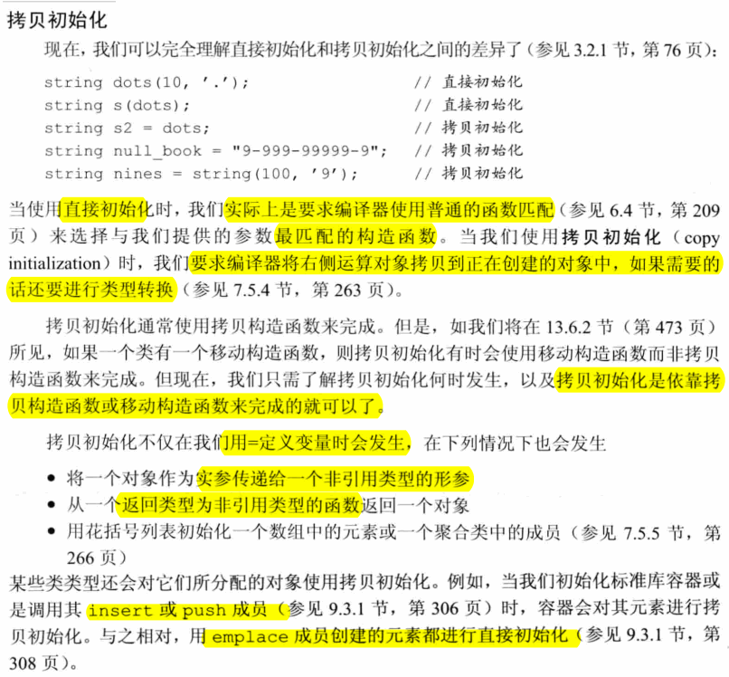

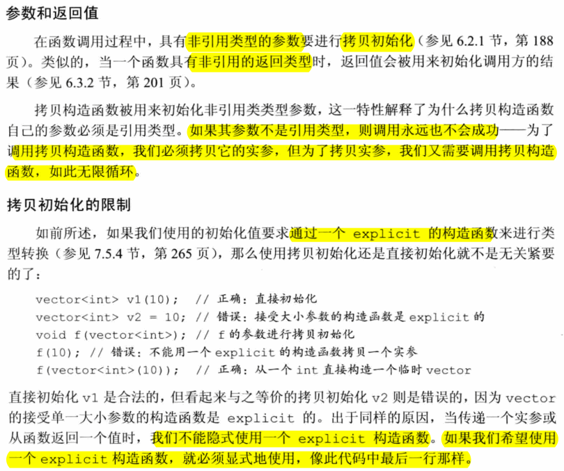

#### Exercise
- e13.1
  > 拷贝构造函数：如果一个**构造函数的第一个参数是自身类类型的引用**，且任何额外参数都是默认值，则此构造函数是拷贝构造函数  
  > 什么时候用它：用`=`定义变量时；将一个对象作为是实参传递给一个非引用类型的形参；从一个返回类型为非引用类型的函数返回一个对象；用花括号列表初始化一个数组中的元素或一个聚合类中的成员。
- e13.2
  > 这是一个构造函数，形参是非引用类型。如果调用它，需要调用拷贝构造函数（因为将一个对象作为实参传递给一个非引用类型的形参是需要调用拷贝构造函数），而调用拷贝构造函数必须拷贝它的实参，但为了拷贝实参，又需要调用拷贝构造函数，如此无限循环。
- e13.3
  ```c++
  #include "StrBlob.h"
  int main() {
      StrBlob sb1({"abc", "efg"});
      cout << "sb1: " << sb1.front() << endl;
      cout << "sb1: " << sb1.count() << endl;
      StrBlob sb2 = sb1;
      cout << "sb2: " << sb2.front() << endl;
      cout << "sb2: " << sb2.count() << endl;

      StrBlobPtr sbp1(sb1);
      cout << "sbp1: " << sbp1.deref() << endl;
      cout << "sbp1: " << sbp1.count() << endl;
      StrBlobPtr sbp2 = sbp1;
      cout << "sbp2: " << sbp2.deref() << endl;
      cout << "sbp2: " << sbp2.count() << endl;
  }
  //output
  sb1: abc
  sb1: 1
  sb2: abc
  sb2: 2
  sbp1: abc
  sbp1: 2
  sbp2: abc
  sbp2: 2
  ```
- e13.4
  ```c++
  #include <iostream>
  using namespace std;

  class Point {
  public:
      Point() {}
      Point(const Point &p) { cout << __PRETTY_FUNCTION__ << endl; }
  };

  // 注意拷贝构造函数，都是发生在对象定义的时候。像*heap = local这一行，对应的时拷贝赋值运算符
  Point global;
  Point foo_bar(Point arg) {   // 1. 将一个对象作为实参传递给一个非引用类型的形参
      Point local = arg,          // 2. = 定义变量
      *heap = new Point(global);    // 3. 这里发生在new Point(global)而不是=，是显示调用构造函数。
      *heap = local;                  // 这个并不是，是赋值操作，因为拷贝构造应该在构造对象时调用
      Point pa[4] = { local, *heap }; // 4、5. 用花括号列表初始化一个数组中的元素
      return *heap;               // 6. 从一个返回类型为非引用类型的函数返回一个对象
  }

  int main() {
      Point p1;
      foo_bar(p1);
  }
  ```
- e13.5
  ```c++
  #include <iostream>
  using namespace std;

  class Point {
  public:
      Point() {}
      Point(const Point &p) { cout << __PRETTY_FUNCTION__ << endl; }
  };

  Point global;
  Point foo_bar(Point arg) {
      Point local = arg, *heap = new Point(global);
      *heap = local;
      Point pa[4] = { local, *heap };
      return *heap;
  }

  int main() {
      Point p1;
      foo_bar(p1);
  }
  ```
### 13.1.2 拷贝赋值运算符
- 某些运算符，包括赋值运算符，必须定义为成员函数。**如果一个运算符是一个成员函数，其左侧运算对象就绑定到隐式的this参数**。对于一个二元运算符，例如赋值运算符，其右侧运算对象作为显示参数传递
- 赋值运算符通常应该**返回一个指向其左侧运算对象的引用**。另外，标准库通常要求保存在容器中的类型要具有赋值运算符，且其返回值是左侧运算对象的引用

#### Exercise
- e13.6
  > 拷贝赋值运算符时一个名为`operator=`的函数，接收一个与其所在类相同类型的参数  
  > 当赋值运算发生时，使用拷贝赋值运算符  
  > 合成拷贝赋值运算符完成的工作：将右侧运算对象的每个非static成员赋予左侧运算对象的对应成员，这一工作时通过成员类型的拷贝赋值运算符来完成的。对于数组类型的成员，逐个赋值数组元素。合成拷贝赋值运算符返回一个指向其左侧运算对象的引用  
  > 如果一个类为定义自己的拷贝赋值运算符，编译器会为它生成一个合成拷贝赋值运算符
- e13.7
  ```
  #include "StrBlob.h"

  int main() {
      StrBlob sb1({"abc", "efg"});
      cout << "sb1: " << sb1.front() << " "<< sb1.count() << endl;
      StrBlob sb2 = sb1, sb3;
      cout << "sb2: " << sb2.front() << " " << sb2.count() << endl;
      sb3 = sb2;
      cout << "sb3: " << sb3.front() << " " << sb3.count() << endl;
      cout << "sb1: " << sb1.front() << " "<< sb1.count() << endl;
      cout << "sb2: " << sb2.front() << " " << sb2.count() << endl;

      StrBlobPtr sbp1(sb1);
      cout << "sbp1: " << sbp1.deref() << " " << sbp1.count() << endl;
      StrBlobPtr sbp2 = sbp1, sbp3;
      cout << "sbp2: " << sbp2.deref() << " " << sbp2.count() << endl;
      sbp3 = sbp2;
      cout << "sbp3: " << sbp3.deref() << " " << sbp3.count() << endl;
      cout << "sbp1: " << sbp1.deref() << " " << sbp1.count() << endl;
      cout << "sbp2: " << sbp2.deref() << " " << sbp2.count() << endl;
  }

  //output： 从输出来看，拷贝赋值和拷贝构造一样，都共享了指针，并没有从指针那里完全把数据拷贝过来。俗称浅拷贝
  sb1: abc 1
  sb2: abc 2
  sb3: abc 3
  sb1: abc 3
  sb2: abc 3
  sbp1: abc 3
  sbp2: abc 3
  sbp3: abc 3
  sbp1: abc 3
  sbp2: abc 3
  ```
- e13.8
  ```c++
  #include <string>
  #include <iostream>

  using namespace std;

  class HasPtr {
  public:
      HasPtr(const std::string &s = std::string()):ps(new std::string(s)), i(0) {
          std::cout << __PRETTY_FUNCTION__ << std::endl;
      }
      HasPtr(const HasPtr &hp):ps(new std::string(*hp.ps)), i(hp.i) {
          std::cout << __PRETTY_FUNCTION__ << std::endl;
      }
      HasPtr& operator=(const HasPtr &hp) {
          std::cout << __PRETTY_FUNCTION__ << std::endl;
          ps = new std::string(*hp.ps);
          i = hp.i;
          return *this //奇怪了，没有这一条编译也通过
      }
  private:
      std::string *ps;
      int i;
  };

  int main() {
      HasPtr hp("test");
      HasPtr hp_cp(hp);
      HasPtr hp_as;
      hp_as = hp;
  }
  ```
  ```
  //output
  HasPtr::HasPtr(const string&)
  HasPtr::HasPtr(const HasPtr&)
  HasPtr::HasPtr(const string&)
  HasPtr& HasPtr::operator=(const HasPtr&)
  ```
### 13.1.3 析构函数
- 由于析构函数不接受参数，因此它不能被重载，对于一个给定类，只会有唯一一个析构函数
- 在一个构造函数中，**成员的初始化是在函数体执行之前完成的**，且按照它们在勒种出现的顺序进行初始化。在一个析构函数中，**首先执行函数体，然后销毁成员**。程序按初始化顺序的逆序销毁。
- 隐式销毁一个**内置指针类型**的成员不会delete它所指向的对象
  
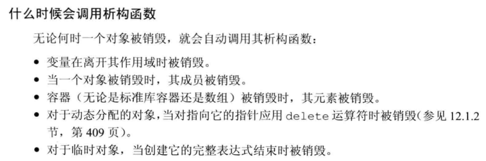

- 当指向一个对象的引用或指针离开作用域时，析构函数不会执行
- 认识到析构函数体自身**并不直接销毁成员**是非常重要的。成员是在析构函数体之后隐含的析构阶段中被销毁的。在整个对象销毁过程中，析构函数体是作为成员销毁步骤之外的另一部分而进行的。

#### Exercise
- e13.9
  > 析构函数是类的一个成员函数，名字由波浪号接类名构成。它没有返回值，也不接受参数。它释放对象使用的资源，并销毁对象的非static数据成员  
  > 析构函数完成什么工作：析构函数的函数体可执行类设计者希望执行的任何收尾工作。通常，析构函数释放对象在生存期分配的所有资源  
  > 当一个类未定义自己的析构函数时，编译器会为它定义一个合成析构函数。
- e13.10
  > 当StrBlob对象销毁时，所指动态分配对象的use_count会递减，当为0时会销毁对象。而StrBlobPtr对象销毁时，所指动态分配对象use_count不会递减，也不会销毁对象
  ```c++
    #include "StrBlob.h"


    int main() {
        StrBlob sb1({"abc", "efg"});
        cout << "sb1: " << sb1.front() << " "<< sb1.count() << endl;

        {
            StrBlob sb2 = sb1, sb3;
            cout << "sb2: " << sb2.front() << " " << sb2.count() << endl;
            sb3 = sb2;
            cout << "sb3: " << sb3.front() << " " << sb3.count() << endl;
            cout << "sb2: " << sb2.front() << " " << sb2.count() << endl;
        }
        cout << "sb1: " << sb1.front() << " "<< sb1.count() << endl;

        StrBlobPtr sbp1(sb1);
        cout << "sbp1: " << sbp1.deref() << " " << sbp1.count() << endl;

        {
            StrBlobPtr sbp2 = sbp1, sbp3;
            cout << "sbp2: " << sbp2.deref() << " " << sbp2.count() << endl;
            sbp3 = sbp2;
            cout << "sbp3: " << sbp3.deref() << " " << sbp3.count() << endl;
            cout << "sbp2: " << sbp2.deref() << " " << sbp2.count() << endl;
        }
        cout << "sbp1: " << sbp1.deref() << " " << sbp1.count() << endl;
    }
  ```

  ```
  //output
    sb1: abc 1
    sb2: abc 2
    sb3: abc 3
    sb2: abc 3
    sb1: abc 1
    sbp1: abc 1
    sbp2: abc 1
    sbp3: abc 1
    sbp2: abc 1
    sbp1: abc 1
  ```
- e13.11
  ```c++
    #include <string>
    #include <iostream>

    using namespace std;

    class HasPtr {
    public:
        HasPtr(const std::string &s = std::string()):ps(new std::string(s)), i(0) {
            std::cout << __PRETTY_FUNCTION__ << std::endl;
        }
        HasPtr(const HasPtr &hp):ps(new std::string(*hp.ps)), i(hp.i) {
            std::cout << __PRETTY_FUNCTION__ << std::endl;
        }
        HasPtr& operator=(const HasPtr &hp) {
            std::cout << __PRETTY_FUNCTION__ << std::endl;
            ps = new std::string(*hp.ps);
            i = hp.i;
            return *this;
        }
        ~HasPtr() {
            std::cout << __PRETTY_FUNCTION__ << std::endl;
            delete ps;
        }
    private:
        std::string *ps;
        int i;
    };

    int main() {
        HasPtr hp("test");
        {
            HasPtr hp_cp(hp);
        }
        HasPtr hp_as;
        hp_as = hp;
    }
  ```

  ```
  \\output
  HasPtr::HasPtr(const string&)
  HasPtr::HasPtr(const HasPtr&)
  HasPtr::~HasPtr()
  HasPtr::HasPtr(const string&)
  HasPtr& HasPtr::operator=(const HasPtr&)
  HasPtr::~HasPtr()
  HasPtr::~HasPtr()
  ```
- e13.12
  ```
  // accum 离开作用域；item1/item2离开作用域，共三次
  // item1(*trans), item2(accum)，是拷贝构造函数，使用了*trans, accum的引用。所以这里并没有产生临时对象
  bool fcn(const Sales_data *trans, Sales_data accum)
  {
      Sales_data item1(*trans), item2(accum);
      return item1.isbn() != item2.isbn();
  }
  ```
- e13.13
  ```c++
  #include <iostream>
  #include <vector>

  using namespace std;

  struct X {
      X() { 
          std::cout << __PRETTY_FUNCTION__ << " " << this << std::endl; 
      }

      X(const X&) {
          std::cout << __PRETTY_FUNCTION__ << " " << this << std::endl;
      }
      
      X& operator=(const X&) {
          std::cout << __PRETTY_FUNCTION__ << " " << this << std::endl;
      }
      
      ~X() {
          std::cout << __PRETTY_FUNCTION__ << " " << this << std::endl; 
      }
  };

  X f(X& x) {
      std::cout << __PRETTY_FUNCTION__ << " " << &x << std::endl;
      return x;
  }

  X f(X *x) {
      std::cout << __PRETTY_FUNCTION__ << " " << x << std::endl; 
      return *x;
  }

  X f2(X x) {
      std::cout << __PRETTY_FUNCTION__ << " " << &x << std::endl; 
      return x;
  }

  X *f() {
      std::cout << __PRETTY_FUNCTION__ << std::endl;
      X *x = new X();
      return x;
  }

  X f3() {
      std::cout << __PRETTY_FUNCTION__ << std::endl;
      X x;
      return x;
  }

  int main() {
      X x1; // X()
      X x2(x1); // X(const X&)
      X x3; // X()
      x3 = x1; // operator=(const X&)
      cout << "vector<X> init begin" << endl;
      vector<X> v{x1, x2}; // X(const X&)
      cout << "vector<X> init done" << endl;
      v[1] = x3; // operator=(const X&)
      v.pop_back(); // ~X()

      cout << "f(x) t1" << endl;
      X t1=f(x1);
      cout << "f(x) t2" << endl;
      X t2=f(&x1);
      cout << "f(x) t3" << endl;
      t1=f(&x1);
      cout << "f(x) t4" << endl;
      t1=f2(x1);
      cout << "f(x) t5" << endl;
      X *t3=f();
      cout << "f(x) t6" << endl;
      t1=f3();

      cout << "main end" << endl;
  }
  ```
  ```
  //output
  X::X() 0x7ffffd39b1b1
  X::X(const X&) 0x7ffffd39b1b2
  X::X() 0x7ffffd39b1b3
  X& X::operator=(const X&) 0x7ffffd39b1b3
  vector<X> init begin
  X::X(const X&) 0x7ffffd39b1e6
  X::X(const X&) 0x7ffffd39b1e7
  X::X(const X&) 0x7ffff5b56e80
  X::X(const X&) 0x7ffff5b56e81
  X::~X() 0x7ffffd39b1e7
  X::~X() 0x7ffffd39b1e6
  vector<X> init done
  X& X::operator=(const X&) 0x7ffff5b56e81
  X::~X() 0x7ffff5b56e81
  f(x) t1
  X f(X&) 0x7ffffd39b1b1
  X::X(const X&) 0x7ffffd39b1b4
  f(x) t2
  X f(X*) 0x7ffffd39b1b1
  X::X(const X&) 0x7ffffd39b1b5
  f(x) t3
  X f(X*) 0x7ffffd39b1b1
  X::X(const X&) 0x7ffffd39b1b7
  X& X::operator=(const X&) 0x7ffffd39b1b4
  X::~X() 0x7ffffd39b1b7
  f(x) t4
  X::X(const X&) 0x7ffffd39b1b6
  X f2(X) 0x7ffffd39b1b6
  X::X(const X&) 0x7ffffd39b1b7
  X& X::operator=(const X&) 0x7ffffd39b1b4
  X::~X() 0x7ffffd39b1b7
  X::~X() 0x7ffffd39b1b6
  f(x) t5
  X* f()
  X::X() 0x7ffff5b56ea0 //内存泄漏
  f(x) t6
  X f3()
  X::X() 0x7ffffd39b1b7
  X& X::operator=(const X&) 0x7ffffd39b1b4
  X::~X() 0x7ffffd39b1b7
  main end
  X::~X() 0x7ffffd39b1b5
  X::~X() 0x7ffffd39b1b4
  X::~X() 0x7ffff5b56e80
  X::~X() 0x7ffffd39b1b3
  X::~X() 0x7ffffd39b1b2
  X::~X() 0x7ffffd39b1b1
  ```

### 13.1.4 三/五法则
- 有三个基本操作可以控制类的拷贝操作：拷贝构造函数、拷贝赋值运算符和析构函数
  - 新标准下，还可以定义一个移动构造函数和一个移动赋值运算符
- 这些操作应该被看做一个整体。通常，只需要其中一个操作，而不需要定义所有操作的情况是很少见的。
- **如果一个类需要一个析构函数，几乎可以肯定它也需要一个拷贝构造函数和一个拷贝赋值运算符**。

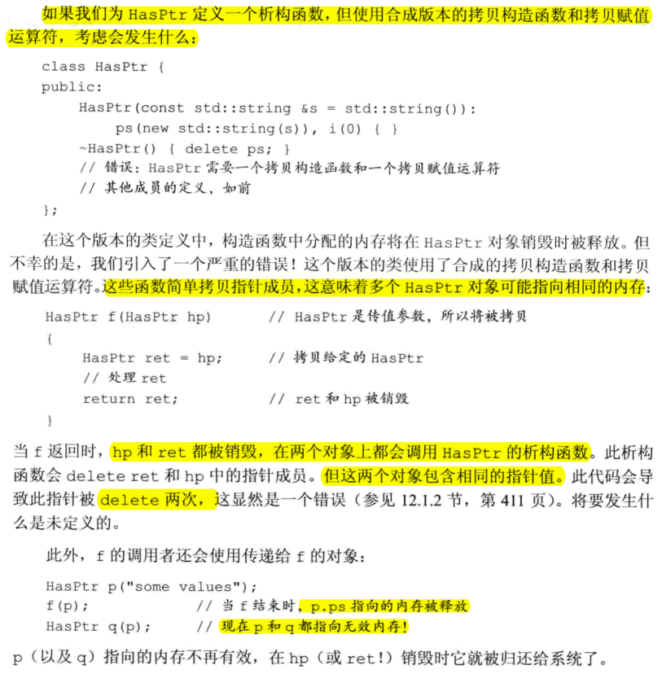

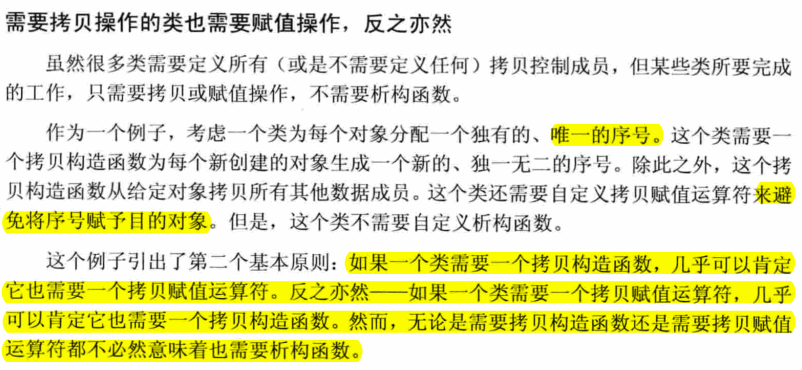

#### Exercise
- e13.14
  ```c++
  #include <iostream>
  using namespace std;

  class numbered {
  public:
      numbered(int sn=base) : mysn(base++) {
          cout << __PRETTY_FUNCTION__ << " " << mysn << endl;
      }
  //private:
      int mysn;
      static int base;
  };
  int numbered::base = 666;

  void f(numbered s) {
      cout << __PRETTY_FUNCTION__ << " " << s.mysn << endl;
  }

  int main() {
      numbered a, b = a, c = b;
      cout << "f test" << endl;
      f(a); f(b); f(c);
  }

  //output
  numbered::numbered(int) 666
  f test
  void f(numbered) 666
  void f(numbered) 666
  void f(numbered) 666
  ```
- e13.15
  ```c++
  #include <iostream>
  using namespace std;

  class numbered {
  public:
      numbered(int sn=base) : mysn(base++) {
          cout << __PRETTY_FUNCTION__ << " " << mysn << endl;
      }
      numbered(const numbered &nb) : mysn(base++) {
          cout << __PRETTY_FUNCTION__ << " " << mysn << endl;
      }
  //private:
      int mysn;
      static int base;
  };
  int numbered::base = 666;

  void f(numbered s) {
      cout << __PRETTY_FUNCTION__ << " " << s.mysn << endl;
  }

  int main() {
      numbered a, b = a, c = b;
      cout << "f test" << endl;
      f(a); f(b); f(c);
  }
  // output
  numbered::numbered(int) 666
  numbered::numbered(const numbered&) 667
  numbered::numbered(const numbered&) 668
  f test
  numbered::numbered(const numbered&) 669
  void f(numbered) 669
  numbered::numbered(const numbered&) 670
  void f(numbered) 670
  numbered::numbered(const numbered&) 671
  void f(numbered) 671
  ```
- e13.16
  ```c++
  #include <iostream>
  using namespace std;

  class numbered {
  public:
      numbered(int sn=base) : mysn(base++) {
          cout << __PRETTY_FUNCTION__ << " " << mysn << endl;
      }
      numbered(const numbered &nb) : mysn(base++) {
          cout << __PRETTY_FUNCTION__ << " " << mysn << endl;
      }
  //private:
      int mysn;
      static int base;
  };
  int numbered::base = 666;

  void f(const numbered &s) {
      cout << __PRETTY_FUNCTION__ << " " << s.mysn << endl;
  }

  int main() {
      numbered a, b = a, c = b;
      cout << "f test" << endl;
      f(a); f(b); f(c);
  }
  //output
  numbered::numbered(int) 666
  numbered::numbered(const numbered&) 667
  numbered::numbered(const numbered&) 668
  f test
  void f(const numbered&) 666
  void f(const numbered&) 667
  void f(const numbered&) 668
  ```

### 13.1.5 使用=default

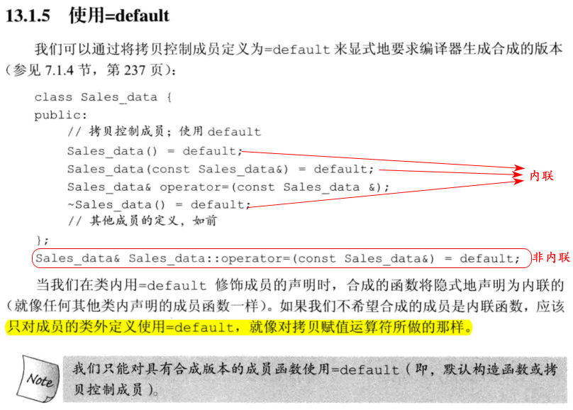

- 对于析构函数已删除的类型，不能定义该类型的变量或释放指向该类型动态分配对象的指针

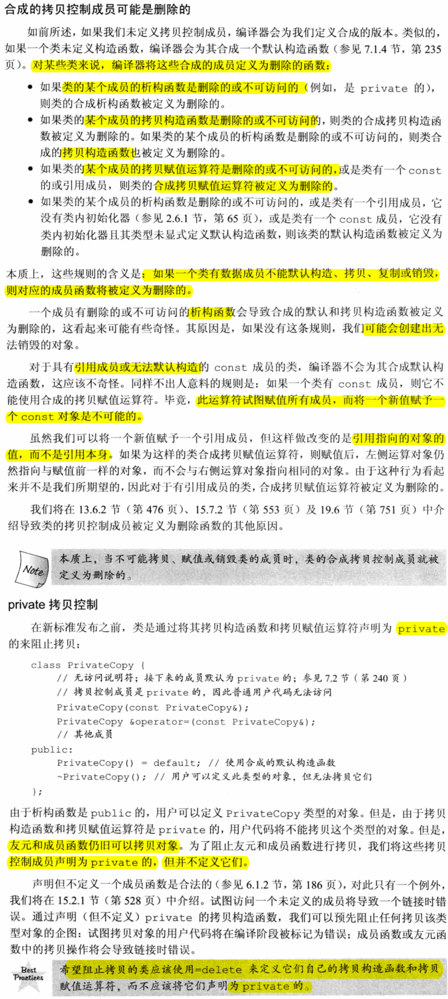

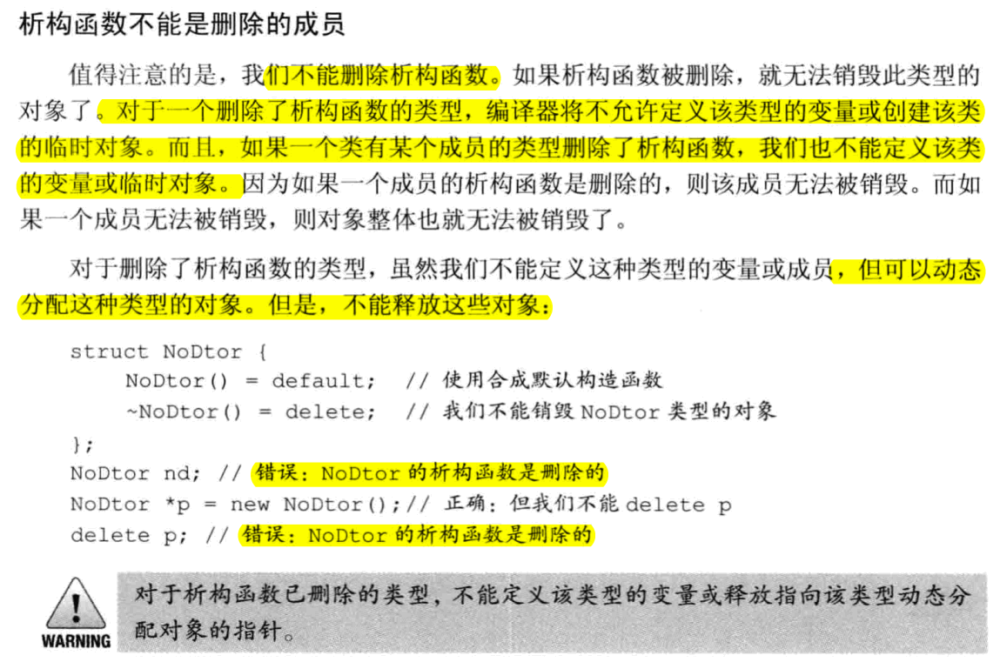

#### Exercise
- e13.18
  ```c++
  #include <iostream>
  #include <string>

  using namespace std;

  class Employee {
  public:
      Employee() : name(""), id(id_base++) {}
      Employee(string name_) : name(name_), id(id_base++) {}
      void print() {
          cout << name << ":" << id << endl;
      }
  private:
      string name;
      size_t id;
      static size_t id_base;
  };

  size_t Employee::id_base = 0;

  int main() {
      Employee e1("skd");
      e1.print();
      Employee e2;
      e2.print();
      e2 = e1;
      e2.print();
  }
  // output
  skd:0
  :1
  skd:0
  ```
- e13.19
  > 不需要，因为一个员工拷贝到另一个员工，或者用一个员工信息复制到另一个员工有点不符合常理
  ```c++
  #include <iostream>
  #include <string>

  using namespace std;

  class Employee {
  public:
      Employee() : name(""), id(id_base++) {}
      Employee(string name_) : name(name_), id(id_base++) {}
      Employee(const Employee&) = delete;
      Employee &operator=(const Employee&) = delete;
      void print() {
          cout << name << ":" << id << endl;
      }
  private:
      string name;
      size_t id;
      static size_t id_base;
  };

  size_t Employee::id_base = 0;

  int main() {
      Employee e1("skd");
      e1.print();
      Employee e2;
      e2.print();
  }
  ```
- e13.20
  > 会拷贝 file, wm
- e13.21
  > 因为封装在库函数中，库已经很好的定义了这些内容。包括智能指针，也不需要析构函数做什么工作。另外，拷贝，赋值所以默认的行为完全符合要求。

## 13.2 拷贝控制和资源管理

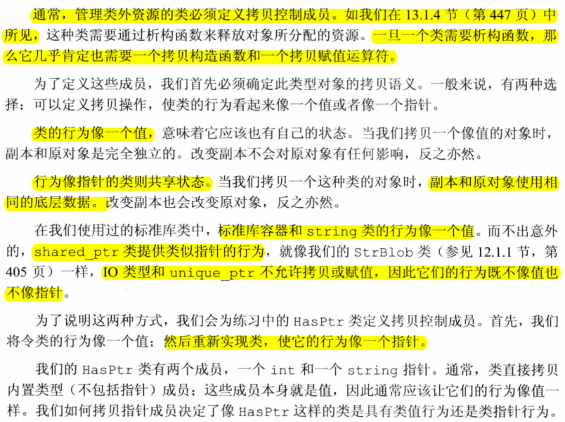

#### Exercise
- e13.22
  ```c++
  #include <string>
  #include <iostream>

  using namespace std;

  class HasPtr {
  public:
      HasPtr(const std::string &s = std::string()):ps(new std::string(s)), i(0) {
          std::cout << __PRETTY_FUNCTION__ << std::endl;
      }
      HasPtr(const HasPtr &hp):ps(new std::string(*hp.ps)), i(hp.i) {
          std::cout << __PRETTY_FUNCTION__ << std::endl;
      }
      // 这里会造成内存泄漏。应该先释放目前持有的，再指向新的内存
      HasPtr& operator=(const HasPtr &hp) {
          std::cout << __PRETTY_FUNCTION__ << std::endl;
          ps = new std::string(*hp.ps);
          i = hp.i;
          return *this;
      }
      ~HasPtr() {
          std::cout << __PRETTY_FUNCTION__ << std::endl;
          delete ps;
      }
  private:
      std::string *ps;
      int i;
  };
  ```
### 13.2.1 行为像值的类

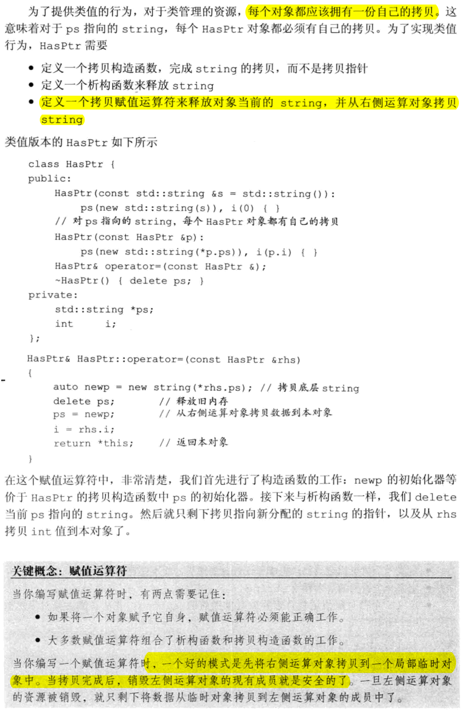

#### Exercise
- e13.23
  ```c++
  #include <string>
  #include <iostream>

  using namespace std;

  class HasPtr {
  public:
      HasPtr(const std::string &s = std::string()):ps(new std::string(s)), i(0) {
          std::cout << __PRETTY_FUNCTION__ << std::endl;
      }
      HasPtr(const HasPtr &hp):ps(new std::string(*hp.ps)), i(hp.i) {
          std::cout << __PRETTY_FUNCTION__ << std::endl;
      }
      HasPtr& operator=(const HasPtr &rhs) {
          std::cout << __PRETTY_FUNCTION__ << std::endl;
          auto newp = new std::string(*rhs.ps);
          delete ps;
          ps = newp;
          i = rhs.i;
          return *this;
      }
      ~HasPtr() {
          std::cout << __PRETTY_FUNCTION__ << std::endl;
          delete ps;
      }
  private:
      std::string *ps;
      int i;
  };
  ```

  ```diff
  dongkesi@DESKTOP-CL29DN1:/mnt/d/workspace/github/C++-Primer/ch13$ diff t13-22.h t13-23.h
  14c14
  <     HasPtr& operator=(const HasPtr &hp) {
  ---
  >     HasPtr& operator=(const HasPtr &rhs) {
  16,17c16,19
  <         ps = new std::string(*hp.ps);
  <         i = hp.i;
  ---
  >         auto newp = new std::string(*rhs.ps);
  >         delete ps;
  >         ps = newp;
  >         i = rhs.i;
  ```
- e13.24
  > 如果没有定义析构函数，合成的析构函数，并不会去释放ps指向的内存，从而造成内存泄漏  
  > 如果没有定义拷贝构造函数，合成的拷贝构造函数，会把lhs拷贝到this->ps，两者指向同样的内存。如果无意释放了其中一个，也会造成另外的指针ps称为悬挂指针
- e13.25
  > 拷贝构造函数需要提取传入的对象引用指向的值，然后使用make_shared再创建一份  
  > 拷贝赋值运算符类似拷贝构造函数  
  > 因为使用了智能指针，所以不需要释放内存，所以不需要析构函数
- e13.26
  ```c++
  #ifndef _T13_26_H
  #define _T13_26_H

  #include <iostream>
  #include <vector>
  #include <string>
  #include <memory>

  using namespace std;

  class StrBlobPtr;

  class StrBlob {
  public:
      typedef vector<string>::size_type size_type;
      StrBlob() : data(make_shared<vector<string>>()) { }
      StrBlob(initializer_list<string> il) : data(make_shared<vector<string>>(il)) { }
      StrBlob(const StrBlob &sb) : data(make_shared<vector<string>>(*sb.data)) {}
      StrBlob& operator=(const StrBlob &lhs) {
          data = make_shared<vector<string>>(*lhs.data);
          return *this;
      }

      size_type size() const { return data->size(); }
      bool empty() const { return data->empty(); }
      void push_back(const string &t) {
          //cout << __PRETTY_FUNCTION__ << endl;
          data->push_back(t);
      }
      void push_back(const string &t) const {
          //cout << __PRETTY_FUNCTION__ << endl;
          data->push_back(t);
      }
      void pop_back();
      void pop_back() const;

      string &front();
      string &back();
      const string &front () const;
      const string &back () const;
      StrBlobPtr begin();
      StrBlobPtr end();
      long count() { return data.use_count(); }
  private:
      shared_ptr<vector<string>> data;
      void check(size_type i, const string &msg) const;    friend class StrBlobPtr;
  };

  void StrBlob::check(size_type i, const string &msg) const {
      if (i >= data->size()) {
          throw out_of_range(msg);
      }
  }

  string& StrBlob::front() {
      check(0, "front on empty StrBlob");
      return data->front();
  }

  string& StrBlob::back() {
      check(0, "back on empty StrBlob");
      return data->back();
  }

  const string& StrBlob::front() const {
      check(0, "front on empty StrBlob");
      return data->front();
  }

  const string& StrBlob::back() const {
      check(0, "back on empty StrBlob");
      return data->back();
  }

  void StrBlob::pop_back() {
      check(0, "pop_back on empty StrBlob");
      data->pop_back();
  }

  void StrBlob::pop_back() const {
      check(0, "pop_back on empty StrBlob");
      data->pop_back();
  }

  class StrBlobPtr {
  public:
      StrBlobPtr() : curr(0) {}
      StrBlobPtr(StrBlob &a, size_t sz = 0) : wptr(a.data), curr(sz) {}
      string &deref() const;
      StrBlobPtr &incr();
      bool operator!=(const StrBlobPtr &sb) { return sb.curr != curr; }
      long count() { return wptr.use_count(); }

  private:
      shared_ptr<vector<string>> check(size_t, const string &) const;
      weak_ptr<vector<string>> wptr;
      size_t curr;
  };

  shared_ptr<vector<string>> StrBlobPtr::check(size_t i, const string &msg) const {
      auto ret = wptr.lock();
      if (!ret)
          throw runtime_error("unbound StrBlobPtr");
      if (i >= ret->size())
          throw out_of_range(msg);
      return ret;
  }

  string &StrBlobPtr::deref() const {
      auto p = check(curr, "dereference past end");
      return (*p)[curr];
  }

  StrBlobPtr &StrBlobPtr::incr() {
      check(curr, "increment past end of StrBlobPtr");
      ++curr;
      return *this;
  }


  StrBlobPtr StrBlob::begin() { return StrBlobPtr(*this); }
  StrBlobPtr StrBlob::end() {
      auto ret = StrBlobPtr(*this, data->size());
      return ret;
  }
  #endif
  ```

### 13.2.2 定义行为像指针的类

#### Exercise
- e13.27
  ```c++
  #include <string>
  #include <iostream>

  using namespace std;

  class HasPtr {
  public:
      HasPtr(const std::string &s = std::string()):ps(new std::string(s)), i(0), use(new std::size_t(1)) {
          std::cout << __PRETTY_FUNCTION__ << std::endl;
      }
      HasPtr(const HasPtr &hp):ps(new std::string(*hp.ps)), i(hp.i), use(hp.use) {
          std::cout << __PRETTY_FUNCTION__ << std::endl;
          ++*use;
      }
      HasPtr& operator=(const HasPtr &rhs) {
          std::cout << __PRETTY_FUNCTION__ << std::endl;
          ++*rhs.use;
          if (--*use == 0) {
              delete ps;
              delete use;
          }
          ps = rhs.ps;
          i = rhs.i;
          use = rhs.use;
          return *this;
      }
      ~HasPtr() {
          std::cout << __PRETTY_FUNCTION__ << std::endl;
          if (--*use == 0) {
              delete ps;
              delete use;
          }
      }
  private:
      std::string *ps;
      int i;
      std::size_t *use;
  };
  ```
- e13.28
  ```c++
  #ifndef T_13_28_H
  #define T_13_28_H
  #include <string>
  class TreeNode {
  public:
      TreeNode() : value(std::string()), count(new int(1)), left(nullptr), right(nullptr) {}
      TreeNode(const TreeNode &tn) : value(tn.value), count(tn.count), left(tn.left),
  right(tn.right) {
          ++*count;
      }
      TreeNode& operator=(const TreeNode &rhs) {
          ++*rhs.count;
          if (--*count == 0) {
              delete count;
              delete left;
              delete right;
          }
          value = rhs.value;
          count = rhs.count;
          left = rhs.left;
          right = rhs.right;
          return *this;
      }
      ~TreeNode() {
          if (--*count == 0) {
              delete count;
              delete left;
              delete right;
          }
      }
  private:
      std::string value;
      int *count;
      TreeNode *left;
      TreeNode *right;
  };

  class BinStrTree {
  public:
      BinStrTree() : root(new TreeNode()) {}
      BinStrTree(const BinStrTree &bst) : root(new TreeNode(*bst.root)) {}
      BinStrTree& operator=(const BinStrTree &rhs) {
          auto newp = new TreeNode(*rhs.root);
          delete root;
          root = newp;
          return *this;
      }
  private:
      TreeNode *root;
  };

  #endif
  ```
## 13.3 交换操作

- 对于那些与重排元素顺序的算法一起使用的类，定义swap时非常重要的，这类算法在需要交换两个元素时会调用swap
- 我们更希望swap交换指针而不是分配string的新副本
- 由于swap的存在就是为了优化代码，我们将其声明为inline函数
- 与拷贝成员不同，swap并不是必要的。但是，对于分配了资源的类，定义swap可能是一种很重要的优化手段
  
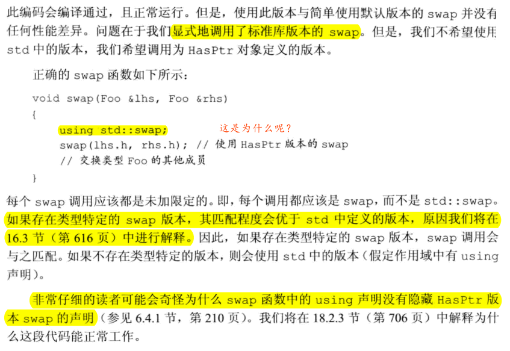

- 定义swap的类通常用swap来定义它们的赋值运算符
- 使用拷贝和交换的赋值运算符自动就是**异常（exception）**安全的，且能正确处理自赋值。

#### Exercise
- e13.29
  > [swap(lhs.ps, rhs.ps); feed the version : swap(std::string*, std::string*) and swap(lhs.i, rhs.i); feed the version : swap(int, int). Both them can't call swap(HasPtr&, HasPtr&). Thus, the calls don't cause a recursion loop.](https://github.com/Mooophy/Cpp-Primer/blob/9c37712d1ab3a71930dd7aad6542f94e2f76dcb5/ch13/README.md)

- e13.30
  ```c++
    #include <string>
    #include <iostream>

    using namespace std;

    class HasPtr {
    public:
        HasPtr(const std::string &s = std::string()):ps(new std::string(s)), i(0),
    use(new std::size_t(1)) {
            std::cout << __PRETTY_FUNCTION__ << std::endl;
        }
        HasPtr(const HasPtr &hp):ps(new std::string(*hp.ps)), i(hp.i), use(hp.use)
        {
            std::cout << __PRETTY_FUNCTION__ << std::endl;
            ++*use;
        }
    /*    HasPtr& operator=(const HasPtr &rhs) {
            std::cout << __PRETTY_FUNCTION__ << std::endl;
            ++*rhs.use;
            if (--*use == 0) {
                delete ps;
                delete use;
            }
            ps = rhs.ps;
            i = rhs.i;
            use = rhs.use;
            return *this;
        }
    */
        HasPtr& operator=(HasPtr rhs) {
            std::cout << __PRETTY_FUNCTION__ << std::endl;
            swap(*this, rhs);
            return *this;
        }

        ~HasPtr() {
            std::cout << __PRETTY_FUNCTION__ << std::endl;
            if (--*use == 0) {
                delete ps;
                delete use;
            }
        }

    private:
        std::string *ps;
        int i;
        std::size_t *use;

        friend void swap(HasPtr&, HasPtr&);
    };


    inline void swap(HasPtr &lhs, HasPtr &rhs) {
        std::cout << __PRETTY_FUNCTION__ << std::endl;
        using std::swap;
        swap(lhs.ps, rhs.ps);
        swap(lhs.i, rhs.i);
    }
  ```

  ```c++
    #include "t13-30.h"

    using namespace std;

    int main() {
        HasPtr h1("test1");

        HasPtr h2;
        h2 = h1;
    }
  ```

  ```c++
    //output
    HasPtr::HasPtr(const string&)
    HasPtr::HasPtr(const string&)
    HasPtr::HasPtr(const HasPtr&)
    HasPtr& HasPtr::operator=(HasPtr)
    void swap(HasPtr&, HasPtr&)
    HasPtr::~HasPtr()
    HasPtr::~HasPtr()
    HasPtr::~HasPtr()
  ```
- e13.31
  ```c++
    #include <string>
    #include <iostream>

    using namespace std;

    class HasPtr {
    public:
        HasPtr(const std::string &s = std::string()):ps(new std::string(s)), i(0),
    use(new std::size_t(1)) {
            std::cout << __PRETTY_FUNCTION__ << std::endl;
        }
        HasPtr(const HasPtr &hp):ps(new std::string(*hp.ps)), i(hp.i), use(hp.use)
        {
            std::cout << __PRETTY_FUNCTION__ << std::endl;
            ++*use;
        }

        HasPtr& operator=(HasPtr rhs) {
            std::cout << __PRETTY_FUNCTION__ << std::endl;
            swap(*this, rhs);
            return *this;
        }

        ~HasPtr() {
            std::cout << __PRETTY_FUNCTION__ << std::endl;
            if (--*use == 0) {
                delete ps;
                delete use;
            }
        }

        void print() const {
            std::cout << *ps << endl;
        }

    private:
        std::string *ps;
        int i;
        std::size_t *use;

        friend bool operator<(const HasPtr &lhs, const HasPtr &rhs);
        friend void swap(HasPtr&, HasPtr&);
    };


    inline void swap(HasPtr &lhs, HasPtr &rhs) {
        std::cout << __PRETTY_FUNCTION__ << std::endl;
        using std::swap;
        swap(lhs.ps, rhs.ps);
        swap(lhs.i, rhs.i);
    }

    bool operator<(const HasPtr &lhs, const HasPtr &rhs) {
        std::cout << __PRETTY_FUNCTION__ << std::endl;
        return *lhs.ps < *rhs.ps;
    }
  ```

  ```c++
    #include <vector>
    #include <algorithm>
    #include "t13-31.h"

    using namespace std;

    int main() {
        vector<HasPtr> v;
        v.push_back(HasPtr("1test"));
        v.push_back(HasPtr("3test"));
        v.push_back(HasPtr("4test"));
        v.push_back(HasPtr("2test"));
        sort(v.begin(), v.end());

        for (auto &e : v) {
            e.print();
        }
    }
  ```
- e13.32 
  > 如果是交换值的话，会受益，但是这里是指针，所以受益不多。

## 13.4 拷贝控制示例


## 13.5 动态内存管理类

#### Exercise
- e13.39
- e13.40
- e13.41
  > 先取元素后操作。如果使用前置会镂空一个元素。

## 13.6 对象移动
- 使用移动而非拷贝的原因：
  - 某些情况下，对象拷贝后就立即被销毁了；移动而非拷贝对象会大幅度提升性能；
  - 另一个原因源于IO类或unique_ptr这样的类包含不能被共享的资源（如指针或IO缓冲），因此，这些类型的对象不能拷贝但可以移动
- 标准库容器、string和shared_ptr类既支持移动也支持拷贝。IO类和unique_ptr类可以移动但不能拷贝。
### 13.6.1 右值引用
- 为了支持移动操作，引入了右值引用操作；
  - 右值引用就是必须绑定到右值的引用。可以通过`&&`而不是`&`来获得右值引用。
  - 右值引用有一个重要的性质——只能绑定到一个将要销毁的对象
    - 要么是字面常量，要么是表达式求值过程中创建的临时对象。
- 左值：
  - 持久的状态；对象的身份；
  - 例子：返回**左值引用**的函数、赋值、下标、解引用、前置递增/递减运算符
- 右值
  - 字面常量、表达式求值过程中创建的临时对象；对象的值；所引用的对象将要销毁、该对象没有其他用户；
  - 例子：返回**非引用类型**的函数、算术、关系、位以及后置递增/递减运算符
- 变量是左值，因此不能将一个右值引用直接绑定到一个变量上，即使这个变量是右值引用类型也不行。

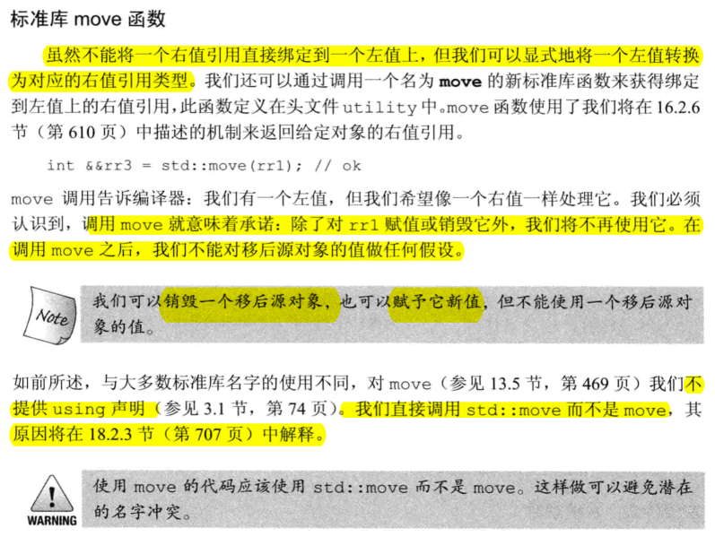 

#### Exercise
- e13.46
  ```c++
    #include <vector>
    using namespace std;

    int f() {
        return 0;
    }

    int main() {
    vector<int> vi(100);
    int &&r1 = f();  //返回非引用类型的函数
    int &r2a = vi[0]; //下标
    /*
    t13-46.cc:12:19: error: cannot bind rvalue reference of type ‘int&&’ to lvalue of type ‘__gnu_cxx::__alloc_traits<std::allocator<int> >::value_type {aka int}’
    int &&r2b = vi[0]; //对象的值
                   ^
    */
    //! int &&r2b = vi[0]; //对象的值
    int &r3 = r1; //变量是左值
    int &&r4 = vi[0] * f(); //算术
    }
  ```
- e13.47
    ```c++
    #ifndef T13_44_H
    #define T13_44_H
    #include <memory>
    #include <iostream>

    class String {
    public:
        String() : String("") {
            std::cout << __PRETTY_FUNCTION__ << std::endl;
        }
        String(const char *);
        String(const String &);
        String& operator= (const String &);
        ~String();

        const char *c_str() const { return elements; }
        size_t size() const { return end - elements; }
        size_t length() const { return end - elements - 1; }

    private:
        std::pair<char *, char *> alloc_n_copy(const char *, const char *);
        void range_initializer(const char *, const char *);
        void free();

    private:
        char *elements;
        char *end;
        std::allocator<char> alloc;
    };
    #endif
    ```

    ```c++
    #include "t13-44.h"
    #include <algorithm>
    #include <iostream>
    using namespace std;

    std::pair<char *, char *> String::alloc_n_copy(const char *b, const char *e) {
        auto str = alloc.allocate(e - b);
        return { str, std::uninitialized_copy(b, e, str) };
    }

    void String::range_initializer(const char *first, const char *last) {
        auto newstr = alloc_n_copy(first, last);
        elements = newstr.first;
        end = newstr.second;
    }

    String::String(const char *s) {
        char *st = const_cast<char *>(s);
        while (*st)
            ++st;
        range_initializer(s, ++st);
        cout << __PRETTY_FUNCTION__ << endl;
    }

    String::String(const String &rhs) {
        range_initializer(rhs.elements, rhs.end);
        cout << __PRETTY_FUNCTION__ << endl;
    }

    void String::free() {
        if (elements) {
            for_each(elements, end, [this](char &c) {alloc.destroy(&c); });
            alloc.deallocate(elements, end - elements);
        }
        cout << __PRETTY_FUNCTION__ << endl;
    }

    String::~String() {
        free();
        cout << __PRETTY_FUNCTION__ << endl;
    }

    String &String::operator= (const String &rhs) {
        auto newstr = alloc_n_copy(rhs.elements, rhs.end);
        free();
        elements = newstr.first;
        end = newstr.second;
        cout << __PRETTY_FUNCTION__ << endl;
        return *this;
    }
    ```
- e13.48
    ```c++
    #include "t13-44.h"
    #include <vector>
    #include <iostream>
    using namespace std;

    void foo(String x) {
        cout << x.c_str() << endl;
    }

    void bar(const String &x) {
        cout << x.c_str() << endl;
    }

    String baz() {
        cout << __PRETTY_FUNCTION__ << endl;
        String ret("world");
        return ret;
    }

    int main() {
        char txt[] = "main_text";

        String s0;
        String s1("hello");
        String s2(s0);
        String s3 = s1;
        String s4(txt);
        s2 = s1;

        foo(s1);
        bar(s1);
        foo("foo");
        bar("bar");
        String s5 = baz();

        vector<String> svec;
        svec.reserve(8);
        cout << "----" << endl;
        svec.push_back(s0);
        svec.push_back(s1);
        svec.push_back(s2);
        svec.push_back(s3);
        svec.push_back(s4);
        svec.push_back(s5);
        svec.push_back(baz());
        svec.push_back("good job");
        cout << "----" << endl;
        for (const auto &s : svec) {
            cout << s.c_str() << endl;
        }
    }
    ```

    ```
    //output
    String::String(const char*)
    String::String()
    String::String(const char*)
    String::String(const String&)
    String::String(const String&)
    String::String(const char*)
    void String::free()
    String& String::operator=(const String&)
    String::String(const String&)
    hello
    void String::free()
    String::~String()
    hello
    String::String(const char*)
    foo
    void String::free()
    String::~String()
    String::String(const char*)
    bar
    void String::free()
    String::~String()
    String baz()
    String::String(const char*)
    ----
    String::String(const String&)
    String::String(const String&)
    String::String(const String&)
    String::String(const String&)
    String::String(const String&)
    String::String(const String&)
    String baz()
    String::String(const char*)
    String::String(const String&)
    void String::free()
    String::~String()
    String::String(const char*)
    String::String(const String&)
    void String::free()
    String::~String()
    ----

    hello
    hello
    hello
    main_text
    world
    world
    good job
    void String::free()
    String::~String()
    void String::free()
    String::~String()
    void String::free()
    String::~String()
    void String::free()
    String::~String()
    void String::free()
    String::~String()
    void String::free()
    String::~String()
    void String::free()
    String::~String()
    void String::free()
    String::~String()
    void String::free()
    String::~String()
    void String::free()
    String::~String()
    void String::free()
    String::~String()
    void String::free()
    String::~String()
    void String::free()
    String::~String()
    void String::free()
    String::~String()
    ```
### 13.6.2 移动构造函数和移动赋值运算符
- 不抛出异常的移动构造函数和移动赋值运算符必须标记为noexcept
- 在移动操作之后，移后源对象必须保持有效的、可析构的状态，但是用户不能对其值进行任何假设。
- 只有当一个类没有定义任何自己版本的**拷贝控制成员**，且它的所有数据成员都能**移动构造或移动赋值**时，编译器才会为它**合成移动构造函数或移动赋值运算符**。
- 如果类定义了一个移动构造函数和/或一个移动赋值运算符，则该类的合成拷贝构造函数和拷贝赋值运算符会被定义为删除的。
- 如果一个类有一个可用的拷贝构造函数而没有移动构造函数，则其对象是通过拷贝构造函数来“移动”的。拷贝赋值运算符和移动赋值运算符的情况类似。

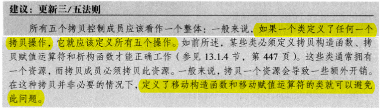  
- 在移动构造函数和移动赋值运算符这些类实现代码之外的地方，只有当你确信需要进行移动操作且移动操作时安全的，才可以使用std::move

#### Exercise
- e13.52
  ```
    -------
    HasPtr::HasPtr(const string&)
    HasPtr::HasPtr(const string&)
    -------
    HasPtr::HasPtr(const HasPtr&)
    HasPtr& HasPtr::operator=(HasPtr)
    void swap(HasPtr&, HasPtr&)
    HasPtr::~HasPtr()
    -------
    HasPtr::HasPtr(HasPtr&&)
    HasPtr& HasPtr::operator=(HasPtr)
    void swap(HasPtr&, HasPtr&)
    HasPtr::~HasPtr()
    -------
  ```

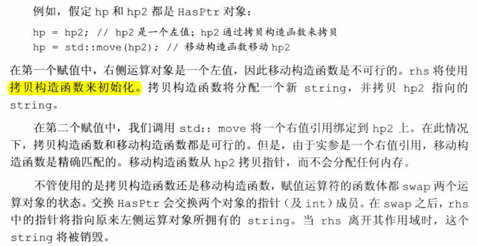 

- e13.53
- 

### 13.6.3 右值引用和成员函数
- 区分移动和拷贝的重载函数通常由一个版本接受一个const T&， 而另一个版本接受一个T&&
- 如果一个成员函数有引用限定符，则具有相同参数列表的所有版本都必须有引用限定符。

#### Exercise
- t13.56
  > 递归操作，因为ret是左值。然后继续调用左值

- t13.57    
  
  > 右值调用

- t13.58
  ```c++
    #ifndef T_13_58_H
    #define T_13_58_H

    #include <iostream>
    #include <vector>
    #include <algorithm>

    class Foo {
    public:
        Foo sorted() &&;
        Foo sorted() const &;
    private:
        std::vector<int> data;
    };

    Foo Foo::sorted() && {
        std::cout << __PRETTY_FUNCTION__ << std::endl;
        std::sort(data.begin(), data.end());
        return *this;
    }

    Foo Foo::sorted() const & {
        std::cout << __PRETTY_FUNCTION__ << std::endl;
    #if defined A
        Foo ret(*this);
        std::sort(ret.data.begin(), ret.data.end());
        return ret;
    #elif defined B
        Foo ret(*this);
        return ret.sorted();
    #else
        return Foo(*this).sorted();
    #endif
    }
    #endif
  ```

  ```c++
    #include "t13-58.h"
    using namespace std;

    int main() {
        Foo f;
        f.sorted();
        cout << "---" << endl;
        Foo().sorted();
    }
  ```