# 14 重载运算与类型转换

- 当运算符作用于类类型的运算对象时，可以通过运算符重载重新定义该运算符的含义。

## 14.1 基本概念
- 重载运算符函数的参数数量与该运算符作用的运算对象数量一样多。
- 除了重载的函数调用运算符operator()之外，其它**重载运算符不能含有默认实参**
- 当一个重载运算符时成员函数时，this绑定到左侧运算对象。成员运算符函数的（显示）参数数量比运算对象的数量少一个。
- 对于一个运算符函数来说，它或者是类的成员，或者至少含有一个类类型的参数。
  ```c++
  //错误：不能为int重定义内置的运算符
  int operator+(int, int)
  ```
- 只能重载已有的运算符，而无权发明新的运算符号

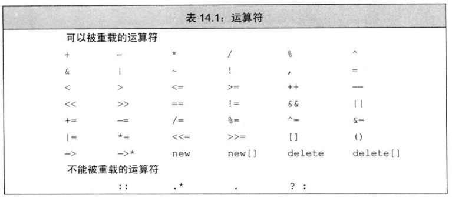

- 两种调用方式，比如“+”
  ```c++
  data1 + data2;
  operator+(data1, data2);

  data1 += data2;
  data1.operator+=(data2);
  ```

- 通常情况下，不应该重载逗号、取地址、逻辑与和逻辑或运算符

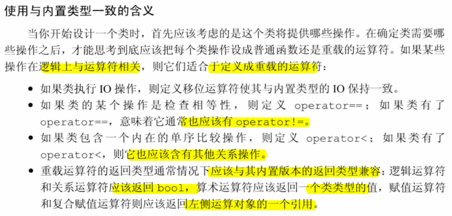

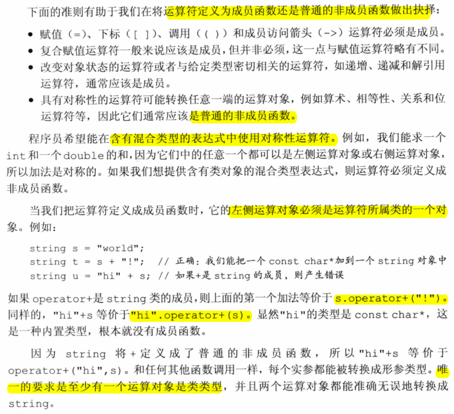

#### Exercise
- e14.1
  - 相同
    > 对于一个重载的运算符来说，其优先级和结合律与对应的内置运算符保持一致。
  - 不同
    > 1. 对于一个运算符函数来说，它或者是类的成员，或者至少含有一个类类型的参数。  
    > 2. 可以像调用普通函数一样直接调用运算符函数。  
    > 3. 某些运算符不应该被重载。
      > 某些运算符制定了运算对象求值的顺序。因为使用重载的运算符本质上是一次函数调用，所以这些关于运算对象求值顺序的规则无法应用到重载运算符上。特别是，逻辑与运算符、逻辑或运算符和逗号运算符的运算对**象求值顺序规则无法保留下来**。除此之外，&&和||运算符的重载版本也**无法保留内置运算符的短路求值属性**，两个运算对象总是会被求值。
- e14.2
  ```c++
  #ifndef SALES_DATA_H
  #define SALES_DATA_H

  #include <string>
  #include <iostream>
  using std::istream;
  using std::ostream;

  class Sales_data {
  friend Sales_data add(const Sales_data &lhs, const Sales_data &rhs);
  friend istream& read(istream &is, Sales_data &item);
  friend ostream& print(ostream &os, const Sales_data &item);

  friend Sales_data operator+(const Sales_data &lhs, const Sales_data &rhs);
  friend istream& operator>>(istream &is, Sales_data &item);
  friend ostream& operator<<(ostream &os, const Sales_data &item);

  public:
      Sales_data(std::string s, unsigned cnt, double price) :
          bookNo(s), units_sold(cnt), revenue(cnt * price) {
          std::cout << __PRETTY_FUNCTION__ << std::endl;
      }

      Sales_data() : Sales_data("", 0, 0) {
          std::cout << __PRETTY_FUNCTION__ << std::endl;
      }

      Sales_data(std::string s) : Sales_data(s, 0, 0) {
          std::cout << __PRETTY_FUNCTION__ << std::endl;
      }

      Sales_data(std::istream &is) : Sales_data() {
          std::cout << __PRETTY_FUNCTION__ << std::endl;
          //read(is, *this);
          is >> *this;
      }

      Sales_data& combine(const Sales_data &rhs);
      Sales_data& operator+=(const Sales_data &);
      std::string isbn() const { return bookNo; }

  private:
      double avg_price() const;
      std::string bookNo;
      unsigned units_sold = 0;
      double revenue = 0.0;
  };

  Sales_data operator+(const Sales_data &lhs, const Sales_data &rhs);
  istream& operator>>(istream &is, Sales_data &item);
  ostream& operator<<(ostream &os, const Sales_data &item);

  Sales_data& Sales_data::combine(const Sales_data &rhs) {
      units_sold += rhs.units_sold;
      revenue += rhs.revenue;
      return *this;
  }

  istream& read(istream &is, Sales_data &item) {
      double price = 0;
      is >> item.bookNo >> item.units_sold >> price;
      item.revenue = price * item.units_sold;
      return is;
  }

  ostream& print(ostream &os, const Sales_data &item) {
      os << item.isbn() << " " << item.units_sold << " "
          << item.revenue;// << " " << item.avg_price();
      return os;
  }

  Sales_data add(const Sales_data &lhs, const Sales_data &rhs) {
      Sales_data sum = lhs;
      sum.combine(rhs);
      return sum;
  }

  Sales_data& Sales_data::operator+=(const Sales_data &rhs) {
      units_sold += rhs.units_sold;
      revenue += rhs.revenue;
      return *this;
  }

  Sales_data operator+(const Sales_data &lhs, const Sales_data &rhs) {
      Sales_data sum = lhs;
      sum += rhs;
      return sum;
  }

  istream& operator>>(istream &is, Sales_data &item) {
      double price = 0;
      is >> item.bookNo >> item.units_sold >> price;
      item.revenue = price * item.units_sold;
      return is;
  }

  ostream& operator<<(ostream &os, const Sales_data &item) {
      os << item.isbn() << " " << item.units_sold << " "
          << item.revenue;// << " " << item.avg_price();
      return os;
  }

  inline double Sales_data::avg_price() const
  {
      if (units_sold)
          return revenue/units_sold;
      else
          return 0;
  }
  #endif
  ```

  ```c++
  #include "t14-2.h"
  #include <vector>
  #include <iostream>
  #include <algorithm>

  using namespace std;

  bool isSmall(const Sales_data &s1, const Sales_data &s2) {
      return s1.isbn() < s2.isbn();
  }

  void compareIsbn(vector<Sales_data> &books) {
      sort(books.begin(), books.end(), isSmall);
  }

  int main() {
      vector<Sales_data> books = {{"0-201-78345-1", 3, 20.00}, {"0-201-78345-9", 3, 20.00}, {"0-201-78345-2", 3, 20.00}, {"0-201-78345-0", 3, 20.00}};
      for (auto &item : books)
          cout << item << " ";
      cout << endl;

      compareIsbn(books);
      for (auto &item : books)
          cout << item << " ";
      cout << endl;

      Sales_data d;
      cin >> d;
      cout << d << endl;
  }
  ```

- e14.3
  > (a): "cobble" == "stone" 哪个都不用，直接是指针比较  
  > (b): svec1[0] == svec2[0] string  
  > (c): svec1 == svec2 vector  
  > (d): "svec1[0] == "stone" string  
- e14.4
  > 推荐非成员函数： (a) % (e) << (f) && (g) == 
  > 必须成员函数: (d) -> (h) ()
  > 通常应该成员函数：(b) %= (c) ++
- e14.5

## 14.2 输入和输出运算符
### 14.2.1 重载输出运算符<<
- 通常，输出运算符应该主要负责打印对象的内容而非控制格式，输出运算符不应该打印换行符。

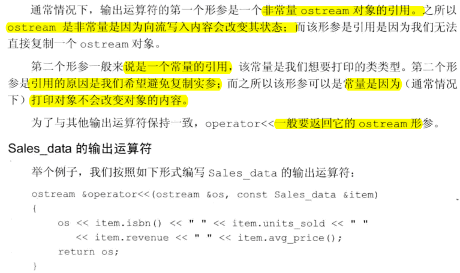

- **输入输出运算符必须是非成员函数**，而不能是类的成员函数。否则，它们的左侧运算对象将是我们的类的一个对象。
- IO运算符通常需要读写类的非公有数据成员，所以IO运算符一般被声明为友元。

#### Exercise
- e14.6
  ```c++
  class Sales_data {
    friend ostream& operator<<(ostream &os, const Sales_data &item);
    ...
  };

  ostream& operator<<(ostream &os, const Sales_data &item) {
      os << item.isbn() << " " << item.units_sold << " "
          << item.revenue;// << " " << item.avg_price();
      return os;
  }
  ```
- e14.7
  ```c++
  #ifndef T14_7_H
  #define T14_7_H
  #include <memory>
  #include <iostream>

  class String {
  friend std::ostream& operator<<(std::ostream &, const String &);

  public:
      String() : String("") {
          std::cout << __PRETTY_FUNCTION__ << std::endl;
      }
      String(const char *);
      String(const String &);
      String& operator= (const String &);
      ~String();

      const char *c_str() const { return elements; }
      size_t size() const { return end - elements; }
      size_t length() const { return end - elements - 1; }

  private:
      std::pair<char *, char *> alloc_n_copy(const char *, const char *);
      void range_initializer(const char *, const char *);
      void free();

  private:
      char *elements;
      char *end;
      std::allocator<char> alloc;
  };

  #endif
  ```

  ```c++
  #include "t14-7.h"
  #include <algorithm>
  #include <iostream>
  using namespace std;

  std::pair<char *, char *> String::alloc_n_copy(const char *b, const char *e) {
      auto str = alloc.allocate(e - b);
      return { str, std::uninitialized_copy(b, e, str) };
  }

  void String::range_initializer(const char *first, const char *last) {
      auto newstr = alloc_n_copy(first, last);
      elements = newstr.first;
      end = newstr.second;
  }

  String::String(const char *s) {
      char *st = const_cast<char *>(s);
      while (*st)
          ++st;
      range_initializer(s, ++st);
      cout << __PRETTY_FUNCTION__ << endl;
  }

  String::String(const String &rhs) {
      range_initializer(rhs.elements, rhs.end);
      cout << __PRETTY_FUNCTION__ << endl;
  }

  void String::free() {
      if (elements) {
          for_each(elements, end, [this](char &c) {alloc.destroy(&c); });
          alloc.deallocate(elements, end - elements);
      }
      cout << __PRETTY_FUNCTION__ << endl;
  }

  String::~String() {
      free();
      cout << __PRETTY_FUNCTION__ << endl;
  }

  String &String::operator= (const String &rhs) {
      auto newstr = alloc_n_copy(rhs.elements, rhs.end);
      free();
      elements = newstr.first;
      end = newstr.second;
      cout << __PRETTY_FUNCTION__ << endl;
      return *this;
  }

  std::ostream& operator<<(std::ostream &os, const String &item) {
      os << item.c_str();
      return os;
  }
  ```

  ```c++
  #include "t14-7.h"

  int main() {
      String s("abc");
      std::cout << s << std::endl;
  }
  ```
- e14.8

### 14.2.2 重载输入运算符>>
- 输入运算符必须处理输入可能失败的情况，而输出运算符不需要
- 当读取操作发生错误时输入运算符应该负责从错误中恢复。

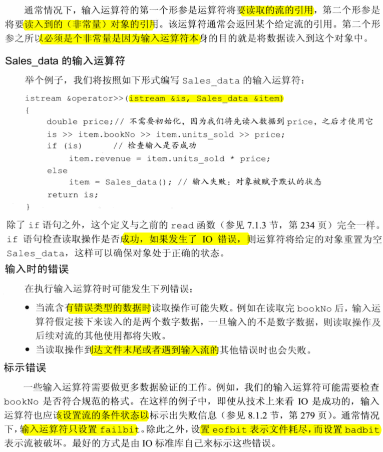 

#### Exercise
- e14.9
  ```c++
  istream& operator>>(istream &is, Sales_data &item) {
      double price = 0;
      is >> item.bookNo >> item.units_sold >> price;
      item.revenue = price * item.units_sold;
      return is;
  }
  ```
- e14.10
  ```c++
  (a) output
  0-201-99999-9 10 24.95
  0-201-99999-9 10 249.5
  (b) output
  10 24.95 0-210-99999-9
  10 24 22.8  // 24 * 0.95
  ```
- e14.11
  > 没有进行输入错误处理。

## 14.3 算术和关系运算符
- 如果类同时定义了算术运算符和相关的复合赋值运算符，则通常情况下应该使用复合赋值来实现算术运算符。

#### Exercise
- e14.14 
  > 可以减少拷贝次数

### 14.3.1 相等运算符

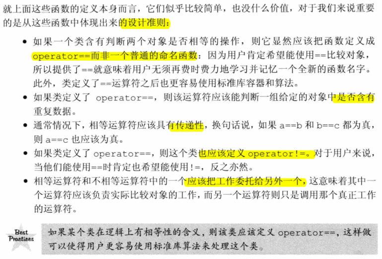 

- e14.16

### 14.3.2 关系运算符
- 如果存在唯一一种逻辑可靠的`<`定义，则应该考虑为这个类定义`<`运算符。如果类同时还包含`==`，则当且仅当`<`的定义和`==`产生的结果一致时才定义`<`运算符。

## 14.4 赋值运算符
- 我们可以重载赋值运算符。不论形参的类型是什么，赋值运算符都必须定义为成员函数。
- 赋值运算符必须定义成类的成员，复合赋值运算符通常情况下也应该这样做。这两类运算符都应该返回左侧运算对象的引用。

## 14.5 下标运算符
- 下标运算符**必须是成员函数**
- 如果一个类包含下标运算符，则它通常会定义两个版本：**一个返回普通引用，另一个是类的常量成员并且返回常量引用**。


## 14.6 递增和递减运算符

## 14.7 成员访问运算符
- 箭头运算符必须是类的成员。解引用运算符通常也是类的成员，尽管并非必须如此。

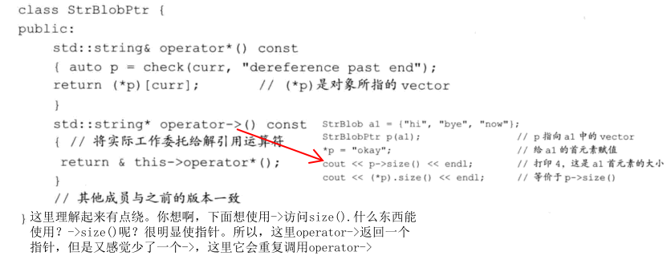 

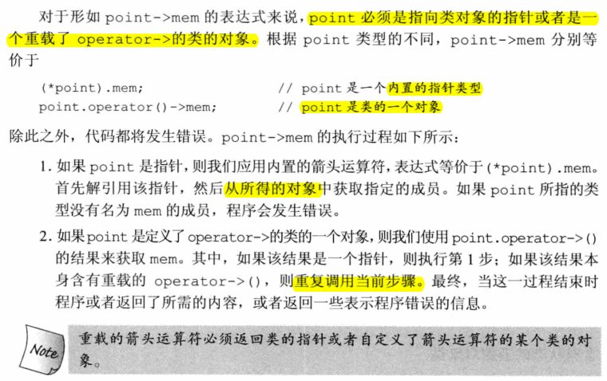 

#### Exercise
- e14.30
- e14.31
  > 没有指针内存操作，所以默认合成的就可以了
- e14.32
  ```c++
  #include "StrBlob.h"

  using namespace std;

  class StrBlobPtrPtr {
  public:
      StrBlobPtrPtr() = default;
      StrBlobPtrPtr(StrBlobPtr* p):ptr(p) {}

      StrBlobPtr &operator*() {
          return *ptr;
      }

      StrBlobPtr *operator->() {
          return ptr;
      }

  private:
      StrBlobPtr *ptr = nullptr;
  };

  int main() {
      StrBlob sb{ "hello", "world" };
      StrBlobPtr iter = sb.begin();
      StrBlobPtrPtr p(&iter);
      std::cout << p->deref() << std::endl;
  }
  ```
## 14.8 函数调用运算符
- 函数调用运算符必须使成员函数。一个类可以定义多个不同版本的调用运算符，相互之间应该在参数数量或类型上有所区别。

#### Exercise
- e14.34
  ```c++
  #include <iostream>
  using namespace std;

  struct A {
      int operator()(bool c, int a, int b) {
          return c ? a : b;
      }
  };

  int main() {
      A f;
      cout << f(true, 3, 4) << endl;
      cout << f(false, 3, 4) << endl;
  }
  ```
- e14.35
  ```c++
  #include <iostream>
  #include <string>
  using namespace std;

  class PrintString {
  public:
      PrintString(istream &i = cin) : is(i) {}
      string operator()() {
          string str;
          if (!getline(is, str))
              return string("empty");
          return str;
      }
  private:
      istream &is;
  };

  int main() {
      PrintString ps;
      cout << ps() << endl;
  }
  ```
- e14.36
  ```c++
  #include <iostream>
  #include <string>
  #include <vector>
  using namespace std;

  class PrintString {
  public:
      PrintString(istream &i = cin) : is(i) {}
      string operator()() {
          string str;
          if (!getline(is, str))
              return string();
          return str;
      }
  private:
      istream &is;
  };

  int main() {
      PrintString ps;
      vector<string> svec;
      string str;
      while(!(str = ps()).empty()) {
          svec.push_back(str);
      }
      for (auto &s : svec)
          cout << s << endl;
  }
  ```
- e14-37
  ```c++
  #include <iostream>
  #include <vector>
  #include <algorithm>
  using namespace std;

  class myequal {
  public:
      myequal(int e) : element(e) {}
      bool operator()(int e) {
          return e == element;
      }
  private:
      int element;
  };

  int main() {
      vector<int> ivec = {1,2,3,4,5,6,6,8,6,10};
      replace_if(ivec.begin(), ivec.end(), myequal(6), 20);
      for (const auto e : ivec) {
          cout << e << " ";
      }
      cout << endl;
  }
  ```
### 14.8.1 lambda是函数对象
#### Exercise
- e14.38

- e14.39

- e14.40

- e14.41

### 14.8.2 标准库定义的函数对象

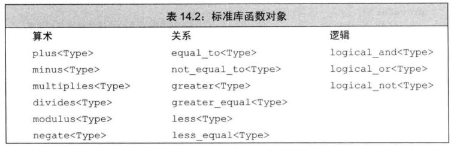 

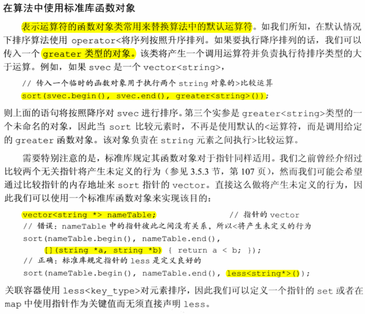 

#### Exercise

### 14.8.3 可调用对象与function

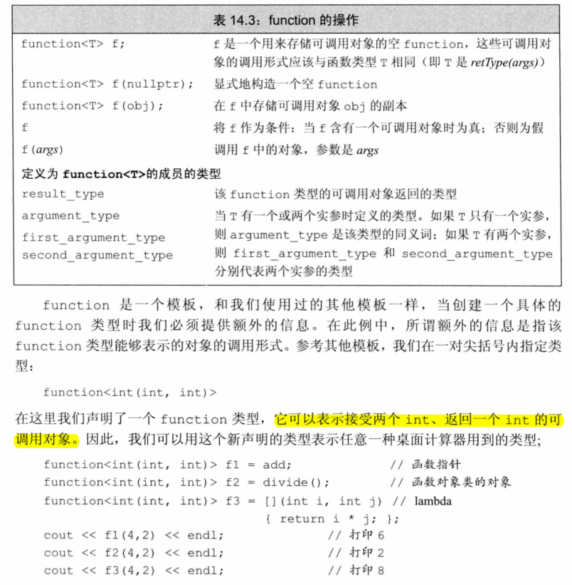 

#### Exercise
- e14.44

  ```c++
  #include <iostream>
  #include <map>
  #include <string>
  #include <functional>
  #include <algorithm>
  using namespace std;

  int add(int i, int j) { return i + j; }
  auto mod = [](int i, int j) { return i % j; };
  struct divide {
      int operator()(int denominator, int divisor) {
          return denominator / divisor;
      }
  };

  map<string, function<int(int, int)>> binops {
      {"+", add},
      {"-", std::minus<int>()},
      {"/", divide()},
      {"*", [](int i, int j) { return i * j; }},
      {"%", mod}
  };

  int main() {
      cout << binops["+"](10, 5) << endl;
      cout << binops["-"](10, 5) << endl;
      cout << binops["*"](10, 5) << endl;
      cout << binops["/"](10, 5) << endl;
      cout << binops["%"](10, 5) << endl;
  }
  ```
## 14.9 重载、类型转换与运算符
### 14.9.1 类型转换运算符
- 一个类型转换函数必须是类的成员函数；它不能声明返回类型，形参列表也必须为空。类型转换函数通常应该是const。
  
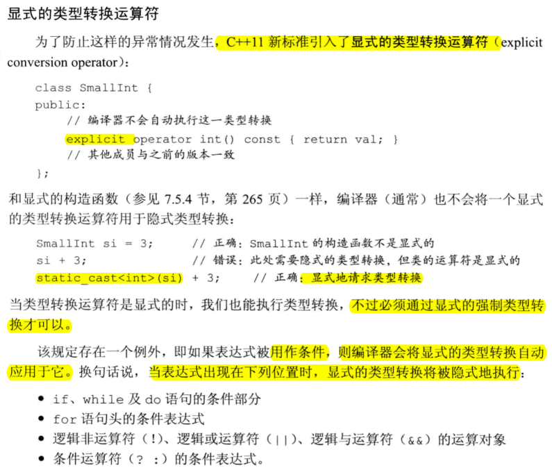 

- 向bool的类型转换通常用在条件部分，因此operator bool一般定义成explicit

#### Exercise
- e14.45
- e14.46
- e14.47
  ```c++
  #include <iostream>
  using namespace std;

  struct Integral {
      Integral(int i):i(i) {}
  #if 1
      operator const int() {
          cout << __PRETTY_FUNCTION__ << endl;
          return i;
      }
  #endif
      operator int() const {
          cout << __PRETTY_FUNCTION__ << endl;
          return i;
      }
      int i;
  };

  int main() {
      const Integral a(3);
      Integral b(4);
      cout << a + 2 << endl;
      cout << b + 2 << endl;
  }
  ```
  ```
  //output
  Integral::operator int() const
  5
  Integral::operator const int()
  6
  ```
### 14.9.2 避免有二义性的类型转换
- 通常情况下，不要为类定义相同的类型转换，也不要在类中定义两个及两个以上转换源或转换目标是算数类型的转换。

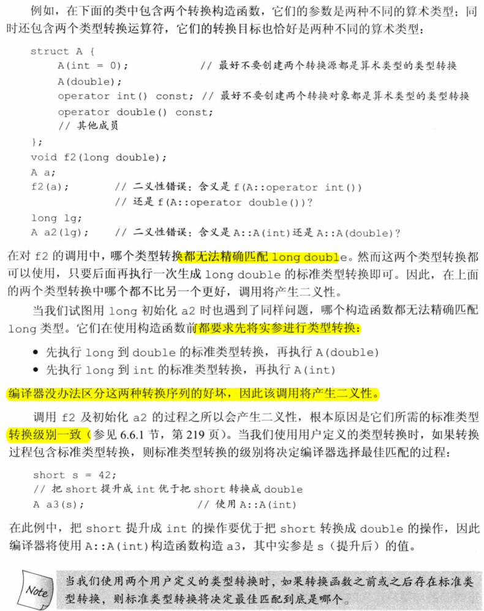 

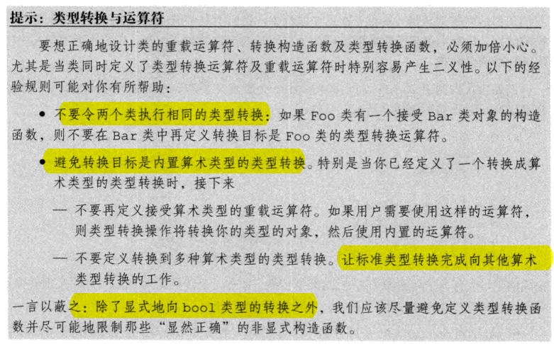 

- 如果在调用重载函数时我们需要使用构造函数或者强制类型转换来改变实参的类型，则这通常意味着程序的设计存在不足

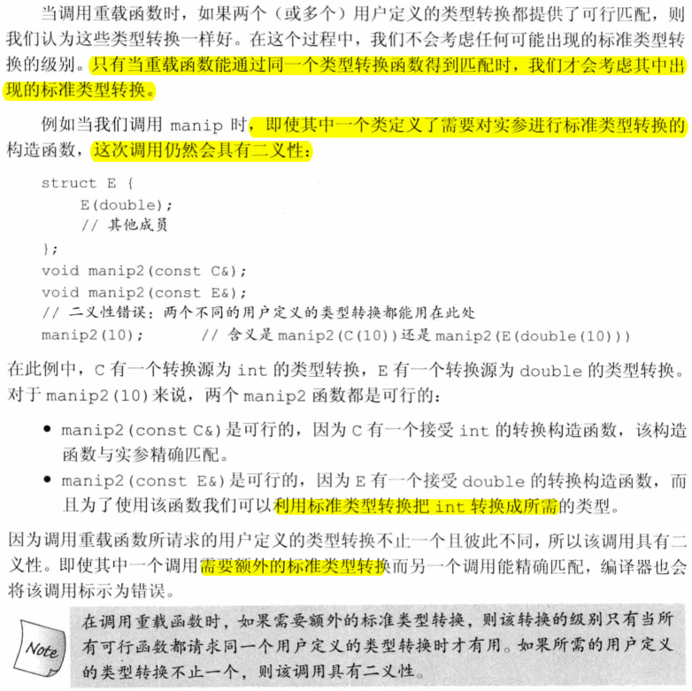 

#### Exercise 
- e14.50

  ```c++
  #include <iostream>
  using namespace std;

  struct LongDouble {
      LongDouble(double e = 0.0):e(e) {
          cout << __PRETTY_FUNCTION__ << endl;
      }

      operator double() {
          cout << __PRETTY_FUNCTION__ << endl;
          return e;
      }

      operator float() {
          cout << __PRETTY_FUNCTION__ << endl;
          return e;
      }

      long double e;
  };

  int main() {
      LongDouble ldObj;
      // 二义性
      //! int ex1 = ldObj;
      // 显示类型转换
      int ex1 = static_cast<double>(ldObj);
      // float()
      float ex2 = ldObj;
  }
  ```
- e14.51
  ```c++
  #include <iostream>
  using namespace std;

  struct LongDouble {
      LongDouble(double e = 0.0):e(e) {
          cout << __PRETTY_FUNCTION__ << endl;
      }

      operator double() {
          cout << __PRETTY_FUNCTION__ << endl;
          return e;
      }

      operator float() {
          cout << __PRETTY_FUNCTION__ << endl;
          return e;
      }

      long double e;
  };

  void calc(int a) {
      cout << __PRETTY_FUNCTION__ << endl;
  }

  void calc(LongDouble a) {
      cout << __PRETTY_FUNCTION__ << endl;
  }

  int main() {
      LongDouble ldObj;
      //! int ex1 = ldObj;
      int ex1 = static_cast<double>(ldObj);
      float ex2 = ldObj;

      double dval;
      calc(dval); // oid calc(int)
  }
  ```

  ```
  1. exact match
  2. const conversion
  3. promotion
  4. arithmetic or pointer conversion
  5. class-type conversion
  // https://github.com/Mooophy/Cpp-Primer/blob/9c37712d1ab3a71930dd7aad6542f94e2f76dcb5/ch14/README.md
  ```
### 14.9.3 函数匹配与重载运算符
- 当我们在表达式中使用重载的运算符时，无法判断正在使用的是成员函数还是非成员函数，因此二者都应该在考虑的范围内。
- 如果我们对同一个类既提供了转换目标是算数类型的类型转换，也提供了重载的运算符，则将会遇到重载运算符与内置运算符的二义性问题。

#### Exercise 
- e14.52
  ```c++
  #include <iostream>
  using namespace std;

  class SmallInt {
  friend SmallInt operator+(const SmallInt &a, const SmallInt &b);
  public:
      SmallInt(int v = 0):val(v) {
          cout << __PRETTY_FUNCTION__ << endl;
      }
      operator int() const {
          cout << __PRETTY_FUNCTION__ << endl;
          return val;
      }
  private:
      std::size_t val;
  };

  SmallInt operator+(const SmallInt &a, const SmallInt &b) {
      cout << __PRETTY_FUNCTION__ << endl;
      return a.val + b.val;
  }

  struct LongDouble {
      LongDouble(double e = 0.0):e(e) {
          cout << __PRETTY_FUNCTION__ << endl;
      }

      LongDouble operator+(const SmallInt & si) {
          cout << __PRETTY_FUNCTION__ << endl;
          return e + static_cast<int>(si);
      }

      operator double() {
          cout << __PRETTY_FUNCTION__ << endl;
          return e;
      }

      operator float() {
          cout << __PRETTY_FUNCTION__ << endl;
          return e;
      }

      long double e;
  };

  void calc(int a) {
      cout << __PRETTY_FUNCTION__ << endl;
  }

  void calc(LongDouble a) {
      cout << __PRETTY_FUNCTION__ << endl;
  }

  int main() {
      LongDouble ldObj;
      //! int ex1 = ldObj;
      int ex1 = static_cast<double>(ldObj);
      float ex2 = ldObj;

      double dval;
      calc(dval);

      cout << "----" << endl;
      SmallInt si;
      LongDouble ld;
      cout << "----" << endl;
      //! ld = si + ld;
      ld = static_cast<int>(si) + static_cast<double>(ld);
      cout << "----" << endl;
      ld = ld + si;
  }
  ```

  ```
  //output
  LongDouble::LongDouble(double)
  LongDouble::operator double()
  LongDouble::operator float()
  void calc(int)
  ----
  SmallInt::SmallInt(int)
  LongDouble::LongDouble(double)
  ----
  SmallInt::operator int() const
  LongDouble::operator double()
  LongDouble::LongDouble(double)
  ----
  LongDouble LongDouble::operator+(const SmallInt&)
  SmallInt::operator int() const
  LongDouble::LongDouble(double)
  ```
- e14.53
  ```
  t14-52.cc: In function ‘int main()’:
  t14-52.cc:72:19: error: ambiguous overload for ‘operator+’ (operand types are ‘SmallInt’ and ‘double’)
      double d = si + 3.14;
                  ~~~^~~~~~
  t14-52.cc:72:19: note: candidate: operator+(int, double) <built-in>
  t14-52.cc:18:10: note: candidate: SmallInt operator+(const SmallInt&, const SmallInt&) SmallInt operator+(const SmallInt &a, const SmallInt &b) {
            ^~~~~~~~
  ```
  需做如下修改
  ```
  double d = si + SmallInt(3.14);
  // output
  SmallInt::SmallInt(int)
  SmallInt operator+(const SmallInt&, const SmallInt&)
  SmallInt::SmallInt(int)
  SmallInt::operator int() const
  ```
  ****