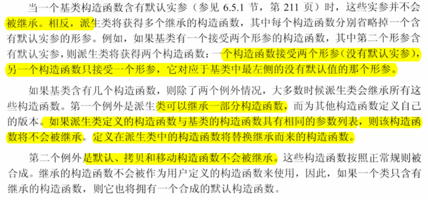

# 15 面向对象程序设计

## 15.1 OOP：概述
- 面向对象程序设计基于三个基本概念：
  - 数据抽象：可以将类的接口与实现分离；
  - 继承：可以定义相似的类型并对其相似关系建模；
  - 动态绑定：可以在一定程度上忽略相似类型的区别，而以统一的方式使用它们的对象；

- 在C++语言中，当我们使用基类的引用（或指针）调用一个虚函数时将发生动态绑定。

## 15.2 定义基类和派生类
### 15.2.1 定义基类
- 基类通常都应该定义一个**虚析构**函数，即使该函数不执行任何实际操作也是如此。
- 在C++语言中，基类必须将它的两种成员函数区分开来：
  - 基类希望其派生类进行覆盖的函数；-> 定义为虚函数
  - 基类希望其派生类直接继承而不要改变的函数。
- 虚函数：
  - 任何构造函数之外的非静态函数都可以时虚函数。
  - virtual只能出现在类内部的声明语句之前而不能用于类外部的函数定义。
  - 如果基类把一个函数声明为虚函数，则该函数的派生类中隐式地也是虚函数。
#### Exercise
- e15.1
  > 在类中关键字virtual修饰的成员函数
- e15.2
  > protected: 派生类可以访问，但其它用户不能访问  
  > private: 派生类和其它用户都不能访问
- e15.3
  ```c++
  #include <iostream>
  #include <string>

  using namespace std;

  class Quote {
  public:
      Quote() = default;
      Quote(const std::string &book, double sales_price) : bookNo(book), price(sales_price) {}
      std::string isbn() const { return bookNo; }
      virtual double net_price(std::size_t n) const {
          return n * price;
      }
      virtual ~Quote() = default;
  private:
      std::string bookNo;
  protected:
      double price = 0.0;
  };

  double print_total(ostream &os, const Quote &item, size_t n) {
      double ret = item.net_price(n);
      os << "ISBN: " << item.isbn() << " # sold: " << n << " total due: " << ret << endl;
      return ret;
  }

  int main() {
      Quote q("0001", 10.00);
      print_total(cout, q, 10);
  }
  ```
## 15.2.2 定义派生类
- 派生类必须将其继承而来的成员函数中需要覆盖的那些重新声明。
- 如果派生类没有覆盖其基类中的某个虚函数，则该虚函数的行为类似于其它的普通成员，派生类会直接继承其在基类中的版本。
- 在派生类对象中含有与其基类对应的组成部分，这一事实时继承的关键所在。
- 每个类控制它自己的成员初始化过程。
- 尽管在派生类对象中含有从基类继承而来的成员，但是派生类并不能直接初始化这些成员。和其它创建了基类对象的代码一样，派生类也必须使用基类的构造函数来初始化它的基类部分。
- 首先初始化基类的部分，然后按照声明的顺序依次初始化派生类的成员。
- 派生类可以访问基类的公有成员和受保护成员
- 派生类的作用域嵌套在基类的作用域之内。


- 如果基类定义了一个静态成员，则在整个继承体系中只存在该成员的唯一定义。
- 在类名后跟一个关键字final可防止继承发生

  

#### Exercise
- e15.4
  > (a): 不正确，不能继承自己  
  > (b): 正确。  
  > (c): 不正确，派生列表不能出现在声明中
- e15.5-6-7
  ```c++
  #include <iostream>
  #include <string>

  using namespace std;

  class Quote {
  public:
      Quote() = default;
      Quote(const std::string &book, double sales_price) : bookNo(book), price(sales_price) {}
      std::string isbn() const { return bookNo; }
      virtual double net_price(std::size_t n) const {
          return n * price;
      }
      virtual ~Quote() = default;
  private:
      std::string bookNo;
  protected:
      double price = 0.0;
  };

  class Bulk_quote : public Quote {
  public:
      Bulk_quote() = default;
      Bulk_quote(const std::string &book, double p, std::size_t qty, double disc) : Quote(book, p), min_qty(qty), discount(disc) {}
      double net_price(std::size_t) const override;
  private:
      std::size_t min_qty = 0;
      double discount = 0.0;
  };

  class Nbulk_quote : public Quote {
  public:
      Nbulk_quote() = default;
      Nbulk_quote(const std::string &book, double p, std::size_t qty, double disc) : Quote(book, p), min_qty(qty), discount(disc) {}
      double net_price(std::size_t) const override;
  private:
      std::size_t min_qty = 0;
      double discount = 0.0;
  };

  double Nbulk_quote::net_price(std::size_t cnt) const {
      if (cnt > min_qty) {
          return min_qty * (1 - discount) * price + (cnt - min_qty) * price;
      } else {
          return cnt * (1 - discount) * price;
      }
  }

  double Bulk_quote::net_price(size_t cnt) const {
      if (cnt >= min_qty) {
          return cnt * (1 - discount) * price;
      } else {
          return cnt * price;
      }
  }

  double print_total(ostream &os, const Quote &item, size_t n) {
      double ret = item.net_price(n);
      os << "ISBN: " << item.isbn() << " # sold: " << n << " total due: " << ret << endl;
      return ret;
  }

  int main() {
      Quote q("0001", 10.00);
      Bulk_quote bq("0002", 20.00, 5, 0.1);
      print_total(cout, q, 10);
      print_total(cout, bq, 4);
      print_total(cout, bq, 10);
      Nbulk_quote nq("0003", 30.00, 5, 0.1);
      print_total(cout, nq, 10);
      print_total(cout, nq, 5);
  }
  ```
  ```
  //output
  ISBN: 0001 # sold: 10 total due: 100
  ISBN: 0002 # sold: 4 total due: 80
  ISBN: 0002 # sold: 10 total due: 180
  ISBN: 0003 # sold: 10 total due: 285
  ISBN: 0003 # sold: 5 total due: 135
  ```
### 15.2.3 类型转换与继承
- 理解基类和派生类之间的类型转换时理解C++语言面向对象编程的关键所在
- 和内置指针一样，只能指针类也支持派生类向基类的类型转换，这意味着我们可以将一个派生类对象的指针存储在一个基类的智能指针内。


- 不存在从基类向派生类的隐式类型转换
- **因为一个基类的对象可能是派生类对象的一部分，也可能不是**，所以不存在从基类向派生类的自动类型转换。
- 即使一个基类指针或引用绑定在一个派生类对象上，也不能执行从基类向派生类的转换。
- 对象之间不存在类型转换
  - 派生类向基类的自动类型转换只对**指针或引用**类型有效，在派生类类型和基类类型之间不存在这样的转换。
  - 当我们初始化或赋值一个类类型的对象时，实际上是在调用某个函数。这些函数都包含一个参数，该参数的类型是类类型的**const版本的引用**。
    - 初始化：调用构造函数
    - 赋值：调用赋值运算符
  - 当我们用一个派生类对象为一个基类对象初始化或赋值时，只有该派生类对象中的基类部分会被拷贝、移动或赋值，它的派生类部分将被忽略掉。


#### Exercise
- e15.8
  > 静态类型：在编译时是已知的；它是变量声明时的类型或表达式生成的类型；  
  > 动态类型：运行时才可知；是变量或表达式表示的内存中的对象的类型。  
- e15.9
  > 如果表达式**既不是引用也不是指针**，则它的动态类型永远与静态类型**一致**；  
  > **基类指针或引用**的静态类型可能与其动态类型**不一致**
- e15.10

## 15.3 虚函数
- 因为知道运行时才能知道到底调用了哪个版本的虚函数，所以所有虚函数都必须有定义，而不管它是否被用到了
- **动态绑定**只有当我们通过**指针或引用**调用**虚函数**时才会发生。
  


- 基类中的虚函数在派生类中**隐含地也是一个虚函数**。当派生类覆盖了某个虚函数时，该函数在基类中的形参必须与派生类中的形参**严格匹配**。
- 如果某次函数调用使用了默认实参，则该实参值由本次调用的静态类型决定。即，如果我们通过基类的引用或指针调用函数，则**使用基类中定义的默认实参**。
  - 如果虚函数使用默认实参，则基类和派生类中定义的默认实参最好一致。
- 如果希望对虚函数的调用不进行动态绑定，可以使用作用域运算符实现。
  - 通常，只有成员函数（或友元）中的代码才需要使用作用域运算符来回避虚函数的机制。
- 如果一个派生类虚函数需要调用它的基类版本，但是没有使用作用域运算符，则在运行时该调用将被解析为对派生类版本自身的调用，从而导致无限递归。
  
#### Exercise
- e15.11
  ```c++
  #include <iostream>
  #include <string>

  using namespace std;

  class Quote {
  public:
      Quote() = default;
      Quote(const std::string &book, double sales_price) : bookNo(book), price(sales_price) {}
      std::string isbn() const { return bookNo; }
      virtual double net_price(std::size_t n) const {
          return n * price;
      }
      virtual void debug() const {
          cout << __PRETTY_FUNCTION__ << endl;
          cout << "bookNo: " << bookNo << " price: " << price << endl;
      }
      virtual ~Quote() = default;
  private:
      std::string bookNo;
  protected:
      double price = 0.0;
  };

  class Bulk_quote : public Quote {
  public:
      Bulk_quote() = default;
      Bulk_quote(const std::string &book, double p, std::size_t qty, double disc) : Quote(book, p), min_qty(qty), discount(disc) {}
      double net_price(std::size_t) const override;
      void debug() const {
          cout << __PRETTY_FUNCTION__ << endl;
          Quote::debug();
          cout << "min_qty: " << min_qty << " discount: " << discount << endl;
      }
  private:
      std::size_t min_qty = 0;
      double discount = 0.0;
  };

  class Nbulk_quote : public Quote {
  public:
      Nbulk_quote() = default;
      Nbulk_quote(const std::string &book, double p, std::size_t qty, double disc) : Quote(book, p), min_qty(qty), discount(disc) {}
      double net_price(std::size_t) const override;
      void debug() const {
          cout << __PRETTY_FUNCTION__ << endl;
          Quote::debug();
          cout << "min_qty: " << min_qty << " discount: " << discount << endl;
      }
  private:
      std::size_t min_qty = 0;
      double discount = 0.0;
  };

  double Nbulk_quote::net_price(std::size_t cnt) const {
      if (cnt > min_qty) {
          return min_qty * (1 - discount) * price + (cnt - min_qty) * price;
      } else {
          return cnt * (1 - discount) * price;
      }
  }

  double Bulk_quote::net_price(size_t cnt) const {
      if (cnt >= min_qty) {
          return cnt * (1 - discount) * price;
      } else {
          return cnt * price;
      }
  }

  double print_total(ostream &os, const Quote &item, size_t n) {
      double ret = item.net_price(n);
      os << "ISBN: " << item.isbn() << " # sold: " << n << " total due: " << ret << endl;
      return ret;
  }

  int main() {
      Quote q("0001", 10.00);
      Bulk_quote bq("0002", 20.00, 5, 0.1);
      print_total(cout, q, 10);
      print_total(cout, bq, 4);
      print_total(cout, bq, 10);
      Nbulk_quote nq("0003", 30.00, 5, 0.1);
      print_total(cout, nq, 10);
      print_total(cout, nq, 5);
      q.debug();
      bq.debug();
      nq.debug();
  }
  ```
- e15.12
  > 有必要，一个派生了覆盖了基类，但是不想再被继承。

  ```c++
  #include <iostream>
  using namespace std;

  class Base {
  public:
      virtual void f() {
          cout << __PRETTY_FUNCTION__ << endl;
      }
  };

  class D1 : public Base {
  public:
      void f() override final {
          cout << __PRETTY_FUNCTION__ << endl;
      }
  };

  class D2 : public D1 {
  public:
      void f() {
          cout << __PRETTY_FUNCTION__ << endl;
      }
  };

  int main() {
      D1 d1;
      Base &b = d1;
      b.f();
      D2 d2;
      Base &b2 = d2;
      b2.f();
  }
  ```
  ```
  //output
  t15-12.cc:20:10: error: virtual function ‘virtual void D2::f()’
      void f() {
            ^
  t15-12.cc:13:10: error: overriding final function ‘virtual void D1::f()’
      void f() override final {
            ^
  ```
- e15.13
  > 会因为无限递归造成段错误
- e15.14
  ```c++
  #include <iostream>
  #include <string>
  using namespace std;

  class base {
  public:
      base(string str = "base") : basename(str) {}
      string name() { return basename; }
      virtual void print(ostream &os) { os << basename << endl; }
  private:
      string basename;
  };

  class derived : public base {
  public:
      derived(int e = 10) : base("derived"), i(e) {}
      void print(ostream &os) {
          base::print(os);
          os << " " << i << endl;
      }
  private:
      int i;
  };

  int main() {
      base bobj;
      derived dobj;
      base *bp1 = &bobj;
      base *bp2 = &dobj;
      base &br1 = bobj;
      base &br2 = dobj;
      bobj.print(cout); // base
      dobj.print(cout); // derived 10
      cout << bp1->name() << endl; // base
      cout << bp2->name() << endl; // derived
      br1.print(cout); // base
      br2.print(cout); // derived 10
  }
  ```

  ```
  base
  derived
  10
  base
  derived
  base
  derived
  10
  ```
## 15.4 抽象基类
- 一个纯虚函数无须定义，但是可以定义，不过函数体必须定义在类的外部。
- 不能创建一个抽象基类的对象

#### Exercise
- e15.15-16-17
  ```c++
  #include <iostream>
  #include <string>

  using namespace std;

  class Quote {
  public:
      Quote() = default;
      Quote(const std::string &book, double sales_price) : bookNo(book), price(sales_price) {}
      std::string isbn() const { return bookNo; }
      virtual double net_price(std::size_t n) const {
          return n * price;
      }
      virtual void debug() const {
          cout << __PRETTY_FUNCTION__ << endl;
          cout << "bookNo: " << bookNo << " price: " << price << endl;
      }
      virtual ~Quote() = default;
  private:
      std::string bookNo;
  protected:
      double price = 0.0;
  };

  class Disc_quote : public Quote {
  public:
      Disc_quote() = default;
      Disc_quote(const std::string &book, double price, std::size_t qty, double disc) : Quote(book, price), quantity(qty), discount(disc) {}
      double net_price(std::size_t) const = 0;
  protected:
      std::size_t quantity = 0;
      double discount = 0.0;
  };

  class Bulk_quote : public Disc_quote {
  public:
      Bulk_quote() = default;
      Bulk_quote(const std::string &book, double price, std::size_t qty, double disc) : Disc_quote(book, price, qty, disc) {}
      double net_price(std::size_t) const override;
  };

  double Bulk_quote::net_price(std::size_t cnt) const {
      if (cnt > quantity) {
          return quantity * (1 - discount) * price + (cnt - quantity) * price;
      } else {
          return quantity * (1 - discount) * price;
      }
  }

  int main() {
      Bulk_quote bq("0001", 10.00, 10, 0.2);
      cout << bq.net_price(20) << endl;
      /*
      t15-15.cc: In function ‘int main()’:
      t15-15.cc:53:16: error: cannot declare variable ‘dq’ to be of abstract type 
      Disc_quote’
          Disc_quote dq;
                      ^~
      t15-15.cc:25:7: note:   because the following virtual functions are pure within ‘Disc_quote’:
      class Disc_quote : public Quote {
            ^~~~~~~~~~
      t15-15.cc:29:12: note:  virtual double Disc_quote::net_price(std::size_t) const
          double net_price(std::size_t) const = 0;
                  ^~~~~~~~~
      */
      //! Disc_quote dq;
  }
  ```
## 15.5 访问控制与继承


- 某个类对其继承而来的成员的访问权限受到两个因素影响：
  - 一是在基类中该成员的访问说明符；
  - 二是在派生类的派生列表中的访问说明符；
    - **派生类访问说明符**对于派生类的成员（及友元）能否访问其直接基类的成员**没有什么影响**。对基类成员的访问权限只与**基类中的访问说明符**有关。
    - 派生访问说明符的目的是控制派生类用户（包括派生类的派生类在内）对于基类成员的访问权限。

    


- 不能继承友元关系；每个类负责控制各自成员的访问权限
- 派生类只能为那些它可以访问的名字提using声明


#### Exercise
- e15.18
  ```c++
  #include <iostream>
  using namespace std;

  class Base {
  public:
      void pub_mem() {
          cout << __PRETTY_FUNCTION__ << endl;
      }
  protected:
      int prot_mem;
  private:
      char priv_mem;
  };

  struct Pub_Derv : public Base {
      int f() { return prot_mem; }
      //! char g() { return priv_mem; }
      char g() { return 0; }
  };

  struct Priv_Derv : private Base {
      int f1() const { return prot_mem; }
  };

  struct Prot_Derv : protected Base {
      int f() const { return prot_mem; }
  };

  struct Derived_from_Public : public Pub_Derv {
      int use_base() { return prot_mem; }
  };

  struct Derived_from_Private : public Priv_Derv {
      //! int use_base() { return prot_mem; }
      int use_base() { return 0; }
  };

  struct Derived_from_Protected : public Prot_Derv {
      int use_base() { return prot_mem; }
  };

  int main() {
      Pub_Derv d1;
      Priv_Derv d2;
      Prot_Derv d3;
      Derived_from_Public dd1;
      Derived_from_Private dd2;
      Derived_from_Protected dd3;
      Base *p;
      p = &d1;
      //! p = &d2;
      //! p = &d3;
      p = &dd1;
      //! p = &dd2;
      //! p = &dd3;
  }
  ```

  

- e15.19
  > 不论D以什么方式继承B，D的**成员函数和友元**都能使用派生类向基类的转换；派生类向其**直接基类**的类型转换对于派生类的成员和友元来说永远是可访问的。  
  > 根据这一条d1/d2/d3都是合法的  
  > 如果D继承B的方式是公有的或受保护的，则D的**派生类的成员和友元**可以使用D向B的类型转换；反之，如果D继承B的方式是私有的，则不能使用。
  > 根据这一条dd1/dd3是合法的，dd2因为是私有继承，所以不合法
- e15.20
  
  ```c++
  #include <iostream>
  using namespace std;

  class Base {
  public:
      void pub_mem() {
          cout << __PRETTY_FUNCTION__ << endl;
      }
      //! void memfcn(Base &b) { b = *this; }
  protected:
      int prot_mem;
  private:
      char priv_mem;
  };

  struct Pub_Derv : public Base {
      int f() { return prot_mem; }
      //! char g() { return priv_mem; }
      char g() { return 0; }
      void memfcn(Base &b) { b = *this; }
  };

  struct Priv_Derv : private Base {
      int f1() const { return prot_mem; }
      void memfcn(Base &b) { b = *this; }
  };

  struct Prot_Derv : protected Base {
      int f() const { return prot_mem; }
      void memfcn(Base &b) { b = *this; }
  };

  struct Derived_from_Public : public Pub_Derv {
      int use_base() { return prot_mem; }
      void memfcn(Base &b) { b = *this; }
  };

  struct Derived_from_Private : public Priv_Derv {
      //! int use_base() { return prot_mem; }
      int use_base() { return 0; }
      //! void memfcn(Base &b) { b = *this; }
  };

  struct Derived_from_Protected : public Prot_Derv {
      int use_base() { return prot_mem; }
      void memfcn(Base &b) { b = *this; }
  };

  int main() {
      Pub_Derv d1;
      Priv_Derv d2;
      Prot_Derv d3;
      Derived_from_Public dd1;
      Derived_from_Private dd2;
      Derived_from_Protected dd3;
      Base *p;
      p = &d1;
      //! p = &d2;
      //! p = &d3;
      p = &dd1;
      //! p = &dd2;
      //! p = &dd3;
  /*  这些测试没法做，这里就是用户代码了？  
      d1.memfcn(d1);
      d2.memfcn(d2);
      d3.memfcn(d3);
      dd1.memfcn(dd1);
      dd2.memfcn(dd2);
      dd3.memfcn(dd3);
  */
  }
  ```
- e15.21
- e15.22

## 15.6 继承中的类作用域
- 当存在继承关系时，派生类的作用域嵌套在其基类的作用域之内
- 派生类的成员将隐藏同名的基类成员
- **除了覆盖继承**而来的虚函数之外，派生类最好**不要重用**其它定义在基类中的名字
  

- 声明在内层作用域的函数并不会重载声明在外层作用域的函数。-> 定义派生类中的函数也不会重载其基类中的成员。
  - 如果派生类（内层作用域）的成员与基类（外层作用域）的某个成员同名，则**派生类将在其作用域内隐藏该基类成员**。即使派生类成员和基类成员的形参列表不一致，基类成员也仍然会被隐藏掉。-> 这也是基类与派生类必须有相同形参列表的原因。
#### Exercise
- e15.23a
  ```c++
  #include <iostream>
  using namespace std;

  class Base {
  public:
      virtual int fcn() {
          cout << __PRETTY_FUNCTION__ << endl;
      }
  };

  class D1 : public Base {
  public:
      int fcn(int) {
          cout << __PRETTY_FUNCTION__ << endl;
      }

      virtual void f2() {
          cout << __PRETTY_FUNCTION__ << endl;
      }
  };

  class D2 : public D1 {
  public:
      int fcn(int) {
          cout << __PRETTY_FUNCTION__ << endl;
      }
      int fcn() {
          cout << __PRETTY_FUNCTION__ << endl;
      }
      void f2() {
          cout << __PRETTY_FUNCTION__ << endl;
      }
  };

  int main() {
      Base bobj; D1 d1obj; D2 d2obj;
      Base *bp1 = &bobj, *bp2 = &d1obj, *bp3 = &d2obj;
      bp1->fcn();
      bp2->fcn();
      bp3->fcn();

      cout << "----" << endl;
      D1 *d1p = &d1obj; D2 *d2p = &d2obj;
      //! bp2->f2();
      d1p->f2();
      d2p->f2();

      cout << "----" << endl;
      Base *p1 = &d2obj; D1 *p2 = &d2obj; D2 *p3 = &d2obj;
      //! p1->fcn(42);
      p2->fcn(42);
      p3->fcn(42);
      cout << "----" << endl;
  }
  ```

  ```
  virtual int Base::fcn()
  virtual int Base::fcn()
  virtual int D2::fcn()
  ----
  virtual void D1::f2()
  virtual void D2::f2()
  ----
  int D1::fcn(int)
  int D2::fcn(int)
  ----
  ```
- e15.23b
  ```c++
  #include <iostream>
  using namespace std;

  class Base {
  public:
      virtual int fcn() {
          cout << __PRETTY_FUNCTION__ << endl;
      }
  };

  class D1 : public Base {
  public:
      int fcn() {
          cout << __PRETTY_FUNCTION__ << endl;
      }

      int fcn(int) {
          cout << __PRETTY_FUNCTION__ << endl;
      }

      virtual void f2() {
          cout << __PRETTY_FUNCTION__ << endl;
      }
  };

  class D2 : public D1 {
  public:
      int fcn(int) {
          cout << __PRETTY_FUNCTION__ << endl;
      }
      int fcn() {
          cout << __PRETTY_FUNCTION__ << endl;
      }
      void f2() {
          cout << __PRETTY_FUNCTION__ << endl;
      }
  };

  int main() {
      Base bobj; D1 d1obj; D2 d2obj;
      Base *bp1 = &bobj, *bp2 = &d1obj, *bp3 = &d2obj;
      bp1->fcn();
      bp2->fcn();
      bp3->fcn();

      cout << "----" << endl;
      D1 *d1p = &d1obj; D2 *d2p = &d2obj;
      //! bp2->f2();
      d1p->f2();
      d2p->f2();

      cout << "----" << endl;
      Base *p1 = &d2obj; D1 *p2 = &d2obj; D2 *p3 = &d2obj;
      //! p1->fcn(42);
      p2->fcn(42);
      p3->fcn(42);
      cout << "----" << endl;
  }
  ```
  ```
  virtual int Base::fcn()
  virtual int D1::fcn()
  virtual int D2::fcn()
  ----
  virtual void D1::f2()
  virtual void D2::f2()
  ----
  int D1::fcn(int)
  int D2::fcn(int)
  ----
  ```
## 15.7 构造函数与拷贝控制

### 15.7.1 虚析构函数
- 继承关系对基类拷贝控制最直接的影响时基类通常应该定义一个虚析构函数。
  - 当我们delete一个动态分配的对象的指针时执行析构函数。如果该指针指向继承体系中的某个类型，则可能出现指针的静态类型与被删除对象的动态类型不符的情况。
  - 如果基类的析构函数不是虚函数，则delete一个指向派生类对象的基类指针将产生未定义的行为。
- 之前介绍过一条经验准则，即如果一个类需要析构函数，那么它也同样需要拷贝和赋值操作。**基类的析构函数并不遵循上述准则，它是一个重要的例外**。
  - 原因：一个基类总是需要析构函数，而且它能将析构函数设定为虚函数。此时，该析构函数为了成为虚函数而令内容为空，我们显示无法由此推断该基类还需要赋值运算符或拷贝构造函数。
#### Exercise
- e15.24
  > 基类需要虚析构函数；之所以必须是虚析构函数，是为了保证正确释放动态分配体系中的对象
### 15.7.2 合成拷贝控制与继承
#### Exericse
- e15.25
  ```c++
  #include <iostream>
  #include <string>

  using namespace std;

  class Quote {
  public:
      Quote() = default;
      Quote(const std::string &book, double sales_price) : bookNo(book), price(sales_price) {}
      std::string isbn() const { return bookNo; }
      virtual double net_price(std::size_t n) const {
          return n * price;
      }
      virtual void debug() const {
          cout << __PRETTY_FUNCTION__ << endl;
          cout << "bookNo: " << bookNo << " price: " << price << endl;
      }
      virtual ~Quote() = default;
  private:
      std::string bookNo;
  protected:
      double price = 0.0;
  };

  class Disc_quote : public Quote {
  public:
      //!Disc_quote() = default;
      Disc_quote(const std::string &book, double price, std::size_t qty, double disc) : Quote(book, price), quantity(qty), discount(disc) {}
      double net_price(std::size_t) const = 0;
  protected:
      std::size_t quantity = 0;
      double discount = 0.0;
  };

  class Bulk_quote : public Disc_quote {
  public:
      Bulk_quote() = default;
      Bulk_quote(const std::string &book, double price, std::size_t qty, double disc) : Disc_quote(book, price, qty, disc) {}
      double net_price(std::size_t) const override;
  };

  double Bulk_quote::net_price(std::size_t cnt) const {
      if (cnt > quantity) {
          return quantity * (1 - discount) * price + (cnt - quantity) * price;
      } else {
          return quantity * (1 - discount) * price;
      }
  }

  int main() {
      Bulk_quote bq("0001", 10.00, 10, 0.2);
      cout << bq.net_price(20) << endl;
      //! Disc_quote dq;
      Bulk_quote bq1;
  }
  ```

  ```shell
  dongkesi@DESKTOP-CL29DN1:/mnt/d/workspace/github/C++-Primer/ch15$ g++ t15-25.cc
  t15-25.cc: In function ‘int main()’:
  t15-25.cc:54:16: error: use of deleted function ‘Bulk_quote::Bulk_quote()’
      Bulk_quote bq1;
                  ^~~
  t15-25.cc:37:5: note: ‘Bulk_quote::Bulk_quote()’ is implicitly deleted because the default definition would be ill-formed:
      Bulk_quote() = default;
      ^~~~~~~~~~
  t15-25.cc:37:5: error: no matching function for call to ‘Disc_quote::Disc_quote()’
  t15-25.cc:28:5: note: candidate: Disc_quote::Disc_quote(const string&, double, std::size_t, double)
      Disc_quote(const std::string &book, double price, std::size_t qty, double disc) : Quote(book, price), quantity(qty), discount(disc) {}
      ^~~~~~~~~~
  t15-25.cc:28:5: note:   candidate expects 4 arguments, 0 provided
  t15-25.cc:25:7: note: candidate: Disc_quote::Disc_quote(const Disc_quote&)
  class Disc_quote : public Quote {
        ^~~~~~~~~~
  t15-25.cc:25:7: note:   candidate expects 1 argument, 0 provided
  t15-25.cc:25:7: note: candidate: Disc_quote::Disc_quote(Disc_quote&&)
  t15-25.cc:25:7: note:   candidate expects 1 argument, 0 provided
  ```
### 15.7.3 派生类的拷贝控制成员
- 析构函数只负责销毁派生类自己分配的资源。
- 当派生类定义了拷贝或移动操作时，该操作负责拷贝或移动包括基类部分成员在内的整个对象。
- 在默认情况下，基类默认构造函数初始化派生类对象的基类部分。如果我们想拷贝（或移动）基类部分，则**必须在派生类的构造函数初始列表中显式地使用基类的拷贝（或移动）构造函数**。
- 派生类的赋值运算符也必须**显式地**为其基类部分赋值。
- 如果构造函数或析构函数调用了某个虚函数，则我们应该执行与构造函数或析构函数所属类型相对应的虚函数版本。

#### Exercise
- e15.26
  ```c++
  #include <iostream>
  #include <string>

  using namespace std;

  class Quote {
      friend int operator!=(const Quote &lhs, const Quote &rhs);
  public:
      Quote() {
          cout << __PRETTY_FUNCTION__ << endl;
      }

      Quote(const Quote &rhs) : bookNo(rhs.bookNo), price(rhs.price) {
          cout << __PRETTY_FUNCTION__ << endl;
      }

      Quote(Quote &&rhs) noexcept : bookNo(std::move(rhs.bookNo)), price(std::move(rhs.price)) {
          cout << __PRETTY_FUNCTION__ << endl;
      }

      Quote& operator=(const Quote &rhs) {
          cout << __PRETTY_FUNCTION__ << endl;
          if (*this != rhs) {
              bookNo = rhs.bookNo;
              price = rhs.price;
          }
          return *this;
      }

      Quote& operator=(Quote &&rhs) noexcept {
          cout << __PRETTY_FUNCTION__ << endl;
          if (*this != rhs) {
              bookNo = std::move(rhs.bookNo);
              price = std::move(rhs.price);
          }
          return *this;
      }

      Quote(const std::string &book, double sales_price) : bookNo(book), price(sales_price) {}
      std::string isbn() const { return bookNo; }
      virtual double net_price(std::size_t n) const {
          return n * price;
      }
      virtual void debug() const {
          cout << __PRETTY_FUNCTION__ << endl;
          cout << "bookNo: " << bookNo << " price: " << price << endl;
      }

      virtual ~Quote() {
          cout << __PRETTY_FUNCTION__ << endl;
      }
  private:
      std::string bookNo;
  protected:
      double price = 0.0;
  };


  int inline operator!=(const Quote &lhs, const Quote &rhs) {
      return (lhs.bookNo != rhs.bookNo) && (lhs.price != rhs.price);
  }

  class Disc_quote : public Quote {
  public:
      Disc_quote() = default;
      Disc_quote(const std::string &book, double price, std::size_t qty, double disc) : Quote(book, price), quantity(qty), discount(disc) {}
      double net_price(std::size_t) const = 0;
  protected:
      std::size_t quantity = 0;
      double discount = 0.0;
  };

  class Bulk_quote : public Disc_quote {
  public:
      Bulk_quote() {
          cout << __PRETTY_FUNCTION__ << endl;
      }
      Bulk_quote(const std::string &book, double price, std::size_t qty, double disc) : Disc_quote(book, price, qty, disc) {}
      Bulk_quote(const Bulk_quote &bq) : Disc_quote(bq) {
          cout << __PRETTY_FUNCTION__ << endl;
      }
      Bulk_quote(Bulk_quote &&bq) noexcept : Disc_quote(std::move(bq)) {
          cout << __PRETTY_FUNCTION__ << endl;
      }
      Bulk_quote& operator=(const Bulk_quote &rhs) {
          Disc_quote::operator=(rhs);
          cout << __PRETTY_FUNCTION__ << endl;
          return *this;
      }
      Bulk_quote& operator=(Bulk_quote &&rhs) noexcept {
          Disc_quote::operator=(std::move(rhs));
          cout << __PRETTY_FUNCTION__ << endl;
          return *this;
      }
      double net_price(std::size_t) const override;

      ~Bulk_quote() {
          cout << __PRETTY_FUNCTION__ << endl;
      }
  };

  double Bulk_quote::net_price(std::size_t cnt) const {
      if (cnt > quantity) {
          return quantity * (1 - discount) * price + (cnt - quantity) * price;
      } else {
          return quantity * (1 - discount) * price;
      }
  }

  int main() {
      Bulk_quote bq("0001", 10.00, 10, 0.2);
      cout << bq.net_price(20) << endl;
      cout << "----" << endl;
      Bulk_quote bq2(bq);
      cout << "----" << endl;
      Bulk_quote bq3 = bq;
      cout << "----" << endl;
      bq3 = bq2;
      cout << "----" << endl;
      Bulk_quote bq4(std::move(bq3));
      cout << "----" << endl;
      bq2 = std::move(bq);
      cout << "----" << endl;
  }
  ```
  ```
  180
  ----
  Quote::Quote(const Quote&)
  Bulk_quote::Bulk_quote(const Bulk_quote&)
  ----
  Quote::Quote(const Quote&)
  Bulk_quote::Bulk_quote(const Bulk_quote&)
  ----
  Quote& Quote::operator=(const Quote&)
  Bulk_quote& Bulk_quote::operator=(const Bulk_quote&)
  ----
  Quote::Quote(Quote&&)
  Bulk_quote::Bulk_quote(Bulk_quote&&)
  ----
  Quote& Quote::operator=(Quote&&)
  Bulk_quote& Bulk_quote::operator=(Bulk_quote&&)
  ----
  virtual Bulk_quote::~Bulk_quote()
  virtual Quote::~Quote()
  virtual Bulk_quote::~Bulk_quote()
  virtual Quote::~Quote()
  virtual Bulk_quote::~Bulk_quote()
  virtual Quote::~Quote()
  virtual Bulk_quote::~Bulk_quote()
  virtual Quote::~Quote()
  ```

### 15.7.4 继承的构造函数



#### Exercise
- e15.27
  ```c++
   /*   Bulk_quote(const std::string &book, double price, std::size_t qty, double disc) : Disc_quote(book, price, qty, disc) {
        cout << __PRETTY_FUNCTION__ << endl;
    }*/
    using Disc_quote::Disc_quote;
  ```
## 15.8 容器与继承
- 当派生类对象被赋值给基类对象时，其中的派生类部分将被“切掉”，因此容器和存在继承关系的类型无法兼容。
- 当我们使用容器存放继承体系中的**对象**时，通常必须采取**间接存储**的方式。因为不允许在容器中保存不同类型的元素。——>在容器中放置（智能）指针而非对象。
#### Exercise
- e15.28-29
  ```c++
  #include <iostream>
  #include <vector>
  #include <string>

  using namespace std;

  class Quote {
      friend int operator!=(const Quote &lhs, const Quote &rhs);
  public:
      Quote() {
          cout << __PRETTY_FUNCTION__ << endl;
      }

      Quote(const Quote &rhs) : bookNo(rhs.bookNo), price(rhs.price) {
          cout << __PRETTY_FUNCTION__ << endl;
      }

      Quote(Quote &&rhs) noexcept : bookNo(std::move(rhs.bookNo)), price(std::move(rhs.price)) {
          cout << __PRETTY_FUNCTION__ << endl;
      }

      Quote& operator=(const Quote &rhs) {
          cout << __PRETTY_FUNCTION__ << endl;
          if (*this != rhs) {
              bookNo = rhs.bookNo;
              price = rhs.price;
          }
          return *this;
      }

      Quote& operator=(Quote &&rhs) noexcept {
          cout << __PRETTY_FUNCTION__ << endl;
          if (*this != rhs) {
              bookNo = std::move(rhs.bookNo);
              price = std::move(rhs.price);
          }
          return *this;
      }

      Quote(const std::string &book, double sales_price) : bookNo(book), price(sales_price) {}
      std::string isbn() const { return bookNo; }
      virtual double net_price(std::size_t n) const {
          return n * price;
      }
      virtual void debug() const {
          cout << __PRETTY_FUNCTION__ << endl;
          cout << "bookNo: " << bookNo << " price: " << price << endl;
      }

      virtual ~Quote() {
          cout << __PRETTY_FUNCTION__ << endl;
      }
  private:
      std::string bookNo;
  protected:
      double price = 0.0;
  };


  int inline operator!=(const Quote &lhs, const Quote &rhs) {
      return (lhs.bookNo != rhs.bookNo) && (lhs.price != rhs.price);
  }

  class Disc_quote : public Quote {
  public:
      Disc_quote() = default;
      Disc_quote(const std::string &book, double price, std::size_t qty, double disc) : Quote(book, price), quantity(qty), discount(disc) {}
      double net_price(std::size_t) const = 0;
  protected:
      std::size_t quantity = 0;
      double discount = 0.0;
  };

  class Bulk_quote : public Disc_quote {
  public:
      Bulk_quote() {
          cout << __PRETTY_FUNCTION__ << endl;
      }
      Bulk_quote(const std::string &book, double price, std::size_t qty, double disc) : Disc_quote(book, price, qty, disc) {}
      Bulk_quote(const Bulk_quote &bq) : Disc_quote(bq) {
          cout << __PRETTY_FUNCTION__ << endl;
      }
      Bulk_quote(Bulk_quote &&bq) noexcept : Disc_quote(std::move(bq)) {
          cout << __PRETTY_FUNCTION__ << endl;
      }
      Bulk_quote& operator=(const Bulk_quote &rhs) {
          Disc_quote::operator=(rhs);
          cout << __PRETTY_FUNCTION__ << endl;
          return *this;
      }
      Bulk_quote& operator=(Bulk_quote &&rhs) noexcept {
          Disc_quote::operator=(std::move(rhs));
          cout << __PRETTY_FUNCTION__ << endl;
          return *this;
      }
      double net_price(std::size_t) const override;

      ~Bulk_quote() {
          cout << __PRETTY_FUNCTION__ << endl;
      }
  };

  double Bulk_quote::net_price(std::size_t cnt) const {
      if (cnt > quantity) {
          return quantity * (1 - discount) * price + (cnt - quantity) * price;
      } else {
          return quantity * (1 - discount) * price;
      }
  }

  int main() {
      Bulk_quote bq("0001", 10.00, 10, 0.2);
      cout << bq.net_price(20) << endl;
      cout << "----" << endl;
      Bulk_quote bq2(bq);
      cout << "----" << endl;
      Bulk_quote bq3 = bq;
      cout << "----" << endl;
      bq3 = bq2;
      cout << "----" << endl;
      Bulk_quote bq4(std::move(bq3));
      cout << "----" << endl;
      bq2 = std::move(bq);
      cout << "----" << endl;

      vector<Quote> qvec;

      Bulk_quote b1("0001", 10.00, 10, 0.2);
      Bulk_quote b2("0002", 20.00, 10, 0.2);
      Bulk_quote b3("0003", 30.00, 10, 0.2);
      Bulk_quote b4("0004", 40.00, 10, 0.2);
      qvec.push_back(b1);
      qvec.push_back(b2);
      qvec.push_back(b3);
      qvec.push_back(b4);

      cout << b1.net_price(20) + b2.net_price(20) 
      + b3.net_price(20) + b4.net_price(20) << endl; //1800
      double sum = 0;
      for (auto &e : qvec) {
          sum += e.net_price(20);
      }
      cout << sum << endl; // 2000
      vector<std::shared_ptr<Quote>> basket;
      basket.push_back(make_shared<Bulk_quote>(b1));
      basket.push_back(make_shared<Bulk_quote>(b2));
      basket.push_back(make_shared<Bulk_quote>(b3));
      basket.push_back(make_shared<Bulk_quote>(b4));
      sum = 0;
      for (auto &e : basket) {
          sum += e->net_price(20); // 1800
      }
      cout << sum << endl;
  }
  ```

### 15.8.1 编写Basket类
- 对于C++面向对象的编程来说，一个悖论是我们无法直接使用对象进行面向对象编程。相反，我们必须使用指针和引用。因为指针会增加程序的复杂性，所以我们经常定义一些辅助的类来处理这种复杂情况。

#### Exercise
- e15.30
  ```c++
  #include <iostream>
  #include <vector>
  #include <string>
  #include <memory>
  #include <set>

  using namespace std;

  class Quote {
      friend int operator!=(const Quote &lhs, const Quote &rhs);
  public:
      Quote() {
          cout << __PRETTY_FUNCTION__ << endl;
      }

      Quote(const Quote &rhs) : bookNo(rhs.bookNo), price(rhs.price) {
          cout << __PRETTY_FUNCTION__ << endl;
      }

      Quote(Quote &&rhs) noexcept : bookNo(std::move(rhs.bookNo)), price(std::move(rhs.price)) {
          cout << __PRETTY_FUNCTION__ << endl;
      }

      Quote& operator=(const Quote &rhs) {
          cout << __PRETTY_FUNCTION__ << endl;
          if (*this != rhs) {
              bookNo = rhs.bookNo;
              price = rhs.price;
          }
          return *this;
      }

      Quote& operator=(Quote &&rhs) noexcept {
          cout << __PRETTY_FUNCTION__ << endl;
          if (*this != rhs) {
              bookNo = std::move(rhs.bookNo);
              price = std::move(rhs.price);
          }
          return *this;
      }

      Quote(const std::string &book, double sales_price) : bookNo(book), price(sales_price) {}
      std::string isbn() const { return bookNo; }
      virtual double net_price(std::size_t n) const {
          return n * price;
      }
      virtual void debug() const {
          cout << __PRETTY_FUNCTION__ << endl;
          cout << "bookNo: " << bookNo << " price: " << price << endl;
      }

      virtual ~Quote() {
          cout << __PRETTY_FUNCTION__ << endl;
      }

      virtual Quote* clone() const & { return new Quote(*this); }
      virtual Quote* clone() && { return new Quote(std::move(*this)); }

  private:
      std::string bookNo;
  protected:
      double price = 0.0;
  };


  int inline operator!=(const Quote &lhs, const Quote &rhs) {
      return (lhs.bookNo != rhs.bookNo) && (lhs.price != rhs.price);
  }

  double print_total(ostream &os, const Quote &item, size_t n) {
      double ret = item.net_price(n);
      os << "ISBN: " << item.net_price(n)
        << " # sold: " << n << " total due: " << ret << endl;
      return ret;
  }

  class Disc_quote : public Quote {
  public:
      Disc_quote() = default;
      Disc_quote(const std::string &book, double price, std::size_t qty, double disc) : Quote(book, price), quantity(qty), discount(disc) {}
      double net_price(std::size_t) const = 0;
  protected:
      std::size_t quantity = 0;
      double discount = 0.0;
  };

  class Bulk_quote : public Disc_quote {
  public:
      Bulk_quote() {
          cout << __PRETTY_FUNCTION__ << endl;
      }
      Bulk_quote(const std::string &book, double price, std::size_t qty, double disc) : Disc_quote(book, price, qty, disc) {}
      Bulk_quote(const Bulk_quote &bq) : Disc_quote(bq) {
          cout << __PRETTY_FUNCTION__ << endl;
      }
      Bulk_quote(Bulk_quote &&bq) noexcept : Disc_quote(std::move(bq)) {
          cout << __PRETTY_FUNCTION__ << endl;
      }
      Bulk_quote& operator=(const Bulk_quote &rhs) {
          Disc_quote::operator=(rhs);
          cout << __PRETTY_FUNCTION__ << endl;
          return *this;
      }
      Bulk_quote& operator=(Bulk_quote &&rhs) noexcept {
          Disc_quote::operator=(std::move(rhs));
          cout << __PRETTY_FUNCTION__ << endl;
          return *this;
      }
      double net_price(std::size_t) const override;

      ~Bulk_quote() {
          cout << __PRETTY_FUNCTION__ << endl;
      }

      Bulk_quote* clone() const & { return new Bulk_quote(*this); }
      Bulk_quote* clone() && { return new Bulk_quote(std::move(*this)); }
  };

  double Bulk_quote::net_price(std::size_t cnt) const {
      if (cnt > quantity) {
          return quantity * (1 - discount) * price + (cnt - quantity) * price;
      } else {
          return quantity * (1 - discount) * price;
      }
  }

  class Basket {
  public:
      void add_item(const Quote &sale) {
          items.insert(std::shared_ptr<Quote>(sale.clone()));
      }
      void add_item(Quote &&sale) {
          items.insert(std::shared_ptr<Quote>(std::move(sale).clone()));
      }
      double total_receipt(std::ostream&) const;
  private:
      static bool compare(const std::shared_ptr<Quote> &lhs,
                          const std::shared_ptr<Quote> &rhs) {
          return lhs->isbn() < rhs->isbn();
      }
      std::multiset<std::shared_ptr<Quote>, decltype(compare)*> items{compare};};

  double Basket::total_receipt(std::ostream &os) const {
      double sum = 0.0;
      for (auto iter = items.cbegin(); iter != items.cend(); iter = items.upper_bound(*iter)) {
          sum += print_total(os, **iter, items.count(*iter));
      }
      os << "Total Sale: " << sum << endl;
      return sum;
  }


  int main() {
      Bulk_quote bq("0001", 10.00, 10, 0.2);
      cout << bq.net_price(20) << endl;
      cout << "----" << endl;
      Bulk_quote bq2(bq);
      cout << "----" << endl;
      Bulk_quote bq3 = bq;
      cout << "----" << endl;
      bq3 = bq2;
      cout << "----" << endl;
      Bulk_quote bq4(std::move(bq3));
      cout << "----" << endl;
      bq2 = std::move(bq);
      cout << "----" << endl;

      vector<Quote> qvec;

      Bulk_quote b1("0001", 10.00, 10, 0.2);
      Bulk_quote b2("0002", 20.00, 10, 0.2);
      Bulk_quote b3("0003", 30.00, 10, 0.2);
      Bulk_quote b4("0004", 40.00, 10, 0.2);
      qvec.push_back(b1);
      qvec.push_back(b2);
      qvec.push_back(b3);
      qvec.push_back(b4);

      cout << b1.net_price(20) + b2.net_price(20) + b3.net_price(20) + b4.net_price(20) << endl;
      double sum = 0;
      for (auto &e : qvec) {
          sum += e.net_price(20);
      }
      cout << sum << endl;
      vector<std::shared_ptr<Quote>> basket;
      basket.push_back(make_shared<Bulk_quote>(b1));
      basket.push_back(make_shared<Bulk_quote>(b2));
      basket.push_back(make_shared<Bulk_quote>(b3));
      basket.push_back(make_shared<Bulk_quote>(b4));
      sum = 0;
      for (auto &e : basket) {
          sum += e->net_price(20);
      }
      cout << sum << endl;

      cout << "=====" << endl;
      Basket b;
      for (int i = 0; i != 20; ++i) {
          b.add_item(b1);
          b.add_item(b2);
          b.add_item(b3);
          b.add_item(b4);
      }
      b.total_receipt(cout);

      cout << "=====" << endl;
  }
  ```

  ```
  ISBN: 180 # sold: 20 total due: 180
  ISBN: 360 # sold: 20 total due: 360
  ISBN: 540 # sold: 20 total due: 540
  ISBN: 720 # sold: 20 total due: 720
  Total Sale: 1800
  ```
## 15.9 文本查询程序再探
