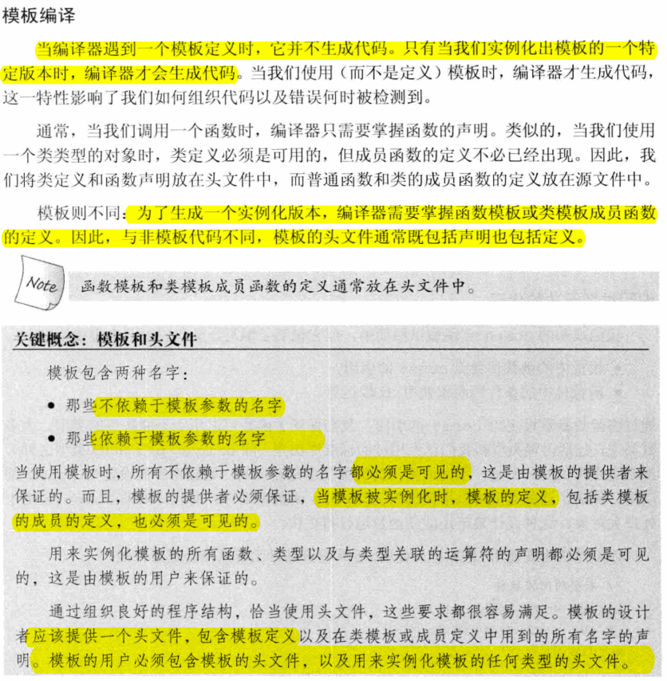
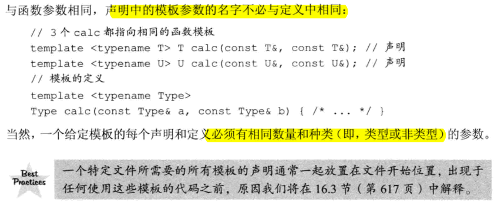
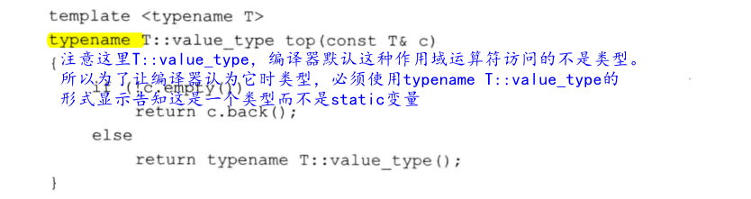
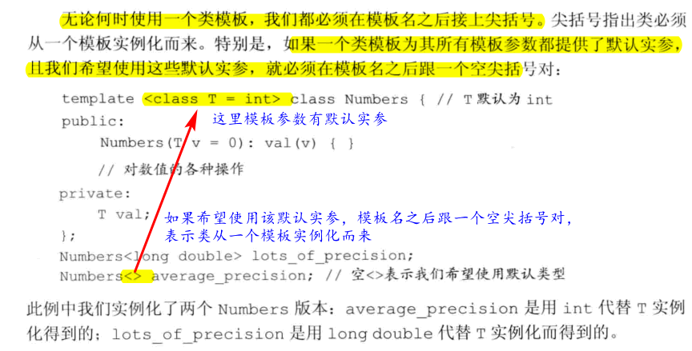
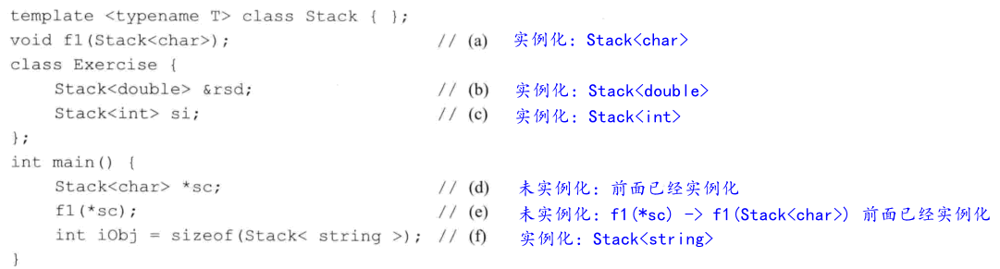
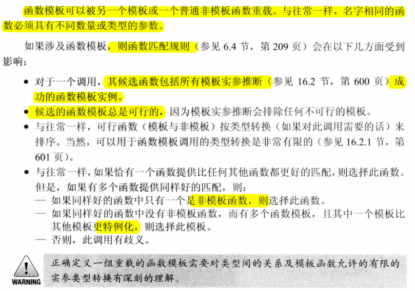

# 16 模板与泛型编程
- 面向对象编程（OOP）和泛型编程都能处理在编写程序时不知道类型的情况。不同之处在于：OOP能处理类型在程序运行之前都未知的情况；而在泛型编程中，在编译时就能获知类型了。
- 模板时C++中泛型编程的基础
## 16.1 定义模板
### 16.1.1 函数模板
- 模板参数列表的作用很像函数参数列表。模板参数表示在类或函数定义中用到的类型或值。
- 编译器生成的版本通常成为模板的实例
- 类型参数可以用来指定返回类型或函数的参数类型，以及在函数体内用于变量声明或类型转换。
- 非类型参数：一个非类型参数表示一个值而非一个类型。我们通过一个特定的类型名而非关键字class或typename来指定非类型参数；
  - 一个非类型参数可以是一个整数；-> 必须是一个常量表达式；
  - 或者是一个指向对象或函数类型的指针或（左值）引用；-> 必须具有静态的生存期。不能用一个普通（非static）局部变量或动态对象作为指针或引用非类型模板参数的实参。
  ```c++
  template<unsigned N, unsigned M>
  int compare(const char (&p1)[N], const char (&p2)[M]) {
    return strcmp(p1, p2);
  }

  compare("hi", "mom") ---> 实例化为： int compare(const char (&p1)[3], const char (&p2)[4])
  ```
- inline或constexpr说明符放在模板参数列表之后，返回类型之前
- 模板程序应该尽量减少对实参类型的要求
- 模板的头文件通常既包括声明也包括定义
  
  

- 保证传递给模板的实参支持模板所要求的操作，以及这些操作在模板中能正确动作，是调用者的责任

#### Exercise
- e16.1
  > 当调用一个函数模板时，编译器用函数实参推断出模板实参，从而实例化一个特定版本的函数。
- e16.2
  ```c++
  #include <iostream>
  using namespace std;

  template <typename T>
  int compare(const T &v1, const T &v2) {
      if (v1 < v2) return -1;
      if (v2 < v1) return 1;
      return 0;
  }

  int main() {
      cout << compare(1, 2) << endl;
      // error: no matching function for call to ‘compare(int, double)’
      //! cout << compare(3, 2.5) << endl;
      cout << compare(2.5, 2.8) << endl;
  }
  ```
- e16.3
  ```
  /usr/include/c++/7/bits/basic_string.h:6119:5: note:   template argument deduction/substitution failed:
  t16-3.cc:7:12: note:   mismatched types ‘const _CharT*’ and ‘Sales_data’
      if (v1 < v2) return -1;
          ~~~^~~~
  ```
- e16.4
  ```c++
  #include <vector>
  #include <string>
  #include <list>
  #include <iostream>

  using namespace std;

  template <typename Iter, typename T>
  Iter find(Iter first, Iter last, const T &k) {
      while (first != last) {
          if (*first == k) return first;
          ++first;
      }
      return last;
  }

  int main() {
      vector<int> ivec{1,2,3,4,5,6,7,8};
      list<string> sl{"abc", "efg", "hij"};
      auto it1 = find(ivec.begin(), ivec.end(), 3);
      if (it1 != ivec.end()) cout << *it1 << endl;
      else cout << "Not Found" << endl;
      auto it2 = find(ivec.begin(), ivec.end(), 0);
      if (it2 != ivec.end()) cout << *it2 << endl;
      else cout << "Not Found" << endl;
      auto it3 = find(sl.begin(), sl.end(), "abc");
      if (it3 != sl.end()) cout << *it3 << endl;
      else cout << "Not Found" << endl;
      auto it4 = find(sl.begin(), sl.end(), "abd");
      if (it4 != sl.end()) cout << *it4 << endl;
      else cout << "Not Found" << endl;
  }
  ```
  ```
  //output
  3
  Not Found
  abc
  Not Found
  ```
- e16.5
  ```c++
  #include <iostream>
  using namespace std;

  template <typename T, unsigned N>
  void print(T (&arr)[N]) {
      for (auto elem : arr)
          cout << elem << endl;
  }

  int main() {
      char c_arry[] = {'a', 'b', 'c', 'd'};
      double d_arry[] = {1.1, 2.2, 3.3};
      int i_arry[] = {1, 2, 3, 4};
      print(c_arry);
      print(d_arry);
      print(i_arry);
  }
  ```
- e16.6
  ```c++
  #include <iostream>
  using namespace std;
  template <typename T, unsigned N>
  T *my_begin(T (&arr)[N]) {
      return arr;
  }

  template <typename T, unsigned N>
  T *my_end(T (&arr)[N]) {
      return &arr[N];
  }

  int main() {
      int a[] = {1,2,3,4,5};
      cout << &a[0] << endl;
      cout << my_begin(a) << endl;
      cout << &a[5] << endl;
      cout << my_end(a) << endl;
  }
  ```
- e16.7
  ```c++
  #include <iostream>
  using namespace std;

  template <typename T, unsigned N>
  constexpr unsigned array_size(const T (&arr)[N]) {
      return N;
  }

  int main() {
      int i[6];
      char c[7];
      cout << array_size(i) << endl;
      cout << array_size(c) << endl;
  }
  ```
- e16.8
  > 模板程序应该尽量减少对实参类型的要求。一般大多数类!=比<定义的更多

### 16.1.2 类模板
- 与函数模板不同，编译器不能为类模板推断模板参数类型，必须在模板名后的尖括号中提供额外信息。

#### Exercise
- e16.9
  > 函数模板：是可以与泛型类型一起使用的特殊功能。这使我们可以创建一个函数模板，其功能可以适应多种类型或类，而无需为每种类型重复完整的代码。  
  > 类模板：提供了基于参数生成类的规范。类模板通常用于实现容器。通过将给定的一组类型作为模板参数传递给它来实例化一个类模板。
- e16.10
  > 实例化类模板，需要提供显示模板实参列表。它们被绑定到模板参数，编译器使用这些模板实参来实例化出特定的类。其中的成员函数只有当程序用到它时才进行实例化，如果一个成员函数没有被使用，则它不会被实例化。
- e16.11
  > 需要为ListItem提供参数列表
  ```c++
  #ifndef T16_11_H
  #define T16_11_H

  template <typename elemType> class ListItem;
  template <typename elemType> class List {
  public:
      List<elemType>();
      List<elemType>(const List<elemType> &);
      List<elemType>& operator=(const List<elemType> &);
      ~List();
      void insert(ListItem<elemType> *ptr, elemType value);
  private:
      ListItem<elemType> *front, *end;
  };

  #endif
  ```
- e16.12
  ```c++
  #ifndef BLOB_H
  #define BLOB_H

  #include <vector>
  #include <string>
  #include <memory>

  template <typename> class BlobPtr;
  template <typename> class Blob;
  template <typename T>
  bool operator==(const Blob<T> &, const Blob<T> &);

  template <typename T> class Blob {
      friend class BlobPtr<T>;
      friend bool operator==<T>(const Blob<T> &, const Blob<T> &);
  public:
      typedef T value_type;
      typedef typename std::vector<T>::size_type size_type;
      // constructor
      Blob();
      Blob(std::initializer_list<T> il);

      size_type size() const {
          return data->size();
      }
      bool empty() const {
          return data->empty();
      }

      void push_back(const T &t) {
          data->push_back(t);
      }
      void push_back(T &&t) {
          data->push_back(std::move(t));
      }
      void pop_back();

      T& front();
      const T& front() const;

      T& back();
      const T& back() const;

      T& operator[](size_type i);
      const T& operator[](size_type i) const;
  private:
      std::shared_ptr<std::vector<T>> data;
      void check(size_type i, const std::string &msg) const;
  };

  template <typename T>
  void Blob<T>::check(size_type i, const std::string &msg) const {
      if (i >= data->size())
          throw std::out_of_range(msg);
  }

  template <typename T>
  const T& Blob<T>::front() const {
      check(0, "front on empty Blob");
      return data->front();
  }

  template <typename T>
  T& Blob<T>::front() {
      check(0, "front on empty Blob");
      return data->front();
  }

  template <typename T>
  const T& Blob<T>::back() const {
      check(0, "back on empty Blob");
      return data->back();
  }

  template <typename T>
  T& Blob<T>::back() {
      check(0, "back on empty Blob");
      return data->back();
  }

  template <typename T>
  T& Blob<T>::operator[] (size_type i) {
      check(i, "subscript out of range");
      return (*data)[i];
  }

  template <typename T>
  const T& Blob<T>::operator[] (size_type i) const {
      check(i, "subscript out of range");
      return (*data)[i];
  }

  template <typename T>
  void Blob<T>::pop_back() {
      check(0, "pop_back on empty Blob");
      data->pop_back();
  }

  template <typename T>
  Blob<T>::Blob() : data(std::make_shared<std::vector<T>>()) {}

  template <typename T>
  Blob<T>::Blob(std::initializer_list<T> il) : data(std::make_shared<std::vector<T>>(il)) {}

  template <typename T>
  bool operator==(const Blob<T> &lhs, const Blob<T> &rhs) {
      return *lhs.data == *rhs.data;
  }

  #endif
  ```

  ```c++
  #ifndef BLOBPTR_H
  #define BLOBPTR_H

  #include "Blob.h"

  template <typename T> class BlobPtr {
  public:
      BlobPtr() : curr(0) {}
      BlobPtr(Blob<T> &a, size_t sz = 0) : wptr(a.data), curr(sz) {}
      T& operator*() const {
          auto p = check(curr, "dereference past end");
          return (*p)[curr];
      }
      BlobPtr& operator++();
      BlobPtr  operator++(int);
      BlobPtr& operator--();
      BlobPtr  operator--(int);
  private:
      std::shared_ptr<std::vector<T>> check(std::size_t, const std::string &) const;
      std::weak_ptr<std::vector<T>> wptr;
      std::size_t curr;
  };

  template <typename T>
  std::shared_ptr<std::vector<T>> BlobPtr<T>::check(std::size_t i, const std::string &msg) const {
      auto ret = wptr.lock();
      if (!ret)
          throw std::runtime_error("unbound StrBlobPtr");
      if (i >= ret->size())
          throw std::out_of_range(msg);
      return ret;
  }

  template <typename T>
  BlobPtr<T> BlobPtr<T>::operator++(int) {
      BlobPtr ret = *this;
      ++*this;
      return ret;
  }

  template <typename T>
  BlobPtr<T>& BlobPtr<T>::operator++() {
      check(curr, "increment past end of StrBlobPtr");
      ++curr;
      return *this;
  }

  template <typename T>
  BlobPtr<T> BlobPtr<T>::operator--(int) {
      BlobPtr ret = *this;
      --*this;
      return ret;
  }

  template <typename T>
  BlobPtr<T>& BlobPtr<T>::operator--() {
      --curr;
      check(curr, "decrement past begin of StrBlobPtr");
      return *this;
  }

  #endif
  ```
- e16.13
  > 一对一版本
- e16.14
- e16.15
- e16.16
 
### 16.1.3 模板参数
- 在模板内不能重用模板参数名
- 一个模板参数名在一个特定模板参数列表中只能出现一次
- 模板声明必须包含模板参数
- 声明中的模板参数的名字不必与定义中相同

  

- 当我们希望通知编译器一个名字表示类型时，必须使用关键字`typename`，而不能使用`class`
  
  

  

#### Exercise
- e16.17
  > 本质上没什么不同。例外是，希望通知编译器一个名字表示类型时，必须使用typename，而不能使用class
- e16.18
  ```c++
  (a) template <typename T, U, typename V> void f1(T, U, V); // 非法，需要指明U是类型参数还是非类型参数；t16-18.h:1:49: error: ‘U’ has not been declared
  (b) template <typename T> T f2(int &T); // 非法，覆盖了模板参数；t16-18.h:2:33: error: declaration of ‘int& T’ shadows template parameter
  (c) inline template <typename T> T foo(T, unsigned int *); // 非法，这里是声明，只有在定义的时候才可以指定inline；t16-18.h:3:17: error: expected unqualified-id before ‘<’ token
  (d) template <typename T> f4(T, T); // 非法，没有返回值； error: expected constructor, destructor, or type conversion before ‘;’ token
  (e) typedef char Ctype;
      template <typename Ctype> Ctype f5(Ctype a); // 合法。这里的模板参数屏蔽了typedef定义的Ctype
  ```
- e16.19
  ```c++
  #include <iostream>
  #include <vector>
  #include <string>
  using namespace std;

  template <typename T> void myprint(const T &c) {
      for (typename T::size_type i = 0; i != c.size(); ++i) {
          cout << c.at(i) << " ";
      }
      cout << endl;
  }

  int main() {
      vector<int> iv{1,2,3,4,5,6};
      string s = "abcdefgh";
      myprint(iv);
      myprint(s);
  }
  ```
- e16.20
  ```c++
  #include <iostream>
  #include <vector>
  #include <string>
  using namespace std;

  template <typename T> void myprint(const T &c) {
      for (typename T::const_iterator it = c.begin(); it != c.end(); ++it) {
          cout << *it << " ";
      }
      cout << endl;
  }

  int main() {
      vector<int> iv{1,2,3,4,5,6};
      string s = "abcdefgh";
      myprint(iv);
      myprint(s);
  }
  ```
### 16.1.4 成员模板
#### Exericse
- e16.21
  ```c++
  #include <iostream>
  #include <string>
  #include <memory>

  using namespace std;

  class DebugDelete {
  public:
      DebugDelete(std::ostream &s = std::cerr) : os(s) {}
      template <typename T> void operator() (T *p) const {
          os << "deleting unique_ptr" << std::endl;
          delete p;
      }
  private:
      std::ostream &os;
  };

  int main() {
      double *p = new double;
      DebugDelete d;
      d(p);

      int *ip = new int;
      DebugDelete()(ip);

      unique_ptr<int, DebugDelete> sp1(new int, DebugDelete());
      unique_ptr<string, DebugDelete> sp2(new string, DebugDelete());
  }
  ```
- e16.22
- e16.23
- e16.24

### 16.1.5 控制实例化
- 当模板被使用时才进行实例化，这一特性意味着，相同的实例可能出现在多个对象文件中。当两个或多个独立编译的源文件使用了相同的模板，并提供了相同的模板参数时，每个文件中就都会有该模板的一个实例
- 实例化声明：`declaration`部分是一个类或函数声明，其中所有模板参数已被替换为模板实参。当编译器遇到`extern`模板声明时，不会在本文件中生成实例化代码。由于编译器在使用一个模板时自动对其实例化，因此`extern`声明必须出现在任何使用此实例化版本的代码之前。
  ```c++
  // 格式
  extern template declaration; 
  // 例子
  extern template class Blob<string>;
  extern template int compare(const int&, const int&);
  ```
- 实例化定义: 当编译器遇到一个实例化定义时，为其生成代码。
  ```c++
  // 格式
  template declaration;
  // 例子
  template class Blob<string>;
  template int compare(const int&, const int&);
  ```
- 实例化定义会实例化所有成员。
  - 一个类模板的实例化定义会实例化该模板的所有成员，包括内联的成员函数。
  - 在一个类模板的实例化定义中，所有类型必须能用于模板的所有成员函数。
#### Exercise
- e16.25
  > 实例化声明；实例化定义
- e16.26
  > 不可以；因为显示实例化定义，会实例化该模板的所有成员。vector会调用NoDefault的默认构造函数对元素进行初始化。
- e16.27
  
    
### 16.1.6 效率与灵活性
:TODO:
## 16.2 模板实参推断
- 在模板实参推断中，编译器使用函数调用中的实参类型来寻找模板实参，用这些模板那实参生成的函数版本与给定的函数调用最为匹配。

### 16.2.1 类型转换与模板类型参数
- 将实参传递给带模板类型的函数形参时，能够自动应用的类型转换只有const转换及数组或函数到指针的转换。
- 其它类型转换，如算数转换，派生类向基类的转换，以及用于定义的转换，都不能应用于函数模板。
- 如果函数参数类型不是模板参数，则对实参进行正常的类型转换。
#### Exercise
- e16.32
  > 在模板实参推断过程中，编译器使用函数调用中的实参类型来寻找模板实参，用这些模板实参生成的函数版本与给定的函数调用最为匹配。
- e16.33
  > const转换，及数组或函数到指针的转换
- e16.34
  > 都是非法的。因为是引用类型，如果是指针类型就合法了。如果函数形参是引用类型，则可以对数组或函数类型的实参应用正常的指针转换。
- e16.35
  > (a) 合法：第二个参数是int类型，不是模板参数，char可以转换为int  
  > (b) 合法：第二个参数不是模板参数，float可以转换为int  
  > (c) 合法：两个实参都是char类型，类型一样  
  > (d) 不合法：一个是double，另一个是float，但是模板参数必须一致
- e16.36
  ```c++
  template <typename T> void f1(T, T) {

  }
  template <typename T1, typename T2> void f2(T1, T2) {
  }
  int main() {
      int i = 0, j = 42, *p1 = &i, *p2 = &j;
      const int *cp1 = &i, *cp2 = &j;
      f1(p1, p2);
      f2(p1, p2);
      f1(cp1, cp2);
      f2(cp1, cp2);
      /*
          t16-36.cc:13:15: error: no matching function for call to ‘f1(int*&, const int*&)’
      */
      //! f1(p1, cp1);
      f2(p1, cp1);
  }
  ```
### 16.2.2 函数模板显示实参
#### Exercise
- e16.37
  > 函数定义：template <class T> const T& max (const T& a, const T& b);  
  > 不可以，因为使用相同类型。做法如下
  ```c++
  #include <iostream>     // std::cout
  #include <algorithm>    // std::max

  using namespace std;

  int main() {
      cout << max(3.16, 4.18) << endl;
      /*
      t16-37.cc:8:24: error: no matching function for call to ‘max(double, int)’
      cout << max(3.16, 4) << endl;
      */
      //! cout << max(3.16, 4) << endl;
      cout << max<double>(3.16, 4) << endl;
  }
  ```
- e16.38
  > 行为：分配并构造一个类型为T的对象，将args传递给它的构造函数，并返回一个类型为shared_ptr<T>的对象，该对象拥有并存储指向它的指针(使用计数为1)。  
  > 如果没有指定T类型，单纯依靠其它参数，如何知道分配多大呢？
  ```c++
  // template <class T, class... Args> shared_ptr<T> make_shared (Args&&... args);
  // make_shared example
  #include <iostream>
  #include <memory>

  int main () {

    std::shared_ptr<int> foo = std::make_shared<int> (10);
    // same as:
    std::shared_ptr<int> foo2 (new int(10));

    auto bar = std::make_shared<int> (20);

    auto baz = std::make_shared<std::pair<int,int>> (30,40);

    std::cout << "*foo: " << *foo << '\n';
    std::cout << "*bar: " << *bar << '\n';
    std::cout << "*baz: " << baz->first << ' ' << baz->second << '\n';

    return 0;
  }
  ```
- e16.39
  ```c++
  #include <iostream>
  #include <string>
  using namespace std;

  template <typename T>
  int compare(const T &v1, const T &v2) {
      if (v1 < v2) return -1;
      if (v2 < v1) return 1;
      return 0;
  }

  int main() {
      cout << compare(1, 2) << endl;
      //! cout << compare(3, 2.5) << endl;
      cout << compare(2.5, 2.8) << endl;
      /*
        t16-39.cc:16:36: error: no matching function for call to ‘compare(const char[6], const char [5])’
      */
      //! cout << compare("abcde", "abcd") << endl;
      cout << compare<string>("abcde", "abcd") << endl;
  }
  ```
### 16.2.3 尾置返回类型与类型转换

#### Exercise
- e16.40
  > 返回类型变成了右值，不能被赋值，这里应该是常量引用；
  ```c++
  #include <vector>
  #include <iostream>
  using namespace std;

  template <typename It>
  auto fcn3(It beg, It end) -> decltype(*beg + 0) {
      return *beg;
  }

  int main() {
      vector<int> iv{1,2,3,4,5};
      /*
      t16-40.cc:12:43: error: lvalue required as left operand of assignment
      */
      //! cout << (fcn3(iv.begin(), iv.end()) = 3) << endl;
  }
  ```
- e16.41
  ```c++
  #include <iostream>
  using namespace std;

  template <typename T1, typename T2>
  auto sum(T1 a, T2 b) -> decltype(a + b) {
      return a + b;
  }

  int main() {
      auto a = sum(1, 1);
      cout << a << " " << sizeof(a) << endl; // 2 4
      auto b = sum(1, 1.1);
      cout << b << " " << sizeof(b) << endl; // 2.1 8
      auto c = sum(1, 1.1f);
      cout << c << " " << sizeof(c) << endl; // 2.1 4
  }
  ```
### 16.2.4 函数指针和实参推断
- 当我们用一个函数模板初始化一个函数指针或为一个函数指针赋值时，编译器使用指针的类型来推断模板实参
  ```c++
  template <typename T> int compare(const T&， const T&);
  int (*pf1)(const int&, const int&) = compare; // -> 推断compare为 int compare(const int&, const int&);
  ```
### 16.2.5 模板实参推断和引用
- 如果一个函数参数是指向模板参数的右值引用（如，T&&），则可以传递给它任意类型的实参。如果将一个左值传递给这样的参数，则函数参数被实例化为一个普通的左值引用（T&）。
- C++语言在正常绑定规则之外定义了两个例外规则。这两个例外规则是move这种标准库设施正确工作的基础
  - 第一个例外影响**右值引用参数的推断**如何进行。
    - 当我们将一个**左值**（int i）传递给函数的**右值引用参数**，且此右值引用指向模板类型参数（如T&&）时，**编译器推断模板类型参数为实参的左值引用**类型。因此，当我们调用f3(i)时，**编译器推断T的类型为`int&`而非`int`**.
  - 可以使用第二个例外绑定规则：如果我们间接创建了一个引用的引用，则这些引用形成了 **“折叠”** 。在所有情况下，**引用会折叠成一个普通的左值引用类型**。在新标准中，折叠规则扩展到右值引用。只在一种特殊情况下引用会折叠成右值引用：右值引用的引用。
    - X& &、X& && 和 X&& &都折叠成类型X&
    - 类型X&& &&折叠成X&&
- 引用折叠只能应用于间接创建的引用的引用，如类型别名或模板参数。
#### Exercise
- e16.42
  > (a) int&, int&; (b) const int &, const int&; (d) int, int &&
  ```c++
  #include <iostream>
  using namespace std;

  template <typename T> void g(T&& val) {
      T t = val;
      cout << "&t: " << &t << endl;
      cout << "&val: " << &val << endl;
      //! val = 10; // ci: error
  }

  int main() {
      int i = 100;
      const int ci = 200;
      g(i);
      g(ci);
      g(42);
  }
  //output
  &t: 0x7ffff399037c
  &val: 0x7ffff399037c
  &t: 0x7ffff3990380
  &val: 0x7ffff3990380
  &t: 0x7ffff3990354
  &val: 0x7ffff3990384
  ```
- e16.43
  > int & 
- e16.44
  > 因为是传值的，所以会拷贝原来的数据，所以传入的是const或非const都一样。所以T是int，val也都是int
  ```c++
  #include <iostream>
  using namespace std;

  template <typename T> void g(T val) {
      T t = val;
      cout << "&t: " << &t << endl;
      cout << "&val: " << &val << endl;
      val = 10; // ci: error
      t = 20;
  }

  int main() {
      int i = 100;
      const int ci = 200;
      g(i);
      g(ci);
      g(i*ci);
      g(42);
      cout << "i: " << i << endl;
      cout << "ci: " << ci << endl;
  }
  ```
  > 当函数参数本身是const时，T的类型推断的结果不会是一个const类型。const已经是函数参数类型的一部分；因此，它不会也是模板参数类型的一部分。所以所有T都是int，所有val都是const int&
  ```c++
  #include <iostream>
  using namespace std;

  template <typename T> void g(const T &val) {
      T t = val;
      cout << "&t: " << &t << endl;
      cout << "&val: " << &val << endl;
      //val = 10; // ci: error
      t = 20;
  }

  int main() {
      int i = 100;
      const int ci = 200;
      g(i);
      g(ci);
      g(i*ci);
      cout << "i: " << i << endl;
      cout << "ci: " << ci << endl;
  }
  ```
- e16.45
  ```c++
  #include <iostream>
  #include <vector>
  using namespace std;
  template <typename T> void g(T&& val) {vector<T> v;}

  int main() {
      int i = 10;
      //! g(i); // T -> int&; vector<int &> vector的元素不能是引用
      g(42); // T->int; vector<int>
  }
  ```
### 16.2.6 理解std::move

### 16.2.7 转发
- 如果一个函数参数是指向模板类型参数的右值引用（如T&&），它对应的实参的const属性和左值/右值属性都得到保持
#### Exericse
- e16.47
  ```c++
  #include <iostream>
  #include <utility>
  using namespace std;

  template <typename F, typename T1, typename T2>
  void flip(F f, T1 &&t1, T2 &&t2) {
      f(std::forward<T2>(t2), std::forward<T1>(t1));
  }

  template <typename F, typename T1, typename T2>
  void flip1(F f, T1 t1, T2 t2) {
      f(t2, t1);
  }

  template <typename F, typename T1, typename T2>
  void flip2(F f, T1 &&t1, T2 &&t2) {
      f(t2, t1);
  }

  void f(int v1, int &v2) {
      cout << v1 << " " << ++v2 << endl;
  }

  void g(int &&i, int &j) {
      cout << i  << " " << j << endl;
  }

  int main() {
      int i = 10, j = 20;
      f(42, i);
      cout << "1: " << i << " " << j << endl;
      flip1(f, j, 42);
      cout << "2: " << i << " " << j << endl;
      //flip2(g, i, 42);
      cout << "3: " << i << " " << j << endl;
      flip(g, i, 42);
      cout << "4: " << i << " " << j << endl;

      g(43, i);
      int &&k = 54;
      /*
      t16-47.cc:41:7: error: cannot bind rvalue reference of type ‘int&&’ to lvalue of type ‘int’
      g(k, i);
      */
      //! g(k, i);
  }
  ```
## 16.3 重载与模板

  

- 对于一个调用，如果非函数模板与一个函数模板提供同样好的匹配，则选择非模板版本
- 当有多个重载模板对一个调用提供同样好的匹配时，应选择最特例化的版本。
- 在定义任何函数之前，记得声明所有重载的函数版本。这样就不必担心编译器由于未遇到你希望调用的函数而实例化一个并非你需要的版本。
#### Exercise
- e16.48
  ```c++
  #include <iostream>
  #include <sstream>
  #include <string>
  using namespace std;

  template <typename T> string debug_rep(const T &t) {
      cout << __PRETTY_FUNCTION__ << endl;
      ostringstream ret;
      ret << t;
      return ret.str();
  }

  template <typename T> string debug_rep(T *p) {
      cout << __PRETTY_FUNCTION__ << endl;
      ostringstream ret;
      ret << "Pointer: " << p;
      if (p)
          ret << " " << debug_rep(*p);
      else
          ret << " null pointer";
      return ret.str();
  }

  string debug_rep(const string &s) {
      cout << __PRETTY_FUNCTION__ << endl;
      return '"' + s + '"';
  }

  string debug_rep(char *p) {
      cout << __PRETTY_FUNCTION__ << endl;
      return debug_rep(string(p));
  }

  string debug_rep(const char *p) {
      cout << __PRETTY_FUNCTION__ << endl;
      return debug_rep(string(p));
  }

  int main() {
      string s("hi");
      cout << "------" << endl;
      cout << debug_rep(s) << endl;
      cout << "------" << endl;
      cout << debug_rep(&s) << endl;
      cout << "------" << endl;
      const string *sp = &s;
      cout << debug_rep(sp) << endl;
      cout << "------" << endl;
      cout << debug_rep("hi world") << endl;
      cout << "------" << endl;
      return 0;
  }
  ```
- e16.49
  ```c++
  #include <iostream>
  using namespace std;

  template <typename T> void f(T) {
      cout << __PRETTY_FUNCTION__ << endl;
  }

  template <typename T> void f(const T*) {
      cout << __PRETTY_FUNCTION__ << endl;
  }

  template <typename T> void g(T) {
      cout << __PRETTY_FUNCTION__ << endl;
  }

  template <typename T> void g(T*) {
      cout << __PRETTY_FUNCTION__ << endl;
  }

  int main() {
      int i = 42, *p = &i;
      const int ci = 0, *p2 = &ci;
      g(42); // g(T)  T = int
      g(p);  // g(T*) T = int
      g(ci); // g(T)  T = int
      g(p2); // g(T*) T = const int
      f(42); // f(T)  T = int
      f(p);  // f(const T*) T = int // f(T) T = int*
      f(ci); // f(T)  T = int
      f(p2); // f(const T*) T = int
  }
  ```
  ```
  //output
  void g(T) [with T = int]
  void g(T*) [with T = int]
  void g(T) [with T = int]
  void g(T*) [with T = const int]
  void f(T) [with T = int]
  void f(T) [with T = int*]
  void f(T) [with T = int]
  void f(const T*) [with T = int]
  ```
- e16.50

## 16.4 可变参数模板
- 一个**可变参数模板**就是一个接受可变数目参数的**模板函数或模板类**

#### Exercise
- e16.51-52
  ```c++
  #include <iostream>
  using namespace std;

  template<typename T, typename ... Args>
  void foo(const T &t, const Args& ... rest) {
      cout << __PRETTY_FUNCTION__ << endl;
      cout << sizeof...(rest) << endl;
      cout << sizeof...(Args) << endl;
      cout << "-----" << endl;
  }

  int main() {
      int i = 0; double d = 3.14; string s = "how now brown cow";
      foo(i, s, 42, d);
      foo(s, 42, "hi");
      foo(d, s);
      foo("hi");
  }
  ```

  ```
  void foo(const T&, const Args& ...) [with T = int; Args = {std::__cxx11::basic_string<char, std::char_traits<char>, std::allocator<char> >, int, double}]
  3
  3
  -----
  void foo(const T&, const Args& ...) [with T = std::__cxx11::basic_string<char>; Args = {int, char [3]}]
  2
  2
  -----
  void foo(const T&, const Args& ...) [with T = double; Args = {std::__cxx11::basic_string<char, std::char_traits<char>, std::allocator<char> >}]
  1
  1
  -----
  void foo(const T&, const Args& ...) [with T = char [3]; Args = {}]
  0
  0
  -----
  ```
### 16.4.1 编写可变参数函数模板
- 当定义可变参数版本的print时，非可变参数版本的声明必须在作用域中。否则，可变参数版本会无限递归。
#### Exercise
- e16.53
  ```c++
  #include <iostream>
  #include <string>
  using namespace std;

  template <typename T>
  ostream &print(ostream &os, const T &t) {
      cout << __PRETTY_FUNCTION__ << endl;
      cout << "---" << endl;
      return os << t;
  }

  template <typename T, typename... Args>
  ostream &print(ostream &os, const T &t, const Args&... rest) {
      cout << __PRETTY_FUNCTION__ << endl;
      os << t << ",";
      cout << "---" << endl;
      return print(os, rest...);
  }

  int main() {
      int i = 33; double d = 3.14; string s = "hello";
      print(cout, i, s, 42);
  }
  ```
  ```
  std::ostream& print(std::ostream&, const T&, const Args& ...) [with T = int; Args = {std::__cxx11::basic_string<char, std::char_traits<char>, std::allocator<char> >, int}; std::ostream = std::basic_ostream<char>]
  33,---
  std::ostream& print(std::ostream&, const T&, const Args& ...) [with T = std::__cxx11::basic_string<char>; Args = {int}; std::ostream = std::basic_ostream<char>]
  hello,---
  std::ostream& print(std::ostream&, const T&) [with T = int; std::ostream = std::basic_ostream<char>]
  ---
  42
  ```
- e16.54
  > 编译失败
- e16.55
  > 编译会失败
  ```
  t16-55.cc:11:17: error: no matching function for call to ‘print(std::ostream&)’
     return print(os, rest...);
            ~~~~~^~~~~~~~~~~~~
  t16-55.cc:7:10: note: candidate: template<class T, class ... Args> std::ostream& print(std::ostream&, const T&, const Args& ...)
  ostream &print(ostream &os, const T &t, const Args&... rest) {
            ^~~~~
  t16-55.cc:7:10: note:   template argument deduction/substitution failed:
  t16-55.cc:11:17: note:   candidate expects at least 2 arguments, 1 provided
      return print(os, rest...);
              ~~~~~^~~~~~~~~~~~~
  ```
### 16.4.2 包扩展
- 对于一个参数包，除了获取其大小外，我们能对它做的唯一的事情就是扩展
  - 当扩展一个包时，我们还要提供用于每个扩展元素的模式。
  - 扩展一个包就是将它分解为构成的元素，对每个元素应用模式，获得扩展后的列表。
  - 通过在模式右边放一个省略号(...)来触发扩展操作
  ```c++
  typename <typename T, typename... Args>  //对于一个参数包，唯一的事情就是扩展
  /* 第一个扩展操作扩展模板参数包，为print生成函数参数列表。对Args的扩展中，编译器将模式const Args&应用到模板参数包Args中的每个元素。因此，此模式的扩展结果是一个逗号分隔的零个或多个类型的列表，每个类型都形如const type & print(cout, i, s, 42) -> ostream & print(ostream &, const int&, const string&, const int&);*/
  ostream & print(ostream &os, const T &t, const Args&...rest) { 
    os << t << ", ";
    /*第二个扩展操作出现在对print的调用中。此模式为print调用生成实参列表 -> print(os, s, 42)。在此情况下，模式是函数参数包的名字，此模式扩展出一个由包中元素组成的、逗号分隔的列表。
    */
    return print(os, rest...) 
  }
  ```
#### Exericse
- e16.56
  ```c++
  #include <iostream>
  #include <sstream>
  #include <string>
  using namespace std;

  template <typename T> string debug_rep(const T &t) {
      cout << __PRETTY_FUNCTION__ << endl;
      ostringstream ret;
      ret << t;
      return ret.str();
  }

  template <typename T> string debug_rep(T *p) {
      cout << __PRETTY_FUNCTION__ << endl;
      ostringstream ret;
      ret << "Pointer: " << p;
      if (p)
          ret << " " << debug_rep(*p);
      else
          ret << " null pointer";
      return ret.str();
  }

  string debug_rep(const string &s) {
      cout << __PRETTY_FUNCTION__ << endl;
      return '"' + s + '"';
  }

  string debug_rep(char *p) {
      cout << __PRETTY_FUNCTION__ << endl;
      return debug_rep(string(p));
  }

  string debug_rep(const char *p) {
      cout << __PRETTY_FUNCTION__ << endl;
      return debug_rep(string(p));
  }

  template <typename T>
  ostream &print(ostream &os, const T &t) {
      cout << __PRETTY_FUNCTION__ << endl;
      cout << "---" << endl;
      return os << t;
  }

  template <typename T, typename... Args>
  ostream &print(ostream &os, const T &t, const Args&... rest) {
      cout << __PRETTY_FUNCTION__ << endl;
      os << t << ",";
      cout << "---" << endl;
      return print(os, rest...);
  }

  template <typename... Args>
  ostream &errorMsg(ostream &os, const Args&... rest) {
      return print(os, debug_rep(rest)...);
  }

  int main() {
      string s = "hi";
      double d = 3.14;
      int i = 99;
      errorMsg(cout, s, d, i);
      return 0;
  }
  ```

  ```
  // 由log可以看出，先扩展，每个元素从右至左调用了对应的debug_rep。所有返回类型都是string
  std::__cxx11::string debug_rep(const T&) [with T = int; std::__cxx11::string = std::__cxx11::basic_string<char>]
  std::__cxx11::string debug_rep(const T&) [with T = double; std::__cxx11::string = std::__cxx11::basic_string<char>]
  std::__cxx11::string debug_rep(const string&)
  // 然后递归打印，print(cout, s, d, i)
  std::ostream& print(std::ostream&, const T&, const Args& ...) [with T = std::__cxx11::basic_string<char>; Args = {std::__cxx11::basic_string<char, std::char_traits<char>, std::allocator<char> >, std::__cxx11::basic_string<char,
  std::char_traits<char>, std::allocator<char> >}; std::ostream = std::basic_ostream<char>]
  "hi",---
  // 第二次 print(cout, d, i)
  std::ostream& print(std::ostream&, const T&, const Args& ...) [with T = std::__cxx11::basic_string<char>; Args = {std::__cxx11::basic_string<char, std::char_traits<char>, std::allocator<char> >}; std::ostream = std::basic_ostream<char>]
  3.14,---
  // 第三次 print(cout, i)
  std::ostream& print(std::ostream&, const T&) [with T = std::__cxx11::basic_string<char>; std::ostream = std::basic_ostream<char>]
  ---
  99
  ```
- e16.57
  > 198页的只能打印同种类型

### 16.4.3 转发参数包
:TODO:

## 16.5 模板特例化
- 特例化的本质是实例化一个模板，而非重载它。因此，特例化不影响函数匹配
- 模板及其特例化版本应该声明在同一个头文件中。所有同名模板的声明应该放在前面，然后是这些模板的特例化版本。
- 我们将一个特殊的函数定义为一个特例化版本还是一个独立的非模板函数，会影响到函数匹配。
- 我们只能部分特例化类模板，而不能部分特例化函数模板

#### Exercise
- e16.63-64
  ```c++
  #include <vector>
  #include <iostream>
  #include <string>
  #include <cstring>
  using namespace std;

  template <typename T>
  int noccur(const vector<T> &vec, const T& val) {
      int occur = 0;
      for (auto &e : vec) {
          if (e == val)
              occur++;
      }
      return occur;
  }

  template <>
  int noccur(const vector<const char *> &vec, const char * const &val) {
      int occur = 0;
      for (auto &e : vec) {
          if (0 == strcmp(e, val))
              occur++;
      }
      return occur;
  }

  int main() {
      vector<double> dvec{3.14, 3.14, 2.5, 6.2, 7.32};
      vector<int> ivec{1, 2, 3, 4, 5, 5, 6};
      vector<string> svec{"abc", "abc", "efg", "hig"};
      cout << noccur(dvec, 3.14) << endl;
      cout << noccur(ivec, 5) << endl;
      cout << noccur(svec, string("abc")) << endl;
      vector<const char *> cvec = {"abc", "abc", "efg", "hig"};
      cout << noccur(cvec, cvec[1]) << endl;
  }
  ````
- e16.65
  ```c++
  #include <iostream>
  #include <sstream>
  #include <string>
  using namespace std;

  template <typename T> string debug_rep(const T &t) {
      cout << __PRETTY_FUNCTION__ << endl;
      ostringstream ret;
      ret << t;
      return ret.str();
  }

  template <typename T> string debug_rep(T *p) {
      cout << __PRETTY_FUNCTION__ << endl;
      ostringstream ret;
      ret << "Pointer: " << p;
      if (p)
          ret << " " << debug_rep(*p);
      else
          ret << " null pointer";
      return ret.str();
  }

  string debug_rep(const string &s) {
      cout << __PRETTY_FUNCTION__ << endl;
      return '"' + s + '"';
  }

  template <>
  string debug_rep(char *p) {
      cout << __PRETTY_FUNCTION__ << endl;
      return debug_rep(string(p));
  }

  template <>
  string debug_rep(const char *p) {
      cout << __PRETTY_FUNCTION__ << endl;
      return debug_rep(string(p));
  }

  int main() {
      string s("hi");
      cout << "------" << endl;
      cout << debug_rep(s) << endl;
      cout << "------" << endl;
      cout << debug_rep(&s) << endl;
      cout << "------" << endl;
      const string *sp = &s;
      cout << debug_rep(sp) << endl;
      cout << "------" << endl;
      cout << debug_rep("hi world") << endl;
      cout << "------" << endl;
      return 0;
  }
  ```
- e16.66
  > 如上题，将重载变为特例化，则执行`cout << debug_rep("hi world") << endl;`时使用了`debug_rep(T*)`。而之前16.3节使用的重载版本，所以重载会作为最佳匹配。
- e16.67
  > 特例化并不会影响函数匹配。当定义函数模板的特例化版本时，本质上接管了编译器的工作。即，我们为原模板的一个特殊实例提供了定义。重要的是要弄清：一个特例化版本本质上是一个实例，而非函数名的一个重载版本。

  