# 17 标准库特殊设施
## tuple类型
- 当我们希望将一个数据组合成单一对象，但又不想麻烦第定义一个新数据结构来表示这些数据时，tuple是非常有用的。

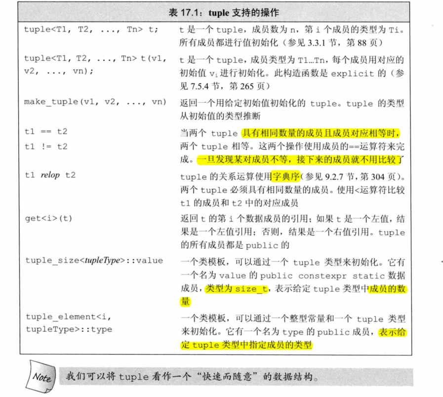 

### 17.1.1 定义和初始化tuple

- tuple的构造函数是explicit的，因此必须使用直接初始化语法

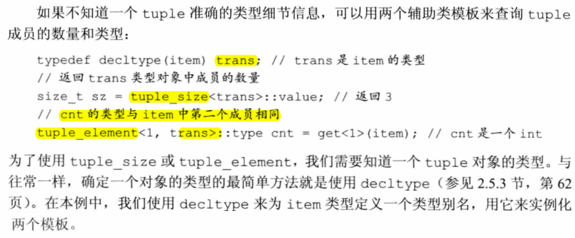 

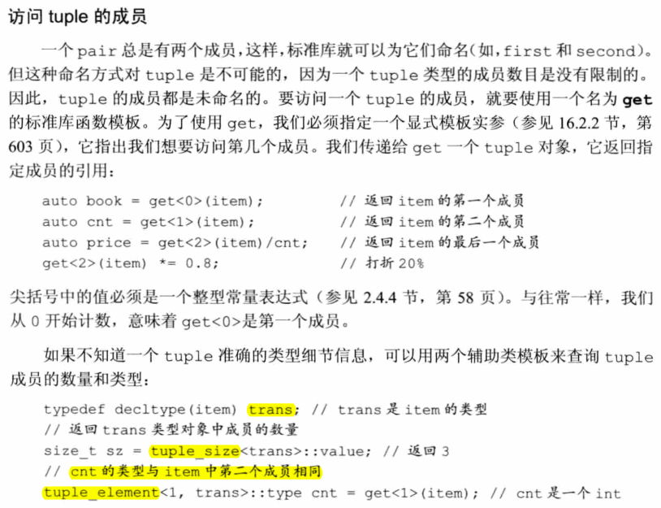 

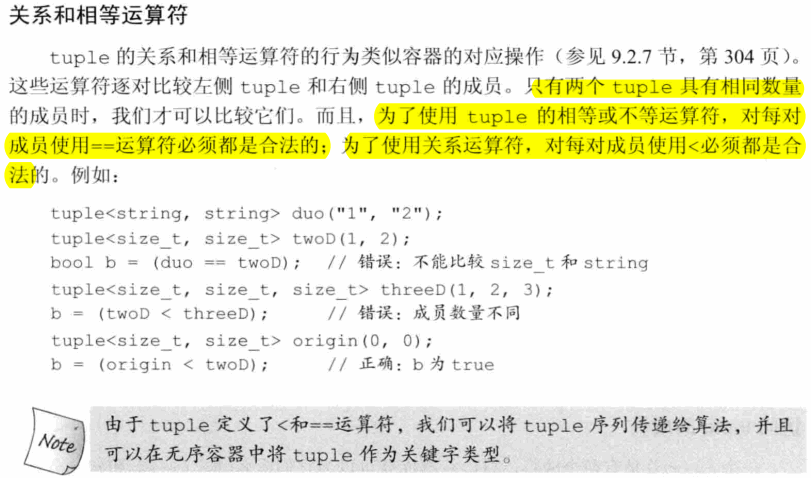 

- 由于tuple定义了`<`和`==`运算符，我们可以将tuple序列传递给算法，并且可以在无序容器中将tuple作为关键字类型。

#### Exercise
- e17.1
  ```c++
  #include <tuple>
  #include <iostream>
  using namespace std;

  int main() {
      tuple<int, int, int> i3 {10, 20, 30};
      cout << get<0>(i3) << endl;
      cout << get<1>(i3) << endl;
      cout << get<2>(i3) << endl;
  }
  ```
- e17.2
  ```c++
  #include <tuple>
  #include <vector>
  #include <string>
  #include <iostream>

  using namespace std;

  int main() {
      tuple<string, vector<string>, pair<string, int>> val {"abc", {"001", "002", "003"}, {"abc", 42}};
      cout << get<0>(val) << endl;
      for (auto it = get<1>(val).begin(); it != get<1>(val).end(); ++it)
          cout << *it << endl;
      cout << get<2>(val).first << endl;
      cout << get<2>(val).second << endl;
  }
  ```
- e17.3
  - t17-3.h
  ```c++
  #ifndef T17_3_H
  #define T17_3_H

  #include <iostream>
  #include <vector>
  #include <set>
  #include <map>
  #include <string>
  #include <fstream>
  #include <sstream>
  #include <memory>
  #include <tuple>

  namespace chapter10 {
  using line_no = std::vector<std::string>::size_type;
  using Iter = std::set<line_no>::iterator;
  using File = std::shared_ptr<std::vector<std::string>>;
  using Line = std::shared_ptr<std::set<line_no>>;
  using QueryResult = std::tuple<std::string, Line, File>;

  class TextQuery {
  public:
      TextQuery(std::ifstream &);
      QueryResult query(const std::string &) const;
  private:
      std::shared_ptr<std::vector<std::string>> file;
      std::map<std::string, std::shared_ptr<std::set<line_no>>> wm;
  };

  TextQuery::TextQuery(std::ifstream &is) : file(new std::vector<std::string>) {
      std::string text;
      while (std::getline(is, text)) {
          file->push_back(text);
          int n = file->size() - 1;
          std::istringstream line(text);
          std::string word;
          while (line >> word) {
              auto &lines = wm[word];
              if (!lines)
                  lines.reset(new std::set<line_no>);
              lines->insert(n);
          }
      }
  }

  QueryResult TextQuery::query(const std::string &sought) const {
      static std::shared_ptr<std::set<line_no>> nodata(new std::set<line_no>);
      auto loc = wm.find(sought);
      if (loc == wm.end())
          return QueryResult(sought, nodata, file);
      else
          return QueryResult(sought, loc->second, file);

  }

  std::string make_plural(size_t ctr, const std::string &word, const std::string &ending) {
      return (ctr > 1) ? word + ending : word;
  }

  std::ostream &print(std::ostream &os, const QueryResult &qr) {
      os << std::get<0>(qr) << " occurs " << std::get<1>(qr)->size() << " " << make_plural(std::get<1>(qr)->size(), "time", "s") << std::endl;
      for (auto num : *std::get<1>(qr))
          os << "\t(line " << num + 1 << ") " << *(std::get<2>(qr)->begin() + num) << std::endl;
      return os;
  }

  void runQueries(std::ifstream &infile) {
      TextQuery tq(infile);
      while (true) {
          std::cout << "enter word to look for, or q to quit: ";
          std::string s;
          if (!(std::cin >> s) || s == "q") break;
          print(std::cout, tq.query(s)) << std::endl;
      }
  }

  }
  #endif
  ```
  - t17-3.cc
  ```c++
  #include "t17-3.h"

  int main(int argc, char *argv[]) {
      std::ifstream in(argv[1]);
      chapter10::runQueries(in);
      return 0;
  }
  ```
### 17.1.2 使用tuple返回多个值
- tuple的一个常见用途是从一个函数返回多个值

#### Exercise
- e17.4
  ```c++
	#include <tuple>
	#include <iostream>
	#include <fstream>
	#include <algorithm>
	#include <vector>
	#include <string>
	#include <cassert>
	#include <utility>
	#include <numeric>

	#include "Sales_data.h"

	using namespace std;

	typedef tuple<vector<Sales_data>::size_type,
								vector<Sales_data>::const_iterator,
								vector<Sales_data>::const_iterator> matches;

	vector<matches> findBook(const vector<vector<Sales_data>> &files, const string &book) {
			vector<matches> ret;
			for (auto it = files.cbegin(); it != files.cend(); ++it) {
					auto found = equal_range(it->cbegin(), it->cend(), book, compareIsbn);
					if (found.first != found.second) {
							ret.push_back(make_tuple(it - files.cbegin(), found.first, found.second));
					}
			}
			return ret;
	}

	void reportResults(istream &in, ostream &os, const vector<vector<Sales_data>> &files) {
			string s;
			while (in >> s) {
					auto trans = findBook(files, s);
					if (trans.empty()) {
							cout << s << " not found in any stores" << endl;
							continue;
					}
					for (const auto &store : trans) {
							os << "store " << get<0>(store) << " sales: "
								<< accumulate(get<1>(store), get<2>(store), Sales_data(s))
								<< endl;
					}
			}
	}

	bool lt(const Sales_data &lhs, const Sales_data &rhs) {
			return lhs.isbn() < rhs.isbn();
	}

	vector<Sales_data> build_store(const string &s) {
			Sales_data item;
			vector<Sales_data> ret;
			ifstream is(s);
			while (read(is, item))
					ret.push_back(item);
			sort(ret.begin(), ret.end(), lt);
			return ret;
	}

	int main(int argc, char **argv) {
			assert(argc > 1);
			vector<vector<Sales_data>> files;
			for (int cnt = 1; cnt != argc; ++cnt)
					files.push_back(build_store(argv[cnt]));
			ifstream in("./findbook.in");
			reportResults(in, cout, files);
	}
	```
- e17.5
- e17.6
- e17.7
- e17.8

## 17.2 bitset 类型

- bitset类定义在头文件bitset中

### 17.2.1 定义和初始化bitset
- 当我们使用给一个整型值来初始化bitset时，此值将被转换为unsigned long long类型并被当做位模式来处理

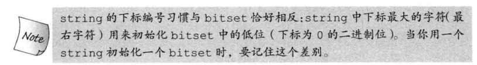

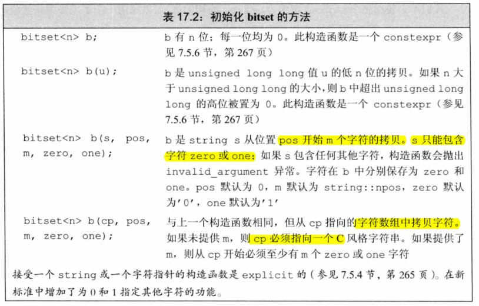

#### Exercise
- e17.9
  ```c++
	#include <iostream>
	#include <bitset>
	#include <string>

	using namespace std;

	int main() {
			bitset<64> bitvec(32);
			bitset<32> bv(1010101);
			string bstr;
			cin >> bstr;
			bitset<8> bvs(bstr);
			cout << bitvec << endl;
			for (int i = 63; i >= 0; --i)
					cout << bitvec[i];
			cout << endl;

			cout << bv << endl;
			for (int i = 31; i >= 0; --i)
					cout << bv[i];
			cout << endl;

			cout << bvs << endl;
			for (int i = 7; i >= 0; --i)
					cout << bvs[i];
			cout << endl;
	}
  ```

	```
	//output
	101010101
	0000000000000000000000000000000000000000000000000000000000100000
	0000000000000000000000000000000000000000000000000000000000100000
	00000000000011110110100110110101
	00000000000011110110100110110101
	10101010
	10101010
	```
### 17.2.2 bitset操作

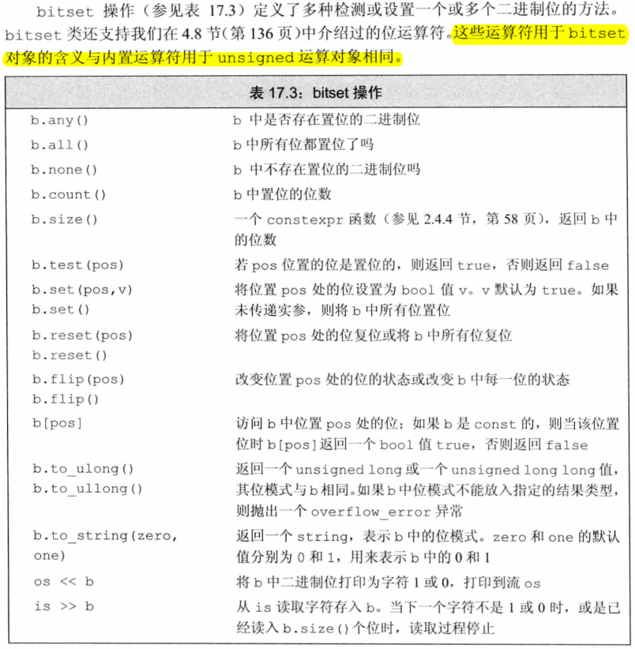

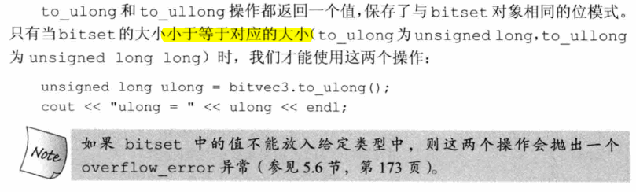

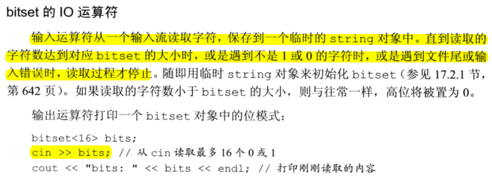

#### Exercise
- e17.10
  ```c++
	#include <bitset>
	#include <iostream>

	using namespace std;

	int main() {
			int b = (1<<1) | (1<<2) | (1<<3) | (1<<5) | (1<<8) | (1<<13) | (1<<21);
			bitset<32> bs1(b);
			cout << bs1 << endl;

			bitset<32> bs2;
			bs2.set(1); bs2.set(2); bs2.set(3); bs2.set(5);
			bs2.set(8); bs2.set(13); bs2.set(21);
			cout << bs2 << endl;
	}
	```
	```
	//output
	00000000001000000010000100101110
	00000000001000000010000100101110
	```
- e17.11-12
  ```c++
	#include <bitset>
	#include <iostream>
	#include <string>
	using namespace std;

	template<size_t N>
	class Quiz {
	public:
			Quiz(string s) : bs(s) {}
			size_t size() {
					return bs.size();
			}
			bool answer(size_t pos) {
					return bs[pos];
			}

	private:
			bitset<N> bs;
	};

	int main() {
			Quiz<100> q1("101010101");
			Quiz<10> q2("00101010");
			cout << q1.size() << endl;
			cout << q2.size() << endl;
			cout << q1.answer(0) << " " << q1.answer(1) << endl;
			cout << q2.answer(0) << " " << q2.answer(1) << endl;
	}
	```
	```
	//output
	100
	10
	1 0
	0 1
	```
- e17.13

## 17.3 正则表达式

- 头文件`regex`

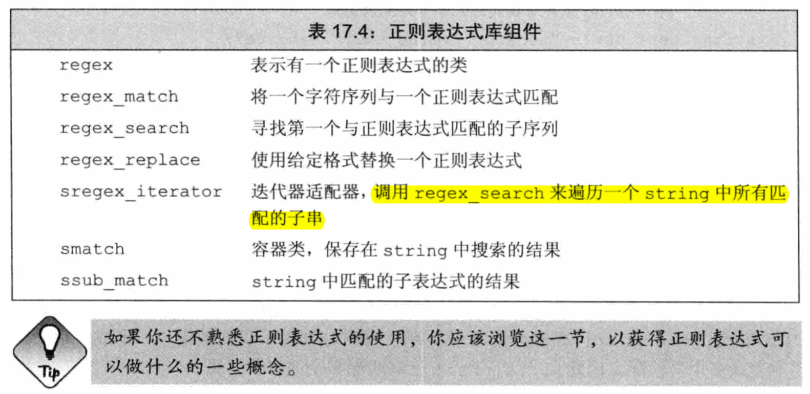

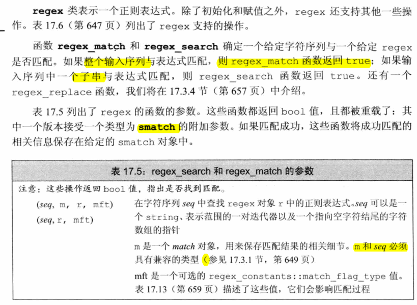

### 17.3.1 使用正则表达式库

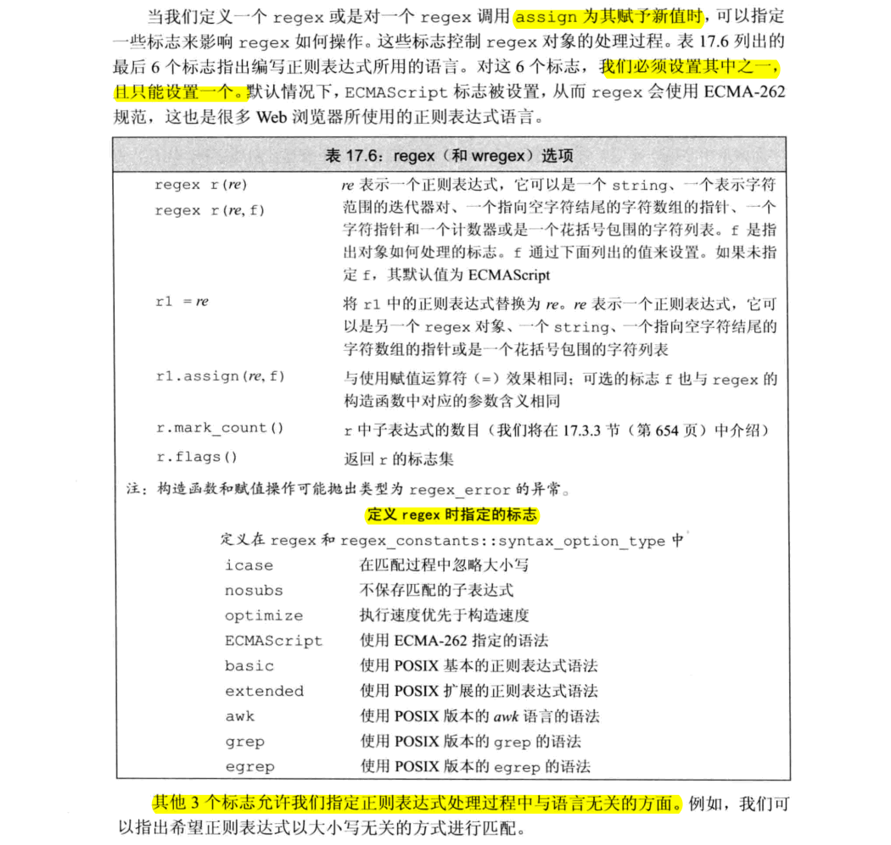

- 我们可以将正则表达式本身看作用一种简单程序语言编写的“程序”。这种语言不是由C++编译器解释的。正则表达式是在运行时，当一个regex对象被初始化或被赋予一个新模式时，才被“编译”的。与任何其他程序语言一样，我们用这种语言编写的正则表达式也可能有错误。
- 需要意识到的非常重要的一点是，一个正则表达式的语法是否正确是在运行时解析的。

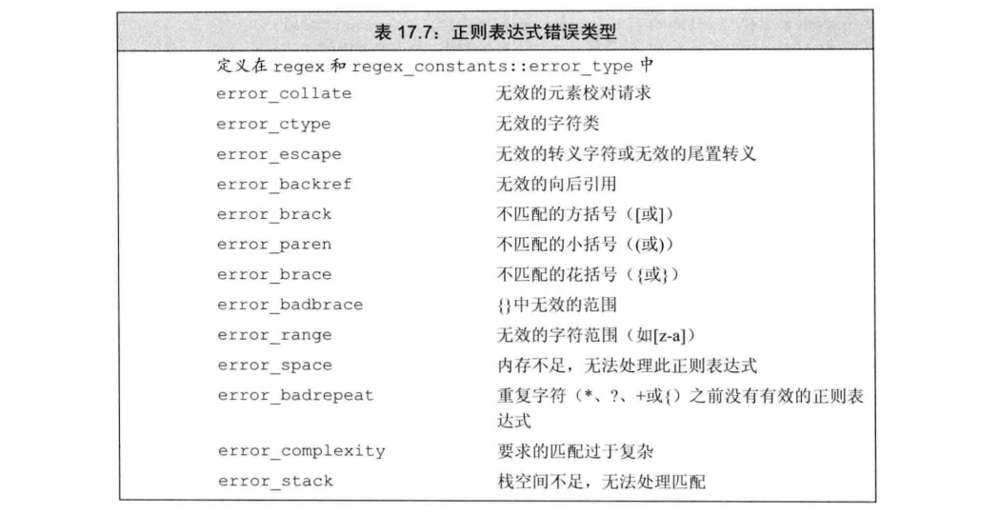

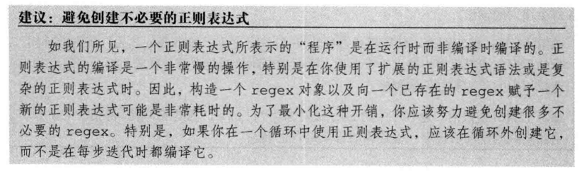

- RE库类型必须与输入序列类型匹配

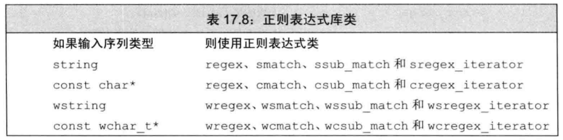

#### Exercise
- e17.14
  ```c++
	#include <regex>
	#include <string>
	#include <iostream>

	using namespace std;

	int main() {
			cout << "=====" << endl;
			try {
					regex r("[[:alnum:]+\\.(cpp|cxx|cc)$", regex::icase);
			} catch (regex_error e) {
					cout << e.what() << "\ncode: " << e.code() << endl;
			}
			cout << "=====" << endl;
			try {
					regex r("[[:alnum:]]+\\.(cpp|cxx|cc)$", regex::icase);
			} catch (regex_error e) {
					cout << e.what() << "\ncode: " << e.code() << endl;
			}
			cout << "=====" << endl;
			try {
					regex r("[[:alnum:]]+\\.cpp|cxx|cc)$", regex::icase);
			} catch (regex_error e) {
					cout << e.what() << "\ncode: " << e.code() << endl;
			}
			cout << "=====" << endl;
			try {
					regex r("[[:alnum:]]+{+\\.(cpp|cxx|cc)$", regex::icase);
			} catch (regex_error e) {
					cout << e.what() << "\ncode: " << e.code() << endl;
			}
			cout << "=====" << endl;
			try {
					regex r("[c-a]", regex::icase);
			} catch (regex_error e) {
					cout << e.what() << "\ncode: " << e.code() << endl;
			}
			cout << "=====" << endl;
			try {
					regex r("*", regex::icase);
			} catch (regex_error e) {
					cout << e.what() << "\ncode: " << e.code() << endl;
			}
			cout << "=====" << endl;
			try {
					regex r("?", regex::icase);
			} catch (regex_error e) {
					cout << e.what() << "\ncode: " << e.code() << endl;
			}
			cout << "=====" << endl;
			try {
					regex r("", regex::icase);
			} catch (regex_error e) {
					cout << e.what() << "\ncode: " << e.code() << endl;
			}
	}
	```
	```
	//output
	=====
	Unexpected character in bracket expression.
	code: 4
	=====
	=====
	regex_error
	code: 5
	=====
	Unexpected character in brace expression.
	code: 7
	=====
	Invalid range in bracket expression.
	code: 8
	=====
	regex_error
	code: 5
	=====
	regex_error
	code: 5
	=====
	```
- e17.15
  ```c++
	#include <regex>
	#include <string>
	#include <iostream>

	using namespace std;

	int main() {
			string pattern("[^c]ei");
			pattern = "[[:alpha:]]*" + pattern + "[[:alpha:]]*";
			regex r(pattern);
			smatch results;
			string test_str;
			while (cin >> test_str) {
					if (test_str == "q")
							break;
					if (regex_search(test_str, results, r))
							cout << "illegal: " << results.str() << endl;
					else
							cout << "legal" << endl;
			}
			return 0;
	}
	```
- e17.16
  > 只匹配3个字符`[^c]ei`。然后输出只有这错误拼写的部分。

### 17.3.2 匹配与Regex迭代器类型

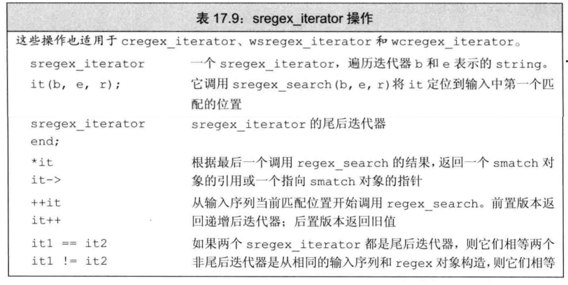

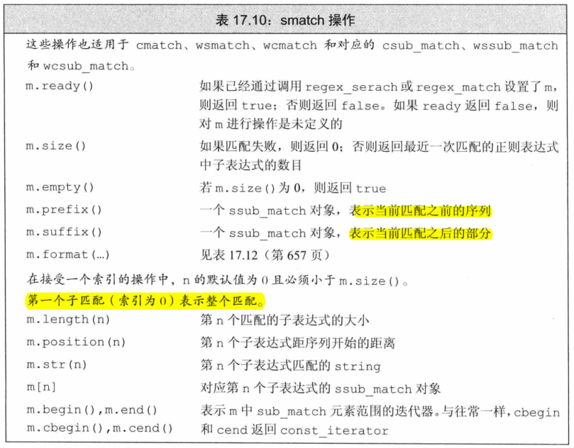

#### Exercise
- e17.17
  ```c++
	#include <regex>
	#include <string>
	#include <iostream>

	using namespace std;

	int main() {
			string pattern("[^c]ei");
			pattern = "[[:alpha:]]*" + pattern + "[[:alpha:]]*";
			regex r(pattern);
			smatch results;
			string test_str;
			while (cin >> test_str) {
					if (test_str == "q")
							break;

					for (sregex_iterator it(test_str.begin(), test_str.end(), r), end_it;
							it != end_it; ++it)
							cout << "illegal: " << it->str() << endl;
			}
			return 0;
	}
	```
	```
	//output
	neighbor albeit freind
	illegal: neighbor
	illegal: albeit
	illegal: freind
	```
- e17.18
  ```c++
	#include <regex>
	#include <string>
	#include <iostream>

	using namespace std;

	int main() {
			string pattern("[^c]ei");
			pattern = "[[:alpha:]]*" + pattern + "[[:alpha:]]*";
			regex r(pattern);
			smatch results;
			string test_str;
			while (cin >> test_str) {
					if (test_str == "q")
							break;

					for (sregex_iterator it(test_str.begin(), test_str.end(), r), end_it;
							it != end_it; ++it)
							if (it->str() != "albeit" && it->str() != "neighbor")
									cout << "illegal: " << it->str() << endl;
			}
			return 0;
	}
	```
	```
	//output
	neighbor albeit freind
	illegal: freind
	```
### 17.3.3 使用子表达式
- 正则表达式语法通常用括号表示子表达式
- 子表达式的一个常见用途就是验证必须匹配特定格式的数据

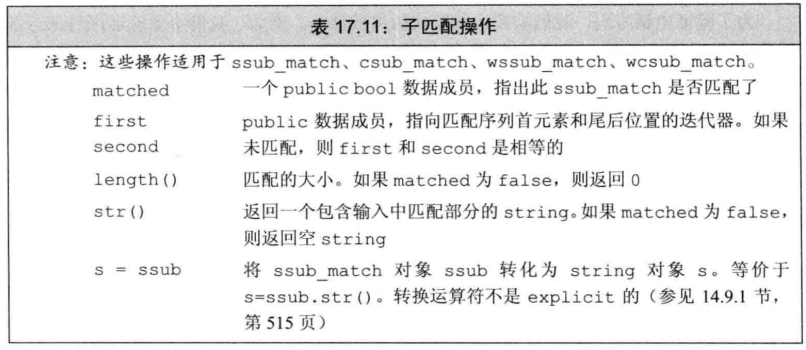

#### Exercise
- e17.19
  > str() 返回一个包含输入中匹配部分的string。如果matched为false，则返回空string

- e17.20
  ```c++
	#include <regex>
	#include <string>
	#include <iostream>
	using namespace std;

	bool valid(const smatch &m) {
			if (m[1].matched) {
					return m[3].matched && (m[4].matched == 0 || m[4].str() == " ");
			} else {
					return !m[3].matched && m[4].str() == m[4].str();
			}
	}


	int main() {
			string phone = "(\\()?(\\d{3})(\\))?([-. ])?(\\d{3})([-. ]?)(\\d{4})";
			regex r(phone);
			smatch m;
			string s;

			while (getline(cin, s)) {
					for (sregex_iterator it(s.begin(), s.end(), r), end_it; it != end_it; ++it) {
							if (valid(*it)) {
									cout << "valid: " << it->str() << endl;
							} else {
									cout << "not valid: " << it->str() << endl;
							}
					}
			}
	}
	```
- e17.21
- e17.22
- e17.23


### 17.3.4 使用regex_replace

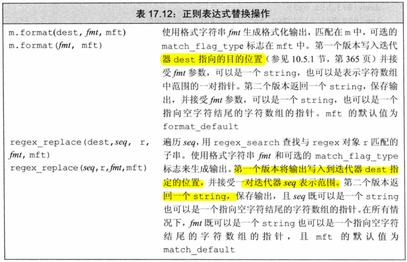

#### Exercise
- e17.24
  ```c++
	#include <regex>
	#include <string>
	#include <iostream>
	using namespace std;

	int main() {
			string phone = "(\\()?(\\d{3})(\\))?([-. ])?(\\d{3})([-. ]?)(\\d{4})";
			regex r(phone);
			smatch m;
			string s;
			string fmt = "$2.$5.$7";

			while (getline(cin, s)) {
					cout << regex_replace(s, r, fmt) << endl;
			}
	}
	```
- e17.25
  ```
	morgan (201) 555-2368 862-555-0123
	drew (973)555.0130
	lee (609) 555-0132 2015550175 800.555-0000
	```
	```c++
	#include <regex>
	#include <string>
	#include <iostream>
	#include <vector>
	using namespace std;

	bool valid(const smatch &m) {
			if (m[1].matched) {
					return m[3].matched && (m[4].matched == 0 || m[4].str() == " ");
			} else {
					return !m[3].matched && m[4].str() == m[4].str();
			}
	}

	int main() {
			string phone = "(\\()?(\\d{3})(\\))?([-. ])?(\\d{3})([-. ]?)(\\d{4})";
			regex r(phone);
			smatch m;
			string s;
			vector<string> first_phone;

			while (getline(cin, s)) {
					for (sregex_iterator it(s.begin(), s.end(), r), end_it; it != end_it; ++it) {
							if (valid(*it)) {
									cout << "valid: " << it->str() << endl;
									first_phone.push_back("valid: " + it->str());
							} else {
									cout << "not valid: " << it->str() << endl;
									first_phone.push_back("invalid: " + it->str());
							}
							break;
					}
			}
			for (auto &e : first_phone)
					cout << e << endl;
	}
	```
- e17.26
  ```c++
	#include <regex>
	#include <string>
	#include <iostream>
	#include <vector>
	using namespace std;

	bool valid(const smatch &m) {
			if (m[1].matched) {
					return m[3].matched && (m[4].matched == 0 || m[4].str() == " ");
			} else {
					return !m[3].matched && m[4].str() == m[4].str();
			}
	}


	int main() {
			string phone = "(\\()?(\\d{3})(\\))?([-. ])?(\\d{3})([-. ]?)(\\d{4})";
			regex r(phone);
			smatch m;
			string s;

			while (getline(cin, s)) {
					sregex_iterator it(s.begin(), s.end(), r), end_it;
					for (it++; it != end_it; ++it) {
							if (valid(*it)) {
									cout << "valid: " << it->str() << endl;
							} else {
									cout << "not valid: " << it->str() << endl;
							}
					}
			}
	}
	```
	```
	//output
	lee (609) 555-0132 2015550175 800.555-0000
	valid: 2015550175
	valid: 800.555-0000

	morgan (201) 555-2368 862-555-0123
	valid: 862-555-0123

	drew (973)555.0130
	```
- e17.27

## 17.4 随机数

- 头文件<random>
  
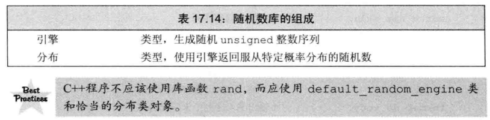

### 17.4.1 随机数引擎和分布

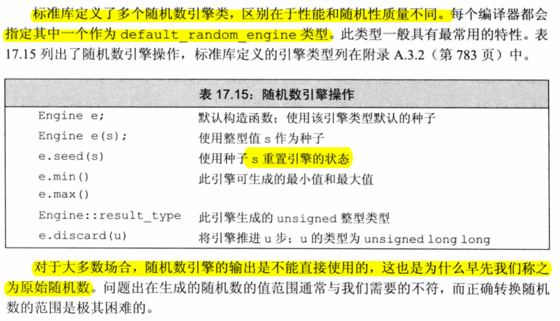

- 当我们说**随机数发生器**时，是指分布对象和引擎对象的组合

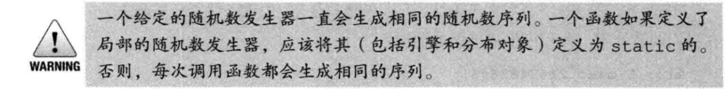

- 随机数发生器会生成相同的随机数序列这一特性在调试中很有用。但是，一旦我们程序调试完毕，我们通常希望每次运行程序都会生成不同的随机结果，可以通过提供一个种子来达到这一目的。种子就是一个数值，引擎可以利用它从序列中的一个新位置重新开始生成随机数。
- 为引擎设置种子有两种方式：
  - 在创建引擎对象时提供种子；
  - 调用引擎的seed成员

#### Exercise
- e17.28
  ```c++
	#include <random>
	#include <iostream>
	using namespace std;

	unsigned int uint_rand() {
			static default_random_engine e;
			static uniform_int_distribution<unsigned> u(e.min(), e.max());
			return u(e);
	}

	int main() {
			for (int i = 0; i != 20; ++i)
					cout << uint_rand() << " ";
			cout << endl;
			return 0;
	}
	```
	```
	//output
	16807 282475249 1622650073 984943658 1144108930 470211272 101027544 1457850878 1458777923 2007237709 823564440 1115438165 1784484492 74243042 114807987 1137522503 1441282327 16531729 823378840 143542612
	```
- e17.29
  ```c++
	#include <random>
	#include <iostream>
	using namespace std;

	unsigned int uint_rand(unsigned int seed) {
			static default_random_engine e;
			e.seed(seed);
			static uniform_int_distribution<unsigned> u(e.min(), e.max());
			return u(e);
	}

	int main() {
			for (int i = 0; i != 20; ++i)
					cout << uint_rand(20) << " ";
			cout << endl;
			return 0;
	}
	```
	```
	//output
	336140 336140 336140 336140 336140 336140 336140 336140 336140 336140 336140 336140 336140 336140 336140 336140 336140 336140 336140 336140
	```
- e17.30
  ```c++
	#include <random>
	#include <iostream>
	using namespace std;

	unsigned int uint_rand(unsigned int seed=0, unsigned int min=0, unsigned int max=100) {
			static default_random_engine e;
			if (seed != 0)
					e.seed(seed);
			static uniform_int_distribution<unsigned> u(min, max);
			return u(e);
	}

	int main() {
			unsigned int min=1, max=20;
			cout << uint_rand(20, min, max) << endl;
			for (int i = 0; i != 10; ++i)
					cout << uint_rand(0, min, max) << " ";
			cout << endl;
			cout << uint_rand(20, min, max) << endl;
			return 0;
	}
	```
	```
	//output
	1
	13 3 4 14 8 19 12 12 14 14
	1
	```

### 17.4.2 其它随机数分布

- 程序经常需要0~1之间的随机数。最常用但不正确的从rand获得一个随机浮点数的方法是用rand()的结果除以RAND_MAX
  - 这种方法不正确的原因是随机整数的精度通常低于随机浮点数，这样，有一些浮点值就永远不会生成。

#### Exercise
- e17.31
  > 如果在循环内，每步循环都会创建一个新引擎，它们使用相同的种子，从而每步循环都是相同的值。
- e17.32
  > 编译失败
- e17.33
  
## 17.5 IO库再探

### 17.5.1 格式化输入与输出
- 操纵符：是一个函数或是一个对象，会影响流的状态，并能作为输入或输出运算符的运算对象。
- 操纵符用于两大类输出控制：控制数值的输出形式已经控制补白的数量和位置。
  - 大多数改变格式状态的操纵符都是设置/复原成对的；一个操纵符用来将格式状态设置为一个新值，而另一个用来将其复原，恢复为正常的默认格式。
- 通常最好在不再需要特殊格式时尽快将流恢复到默认状态
- 操纵符hex、oct、dec只影响整型运算对象，浮点值的表示形式不受影响。
  
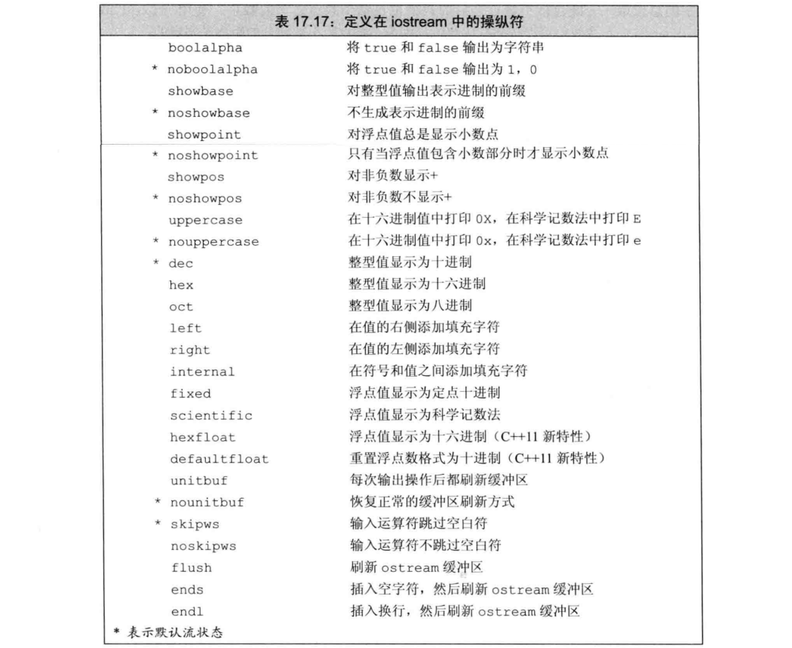


#### Exercise
- e17.34
  ```c++
	#include <iostream>
	#include <cmath>
	#include <iomanip>

	using namespace std;

	int main() {
			cout << "default bool values: " << true << " " << false
					<< "\nalpha bool values: " << boolalpha
					<< true << " " << false << noboolalpha << endl;
			cout << showbase;
			cout << "default: " << 20 << " " << 1024 << endl;
			cout << "in octal: " << oct << 20 << " " << 1024 << endl;
			cout << "in hex: " << hex << 20 << " " << 1024 << endl;
			cout << "in decimal: " << dec << 20 << " " << 1024 << endl;
			cout << noshowbase;

			cout << uppercase << showbase << hex
					<< "printed in hexadecimal: " << 20 << " " << 1024
					<< nouppercase << noshowbase << dec << endl;

			cout << "Precision: " << cout.precision()
					<< ", Value: " << sqrt(2.0) << endl;
			cout.precision(12);
			cout << "Precision: " << cout.precision()
					<< ", Value: " << sqrt(2.0) << endl;
			cout << setprecision(3);
			cout << "Precision: " << cout.precision()
					<< ", Value: " << sqrt(2.0) << endl;

			cout << "default format: " << 100 * sqrt(2.0) << '\n'
					<< "scientific: " << scientific << 100 * sqrt(2.0) << '\n'
					<< "fixed decimal: " << fixed << 100 * sqrt(2.0) << '\n'
					<< "hexadecimal: " << hexfloat << 100 * sqrt(2.0) << '\n'
					<< "use defaults: " << defaultfloat << 100 * sqrt(2.0) << "\n\n";

			cout << 10.0 << endl;
			cout << showpoint << 10.0 << noshowpoint << endl;

			int i = -16;
			double d = 3.14159;

			cout << "i: " << setw(12) << i << "next col" << '\n'
					<< "d: " << setw(12) << d << "next col" << '\n';

			cout << left
					<< "i: " << setw(12) << i << "next col" << '\n'
					<< "d: " << setw(12) << d << "next col" << '\n'
					<< right;

			cout << right
					<< "i: " << setw(12) << i << "next col" << '\n'
					<< "d: " << setw(12) << d << "next col" << '\n';

			cout << internal
					<< "i: " << setw(12) << i << "next col" << '\n'
					<< "d: " << setw(12) << d << "next col" << '\n';

			cout << setfill('#')
					<< "i: " << setw(12) << i << "next col" << '\n'
					<< "d: " << setw(12) << d << "next col" << '\n'
					<< setfill(' ');
	}
	```
	```
	//output
	default bool values: 1 0
	alpha bool values: true false
	default: 20 1024
	in octal: 024 02000
	in hex: 0x14 0x400
	in decimal: 20 1024
	printed in hexadecimal: 0X14 0X400
	Precision: 6, Value: 1.41421
	Precision: 12, Value: 1.41421356237
	Precision: 3, Value: 1.41
	default format: 141
	scientific: 1.414e+02
	fixed decimal: 141.421
	hexadecimal: 0x1.1ad7bc01366b8p+7
	use defaults: 141

	10
	10.0
	i:          -16next col
	d:         3.14next col
	i: -16         next col
	d: 3.14        next col
	i:          -16next col
	d:         3.14next col
	i: -         16next col
	d:         3.14next col
	i: -#########16next col
	d: ########3.14next col
	```
- e17.35
  ```c++
	#include <iostream>
	#include <cmath>
	#include <iomanip>

	using namespace std;

	int main() {
			cout << uppercase;
			cout << "default format: " << 100 * sqrt(2.0) << '\n'
					<< "scientific: " << scientific << 100 * sqrt(2.0) << '\n'
					<< "fixed decimal: " << fixed << 100 * sqrt(2.0) << '\n'
					<< "hexadecimal: " << hexfloat << 100 * sqrt(2.0) << '\n'
					<< "use defaults: " << defaultfloat << 100 * sqrt(2.0) << "\n\n";
			cout << nouppercase;
	}
	```
	```
	//output
	default format: 141.421
	scientific: 1.414214E+02
	fixed decimal: 141.421356
	hexadecimal: 0X1.1AD7BC01366B8P+7
	use defaults: 141.421
	```
- e17.36
  ```c++
	#include <iostream>
	#include <cmath>
	#include <iomanip>

	using namespace std;

	int main() {
			cout << uppercase << left;
			cout << setw(24) << "default format: " << 100 * sqrt(2.0) << '\n'
					<< setw(24) << "scientific: " << scientific << 100 * sqrt(2.0) << '\n'
					<< setw(24) << "fixed decimal: " << fixed << 100 * sqrt(2.0) << '\n'
					<< setw(24) << "hexadecimal: " << hexfloat << 100 * sqrt(2.0) << '\n'
					<< setw(24) << "use defaults: " << defaultfloat << 100 * sqrt(2.0) << "\n\n";
			cout << nouppercase << right;
	}
	```

	```
	//output
	default format:         141.421
	scientific:             1.414214E+02
	fixed decimal:          141.421356
	hexadecimal:            0X1.1AD7BC01366B8P+7
	use defaults:           141.421
	```

### 17.5.2 未格式化的输入/输出操作

- 未格式化IO，允许我们将一个流当做一个无解释的字节序列来处理

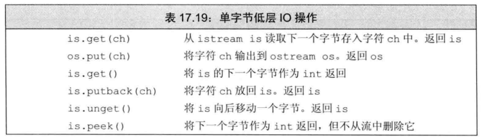

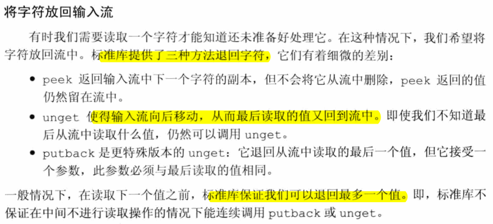

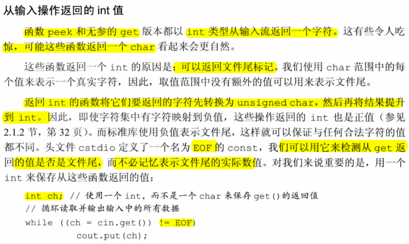

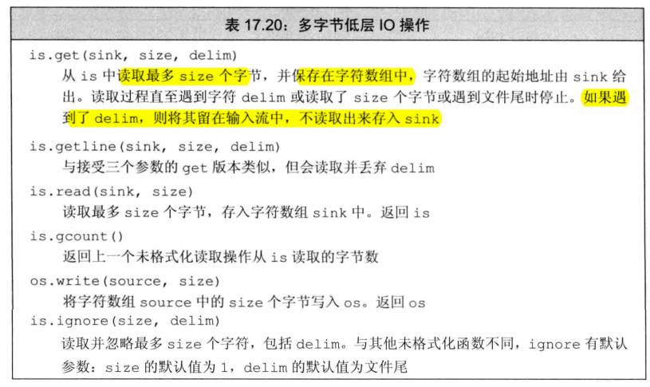

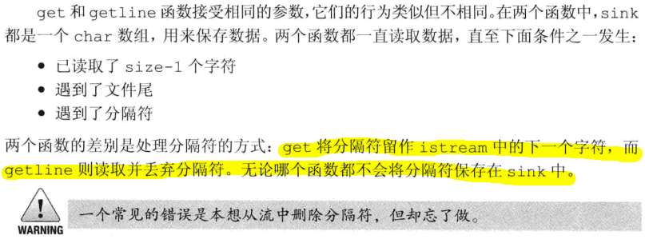

#### Exercise
- e17.37
  ```c++
	#include <iostream>
	#include <fstream>
	#include <string>
	using namespace std;

	int main(int argc, char *argv[]) {
			ifstream input(argv[1]);
			if (!input) {
					cout << "Open file error: " << string(argv[1]) << endl;
					return -1;
			}
			char sink[80];
			while(input.getline(sink, 50, '\n')) {
					cout << input.gcount() << ": " << sink << endl;
			}
	}
	```

	```bash
	dongkesi@DESKTOP-CL29DN1:/mnt/d/workspace/github/C++-Primer/ch17$ ./a.out t17-37.cc
	20: #include <iostream>
	19: #include <fstream>
	18: #include <string>
	21: using namespace std;
	1:
	35: int main(int argc, char *argv[]) {
	29:     ifstream input(argv[1]);
	18:     if (!input) {
	```
- e17.38
	```c++
	#include <iostream>
	#include <fstream>
	#include <string>
	using namespace std;

	int main(int argc, char *argv[]) {
			ifstream input(argv[1]);
			if (!input) {
					cout << "Open file error: " << string(argv[1]) << endl;
					return -1;
			}
			char sink[80];
			while(!input.eof()) {
					input.getline(sink, 50, '\n');
					cout << "> R <" << input.gcount() << ":" << sink;
					if (!input.good()) {
							if (input.gcount() > 0)
									input.clear();
					} else {
							cout << endl;
					}
			}
	}
	```
	```
	//output
	> R <20:#include <iostream>
	> R <19:#include <fstream>
	> R <18:#include <string>
	> R <21:using namespace std;
	> R <1:
	> R <35:int main(int argc, char *argv[]) {
	> R <29:    ifstream input(argv[1]);
	> R <18:    if (!input) {
	> R <49:        cout << "Open file error: " << string(arg> R <15:v[1]) << endl;
	> R <19:        return -1;
	> R <6:    }
	> R <19:    char sink[80];
	> R <26:    while(!input.eof()) {
	> R <39:        input.getline(sink, 50, '\n');
	> R <49:        cout << "> R <" << input.gcount() << ":" > R <9:<< sink;
	> R <29:        if (!input.good()) {
	> R <36:            if (input.gcount() > 0)
	> R <31:                input.clear();
	> R <17:        } else {
	> R <26:            cout << endl;
	> R <10:        }
	> R <6:    }
	> R <2:}
	> R <0:
	```

### 17.5.3 流随机访问

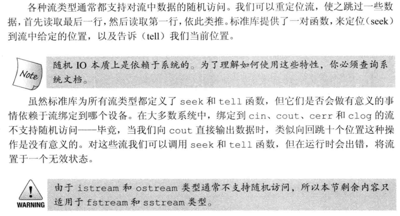

- 由于只有单一的标记，因此只要我们在读写操作间切换，就必须进行seek操作来重定位标记。
  
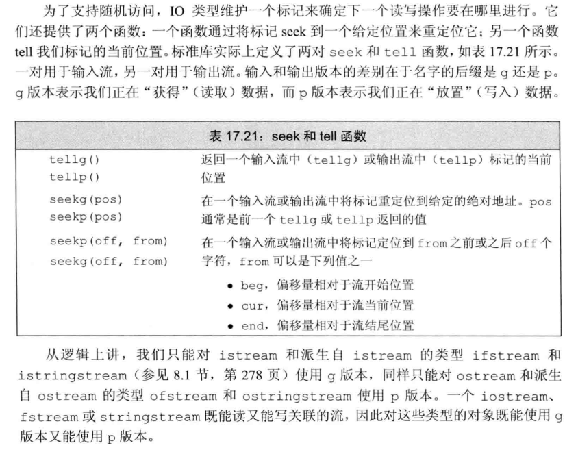

- g版本表示我们正在“获得”（读取）数据，而p版本表示我们正在“放置”（写入）数据

#### Exercise 
- e17.39
	```c++
	#include <iostream>
	#include <fstream>
	#include <string>
	using namespace std;

	int main() {
			fstream inOut("copyOut", fstream::ate | fstream::in | fstream::out);
			if (!inOut) {
					cerr << "Unable to open file!" << endl;
					return EXIT_FAILURE;
			}
			auto end_mark = inOut.tellg();
			inOut.seekg(0, fstream::beg);
			size_t cnt = 0;
			string line;
			while (inOut && inOut.tellg() != end_mark && getline(inOut, line)) {
					cnt += line.size() + 1;
					auto mark = inOut.tellg();
					inOut.seekp(0, fstream::end);
					inOut << cnt;
					if (mark != end_mark) inOut << " ";
					inOut.seekg(mark);
			}
			inOut.seekp(0, fstream::end);
			inOut << "\n";
			return 0;
	}
	```
