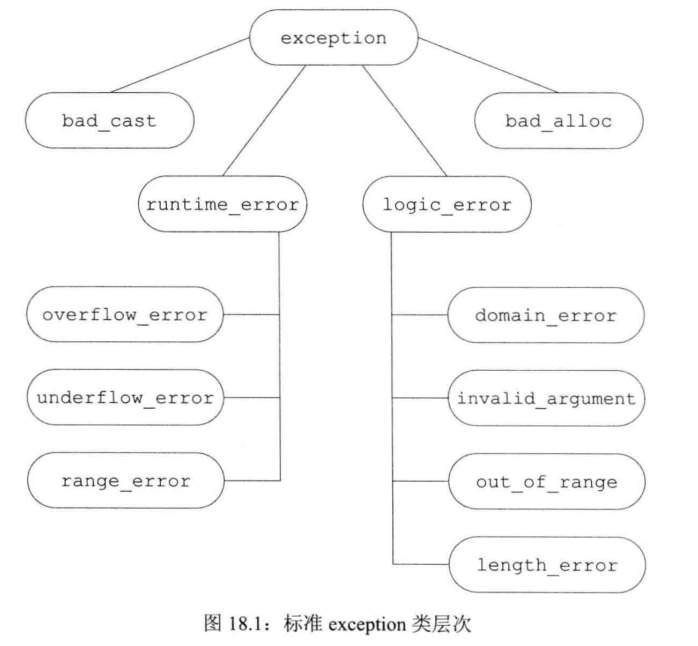
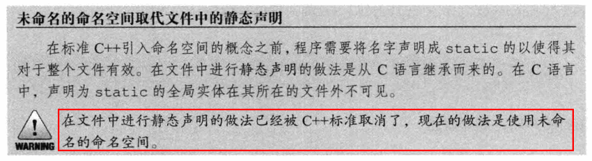
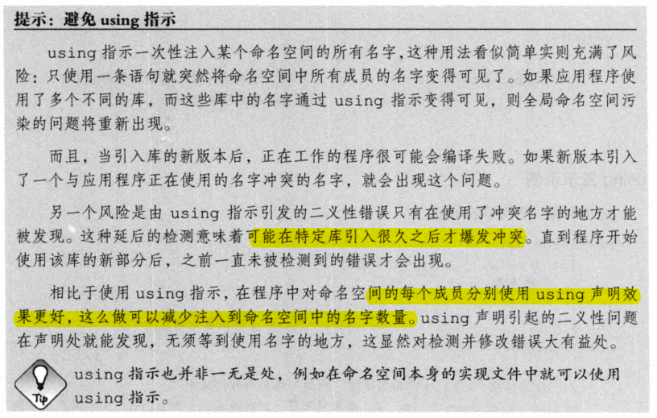
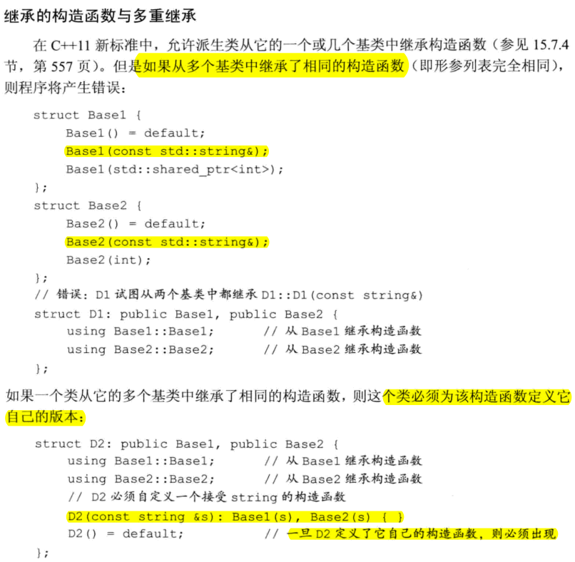
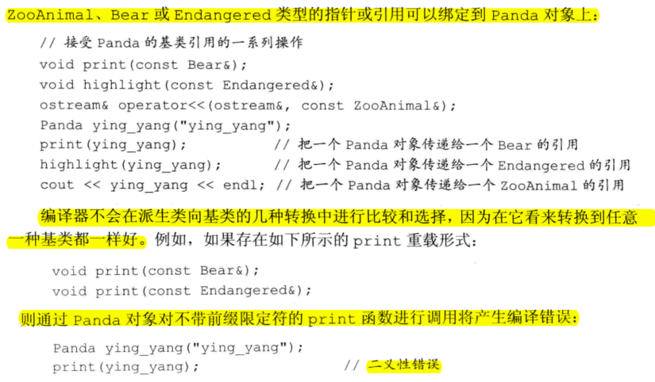
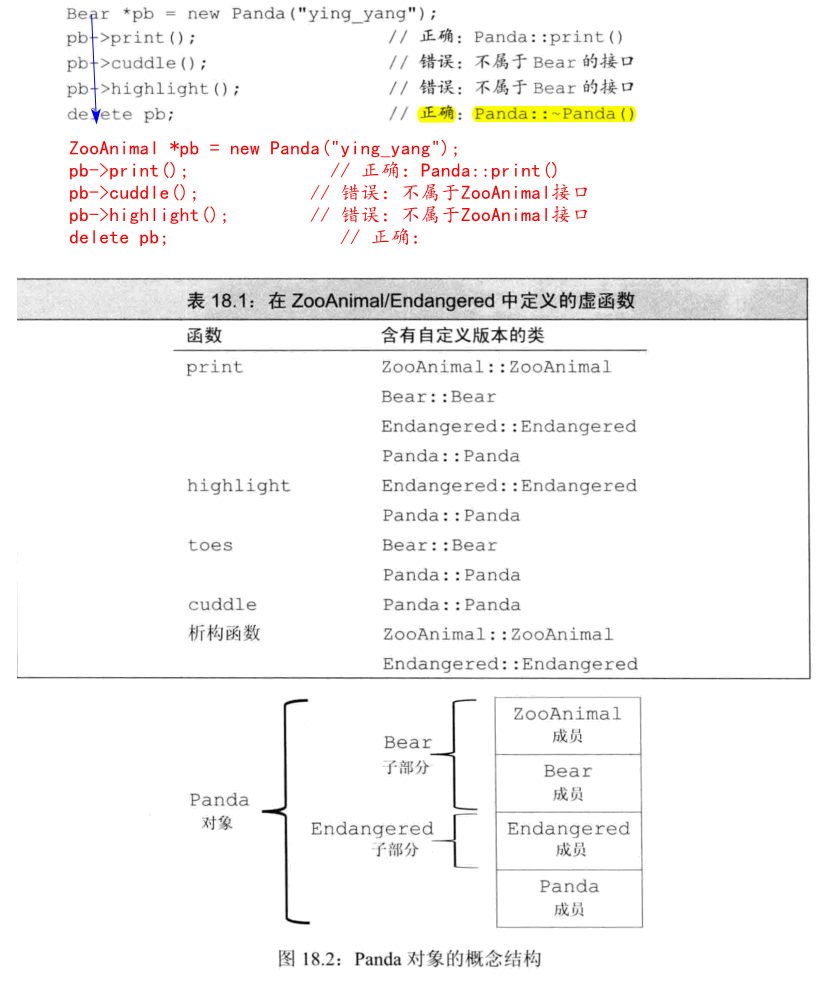
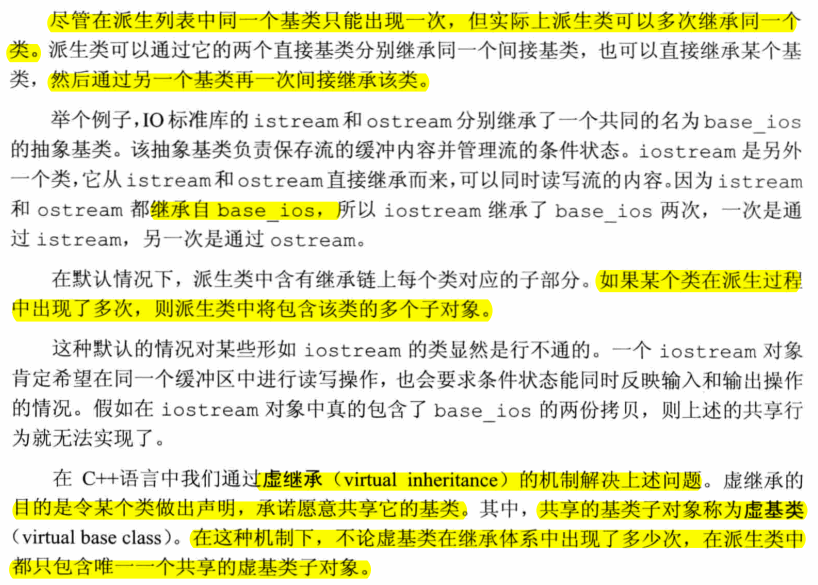
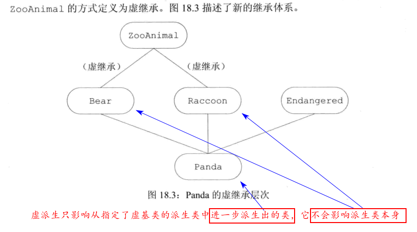
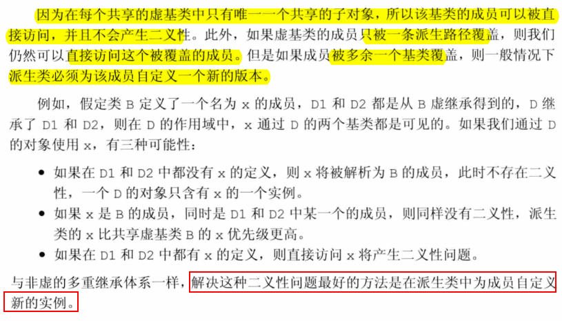

# 18 用于大型程序的工具
## 18.1 异常处理
- 要想有效地使用异常处理
  - 了解当抛出异常时发生什么
  - 捕获异常时发生什么
  - 用来传递错误的对象的意义
### 18.1.1 抛出异常
- 根据抛出对象的类型和内容，程序的异常抛出部分将会告知异常处理部分到底发生了什么错误。
- 当执行一个throw时，程序的控制权从throw转移到与之匹配的catch模块。控制权从一处转移到另一处，有两个重要的含义：
  - 沿着调用链的函数可能会提早退出
  - 一旦程序开始执行异常处理代码，则沿着调用链创建的对象将被销毁
- 一个异常如果没有被捕获，则它将终止当前的程序
- 当执行完catch子句后，找到与try块关联的最后一个catch子句之后的点，并从这里继续执行
- 在栈展开的过程中，运行类类型的局部对象的析构函数。因为这些析构函数是自动执行的，所以它们不应该抛出异常。一旦在栈展开的过程中析构函数抛出了异常，并且析构函数自身没能捕获到该异常，则程序将被终止。
- **栈展开**：当抛出一个异常后，程序暂停当前函数的执行过程并立即开始寻找与异常匹配的catch子句。
  - 当throw出现在一个**try语句块内**时，检查与该try块关联的catch子句。如果找到了匹配的catch，就使用该catch处理异常。
  - 如果这一步没找到匹配的catch且该try语句嵌套在其它的try块中，则继续检查与**外层try匹配的catch子句**。
  - 如果还是找不到匹配的catch，则**退出当前的函数**，在调用当前函数的**外层函数**中继续寻找。
  - 在找不到匹配的catch时，程序将调用标准库函数terminate，终止程序
- 如果异常发生在构造函数中，即使某个对象只构造了一部分，我们也要确保已构造的成员能被正确地销毁。
- 异常对象：编译器使用异常抛出表达式来对异常对象进行拷贝初始化。
  - throw语句中的表达式必须拥有完全类型。
    - 如果该表达式是类类型的话，则相应的类必须含有一个可访问的析构函数和一个可访问的拷贝或移动构造函数。
    - 如果该表示式是数组类型或函数类型，则表达式将被转换成与之对应的指针类型。
- 异常对象位于编译器管理得空间中，编译器确保无论最终调用的是哪个catch子句都能访问该空间。当异常处理完毕后，异常对象被销毁。
- 抛出一个指向局部对象的指针肯定是一种错误的行为。
- 抛出指针要求在任何对应的处理代码存在的地方，指针所指的对象都必须存在。
- 当抛出一条表达式时，该表达式的静态编译时类型决定了异常对象的类型。
  - 例如throw表达式解引用一条基类指针，而该指针实际指向的是派生类对象，则抛出的对象将被切掉一部分，只有基类部分被抛出。
#### Exercise
- e18.1
  ```c++
  #include <stdexcept>
  #include <iostream>
  using namespace std;

  int main() {
      range_error r("error");
      exception *p = &r;

  /*
  terminate called after throwing an instance of 'std::range_error'
  what():  error
  Aborted (core dumped)
  */
  //    throw r;
  /* 该表达式的静态编译时类型决定了异常对象的类型
  terminate called after throwing an instance of 'std::exception'
  what():  std::exception
  Aborted (core dumped)
  */
  //    throw *p;
  /*
  terminate called after throwing an instance of 'std::exception*'
  Aborted (core dumped)
  */
      throw p;
  }
  ```
- e18.2
  > p指向的内存将得不到回收造成内存泄漏
- e18.3
  ```c++
  #include <stdexcept>
  #include <vector>
  #include <iostream>
  #include <fstream>

  using namespace std;

  void exercise(int *b, int *e) {
      int i = 10;
      vector<int> v(b, e);
      int *p = new int[v.size()];
      try {
          ifstream in("ints");
          throw i;
          cout << "not here" << endl;
      }
      catch (int e) {
          cout << "here" << endl;
          delete p;
      }
  }

  int main() {
      int a[10] = {0,1,2,3,4,5};
      exercise(&a[0], &a[9]);
  }
  ```

  :TODO: 下面的析构函数并没有执行

  ```c++
  #include <stdexcept>
  #include <vector>
  #include <iostream>
  #include <fstream>

  using namespace std;

  class MyArray {
  public:
      MyArray(size_t sz) : ia(new int[sz]) {
          cout << __PRETTY_FUNCTION__ << endl;
      }

      ~MyArray() {
          cout << __PRETTY_FUNCTION__ << endl;
          if (ia) delete[] ia;
      }
  private:
      int *ia;
  };

  void exercise(int *b, int *e) {
      int i = 10;
      vector<int> v(b, e);
      MyArray ar(v.size());
      ifstream in("ints");
      throw i;
  }

  int main() {
      int a[10] = {0,1,2,3,4,5};
      exercise(&a[0], &a[9]);
  }
  ```
### 18.1.2 捕获异常
- 通常情况下，如果catch接受的异常与某个继承体系有关，则最好将该catch的参数**定义成引用类型**。
- 如果在多个catch语句的类型之间存在着继承关系，则我们应该把继承链最底端的类放在前面，而将继承链最顶端的类放在后面。
- 空的throw语句只能出现在catch语句或catch语句直接或间接调用的函数之内。如果在处理代码之外的区域遇到了空throw语句，编译器将调用terminate
- 只有当catch异常声明的时引用类型时我们对参数所做的改变才会被保留并继续传播。
- 如果catch(...)与其他几个catch语句一起出现，则catch(...)必须在最后的位置。出现在捕获所有异常语句后面的catch语句将永远不会被匹配
#### Exericse
- e18.4
  > 因为三者之间有继承关系。应该把继承链最底端的类放在前面，而将继承链最顶端的类放在后面
  ```c++
  try {

  } catch (overflow_error eobj) {

  } catch (const runtime_error &re) {

  } catch (exception) {

  }
  ```
- e18.5
  
  

  ```c++
  #include <stdexcept>
  #include <iostream>
  using namespace std;

  int main() {
      exception ex;
      bad_cast bc;
      bad_alloc ba;
      runtime_error re("abc");
      logic_error le("abc");
      overflow_error oe("abc");
      underflow_error ue("abc");
      range_error rae("abc");
      domain_error de("abc");
      invalid_argument ia("abc");
      out_of_range oor("abc");
      length_error lee("abc");

      try {
          throw lee;
      } catch (const exception &e) {
          cerr << e.what() << endl;
          abort();
      }
      return 0;
  }
  ```
- e18.6
  ```c++
  #include <stdexcept>
  #include <iostream>
  using namespace std;

  class exceptionType{};
  typedef int EXCPTYPE;

  int main() {
      try {
          throw new exceptionType();
      } catch (exceptionType *pet) {
          cout << "1" << endl;
      }

      try {
          throw "abc";
      } catch (...) {
          cout << "2" << endl;
      }

      try {
          throw 42;
      } catch (EXCPTYPE) {
          cout << "3" << endl;
      }

  }
  ```
### 18.1.3 函数try语句块与构造函数
- 处理构造函数初始值异常的唯一方法是将构造函数写成函数try语句块
- 与try关联的catch既能处理构造函数抛出的异常，也能处理成员初始化列表抛出的异常。
  - 如果初始化构造函数的参数发生异常，try语句块不能处理，属于调用表达式的一部分。
#### Exercise
- e18.7
  ```c++
  void handle_out_of_memory(const std::exception &e) {

  }

  template <typename T>
  Blob<T>::Blob(std::initializer_list<T> il) try : data(std::make_shared<std::vector<T>>(il)) {
  } catch(const std::bad_alloc(&e)) { 
    handle_out_of_memory(e);
  }
  ```

### 18.1.4 noexcept异常说明
- 预先知道某个函数不会抛出异常显然大有裨益
- noexcept说明要么出现在该函数的所有声明语句和定义语句中，要么一次也不出现。
  - 该说明应该在函数的尾置返回类型之前
  - 可以在函数指针的声明和定义中指定noexcept
  - 在typedef或类型别名中不能出现noexcept
  - 在成员函数中，noexcept说明符需要跟在const及引用限定符之后，而在final、override或虚函数的=0之前
- noexcept可以用在两种情况下：
  - 一是确认函数不会抛出异常
  - 而是根本不知道该如何处理异常
- 通常，编译器不能也不必在编译时验证异常说明
- noexcept运算符时一个一元运算符，它的返回值是一个bool类型的右值常量表达式，用于表示给定的表达式是否抛出异常。
- noexcept有两层含义：当跟在函数参数列表后面时它是异常说明符；当作为noexcept异常说明的bool实参出现时，它是一个运算符;
  ```c++
  void recoup(int) noexcept(true);  //recoup 不会抛出异常
  void alloc(int) noexcept(false);  //alloc 可能抛出异常
  noexcept(recoup(i)) //如果recoup不抛出异常则结果为true；否则结果为false
  void f() noexcept(noexcept(g())); //f和g的异常说明一致
  ```
- 如果我们显示或隐式地说明了指针可能抛出异常，则该指针可以指向任何函数，即使承诺了不抛出异常的函数也可以；如果我们为某个指针做了不抛出异常的说明，则该指针只能指向不抛出异常的函数。
  
### 18.1.5 异常类层次


- what负责返回用于初始化异常对象的信息。因为what是虚函数，所以当我们捕获基类的引用时，对what函数的调用将执行与异常动态类型对应的版本。
#### Exercise
- e18.9
- e18.10
  > 有异常处理

  ```c++
  #include "Sales_data.h"
  using namespace std;

  int main() {
      Sales_data item1, item2, sum;
      while (cin >> item1 >> item2) {
          try {
              sum = item1 + item2;
          } catch (const isbn_mismatch &e) {
              cerr << e.what() << ": left isbn(" << e.left
                  << ") right isbn(" << e.right << ")" << endl;
          }
      }

      return 0;
  }
  //output
  10 3 20.0
  20 3 10.0
  wrong isbns: left isbn(10) right isbn(20)
  ```

  > 无异常处理

  ```c++
  #include "Sales_data.h"
  using namespace std;

  int main() {
      Sales_data item1, item2, sum;
      while (cin >> item1 >> item2) {
              sum = item1 + item2;
      }

      return 0;
  }
  // output
  10 3 20.0
  20 3 10.0
  terminate called after throwing an instance of 'isbn_mismatch'
    what():  wrong isbns
  Aborted (core dumped)
  ```
- e18.11
  > what函数抛出异常，会继续产生异常，从而造成死循环。

## 18.2 命名空间

- 命名空间为防止名字冲突提供了更加可控的机制

### 18.2.1 命名空间定义

- 命名空间既可以定义在全局作用域内，也可以定义在其它命名空间中，但是**不能定义在函数或类的内部**。
- 命名空间作用域后面无须分号
- 命名空间的定义可以不连续，使得我们可以将几个独立的接口和实现文件组成一个命名空间。此时，命名空间的组织方式类似于我们管理自定义类及函数的方式：
  - 命名空间的一部分成员的作用是**定义类**，以及**声明作为类接口的函数及对象**，这些成员应该置于头文件中，这些头文件将被包含在使用了这些成员的文件中。
  - 命名空间**成员的定义部分**则置于另外的源文件中。
- 当应用程序的代码在一次发布和另一个发布之间发生了改变时，常常会用到**内联命名空间**。



- 和其它命名空间不同，未命名的命名空间仅在特定的文件内部有效，其作用范围不会横跨多个不同的文件。
- 如果一个头文件定义了未命名的命名空间，则该命名空间中定义的名字将在每个包含了该头文件的文件中对应不同实体

#### Exercise

- e18.12
- e18.13
  > 在文件中进行静态声明的做法已经被C++标准取消了，现在的做法是使用未命名的命名空间。也就是声明局部与文件的实体时，使用未命名的命名空间。
- e18.14
  > 函数定义时使用了含有命名空间前缀的名字，函数形参如果在命名空间内，就可以直接使用命名空间内的名字

  ```c++
  mathLib::MatrixLib::matrix mathLib::MatrixLib::operator*(const matrix&, const matrix&);
  ```

  ```c++
  #include <iostream>
  namespace mathLib {
      namespace MatrixLib {
          class matrix {};
          matrix operator* (const matrix &, const matrix &);
      }
  }

  mathLib::MatrixLib::matrix mathLib::MatrixLib::operator* (const matrix &a, const matrix& b) {
      std::cout << __PRETTY_FUNCTION__ << std::endl;
      return a;
  }

  int main() {
      mathLib::MatrixLib::matrix a, b;
      a * b;
  }
  ```

### 18.2.2 使用命名空间成员

- 不能再命名空间还没有定义前就声明别名，否则将产生错误
- 一个命名空间可以有好几个同义词或别名，所有别名都与命名空间原来的名字等价

  ```c++
  // 使用方式
  namespace cplusplus_primer {};
  namespace primer = cplusplus_primer;
  // 嵌套
  namespace Qlib = cplusplus_primer::QueryLib;
  Qlib::Query q;
  ```

- 一条**using声明**语句可以出现在全局作用域、局部作用域、命名空间作用域以及类的作用域中。在类的作用域中，这样的声明语句只能指向基类成员。
- **using指示**以关键字using开始，后面是关键字namespace已经命名空间的名字。
- 头文件如果在其顶层作用域中含有using指示或using声明，则会将名字注入到所有包含了该头文件的文件中。
  
  - 通常情况下，头文件应该只负责定义接口部分的名字，而不定义实现部分的名字。
  - **头文件**最多只能在它的**函数或命名空间内**使用using指示或using声明



#### Exercise
- e18.15
  
  分类 | 效果 | 有效范围 | 作用域 | 出现场合
  ---|---|---|---|---
  声明 | using声明语句为命名空间的成员在当前作用域内创建了一个别名 | 令名字在局部作用域内有效 | 从using声明的地方开始，一直到using声明所在的作用域结束为止 | 可以出现在全局作用域、局部作用域、命名空间作用域以及类的作用域中
  指示 | using指示将命名空间提升到包含命名空间本身和using指示的最近作用域的能力 | 令整个命名空间的所有内容变得有效 | 从using指示开始，一直到using指示所在的作用域结束都能使用 | 可以出现在全局作用域、局部作用域和命名空间作用域中，但不能出现在类的作用域中

- e18.16-17
  ```c++
  #include <iostream>
  using std::cout;
  using std::endl;

  namespace Exercise {
      int ivar = 0;
      double dvar = 0;
      const int limit = 1000;
  }

  int ivar = 0;

  //! using Exercise::ivar; t18-16a.cc:13:17: error: ‘ivar’ is already declared in this scope
  using Exercise::dvar;
  using Exercise::limit;

  int main() {
      double dvar = 3.1416;
      int iobj = limit + 1;
      ++ivar;
      ++::ivar;
  }
  ```

  ```c++
  #include <iostream>
  using std::cout;
  using std::endl;

  namespace Exercise {
      int ivar = 0;
      double dvar = 0;
      const int limit = 1000;
  }

  int ivar = 10;


  int main() {
      using Exercise::ivar;
      //! using Exercise::dvar; // t18-16b.cc:18:12: error: redeclaration of ‘double dvar’
      using Exercise::limit;
      double dvar = 3.1416;
      int iobj = limit + 1;
      ++ivar;
      ++::ivar;
      cout << ivar << endl; // 1
      cout << ::ivar <<endl; // 11
  }
  ```

  ```c++
  #include <iostream>
  using std::cout;
  using std::endl;

  namespace Exercise {
      int ivar = 0;
      double dvar = 0;
      const int limit = 1000;
  }

  int ivar = 10;

  using namespace Exercise;

  int main() {
      double dvar = 3.1416;
      int iobj = limit + 1;
      //! ++ivar; // t18-16c.cc:18:7: error: reference to ‘ivar’ is ambiguous
      ++Exercise::ivar;
      ++::ivar;
      cout << Exercise::ivar << endl;
      cout << ::ivar << endl;
      cout << Exercise::dvar << endl;
      cout << dvar << endl;
  }
  ```

  ```c++
  #include <iostream>
  using std::cout;
  using std::endl;

  namespace Exercise {
      int ivar = 0;
      double dvar = 0;
      const int limit = 1000;
  }

  int ivar = 10;

  int main() {
      using namespace Exercise;
      double dvar = 3.1416;
      int iobj = limit + 1;
      //! ++ivar; // t18-16d.cc:17:7: error: reference to ‘ivar’ is ambiguous
      ++Exercise::ivar;
      ++::ivar;
      cout << Exercise::ivar << endl;
      cout << ::ivar << endl;
      cout << Exercise::dvar << endl;
      cout << dvar << endl;
  }

  // output
  1
  11
  0
  3.1416
  ```
  > 对比以上，可以看出声明类似别名，同一个作用域的同样名字就会有问题；而指示，会造成二义性，如果明确指明就不会有二义性。

  

### 18.2.3 类、命名空间与作用域
- 实参相关的查找：对于命名空间中名字的隐藏规则来说有一个重要的例外（当给输出运算符函数传递一个类类型的对象时，除了在常规的作用域查找外还会查找**实参类所属的命名空间**），它使得我们可以**直接访问输出运算符**。
  ```c++
  std::cin>>s; 等价于 operator>>(std::cin,s);
  // 如果没有这个例外，必须这么用，而不是上面的std::cin>>s;
  using std::operator>>;
  std::operator>>(std::cin, s);  
  ```

#### Exercise 
- e18.18
- e18.19
  ```c++
  #include <iostream>
  #include <string>

  class Type {
  public:
      //std::string mem1;
      int mem1;
  };

  template <typename T>
  void swap(T v1, T v2) {
      std::cout << __PRETTY_FUNCTION__ << std::endl;
      using std::swap;
      swap(v1.mem1, v2.mem1);
  }

  int main() {
      Type t1, t2;
      swap(t1, t2); // 先调用自定义的swap，然后进入swap后，遇到std::swap覆盖了自定义的swap，之后使用标准库的swap；类似地如果在swap内使用std::swap也是一样
  }
  ```
### 18.2.4 重载与命名空间
- 对接受类类型实参的函数来说，其名字查找将在实参类所属的命名空间中进行。在这些命名空间中所有与被调用函数同名的函数都被添加到候选集中，即使其中某些函数在调用语句处不可见也是如此。
- 一个using声明引入的函数将**重载**该声明语句所属作用域中已有的其它同名函数。如果using声明出现在**局部作用域**中，则引入的名字将**隐藏外层作用域的相关声明**。
- 如果using声明所在的作用域中已经有一个函数与新引入的函数**同名且形参列表相同**，则该using声明将**引发错误**。
  
#### Exercise
- e18.20
  ```c++
  #include <iostream>
  using namespace std;

  namespace primerLib {
      void compute() {
          cout << __PRETTY_FUNCTION__ << endl;
      }

      void compute(const void *) {
          cout << __PRETTY_FUNCTION__ << endl;
      }
  }

  //using primerLib::compute;
  void compute(int) {
      cout << __PRETTY_FUNCTION__ << endl;
  }
  void compute(double , double = 3.4) {
      cout << __PRETTY_FUNCTION__ << endl;
  }
  void compute(char *, char * = 0) {
      cout << __PRETTY_FUNCTION__ << endl;
  }

  void f() {
      compute(0);
  }

  int main() {
      using primerLib::compute; // 如果using声明出现在局部作用域中，则引入的名字将隐藏外层作用域的相关声明
      compute(0);
      f();
  }
  //output
  void primerLib::compute(const void*)
  void compute(int)
  ```

  ```c++
  #include <iostream>
  using namespace std;

  namespace primerLib {
      void compute() {
          cout << __PRETTY_FUNCTION__ << endl;
      }

      void compute(const void *) {
          cout << __PRETTY_FUNCTION__ << endl;
      }

      void compute(int) { //这里有同名的，但是用在局部作用域会隐藏外面，所以不会构成冲突，但是如果using声明用在main外面，会发生错误。
          cout << __PRETTY_FUNCTION__ << endl;
      }
  }

  //using primerLib::compute;
  void compute(int) {
      cout << __PRETTY_FUNCTION__ << endl;
  }
  void compute(double , double = 3.4) {
      cout << __PRETTY_FUNCTION__ << endl;
  }
  void compute(char *, char * = 0) {
      cout << __PRETTY_FUNCTION__ << endl;
  }

  void f() {
      compute(0);
  }

  int main() {
      using primerLib::compute;
      compute(0);
      f();
  }
  // output
  void primerLib::compute(int)
  void compute(int)
  ```
## 18.3 多重继承与虚继承
- 对于派生类能够继承的基类个数，C++没有进行特殊规定；但是在某个给定的派生类里列表中，同一个基类只能出现一次。
- 基类的构造顺序与派生列表中基类的出现顺序保持一致，而与派生类构造函数初始值里列表中基类的顺序无关

### 18.3.1 多重继承



#### Exercise
- e18.21
  > a) ~~Vehicle之前需要加public~~ 没有错误，Vehicle默认使用private
  > b) 错误；同一个基类只能出现一次  
  > c) 正确
- e18.22
  > A:B:C:X:Y:Z:MI

### 18.3.2 类型转换与多个基类



#### Exercise
- e18.23
  > 所有继承都可以；
- e18.24
  
  

- e18.25
  ```c++
  #include <iostream>
  using namespace std;

  class Base1 {
  public:
      virtual void print() {
          cout << __PRETTY_FUNCTION__ << endl;
      }
      virtual ~Base1() {
          cout << __PRETTY_FUNCTION__ << endl;
      }
  };

  class Base2 {
  public:
      virtual void print() {
          cout << __PRETTY_FUNCTION__ << endl;
      }
      virtual ~Base2() {
          cout << __PRETTY_FUNCTION__ << endl;
      }
  };

  class D1 : public Base1 {
  public:
      virtual void print() {
          cout << __PRETTY_FUNCTION__ << endl;
      }
      virtual ~D1() {
          cout << __PRETTY_FUNCTION__ << endl;
      }
  };


  class D2 : public Base2 {
  public:
      virtual void print() {
          cout << __PRETTY_FUNCTION__ << endl;
      }
      virtual ~D2() {
          cout << __PRETTY_FUNCTION__ << endl;
      }
  };


  class MI : public D1, public D2 {
  public:
      virtual void print() {
          cout << __PRETTY_FUNCTION__ << endl;
      }
      virtual ~MI() {
          cout << __PRETTY_FUNCTION__ << endl;
      }
  };

  int main() {
      Base1 *pb1 = new MI;
      Base2 *pb2 = new MI;
      D1 *pd1 = new MI;
      D2 *pd2 = new MI;

      pb1->print();
      pd2->print();
      pd2->print();
      cout << "-------" << endl;
      delete pb2;
      cout << "-------" << endl;
      delete pd1;
      cout << "-------" << endl;
      delete pd2;
      cout << "-------" << endl;
  }
  //output
  virtual void MI::print()
  virtual void MI::print()
  virtual void MI::print()
  -------
  virtual MI::~MI()
  virtual D2::~D2()
  virtual Base2::~Base2()
  virtual D1::~D1()
  virtual Base1::~Base1()
  -------
  virtual MI::~MI()
  virtual D2::~D2()
  virtual Base2::~Base2()
  virtual D1::~D1()
  virtual Base1::~Base1()
  -------
  virtual MI::~MI()
  virtual D2::~D2()
  virtual Base2::~Base2()
  virtual D1::~D1()
  virtual Base1::~Base1()
  -------
  ```

### 18.3.3 多重继承下的类作用域
- 对于一个派生类来说，从它的几个基类中分别继承**名字相同的成员**完全是合法的，只不过在**使用这个名字**的时候必须明确指出它的版本。**不加前缀限定符直接使用该名字将引发二义性**。
- 要想避免潜在的二义性，最好的办法是在派生类中为该函数定义一个新版本。
#### Exercise
- e18.26
  > 重载发生在同层次的类中，继承中是覆盖或重写。如果MI类中没有print，会试着调用Derived中的print，还是不行，继续注释掉Derived中的，但是Base1和Base2中不直到选哪个，然后随便注掉一个就可以了。  
  > 或者直接在MI中重新定义一个int参数的print

  ```c++
  #include <iostream>
  #include <string>
  #include <vector>
  using namespace std;

  #define C1 0
  #define C2 0
  #define C3 0
  struct Base1 {
      void print(int) const {
          cout << __PRETTY_FUNCTION__ << endl;
      }
  protected:
      int ival;
      double dval;
      char cval;
  private:
      int *id;
  };

  struct Base2 {
  #if C3
      void print(double) const {
          cout << __PRETTY_FUNCTION__ << endl;
      }
  #endif
  protected:
      double fval;
  private:
      double dval;
  };

  struct Derived : public Base1 {
  #if C2
      void print(std::string) const {
          cout << __PRETTY_FUNCTION__ << endl;
      }
  #endif
  protected:
      std::string sval;
      double dval;
  };

  struct MI : public Derived, public Base2 {
  #if C1
      void print(std::vector<double>) const {
          cout << __PRETTY_FUNCTION__ << endl;
      }
  #endif
      void print(int) const {
          cout << __PRETTY_FUNCTION__ << endl;
      }
  protected:
      int *ival;
      std::vector<double> dvec;
  };

  int main() {
      MI mi;
      mi.print(42);
  }
  ```
- e18.27
  - a)
  
  ```c++
  int ival;
  double dval;
  void MI::foo(double cval) {
      int dval;
      ::ival;
      ::dval;
      Base1::ival;
      Base1::dval;
      Base1::cval;
      Base1::print(0);

      Derived::sval;
      Derived::dval;
      Derived::print("test");

      Base2::fval;
      Base2::print(0.5);

      ival;
      dvec.begin();
  }
  ```
  - b)
  > print, dval
  
  - c,d,e)
  ```c++
  #include <iostream>
  #include <string>
  #include <vector>
  using namespace std;

  #define C1 1
  #define C2 1
  #define C3 1
  struct Base1 {
      void print(int) const {
          cout << __PRETTY_FUNCTION__ << endl;
      }
  protected:
      int ival;
      double dval;
      char cval;
  private:
      int *id;
  };

  struct Base2 {
  #if C3
      void print(double) const {
          cout << __PRETTY_FUNCTION__ << endl;
      }
  #endif
  protected:
      double fval;
  private:
      double dval;
  };

  struct Derived : public Base1 {
  #if C2
      void print(std::string) const {
          cout << __PRETTY_FUNCTION__ << endl;
      }
  #endif
  protected:
      std::string sval;
      double dval;
  };

  struct MI : public Derived, public Base2 {
  #if C1
      void print(std::vector<double>) const {
          cout << __PRETTY_FUNCTION__ << endl;
      }
  #endif
      void print(int) const {
          cout << __PRETTY_FUNCTION__ << endl;
      }
      void foo(double cval);
  protected:
      int *ival;
      std::vector<double> dvec;
  };

  int ival;
  double dval;
  void MI::foo(double cval) {
      int dval;

      // a)
      ::ival;
      ::dval;
      Base1::ival;
      Base1::dval;
      Base1::cval;
      Base1::print(0);

      Derived::sval;
      Derived::dval;
      Derived::print("test");

      Base2::fval;
      Base2::print(0.5);

      ival;
      dvec.begin();

      // c)
      dval = Base1::dval + Derived::dval;

      // d)
      dvec.push_back(20.6);
      fval = dvec.back();

      // e)
      sval[0] = cval;
  }

  int main() {
      MI mi;
      mi.print(42);
      mi.foo(32);
  }
  ```
### 18.3.4 虚继承



- 虚派生只影响从指定了虚基类的派生类中进一步派生出的类，它不会影响派生类本身。

  

- virtual说明符表明了一种愿望，即在后续的派生类当中共享虚基类的同一份实例。



#### Exercise
- e18-28
  ```c++
  #include <iostream>
  using namespace std;

  struct Base {
      void bar(int) {
          cout << __PRETTY_FUNCTION__ << endl;
      }
  protected:
      int ival;
  };

  struct Derived1 : virtual public Base {
      void bar(char) {
          cout << __PRETTY_FUNCTION__ << endl;
      }
      void foo(char) {
          cout << __PRETTY_FUNCTION__ << endl;
      }
  protected:
      char cval;
  };

  struct Derived2 : virtual public Base {
      void foo(int) {
          cout << __PRETTY_FUNCTION__ << endl;
      }
  protected:
      int ival;
      char cval;
  };

  class VMI : public Derived1, public Derived2 {
  public:
      void fun();
  };


  void VMI::fun() {
      bar(33);
      foo(42);
      ival = 20;
      cval = 2;
  }

  int main() {
      VMI vm;
      vm.fun();
  }
  ```
  ```
  t18-28.cc: In member function ‘void VMI::fun()’:
  t18-28.cc:40:5: error: reference to ‘foo’ is ambiguous
      foo(42);
      ^~~
  t18-28.cc:24:10: note: candidates are: void Derived2::foo(int)
      void foo(int) {
            ^~~
  t18-28.cc:16:10: note:                 void Derived1::foo(char)
      void foo(char) {
            ^~~
  t18-28.cc:42:5: error: reference to ‘cval’ is ambiguous
      cval = 2;
      ^~~~
  t18-28.cc:29:10: note: candidates are: char Derived2::cval
      char cval;
            ^~~~
  t18-28.cc:20:10: note:                 char Derived1::cval
      char cval;
            ^~~~
  ```
### 18.3.5 构造函数与虚继承
- **虚基类总是先于非虚基类构造**，与它们在继承体系中的次序和位置无关。
#### Exericse 
- e18.29
  ```c++
  #include <iostream>
  using namespace std;

  class Class {
  public:
      Class() { cout << __PRETTY_FUNCTION__ << endl; }
      ~Class() { cout << __PRETTY_FUNCTION__ << endl; }
  };

  class Base : public Class {
  public:
      Base() { cout << __PRETTY_FUNCTION__ << endl; }
      ~Base() { cout << __PRETTY_FUNCTION__ << endl; }
  };

  class D1 : virtual public Base {
  public:
      D1() : Base() { cout << __PRETTY_FUNCTION__ << endl; }
      ~D1() { cout << __PRETTY_FUNCTION__ << endl; }
  };

  class D2 : virtual public Base {
  public:
      D2() : Base() { cout << __PRETTY_FUNCTION__ << endl; }
      ~D2() { cout << __PRETTY_FUNCTION__ << endl; }
  };

  class MI : public D1, public D2 {
  public:
      MI() { cout << __PRETTY_FUNCTION__ << endl; }
      ~MI() { cout << __PRETTY_FUNCTION__ << endl; }
  };

  class Final : public MI, public Class {
  public:
      Final():Base() { cout << __PRETTY_FUNCTION__ << endl; }
      ~Final() { cout << __PRETTY_FUNCTION__ << endl; }
  };

  int main() {
      Final f;
      cout << "----" << endl;
      Base *pb;
      Class *pc;
      MI *pmi;
      D2 *pd2;
      //! pb = new Class; // error: invalid conversion from ‘Class*’ to ‘Base*’ [-fpermissive]
      //! pc = new Final; // error: ‘Class’ is an ambiguous base of ‘Final’
      //! pmi = pb; // error: invalid conversion from ‘Base*’ to ‘MI*’ [-fpermissive]
      pd2 = pmi;
  }
  ```
- e18.30
  ```c++
  #include <iostream>
  using namespace std;

  class Class {
  public:
      Class() { cout << __PRETTY_FUNCTION__ << endl; }
      ~Class() { cout << __PRETTY_FUNCTION__ << endl; }
  };

  class Base : public Class {
  public:
      Base() { cout << __PRETTY_FUNCTION__ << endl; }
      Base(const Base &b) { cout << __PRETTY_FUNCTION__ << endl; }
      Base(int i) { cout << __PRETTY_FUNCTION__ << endl; }
      ~Base() { cout << __PRETTY_FUNCTION__ << endl; }
  };

  class D1 : virtual public Base {
  public:
      D1() : Base() { cout << __PRETTY_FUNCTION__ << endl; }
      D1(const D1 &d1) : Base(d1) { cout << __PRETTY_FUNCTION__ << endl; }
      D1(int i) : Base(i) { cout << __PRETTY_FUNCTION__ << endl; }
      ~D1() { cout << __PRETTY_FUNCTION__ << endl; }
  };

  class D2 : virtual public Base {
  public:
      D2() : Base() { cout << __PRETTY_FUNCTION__ << endl; }
      D2(const D2 &d2) : Base(d2) { cout << __PRETTY_FUNCTION__ << endl; }
      D2(int i) : Base(i) { cout << __PRETTY_FUNCTION__ << endl; }
      ~D2() { cout << __PRETTY_FUNCTION__ << endl; }
  };

  class MI : public D1, public D2 {
  public:
      MI() : Base(), D1(), D2() { cout << __PRETTY_FUNCTION__ << endl; }
      MI(const MI &m) : Base(m), D1(m), D2(m) { cout << __PRETTY_FUNCTION__ << endl; }
      MI(int i) : Base(i), D1(i), D2(i) { cout << __PRETTY_FUNCTION__ << endl; }
      ~MI() { cout << __PRETTY_FUNCTION__ << endl; }
  };

  class Final : public MI, public Class {
  public:
      Final():Base(), MI(), Class() { cout << __PRETTY_FUNCTION__ << endl; }
      Final(const Final &f):Base(f), MI(f), Class() { cout << __PRETTY_FUNCTION__ << endl; }
      Final(int i) : Base(i), MI(i), Class() { cout << __PRETTY_FUNCTION__ << endl;
  }
      ~Final() { cout << __PRETTY_FUNCTION__ << endl; }
  };

  int main() {
      Final f;
      cout << "----" << endl;
      Base *pb;
      Class *pc;
      MI *pmi;
      D2 *pd2;
      //! pb = new Class;
      //! pc = new Final;
      //! pmi = pb;
      pd2 = pmi;
      cout << "----" << endl;
      { Final f2(f);}
      cout << "----" << endl;
      { Final f3(2);}
      cout << "----" << endl;
  }
  ```
  ```c++
  // output
  Class::Class()
  Base::Base()
  D1::D1()
  D2::D2()
  MI::MI()
  Class::Class()
  Final::Final()
  ----
  ----
  Class::Class()
  Base::Base(const Base&)
  D1::D1(const D1&)
  D2::D2(const D2&)
  MI::MI(const MI&)
  Class::Class()
  Final::Final(const Final&)
  Final::~Final()
  Class::~Class()
  MI::~MI()
  D2::~D2()
  D1::~D1()
  Base::~Base()
  Class::~Class()
  ----
  Class::Class()
  Base::Base(int)
  D1::D1(int)
  D2::D2(int)
  MI::MI(int)
  Class::Class()
  Final::Final(int)
  Final::~Final()
  Class::~Class()
  MI::~MI()
  D2::~D2()
  D1::~D1()
  Base::~Base()
  Class::~Class()
  ----
  Final::~Final()
  Class::~Class()
  MI::~MI()
  D2::~D2()
  D1::~D1()
  Base::~Base()
  Class::~Class()
  ```
