# 19 特殊工具与技术

## 19.1 控制内存分配

### 19.1.1 重载new和delete

- new/delete运算符函数定义成类成员时，是**隐式静态的，无须显示声明static**
  - 因为new用在对象构造之前，而delete用在对象销毁之后，所以不许是静态的，而且它们不能操纵类的任何数据成员
- new/new[]返回类型必须是void*，第一个形参的类型必须是size_t且该形参不能还有默认实参。
- 当自定义了全局的operator new函数和operator delete函数后，我们就担负起了控制动态内存分配的职责。这两个函数必须是正确的：因为它们是程序整个处理过程中至关重要的一部分。

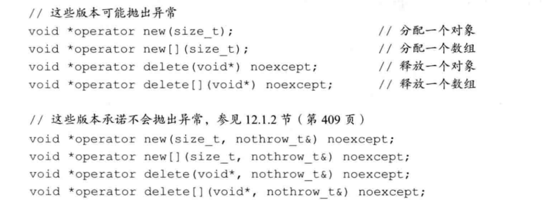 

#### Exercise
- e19.1
  ```c++
  #include <iostream>
  #include <cstdlib>
  using namespace std;
  void *operator new(size_t size) {
      cout << __PRETTY_FUNCTION__ << endl;
      if (void *mem = malloc(size)) {
          cout << "size: " << size << " mem: " << mem << endl;
          return mem;
      } else {
          throw bad_alloc();
      }
  }

  void operator delete(void *mem) noexcept {
      cout << __PRETTY_FUNCTION__ << endl;
      cout << "mem: " << mem << endl;
      free(mem);
  }

  int main() {
      int *p = new int;
      delete(p);
  }
  ```
  ```c++
  // output
  void* operator new(size_t)
  size: 4 mem: 0x7fffeb648e80
  void operator delete(void*)
  mem: 0x7fffeb648e80
  ```
- e19.2
  :TODO:

### 19.1.2 定位new表达式

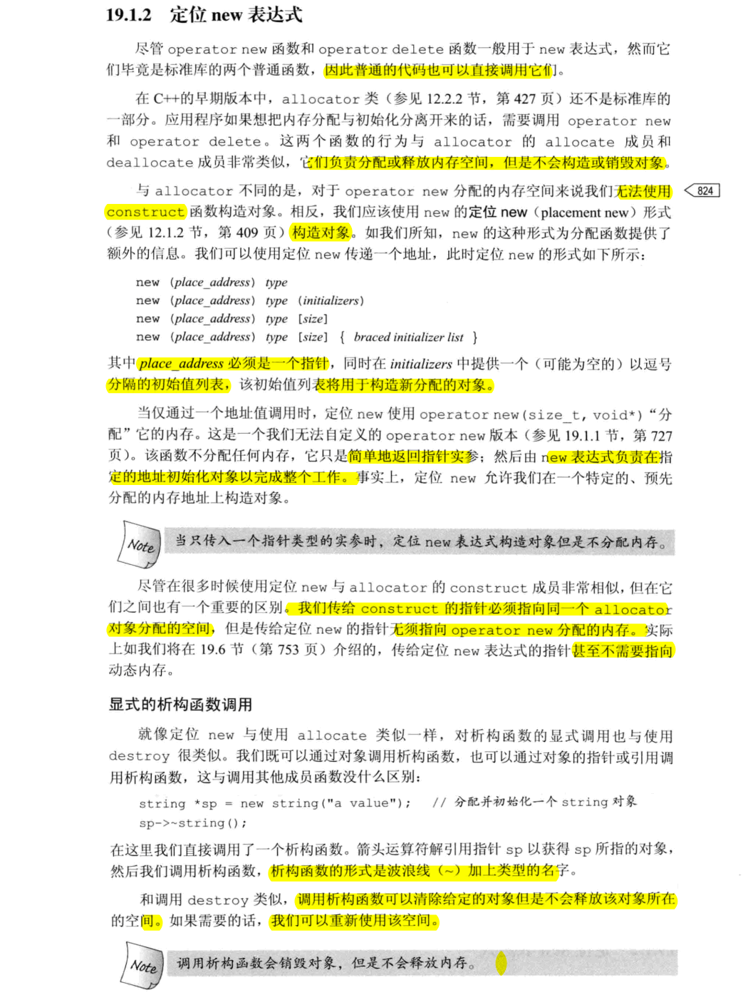 

## 19.2 运行时类型识别
- 一般来说如果**有虚函数**，那么**编译器将根据对象的动态类型自动选择**正确的函数版本；然而，并非任何时候都能定义一个虚函数，如果无法使用虚函数，则可以使用一个RTTI运算符，强制把基类转换为派生类类型。
- 使用RTTI必须加倍小心，在可能的情况下，最好定义虚函数而非直接接管类型管理的责任。

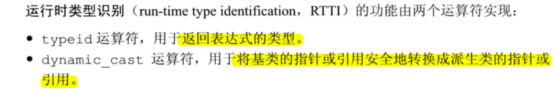 

### 19.2.1 dynamic_cast运算符
- 在条件部分执行dynamic_cast操作可以确保类型转换和结果检查在同一条表达式中完成
- 转换指针
  ```c++
  if (Drived *dp = dynamic_cast<Derived *>(bp)) {
      // 使用dp指向的Drived对象
  } else {
      // 使用dp指向的Base对象
  }
  ```
- 转换引用
  ```c++
  void f (const Base &b) {
    try {
      const Derived &d = dynamic_cast<const Derived &>(b);
      // 使用b引用的Derived对象
    } catch (bad_cast) {
      // 处理类型转换失败的情况
    }
  }
  ```
- dynamic_cast运算符使用形式
  ```c++
  dynamic_cast<type *>(e)
  dynamic_cast<type &>(e)
  dynamic_cast<type &&>(e)
  ```
  - e的类型必须符合以下三个条件中的任意一个：
    - e的类型是目标type的公有派生类
    - e的类型是目标type的公有基类
    - e的类型就是目标type的类型
#### Exercise
- e19.3
  ```c++
  #include <iostream>
  using namespace std;

  class A {
  public:
      virtual ~A() {}
  };

  class B : public A {
  public:
      virtual ~B() {}
  };

  class C : public B {
  public:
      virtual ~C() {}
  };

  class D : public B, public A {
  public:
      virtual ~D() {}
  };

  int main() {
  // a)
      {
          A *pa = new C;
          B *pb = dynamic_cast<B*>(pa);
          cout << pb << endl; // 正确
      }
  // b)
      {
          B *pb = new B;
          C *pc = dynamic_cast<C*>(pb);
          cout << pc << endl; // 转换失败：0
      }
  // c)
      {
      // 编译错误：error: ‘A’ is an ambiguous base of ‘D’
      //!    A *pa = new D;
      //!    B *pb = dynamic_cast<B*>(pa);
      }
  }
  ```
  对于C可以虚继承修复
  ```c++
  #include <iostream>
  using namespace std;

  class A {
  public:
      virtual ~A() {}
  };

  class B : public virtual A {
  public:
      virtual ~B() {}
  };

  class C : public B {
  public:
      virtual ~C() {}
  };

  class D : public virtual B, public virtual A {
  public:
      virtual ~D() {}
  };

  int main() {
  // a)
      {
          A *pa = new C;
          B *pb = dynamic_cast<B*>(pa);
          cout << pb << endl; // 正确
      }
  // b)
      {
          B *pb = new B;
          C *pc = dynamic_cast<C*>(pb);
          cout << pc << endl; // 0
      }
  // c)
      {
          A *pa = new D;
          B *pb = dynamic_cast<B*>(pa);
          cout << pb << endl; // 正确
      }
  }
  ```
- e19.4
  ```c++
  #include <iostream>
  #include <typeinfo>
  using namespace std;

  class A {
  public:
      virtual ~A() {}
  };

  class B : public A {
  public:
      virtual ~B() {}
  };

  class C : public B {
  public:
      virtual ~C() {}
  };

  class D : public B, public A {
  public:
      virtual ~D() {}
  };

  int main() {
  // a)
      {
          A *pa = new C;
          B *pb = dynamic_cast<B*>(pa);
          cout << pb << endl;
          if (C *pc = dynamic_cast<C*>(pa)) {
              cout << "success: " << pc << endl; // here
          } else {
              cout << "failed: " << pc << endl;
          }
          try {
              C &rc = dynamic_cast<C &>(*pa);
              cout << "success" << endl; // here
          } catch (std::bad_cast &bc) {
              cout << "failed" << endl;
          }
      }
  // b)
      {
          B *pb = new B;
          C *pc = dynamic_cast<C*>(pb);
          cout << pc << endl;
      }
  // c)
      {
        //!  A *pa = new D;
        //!  B *pb = dynamic_cast<B*>(pa);
        //!  cout << pb << endl;
      }
  }
  ```
- e19.5
  > 使用基类对象的指针或引用执行某个派生类操作并且该操作不是虚函数；通常情况下发生在无法在基类中增加虚函数，这时候在派生类中添加函数时，只能时非虚函数，如果使用基类指针或引用访问该函数，就必须使用dynamic_cast来代替虚函数。
### 19.2.2 typeid运算符
- 当typeid作用于指针时（而非指针所指的对象），返回的结果是该指针的静态编译时类型。
- 当运算对象**不属于类类型**或者是一个**不包含任何虚函数的类**时，typeid运算符指示的是运算对象的**静态类型**。->因为不含虚函数就不需要运行时检查。
- 当运算对象是定义了至少一个**虚函数的类**的左值时，typeid的结果**直到运行时**才会球的。
- 用途:比较两条表达式的类型是否相同，或者比较一条表达式的类型是否与指定类型相同。
- 如果指针P所指的类型不含有虚函数，则P不必非得是一个有效的指针；-> 因为不会运行时求值；

#### Exercise
- e19.6
    ```c++
    #include "Query.h"
    #include "NotQuery.h"
    #include "OrQuery.h"
    #include "AndQuery.h"
    #include <iostream>
    using namespace std;
    using namespace chapter15;
    using namespace chapter10;
    int main() {
        Query left("left"), right("right");
        Query_base *pqb = new AndQuery(left, right);
        if (AndQuery *paq = dynamic_cast<AndQuery *>(pqb)) {
            cout << "success!" << endl;
        } else {
            cout << "failed!" << endl;
        }

    }
    ```

    ```c++
    //output
    chapter15::WordQuery::WordQuery(const string&)
    chapter15::Query::Query(const string&)
    chapter15::WordQuery::WordQuery(const string&)
    chapter15::Query::Query(const string&)
    chapter15::BinaryQuery::BinaryQuery(const chapter15::Query&, const chapter15::Query&, std::__cxx11::string)
    chapter15::AndQuery::AndQuery(const chapter15::Query&, const chapter15::Query&)
    success!
    ```
- e19.7
    ```c++
    #include "Query.h"
    #include "NotQuery.h"
    #include "OrQuery.h"
    #include "AndQuery.h"
    #include <iostream>
    using namespace std;
    using namespace chapter15;
    using namespace chapter10;
    int main() {
        Query left("left"), right("right");
        Query_base *pqb = new AndQuery(left, right);
        try {
            AndQuery &raq = dynamic_cast<AndQuery &>(*pqb);
            cout << "success!" << endl;
        } catch (std::bad_cast &bc) {
            cout << "failed!: " << bc.what() << endl;
        }
    }
    ```
    ```c++
    //output
    chapter15::WordQuery::WordQuery(const string&)
    chapter15::Query::Query(const string&)
    chapter15::WordQuery::WordQuery(const string&)
    chapter15::Query::Query(const string&)
    chapter15::BinaryQuery::BinaryQuery(const chapter15::Query&, const chapter15::Query&, std::__cxx11::string)
    chapter15::AndQuery::AndQuery(const chapter15::Query&, const chapter15::Query&)
    success!
    ```
- e19.8
    ```c++
    #include "Query.h"
    #include "NotQuery.h"
    #include "OrQuery.h"
    #include "AndQuery.h"
    #include <iostream>
    using namespace std;
    using namespace chapter15;
    using namespace chapter10;
    int main() {
        Query left("left"), right("right");
        Query_base *pqb1 = new AndQuery(left, right);
        Query_base *pqb2 = new OrQuery(left, right);

        if (typeid(*pqb1) == typeid(*pqb2)) {
            cout << "same" << endl;
        } else {
            cout << "different" << endl;
        }
        if (typeid(*pqb1) == typeid(AndQuery)) {
            cout << "AndQuery" << endl;
        }
        if (typeid(*pqb2) == typeid(OrQuery)) {
            cout << "OrQuery" << endl;
        }
    }
    ```
    ```c++
    // output
    chapter15::WordQuery::WordQuery(const string&)
    chapter15::Query::Query(const string&)
    chapter15::WordQuery::WordQuery(const string&)
    chapter15::Query::Query(const string&)
    chapter15::BinaryQuery::BinaryQuery(const chapter15::Query&, const chapter15::Query&, std::__cxx11::string)
    chapter15::AndQuery::AndQuery(const chapter15::Query&, const chapter15::Query&)
    chapter15::BinaryQuery::BinaryQuery(const chapter15::Query&, const chapter15::Query&, std::__cxx11::string)
    chapter15::OrQuery::OrQuery(const chapter15::Query&, const chapter15::Query&)
    different
    AndQuery
    OrQuery
    ```
### 19.2.3 使用RTTI

### 19.2.4 type_info类
- type_info类在不同的编译器上有所区别。有的编译器提供了额外的成员函数以提供程序中所用类型的额外信息。读者应该阅读所用编译器的使用手册。
#### Exercise
- e19.9
    ```c++
    #include <iostream>
    #include <typeinfo>
    #include <string>

    using namespace std;

    class Base {
        friend bool operator==(const Base&, const Base&);
    public:
        Base(int _i = 10) : i(_i) {}
    protected:
        virtual bool equal(const Base &) const;
    private:
        int i;
    };

    bool Base::equal(const Base &rhs) const {
        return i == rhs.i;
    }

    class Derived : public Base {
    public:
        Derived(int _i = 20, int _j = 30) : Base(_i), j(_j) {}
    protected:
        bool equal(const Base&) const;
    private:
        int j;
    };

    bool Derived::equal(const Base &rhs) const {
        auto r = dynamic_cast<const Derived &>(rhs);
        return j == r.j && Base::equal(rhs);
    }

    bool operator==(const Base &lhs, const Base &rhs) {
        return typeid(lhs) == typeid(rhs) && lhs.equal(rhs);
    }

    int main() {
        int arr[10];
        Derived d1(2, 3), d2(2, 3), d3(3, 4), d4;

        cout << (d1 == d2) << endl;
        cout << (d4 == d3) << endl;

        cout << "=======" << endl;

        Base *p = &d1;
        cout << typeid(42).name() << ", "
            << typeid(arr).name() << ", "
            << typeid(std::string).name() << ", "
            << typeid(p).name() << ", "
            << typeid(d2).name() << ", "
            << typeid(*p).name() << endl;
    }
    ```

    ```c++
    1
    0
    =======
    i, A10_i, NSt7__cxx1112basic_stringIcSt11char_traitsIcESaIcEEE, P4Base, 7Derived, 7Derived
    ```
- e19.10
    ```c++
    #include <iostream>
    #include <typeinfo>
    using namespace std;

    class A {
    public:
    virtual ~A() {}
    };

    class B : public A {
    public:
    };

    class C : public B {

    };


    int main() {
    A *pa = new C;
    cout << typeid(pa).name() << endl;

    C cobj;
    A &ra1 = cobj;
    cout << typeid(&ra1).name() << endl;

    B *px = new B;
    A &ra2 = *px;
    cout << typeid(ra2).name() << endl;
    }
    ```
    ```c++
    P1A
    P1A
    1B
    ```
## 19.3 枚举类型
- 枚举类型可以将一组整型常量组织在一起。属于字面值常量类型
- 要想初始化一个enum对象，必须使用该enum类型的另一个对象或者它的一个枚举成员
- 可以将一个不限定作用域的枚举类型对象或枚举成员传给整型形参，此时,enum的值提升成int或更大的整型，实际提升的结果由枚举类型的潜在类型决定。

## 19.4 类成员指针

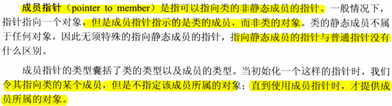 

### 19.4.1 数据成员指针

#### Exercise
- e19.11 
  > 定义：`const string Screen::*pdata;` 必须包含成员所属的类
  > 赋值: `pdata = &Screen::contents;` 初始化一个成员指针或为成员指针赋值时，该指针并没有指向任何数据，成员指针指定了成员而非成员所属的对象，只有当解引用成员指针时才提供对象的信息。
  > 访问: `Screen myScreen, *pScreen = &myScreen`  
  `auto s = myScreen.*pdata;` 或 `s = pScreen->*pdata;` 该过程分两步：首先解引用成员指针已得到所需的成员；然后像成员访问运算符一样，通过对象（`.*`）或指针(`->*`)获取成员。

- e19.12
    ```c++
    #include <iostream>
    #include <string>

    using namespace std;

    typedef std::string::size_type pos;
    class Screen {
    public:
        Screen() = default;
        Screen(pos ht, pos wd, char c) : height(ht), width(wd), contents(ht*wd, c) {}
        char get() const { return contents[cursor]; }
        char get(pos ht, pos wd) const {
            pos row = ht * width;
            return contents[row + wd];
        }
        Screen &move(pos r, pos c) {
            pos row = r * width;
            cursor = row + c;
            return *this;
        }
        static const std::string Screen::*data() {
            return &Screen::contents;
        }
        static const pos Screen::*cur() {
            return &Screen::cursor;
        }
    private:
        std::string contents;
        pos cursor = 0;
        pos height = 0, width = 0;
    };

    int main() {
        Screen myScreen(5, 5, 'X');
        myScreen.move(3,4);
        const string Screen::*pdata = Screen::data();
        auto s = myScreen.*pdata;
        cout << s << endl;
        const pos Screen::*pCursor = Screen::cur();
        cout << myScreen.*pCursor << endl;
    }
    ```
- e19.13
    ```c++
    #include "Sales_data.h"
    #include <iostream>
    using namespace std;

    int main() {
        Sales_data data1;
        double price = 0;
        std::cin >> data1.bookNo >> data1.units_sold >> price;
        data1.revenue = data1.units_sold * price;
        std::string Sales_data::*pBookNo = &Sales_data::bookNo;
        cout << data1.bookNo << endl;
        cout << data1.*pBookNo << endl;
    }
    ```

### 19.4.2 成员函数指针

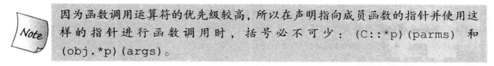 

#### Exercise
- e19.14
  > 合法，它们的类型一致，auto pmf 从get_cursor推断出来，所以get可以直接赋值给pmf，编译器会选择与get_cursor一致的版本;

    ```c++
    #include <iostream>
    #include <string>

    using namespace std;

    typedef std::string::size_type pos;
    class Screen {
    public:
        Screen() = default;
        Screen(pos ht, pos wd, char c) : height(ht), width(wd),
    contents(ht*wd, c) {}
        char get_cursor() const {
            std::cout << __PRETTY_FUNCTION__ << endl;
            return contents[cursor];
        }
        char get() const {
            std::cout << __PRETTY_FUNCTION__ << endl;
            return contents[cursor];
            return contents[cursor];
        }
        char get(pos ht, pos wd) const {
            std::cout << __PRETTY_FUNCTION__ << endl;
            return contents[cursor];
            pos row = ht * width;
            return contents[row + wd];
        }
        Screen &move(pos r, pos c) {
            pos row = r * width;
            cursor = row + c;
            return *this;
        }
        static const std::string Screen::*data() {
            return &Screen::contents;
        }
        static const pos Screen::*cur() {
            return &Screen::cursor;
        }
    private:
        std::string contents;
        pos cursor = 0;
        pos height = 0, width = 0;
    };

    int main() {
        cout << "----" << endl;
        Screen myScreen(5, 5, 'X');
        auto pmf = &Screen::get_cursor;
        (myScreen.*pmf)();
        pmf = &Screen::get;
        (myScreen.*pmf)();
        //! auto p1 = &Screen::get; // t19-14.cc:50:24: error: unable to deduce ‘auto’ from ‘& Screen::get’
    }
    ```
    ```c++
    //output
    ----
    char Screen::get_cursor() const
    char Screen::get() const
    ```
- e19.15
  > 和普通函数指针不同的是，在成员函数和指向该成员的指针之间不存在自动转换规则。另外不可以直接调用，必须绑定到一个对象上。
- e19.16
    ```c++
    #include "Sales_data.h"
    #include <iostream>
    using namespace std;
    int main() {
        using Avg = double (Sales_data::*)() const;
        Avg pFun = &Sales_data::avg_price;
        Sales_data sd;
        double price = 0;
        cin >> sd.bookNo >> sd.units_sold >> price;
        sd.revenue = sd.units_sold * price;
        cout << (sd.*pFun)() << endl;
    }
    ```
- e19.17
    ```c++
    #include <iostream>
    #include <string>

    using namespace std;

    typedef std::string::size_type pos;
    class Screen {
    public:
        using Action = Screen& (Screen::*)();
        Screen() = default;
        Screen(pos ht, pos wd, char c) : height(ht), width(wd), contents(ht*wd, c) {}
        char get_cursor() const {
            std::cout << __PRETTY_FUNCTION__ << endl;
            return contents[cursor];
        }
        char get() const {
            std::cout << __PRETTY_FUNCTION__ << endl;
            return contents[cursor];
            return contents[cursor];
        }
        char get(pos ht, pos wd) const {
            std::cout << __PRETTY_FUNCTION__ << endl;
            return contents[cursor];
            pos row = ht * width;
            return contents[row + wd];
        }
        Screen &move(pos r, pos c) {
            pos row = r * width;
            cursor = row + c;
            return *this;
        }
        static const std::string Screen::*data() {
            return &Screen::contents;
        }
        static const pos Screen::*cur() {
            return &Screen::cursor;
        }
        enum Directions {HOME, FORWARD, BACK, UP, DOWN};
        Screen &move(Directions);
        Screen& home() {
            std::cout << __PRETTY_FUNCTION__ << endl;
            return *this;
        }
        Screen& forward() {
            std::cout << __PRETTY_FUNCTION__ << endl;
            return *this;
        }
        Screen& back() {
            std::cout << __PRETTY_FUNCTION__ << endl;
            return *this;
        }
        Screen& up() {
            std::cout << __PRETTY_FUNCTION__ << endl;
            return *this;
        }
        Screen& down() {
            std::cout << __PRETTY_FUNCTION__ << endl;
            return *this;
        }
    private:
        static Action Menu[];
        std::string contents;
        pos cursor = 0;
        pos height = 0, width = 0;
    };

    Screen& Screen::move(Directions cm) {
        return (this->*Menu[cm])();
    }

    Screen::Action Screen::Menu[] = {
        &Screen::home,
        &Screen::forward,
        &Screen::back,
        &Screen::up,
        &Screen::down,
    };

    int main() {
        cout << "----" << endl;
        Screen myScreen(5, 5, 'X');
        auto pmf = &Screen::get_cursor;
        (myScreen.*pmf)();
        pmf = &Screen::get;
        (myScreen.*pmf)();
        myScreen.move(Screen::HOME);
        myScreen.move(Screen::DOWN);
        //! auto p1 = &Screen::get;
        using Get4 = char (Screen::*)(pos, pos) const;
        Get4 p1 = &Screen::get;
        (myScreen.*p1)(2, 3);
        typedef char (Screen::*pGet)(pos, pos) const;
        pGet p2 = &Screen::get;
        (myScreen.*p2)(3, 4);
        using Move = Screen& (Screen::*)(Screen::Directions);
        Move p3 = &Screen::move;
        (myScreen.*p3)(Screen::UP);
    }
    ```
    ```c++
    ----
    char Screen::get_cursor() const
    char Screen::get() const
    Screen& Screen::home()
    Screen& Screen::down()
    char Screen::get(pos, pos) const
    char Screen::get(pos, pos) const
    Screen& Screen::up()
    ```

### 19.4.3 将成员函数用作可调用对象
- 如我们所知，要像通过一个指向成员函数的指针进行函数调用，必须首先利用`.*`运算符或`->*`运算符将该指针绑定到特定的对象上。因此**与普通的函数指针不同，成员指针不是一个可调用对象，这样的指针不支持函数调用运算符**。
- 因为成员指针不是可调用对象，所以我们不能直接将一个指向成员函数的指针传递给算法。
- 使用funtion生成一个可调用对象
  ```c++
  function<bool (const string&)> fcn = &string::empty;
  if (fcn(*it)) -> if(((*it).*p)())
  ```
- 使用mem_fn生成一个可调用对象
  ```c++
  auto f = mem_fn(&string::empty);
  f(*svec.begin());
  f(&svec[0]);
  ```
- 使用bind生成一个可调用对象
  ```c++
  auto f = bind(&string::empty, _1);
  f(*svec.begin());
  f(&svec[0]);
  ```

#### Exercise
- e19.18
    ```c++
    #include <string>
    #include <vector>
    #include <iostream>
    #include <algorithm>
    #include <functional>
    using namespace std;

    int main() {
        vector<string> svec {"abc", "", "efg", "", ""};

        function<bool (const string)> fp = &string::empty;
        int e_cnt1 = count_if(svec.begin(), svec.end(), fp);
        cout << e_cnt1 << endl;

        int e_cnt2 = count_if(svec.begin(), svec.end(), mem_fn(&string::empty));
        cout << e_cnt2 << endl;

        int e_cnt3 = count_if(svec.begin(), svec.end(), bind(&string::empty, std::placeholders::_1));
        cout << e_cnt3 << endl;
    }
    //output
    3
    3
    3
    ```
- e19.19
    ```c++
    #include "Sales_data.h"
    #include <iostream>
    #include <vector>
    #include <functional>
    #include <algorithm>

    bool above(Sales_data &sd, double d) {
        return sd.avg_price() > d;
    }

    using namespace std;
    int main() {
        vector<Sales_data> sdvec;
        sdvec.push_back(Sales_data("001", 10, 20));
        sdvec.push_back(Sales_data("002", 20, 10));
        sdvec.push_back(Sales_data("003", 30, 25));
        double price = 23;
        auto fun = bind(above, std::placeholders::_1, price);
        auto it = find_if(sdvec.begin(), sdvec.end(), fun);
        if (it != sdvec.end())
            cout << it->bookNo << endl;
        else
            cout << "none" << endl;
    }
    ```
## 19.5 嵌套类

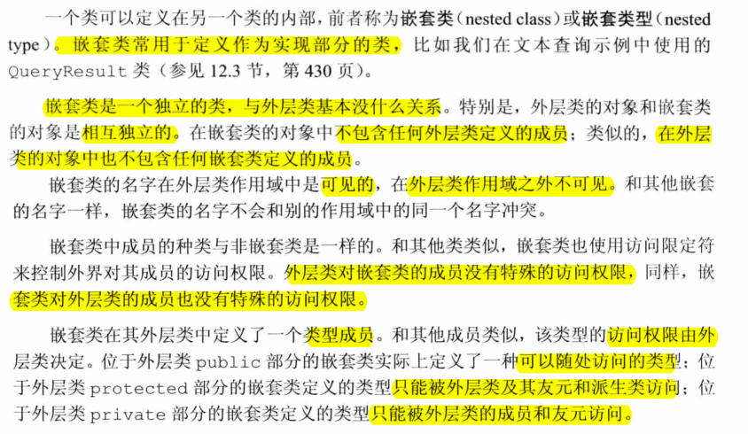 

#### Exericse
- e19-20
  - t19-20.h
    ```c++
    #ifndef T19_20_H
    #define T19_20_H

    #include <iostream>
    #include <vector>
    #include <set>
    #include <map>
    #include <string>
    #include <fstream>
    #include <sstream>
    #include <memory>

    namespace chapter10 {

    class TextQuery {
        using line_no = std::vector<std::string>::size_type;  
    public:
        class QueryResult {
        friend std::ostream &print(std::ostream &, const TextQuery::QueryResult &);
        public:
            QueryResult(std::string s, std::shared_ptr<std::set<line_no>> p, std::shared_ptr<std::vector<std::string>> f);
            std::set<line_no>::iterator begin();
            std::set<line_no>::iterator end() { return lines->end(); }
            std::shared_ptr<std::vector<std::string>> get_file() { return file; }

        private:
            std::string sought;
            std::shared_ptr<std::set<line_no>> lines;
            std::shared_ptr<std::vector<std::string>> file;
        };

        TextQuery(std::ifstream &);
        QueryResult query(const std::string &) const;
    private:
        std::shared_ptr<std::vector<std::string>> file;
        std::map<std::string, std::shared_ptr<std::set<line_no>>> wm;
    };

    TextQuery::QueryResult::QueryResult(std::string s, std::shared_ptr<std::set<line_no>> p, std::shared_ptr<std::vector<std::string>> f) : sought(s), lines(p), file(f) {}

    std::set<TextQuery::line_no>::iterator TextQuery::QueryResult::begin() { return lines->begin(); }

    TextQuery::TextQuery(std::ifstream &is) : file(new std::vector<std::string>) {
        std::string text;
        while (std::getline(is, text)) {
            file->push_back(text);
            int n = file->size() - 1;
            std::istringstream line(text);
            std::string word;
            while (line >> word) {
                auto &lines = wm[word];
                if (!lines)
                    lines.reset(new std::set<line_no>);
                lines->insert(n);
            }
        }
    }

    TextQuery::QueryResult TextQuery::query(const std::string &sought) const {
        static std::shared_ptr<std::set<line_no>> nodata(new std::set<line_no>);
        auto loc = wm.find(sought);
        if (loc == wm.end())
            return QueryResult(sought, nodata, file);
        else
            return QueryResult(sought, loc->second, file);

    }

    std::string make_plural(size_t ctr, const std::string &word, const std::string &ending) {
        return (ctr > 1) ? word + ending : word;
    }

    std::ostream &print(std::ostream &os, const TextQuery::QueryResult &qr) {
        os << qr.sought << " occurs " << qr.lines->size() << " " << make_plural(qr.lines->size(), "time", "s") << std::endl;
        for (auto num : *qr.lines)
            os << "\t(line " << num + 1 << ") " << *(qr.file->begin() + num) << std::endl;
        return os;
    }

    void runQueries(std::ifstream &infile) {
        TextQuery tq(infile);
        while (true) {
            std::cout << "enter word to look for, or q to quit: ";
            std::string s;
            if (!(std::cin >> s) || s == "q") break;
            print(std::cout, tq.query(s)) << std::endl;
        }
    }

    }
    #endif
    ```
  - t19-20.cc
    ```c++
    #include "t19-20.h"

    int main(int argc, char *argv[]) {
        std::ifstream in(argv[1]);
        chapter10::runQueries(in);

        return 0;
    }
    ```

## 19.6 union: 一种节省空间的类
- union不能还有引用类型的成员
- union可以定义包括构造函数和析构函数在内的成员函数。但是由于union既不能继承自其它类，也不能作为基类使用，所以在union中不能含有虚函数。
- 如果提供了初始值，则该初始值被用于初始化第一个成员。

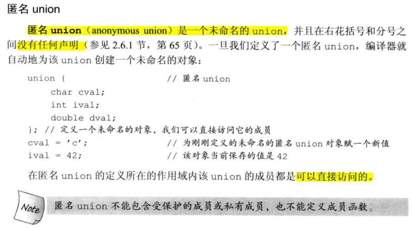 

- 如果我们像将union的值改为类类型成员对应的值，或者将类类型成员的值改为一个其它值，则必须分别构造或析构该类类型的成员：
  - 当我们将union的值改为类类型成员对应的值时，必须运行该类型的构造函数；
  - 反之，当我们将类类型成员的值改为一个其他值时，必须运行该类型的析构函数。

#### Exercise
- t19.21-25
  > 这里用到了一个语法 new(&sval) string(s); 这是place_new语法；测试如下

  - placement new test
  
    ```c++
    #include <iostream>
    using namespace std;

    int main() {
        string *buf = new string();
        new(buf) string("abc");
        cout << buf << ": " << *buf << endl;
        string *p = new(buf) string("hi");
        cout << buf << ": " << *buf << endl;
        cout << p << ": " << *p << endl;
        delete p;
        cout << buf << ": " << *buf << endl;
    }
    // output
    0x7fffbb7ffe70: abc
    0x7fffbb7ffe70: hi
    0x7fffbb7ffe70: hi
    Segmentation fault (core dumped)
    ```

  - t19-24.h

    ```c++
    #ifndef T19_24_H
    #define T19_24_H
    #include "Sales_data.h"
    #include <string>
    #include <iostream>
    //using std::string;
    class Token {
    public:
        Token() : tok(INT), ival{0} {
            std::cout << __PRETTY_FUNCTION__ << std::endl;
        }
        Token(const Token &t) : tok(t.tok) {
            std::cout << __PRETTY_FUNCTION__ << std::endl;
            copyUnion(t);
        }
        Token &operator=(const Token&);
        ~Token() {
            std::cout << __PRETTY_FUNCTION__ << std::endl;
            if (tok == STR) sval.std::string::~string();
            if (tok == SD) sdval.~Sales_data();
        }
        Token &operator=(const std::string&);
        Token &operator=(char);
        Token &operator=(int);
        Token &operator=(double);
        Token &operator=(const Sales_data &);
        Token(Token &&);
        Token &operator=(Token &&);

    private:
        enum {INT, CHAR, DBL, STR, SD} tok;
        union {
            char cval;
            int ival;
            double dval;
            std::string sval;
            Sales_data sdval;
        };
        void copyUnion(const Token&);
    };

    Token &Token::operator=(int i) {
        std::cout << __PRETTY_FUNCTION__ << std::endl;
        if (tok == STR) sval.std::string::~string();
        if (tok == SD) sdval.~Sales_data();
        ival = i;
        tok = INT;
        return *this;
    }

    Token &Token::operator=(char c) {
        std::cout << __PRETTY_FUNCTION__ << std::endl;
        if (tok == STR) sval.std::string::~string();
        if (tok == SD) sdval.~Sales_data();
        cval = c;
        tok = CHAR;
        return *this;
    }

    Token &Token::operator=(double d) {
        std::cout << __PRETTY_FUNCTION__ << std::endl;
        if (tok == DBL) sval.std::string::~string();
        if (tok == SD) sdval.~Sales_data();
        dval = d;
        tok = DBL;
        return *this;
    }

    Token &Token::operator=(const std::string &s) {
        std::cout << __PRETTY_FUNCTION__ << std::endl;
        if (tok == SD) sdval.~Sales_data();
        if (tok == STR)
            sval = s;
        else
            new(&sval) std::string(s);
        tok = STR;
        return *this;
    }

    Token &Token::operator=(const Sales_data &sd) {
        std::cout << __PRETTY_FUNCTION__ << std::endl;
        if (tok == STR) sval.std::string::~string();
        if (tok == SD)
            sdval = sdval;
        else
            new(&sdval) Sales_data(sd);
        tok = SD;
        return *this;
    }

    Token &Token::operator=(const Token &t) {
        std::cout << __PRETTY_FUNCTION__ << std::endl;
        if (tok == SD && t.tok != SD) sdval.~Sales_data();
        if (tok == SD && t.tok == SD) sdval = t.sdval;
        if (tok == STR && t.tok != STR) sval.std::string::~string();
        if (tok == STR && t.tok == STR)
            sval = t.sval;
        else
            copyUnion(t);
        tok = t.tok;
        return *this;
    }

    void Token::copyUnion(const Token &t) {
        std::cout << __PRETTY_FUNCTION__ << std::endl;
        switch (t.tok) {
            case Token::INT: ival = t.ival; break;
            case Token::CHAR: cval = t.cval; break;
            case Token::DBL: dval = t.dval; break;
            case Token::STR: new(&sval) std::string(t.sval); break;
            case Token::SD: new(&sdval) Sales_data(t.sdval); break;
        }
    }


    Token::Token(Token &&t) {
        std::cout << __PRETTY_FUNCTION__ << std::endl;
        copyUnion(t);
        tok = std::move(t.tok);
    }

    Token &Token::operator=(Token &&t) {
        std::cout << __PRETTY_FUNCTION__ << std::endl;
        if (this != &t) {
            this->~Token();
            copyUnion(t);
            tok = std::move(t.tok);
        }
        return *this;
    }
    #endif
    ```
  - main.c
  
    ```c++
    #include <iostream>
    #include "t19-24.h"

    using namespace std;

    int main() {
        Token t;
        cout << "----" << endl;
        Token t2 = std::move(t);
        cout << "----" << endl;
        Token t3;
        cout << "----" << endl;
        t3 = std::move(t2);
        cout << "----" << endl;
        int i = 4;
        t3 = i;
        cout << "----" << endl;
        double d = 5.5;
        t3 = d;
        cout << "----" << endl;
        Sales_data sd;
        t3 = sd;
        cout << "----" << endl;
        char c = 'a';
        t3 = c;
        cout << "----" << endl;
        string s = "abc";
        t3 = s;
        cout << "----" << endl;
    }
    ```

    ```c++
    Token::Token()
    ----
    Token::Token(Token&&)
    void Token::copyUnion(const Token&)
    ----
    Token::Token()
    ----
    Token& Token::operator=(Token&&)
    Token::~Token()
    void Token::copyUnion(const Token&)
    ----
    Token& Token::operator=(int)
    ----
    Token& Token::operator=(double)
    ----
    Token& Token::operator=(const Sales_data&)
    ----
    Token& Token::operator=(char)
    ----
    Token& Token::operator=(const string&)
    ----
    Token::~Token()
    Token::~Token()
    Token::~Token()
    ```
## 19.7 局部类

- 局部类的所有成员（包含函数在内）都必须完整定义在类的内部。因此，局部类的作用与嵌套类相比相差很远。
- 在局部类中不允许声明静态数据成员，因为我们没法定义这样的成员。
- 局部类只能访问外层作用域定义的类型名、静态变量、以及枚举成员。如果局部类定义在某个函数内部，则该函数的普通局部变量不能被该局部类使用。

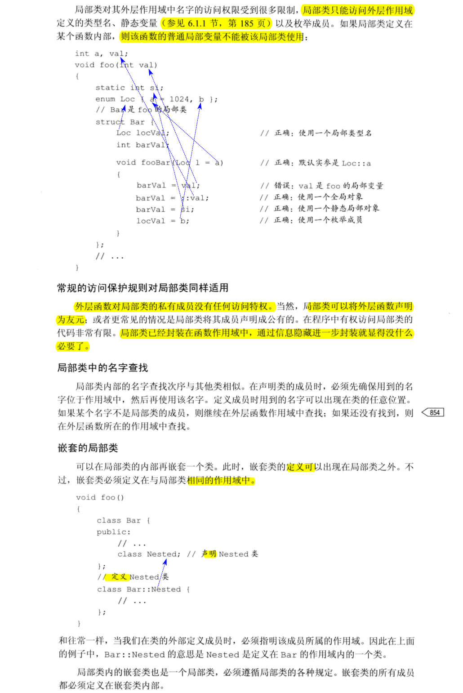

## 19.8 固有的不可移植的特性
- C++定义了一些固有的不可移植特性；从C语言继承而来的另外两种不可移植特性：**位域和volatile限定符**；此外，还将介绍**链接指示**，它时C++新增的一种不可移植特性。
  
### 19.8.1 位域
- 类可以将（非静态）数据成员定义成位域；
- 位域在内存中的布局是与**机器相关的**；
- **位域的类型必须是整型或枚举类型**。因为带符号位域的行为是由具体实现确定的，所以**通常我们使用无符号类型保存一个位域**。
- 位域的声明形式是在成员名字之后紧跟一个冒号以及一个常量表达式。

  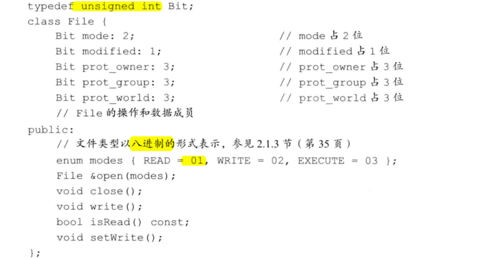 

- 取地址运算符（&）不能作用域位域，因此任何指针都无法指向类的位域。

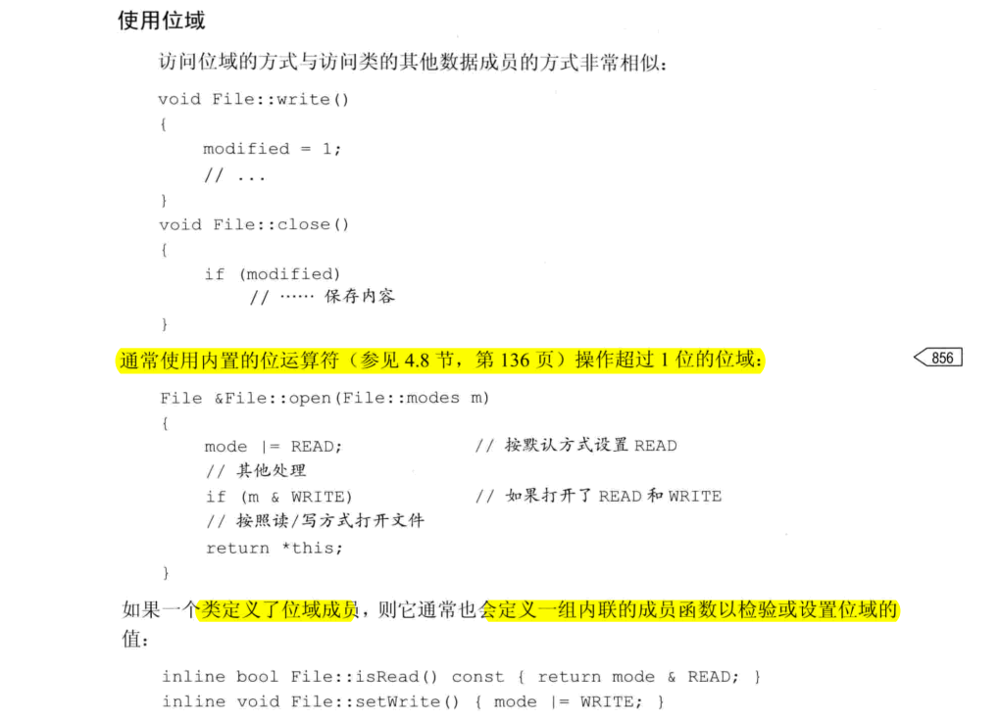 

### 19.8.2 volatile限定符

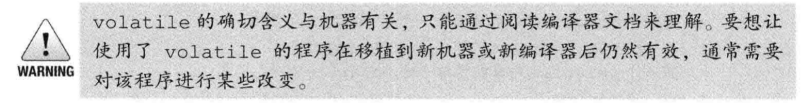 

- 只有volatile的成员函数才能被volatile的对象调用

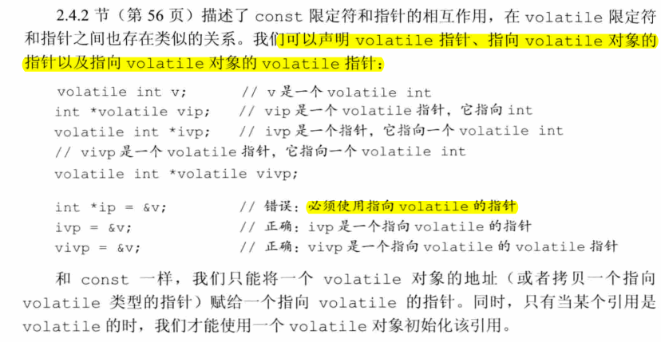 

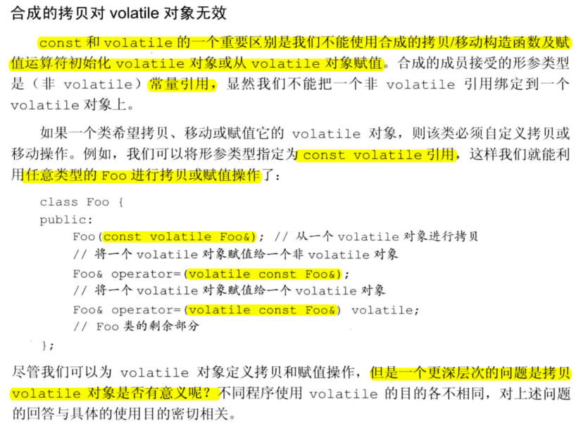 

### 19.8.3 链接指示：extern "C"

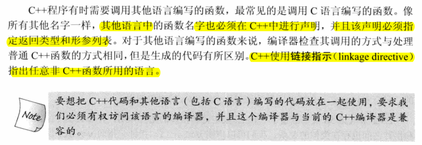 

#### Exercise
- e19.26 
  > 不合法，这两条语句是声明。这两个函数是C函数，然后使用extern "C"声明，表示在C++中使用C函数，但是C不支持重载，所以，这两个函数只能存在一个。解决方案：把其中一个用C++定义。
  - compute.c
    ```c
    //compute.c

    //#include "compute.h"
    #include <stdio.h>
    int compute(int *p, int a) {
        printf("%s\n", __PRETTY_FUNCTION__);
        return 0;
    }
    /* // error: conflicting types for ‘compute’
    double compute(double *, double) {
        printf("%s\n", __PRETTY_FUNCTION__);
        return 0;
    }

    */
    ```
  - compute.h
    ```c
    // compute.h
    extern "C" int compute(int *, int);
    //! int compute(int *, int); //t19-26.cc:(.text+0x74): undefined reference to `compute(int*, int)'
    //! extern "C" double compute(double *, double); //conflicting declaration of C function ‘double compute(double*, double)’
    ```
  - t19-26.cc
    ```c++
    // t19-26.cc
    #include "compute.h"
    #include <iostream>
    using namespace std;
    double compute(double *d, double b) {
        cout << __PRETTY_FUNCTION__ << endl;
    }

    int main() {
        int i = 20;
        double d = 10.2;
        compute(&i, 4);
        compute(&d, 8.2);
    }
    ```
  - gcc 编译computer.c；g++编译t19-26.cc
    ```bash
    dongkesi@DESKTOP-CL29DN1:/mnt/d/workspace/github/C++-Primer/ch19$ gcc compute.c -cdongkesi@DESKTOP-CL29DN1:/mnt/d/workspace/github/C++-Primer/ch19$ g++ t19-26.cc compute.o
    dongkesi@DESKTOP-CL29DN1:/mnt/d/workspace/github/C++-Primer/ch19$ ./a.out
    compute
    double compute(double*, double)
    ```